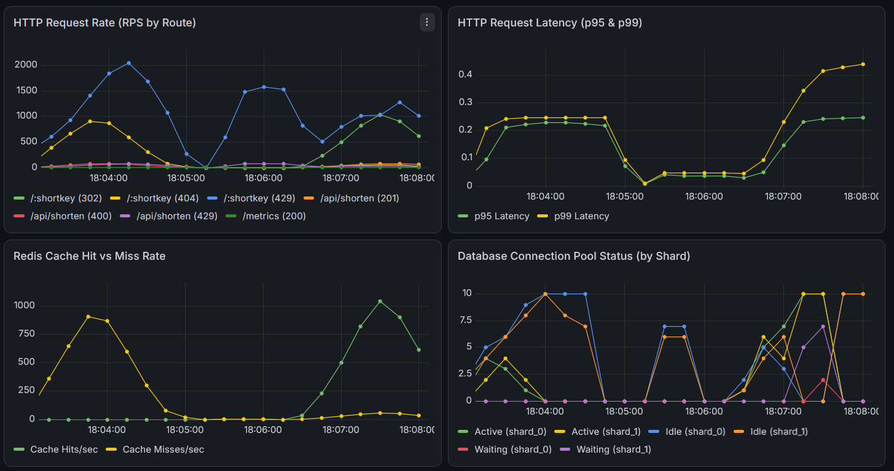
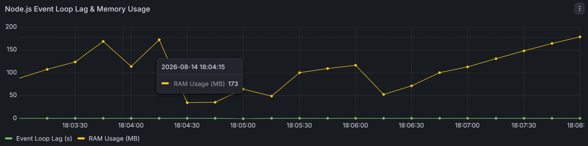
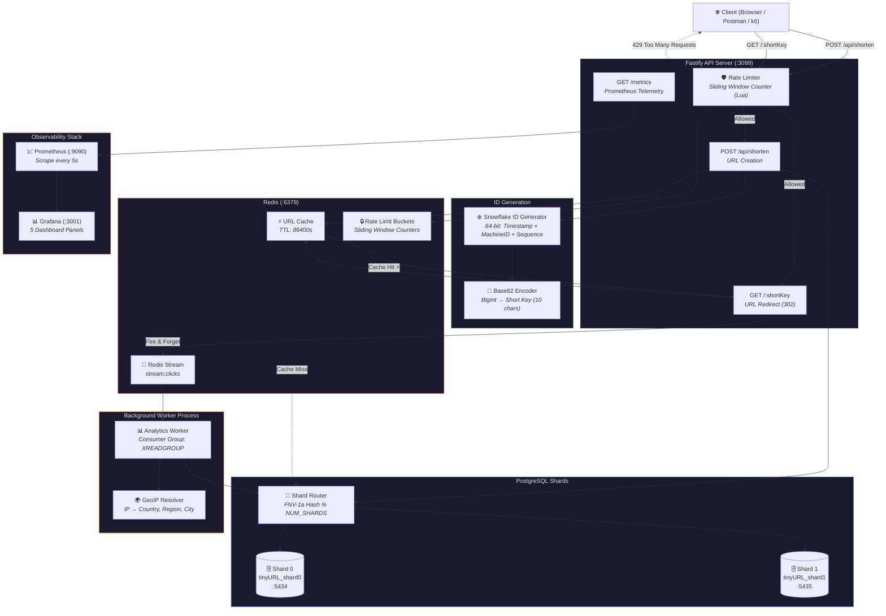

<p align="center">
  <h1 align="center">TinyURL - Distributed URL Shortener</h1>
  <p align="center">
    A production-grade, horizontally scalable URL shortening service built from scratch as a <strong>System Design deep-dive</strong>.
    <br />Engineered for <strong>high throughput</strong>, <strong>low latency</strong>, and <strong>real-time observability</strong>.
  </p>
</p>

<p align="center">
  
</p>

---

## 📊 Live Grafana Dashboard — Real-Time System Metrics Under Load

<p align="center">
  
</p>

<p align="center">
  
</p>

> **Dashboard panels**: HTTP Request Rate by Route · p95/p99 Latency · Redis Cache Hit vs Miss · Database Connection Pool Status (by Shard) · Node.js Event Loop Lag & Memory Usage

---

## 🏗️ System Architecture



---

## ⚡ Performance Benchmarks

### Single Request Latency (Postman)

| Operation | Latency | Details |
|---|---|---|
| `POST /api/shorten` | **22 ms** | Snowflake ID → Base62 → Shard Insert → Redis Cache Set |
| `GET /:shortKey` (Cache Hit) | **5 ms** | Redis lookup → 302 Redirect + Async stream push |

### k6 Stress Test — 500 Concurrent Virtual Users

| Metric | Result |
|---|---|
| **Total Requests** | 184,741 |
| **Throughput** | 2,308 req/sec |
| **Checks Passed** | 100.00% ✅ |
| **p50 Latency** | 143 ms |
| **p90 Latency** | 243 ms |
| **p95 Latency** | 277 ms |
| **Server Errors (5xx)** | 0 |

### Node.js Load Test — 100 Concurrent Workers (30s)

| Metric | GET Redirects | POST Shorten |
|---|---|---|
| **p50 Latency** | 31.7 ms | 31.7 ms |
| **p95 Latency** | 43.7 ms | 43.6 ms |
| **p99 Latency** | 56.5 ms | 56.5 ms |
| **Throughput** | 3,074 req/sec | — |

---

## 🧠 Core Engineering Features

### 1. ❄️ Snowflake ID Generation
- Custom **64-bit distributed ID generator** inspired by Twitter Snowflake.
- **Bit layout**: `[41-bit timestamp] [10-bit machine ID] [12-bit sequence]`
- Supports **4,096 unique IDs per millisecond per machine** across **1,024 machine instances**.
- IDs are encoded to **Base62** (alphanumeric) producing compact, URL-safe short keys.
- Clock drift detection with automatic recovery via busy-wait.

### 2. 🔀 Horizontal Database Sharding
- Writes and reads are **deterministically routed** to PostgreSQL shards using **FNV-1a hashing** on the short key.
- Shard routing: `fnv1aHash(shortKey) % NUM_SHARDS`
- Each shard is a fully independent PostgreSQL instance with its own `url.URL` and `url.click_analytics` tables.
- Scales horizontally — add shards by updating `NUM_SHARDS` and `DB_SHARD_N_URL` env vars.

### 3. ⚡ Multi-Tier Caching Strategy
- **L1 Cache**: Redis with configurable TTL (default: 24 hours).
- **Single-Flight Deduplication**: Concurrent cache-miss requests for the same key are coalesced into a single DB query, preventing thundering herd on cold keys.
- **Write-Through**: On URL creation, the cache is immediately populated — first redirect is always a cache hit.

### 4. 🛡️ Distributed Rate Limiting
- **Sliding Window Counter** algorithm implemented as an atomic **Redis Lua script** for zero-race-condition enforcement.
- Per-IP limits: `100 req/min` for redirects, `10 req/min` for URL creation.
- Supports `X-Forwarded-For` header for proxy/load-balancer environments.
- Fail-open design: if Redis is unavailable, requests are allowed through to preserve availability.
- Response headers: `X-RateLimit-Limit`, `X-RateLimit-Remaining`, `Retry-After`.

### 5. 📊 Real-Time Analytics Pipeline
- **Fire-and-forget architecture**: Click events are pushed to a Redis Stream (`XADD`) without blocking the HTTP response.
- **Background Worker**: A dedicated Node.js process consumes events via `XREADGROUP` (Consumer Groups) in configurable batches of 100.
- **GeoIP Resolution**: Each click's IP address is resolved to country, region, and city using `geoip-lite`.
- **Shard-Aware Batch Writes**: Analytics records are grouped by target shard and batch-inserted into `url.click_analytics`.

### 6. 📈 Full Observability Stack
- **Prometheus** scrapes application metrics every 5 seconds from `/metrics`.
- **Custom Metrics**: HTTP request counters, duration histograms, Redis cache hit/miss counters, DB connection pool gauges.
- **Grafana Dashboard** with 5 pre-configured panels for real-time system health monitoring.
- **Structured Logging** via Pino with correlation IDs (`x-request-id`) across every request.

---

## 🗂️ Project Structure

```
TinyURL/
├── src/
│   ├── app.js                          # Fastify app builder with hooks & metrics
│   ├── server.js                       # Server entry point
│   ├── config/
│   │   └── env.js                      # Environment variable loader
│   ├── modules/
│   │   ├── shorten/
│   │   │   ├── shorten.controller.js   # POST /api/shorten handler
│   │   │   ├── shorten.service.js      # Snowflake ID + shard insert logic
│   │   │   └── shorten.route.js        # Route registration + rate limit
│   │   └── redirect/
│   │       ├── redirect.controller.js  # GET /:shortKey handler + analytics emit
│   │       ├── redirect.service.js     # Cache lookup → DB fallback → single-flight
│   │       └── redirect.route.js       # Route registration + rate limit
│   ├── id-generation/
│   │   ├── snowflake.js                # 64-bit Snowflake ID generator
│   │   └── base62.js                   # Base62 encode/decode
│   ├── db/
│   │   ├── shard_router.js             # FNV-1a hash-based shard routing + pool mgmt
│   │   ├── connection_helper.js        # Connection string parser
│   │   └── migrations/
│   │       └── create_table.sql        # Schema definition
│   ├── cache/
│   │   ├── redis_client.js             # Redis connection (ioredis)
│   │   ├── url_cache.js                # Get/Set URL cache with TTL
│   │   └── single_flight.js            # Thundering herd protection
│   ├── queue/
│   │   └── click_producer.js           # Redis Stream XADD producer
│   ├── rate-limit/
│   │   ├── rate_limiter.js             # Lua script executor
│   │   └── sliding_window_counter.lua  # Atomic sliding window algorithm
│   ├── middleware/
│   │   └── ratelimit.middleware.js     # Fastify preHandler hook
│   ├── services/
│   │   └── geoip.js                    # IP → Country/Region/City resolver
│   └── observability/
│       ├── logger.js                   # Pino structured logger
│       └── metrics.js                  # Prometheus counters, histograms, gauges
├── worker/
│   └── analytics_worker.js             # Background Redis Stream consumer + batch PG writer
├── scripts/
│   ├── migrate_shards.js               # Schema migration across all shards
│   ├── test_db.js                      # Database connectivity checker
│   ├── check_redis_stream.js           # Redis Stream inspector
│   └── check_analytics_db.js           # Analytics data inspector
├── tests/
│   ├── unit/
│   │   └── geoip.test.js              # GeoIP resolution unit tests
│   ├── integration/
│   │   └── analytics.test.js          # End-to-end analytics pipeline test
│   └── load/
│       ├── node_load_test.js          # Node.js 100-worker concurrency test
│       └── k6_stress_test.js          # k6 500-VU stress test
├── infra/
│   ├── docker-compose.yml             # PostgreSQL shards, Redis, Prometheus, Grafana, k6
│   ├── prometheus/
│   │   └── prometheus.yml             # Scrape config targeting :3099/metrics
│   └── grafana/
│       └── provisioning/
│           ├── datasources/           # Auto-provisioned Prometheus datasource
│           └── dashboards/            # Pre-built TinyURL Health dashboard
└── docs/
    ├── backend/                       # 9 detailed backend engineering documents
    └── system_design/                 # 6 system design deep-dive documents
```

---

## 🚀 Getting Started

### Prerequisites

- **Node.js** ≥ 18
- **Docker** & **Docker Compose**

### 1. Clone & Install

```bash
git clone https://github.com/tarunahuja19/TinyURL.git
cd TinyURL
npm install
```

### 2. Start Infrastructure

```bash
docker compose -f infra/docker-compose.yml up -d
```

This spins up:
| Service | Port | Purpose |
|---|---|---|
| PostgreSQL Shard 0 | `5434` | `tinyURL_shard0` |
| PostgreSQL Shard 1 | `5435` | `tinyURL_shard1` |
| Redis | `6379` | Cache + Rate Limiting + Event Streams |
| Prometheus | `9090` | Metrics collection |
| Grafana | `3001` | Dashboard visualization |

### 3. Run Database Migrations

```bash
npm run migrate
```

### 4. Start the API Server

```bash
npm run dev
```

The server starts at `http://localhost:3099`.

### 5. Start the Analytics Worker (Optional)

```bash
npm run worker
```

---

## 📡 API Reference

### Create Short URL

```http
POST /api/shorten
Content-Type: application/json

{
  "originalUrl": "https://github.com"
}
```

**Response** `201 Created`:
```json
{
  "short_url": "http://localhost:3099/PbbJAfOoE4",
  "shortKey": "PbbJAfOoE4"
}
```

> **Note**: The API accepts `originalUrl`, `original_url`, and `OriginalURL` field names.

### Redirect

```http
GET /:shortKey
```

**Response** `302 Found` → Redirects to the original URL.

### Prometheus Metrics

```http
GET /metrics
```

Returns all application metrics in Prometheus exposition format.

---

## 🧪 Testing

```bash
# Unit Tests — GeoIP resolution
node tests/unit/geoip.test.js

# Integration Test — Full analytics pipeline (API → Redis Stream → Worker → PostgreSQL)
node tests/integration/analytics.test.js

# Load Test — 100 concurrent workers for 30 seconds
npm run load-test

# k6 Stress Test — 500 VUs ramping over 80 seconds
npm run load-test:k6
```

---

## 📈 Monitoring

| Tool | URL | Credentials |
|---|---|---|
| **Grafana Dashboard** | [http://localhost:3001](http://localhost:3001) | `admin` / `admin` |
| **Prometheus** | [http://localhost:9090](http://localhost:9090) | — |
| **Raw Metrics** | [http://localhost:3099/metrics](http://localhost:3099/metrics) | — |


## 🛠️ Tech Stack

<table>
  <tr>
    <td width="20%"><b>Languages</b></td>
    <td>
      
      
    </td>
  </tr>
  <tr>
    <td><b>Runtime & Server</b></td>
    <td>
      
    </td>
  </tr>
  <tr>
    <td><b>Databases & Cache</b></td>
    <td>
      
      
    </td>
  </tr>
  <tr>
    <td><b>Observability</b></td>
    <td>
      
      
    </td>
  </tr>
  <tr>
    <td><b>DevOps & Testing</b></td>
    <td>
      
      
    </td>
  </tr>
</table>

