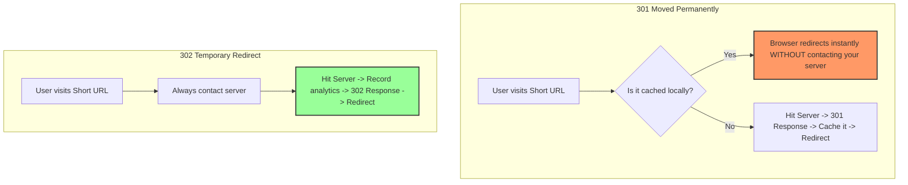

# 🔄 301 vs 302 Redirects: The Traffic Control of the Web

Both status codes tell the browser to "go to another URL," but they represent two completely different promises about **how long** that redirection will last. 

Let's look at the core difference through a simple real-world analogy:

---

## 🚚 The Real-World Analogy

### 🏢 301 Moved Permanently (The Store Relocation)
A physical store moves permanently to a new building across town. 
* They put up a sign: *"We have moved forever. Update your address books."*
* The post office automatically forwards your mail to the new address.
* Next time you want to visit, you don't even go to the old store location—you walk straight to the new building.

### 🚚 302 Found / Temporary (The Food Truck)
A food truck is parked on Corner A today, but redirects you to Corner B because Corner A is blocked for construction.
* The sign says: *"We are parked at Corner B today. Check back tomorrow to see where we are!"*
* You go to Corner B today. But tomorrow, you **must** go back to Corner A first to check if they moved back or went somewhere else.v

---

## 🗺️ What Happens to Web Traffic?

Here is what happens inside a user's browser when a redirect is triggered:



---

## 📊 Quick Comparison Table

| Feature | 301 Moved Permanently | 302 Found (Temporary) |
| :--- | :--- | :--- |
| **Browser Caching** | **Yes.** Cached aggressively. | **No.** Never cached by default. |
| **Server Hit on Repeat** | **No.** Subsequent visits bypass the server. | **Yes.** Hits the server on *every* single click. |
| **SEO Impact** | Transfers 90-99% of SEO ranking to the new link. | Does not transfer SEO ranking history. |
| **Best Used For** | Changing domain names permanently. | A URL Shortener, A/B testing, promo links. |

---

## 🎯 Why This Matters for a URL Shortener

In your redirect controller (`src/modules/redirect/redirect.controller.js`), you redirect users using a **302 status code**:

```typescript
// Sending a 302 Redirect
return reply.redirect(302, originalUrl);
```

Here is why **302** is the only correct choice for a URL shortener:

### 1. The Analytics Trap (Click Tracking) 📊
If you used a **301 redirect**, the user's browser would cache the destination. The next time they clicked the link, their browser would go directly to the destination *without ever telling your server*. 
* **The Result:** You would miss 90% of repeat clicks in your analytics logs. **302** forces the browser to hit your server every time, so you can track every single click event.

### 2. The Edit & Expire Problem ⏳
If a user edits their short link or lets it expire, a **301 redirect** would be cached in their visitors' browsers forever. Visitors would continue to be redirected to the old destination until they cleared their browser cache. 
* **The Result:** With **302**, changes and expirations take effect instantly for everyone.

---

## 💡 Summary Checklist

* Use **301** if you are restructuring a website or moving a page permanently and want search engines to know the old address is dead.
* Use **302** if you are redirecting dynamic links, tracking analytics, or handling temporary pages where the destination might change later.