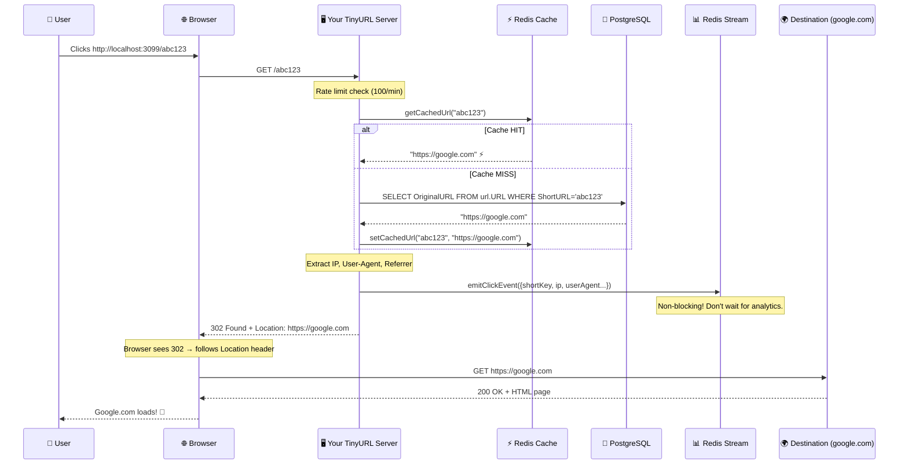

# 🔄 The Complete Guide to HTTP Redirects & Status Codes (301 vs 302)

> *"A redirect is just one line of code. But choosing the wrong status code can silently destroy your analytics, your SEO ranking, and your users' experience — and you won't even know it's happening."*

This guide teaches you **everything** about HTTP redirection — the full family of status codes, how browsers actually process them, what happens at the network level, and exactly why your TinyURL uses 302 and not 301.

---

## 📖 Table of Contents

1. [Chapter 1: What Is a Redirect? — The Forwarding Address](#chapter-1-what-is-a-redirect)
2. [Chapter 2: The HTTP Status Code Universe](#chapter-2-status-code-universe)
3. [Chapter 3: 301 Moved Permanently — "We've Moved. Forever."](#chapter-3-301)
4. [Chapter 4: 302 Found (Temporary Redirect) — "Check Back Tomorrow"](#chapter-4-302)
5. [Chapter 5: The Network-Level Deep Dive — What Actually Happens](#chapter-5-network-deep-dive)
6. [Chapter 6: Browser Caching — The Invisible Trap](#chapter-6-browser-caching)
7. [Chapter 7: Why Your TinyURL Uses 302 — The Complete Argument](#chapter-7-your-tinyurl)
8. [Chapter 8: The Full Redirect Family — 301, 302, 303, 307, 308](#chapter-8-full-family)
9. [Chapter 9: SEO Impact — How Google Sees Redirects](#chapter-9-seo)
10. [Chapter 10: Redirect Chains & Loops — Things That Break](#chapter-10-chains-and-loops)
11. [Chapter 11: Testing & Debugging Redirects](#chapter-11-testing)
12. [Chapter 12: Quick Reference Cheat Sheet](#chapter-12-cheat-sheet)

---

<a id="chapter-1-what-is-a-redirect"></a>
## 📕 Chapter 1: What Is a Redirect? — The Forwarding Address

### 📬 The Post Office Analogy

You move to a new house. You go to the post office and say:

> *"Any mail sent to 123 Old Street should be forwarded to 456 New Avenue."*

Now, when the mail carrier arrives at 123 Old Street, they don't just leave the letter there. They see the forwarding notice and deliver it to 456 New Avenue instead.

**That's exactly what an HTTP redirect is.**

```
  Your browser (the mail carrier) tries to visit a URL.
  The server says: "That page isn't here. Go to THIS URL instead."
  The browser automatically goes to the new URL.
  The user never sees the intermediate step.

  ┌────────────┐    GET /abc123     ┌────────────────┐
  │            │ ──────────────────▶│                │
  │  Browser   │                    │  Your Server   │
  │            │ ◀──────────────────│                │
  │            │  302 → go to       │                │
  │            │  google.com        └────────────────┘
  │            │
  │            │    GET google.com   ┌────────────────┐
  │            │ ──────────────────▶│                │
  │            │                    │  Google.com     │
  │            │ ◀──────────────────│                │
  └────────────┘  200 OK (the page) └────────────────┘
```

### The Three Parts of a Redirect Response

When your server sends a redirect, the HTTP response contains:

```
  HTTP/1.1 302 Found                    ← Status code (the "type" of redirect)
  Location: https://www.google.com      ← Where to go (the new URL)
  Content-Length: 0                      ← No body (just go!)
```

That's it. Two key pieces:
1. **Status code** — tells the browser *how* to redirect (temporarily? permanently?)
2. **Location header** — tells the browser *where* to go

---

<a id="chapter-2-status-code-universe"></a>
## 📗 Chapter 2: The HTTP Status Code Universe

Before diving into 301 vs 302, let's understand where they fit in the bigger picture.

### The Five Families of HTTP Status Codes

```
  ┌─────────────────────────────────────────────────────────────────────┐
  │                   HTTP STATUS CODE FAMILIES                        │
  │                                                                    │
  │  1xx  ℹ️  INFORMATIONAL     "Hold on, I'm working on it..."       │
  │           100 Continue                                             │
  │           101 Switching Protocols                                  │
  │                                                                    │
  │  2xx  ✅  SUCCESS            "Here you go, everything worked!"     │
  │           200 OK                                                   │
  │           201 Created                                              │
  │           204 No Content                                           │
  │                                                                    │
  │  3xx  🔄  REDIRECTION       "It's not here. Go over THERE."  ◀──│
  │           301 Moved Permanently                              YOU  │
  │           302 Found (Temporary)                              ARE  │
  │           303 See Other                                      HERE │
  │           307 Temporary Redirect                                  │
  │           308 Permanent Redirect                                  │
  │                                                                    │
  │  4xx  🚫  CLIENT ERROR       "YOU messed up."                     │
  │           400 Bad Request                                          │
  │           401 Unauthorized                                         │
  │           403 Forbidden                                            │
  │           404 Not Found                                            │
  │           429 Too Many Requests                                    │
  │                                                                    │
  │  5xx  💀  SERVER ERROR       "I messed up."                       │
  │           500 Internal Server Error                                │
  │           502 Bad Gateway                                          │
  │           503 Service Unavailable                                  │
  │           504 Gateway Timeout                                      │
  │                                                                    │
  └─────────────────────────────────────────────────────────────────────┘
```

### The 3xx Family — Your Focus

The 3xx family is all about **redirects**. But not all redirects are equal:

```
  ┌──────────────────────────────────────────────────────────────────┐
  │  CODE  │  NAME                    │  ONE-LINE MEANING           │
  │────────│──────────────────────────│─────────────────────────────│
  │  301   │  Moved Permanently       │  "Gone forever. Update it." │
  │  302   │  Found (Temporary)       │  "Here today, maybe not     │
  │        │                          │   tomorrow."                │
  │  303   │  See Other               │  "Go GET this other URL."   │
  │  307   │  Temporary Redirect      │  "Same as 302, but keep     │
  │        │                          │   the same HTTP method."    │
  │  308   │  Permanent Redirect      │  "Same as 301, but keep     │
  │        │                          │   the same HTTP method."    │
  └──────────────────────────────────────────────────────────────────┘
```

---

<a id="chapter-3-301"></a>
## 📘 Chapter 3: 301 Moved Permanently — "We've Moved. Forever."

### 🏢 The Store Relocation Story

Imagine your favorite bookstore at 10 Main Street closes down. They put up a big permanent sign:

```
  ┌──────────────────────────────────────────────────────────┐
  │                                                          │
  │   📍 WE HAVE PERMANENTLY MOVED                          │
  │                                                          │
  │   Our new address is:                                    │
  │   42 Oak Avenue                                          │
  │                                                          │
  │   UPDATE YOUR ADDRESS BOOK.                              │
  │   DO NOT COME BACK HERE.                                 │
  │   THIS BUILDING IS BEING DEMOLISHED.                     │
  │                                                          │
  └──────────────────────────────────────────────────────────┘
```

The first time you see this sign, you read it and drive to 42 Oak Avenue. But here's the key: **you write down the new address.** Next time you want books, you drive directly to 42 Oak Avenue. You never visit 10 Main Street again.

### What 301 Tells the Browser

```
  Server → Browser:

  "The resource at this URL has PERMANENTLY moved to a new location.
   Cache this redirect. NEVER ask me about this old URL again.
   Go directly to the new URL from now on."
```

### 301 — Visit Pattern Over Time

```
  Visit 1:                              Visit 2, 3, 4, 5...:
  ────────                              ──────────────────────

  Browser                Server          Browser            Server
     │                     │                │                  │
     │  GET /abc123        │                │                  │
     │────────────────────▶│                │  (checks cache)  │
     │                     │                │  "I know this    │
     │  301 Moved          │                │   redirect!"     │
     │  Location: google   │                │                  │
     │◀────────────────────│                │  ──▶ google.com  │
     │                     │                │                  │
     │  GET google.com     │                │  Server is       │
     │────▶ (goes to       │                │  NEVER contacted │
     │      google)        │                │  again! 🔇       │
     │                     │                │                  │
     │  Cache: /abc123     │                │                  │
     │  → google.com 💾   │                │                  │
```

### When to Use 301

```
  ✅ GOOD uses of 301:

  • Migrating from HTTP to HTTPS
    http://example.com → https://example.com

  • Changing your domain name
    old-company.com → new-company.com

  • Restructuring your website permanently
    /blog/2024/post → /articles/post

  • Consolidating duplicate pages
    example.com/page and www.example.com/page → one canonical URL


  ❌ BAD uses of 301:

  • URL shorteners (you lose analytics!)
  • A/B testing (can't change the destination later!)
  • Temporary maintenance redirects
  • Anything where the destination might change
```

---

<a id="chapter-4-302"></a>
## 📙 Chapter 4: 302 Found (Temporary Redirect) — "Check Back Tomorrow"

### 🚚 The Food Truck Story

Your favorite taco truck parks at the corner of Main & 1st every day. Today, there's construction on that corner, so they left a sign:

```
  ┌──────────────────────────────────────────────────────────┐
  │                                                          │
  │   🌮 WE'RE AT 5TH & OAK TODAY                          │
  │                                                          │
  │   Come find us there!                                    │
  │   But check back here TOMORROW —                         │
  │   we might be in a different spot.                       │
  │                                                          │
  └──────────────────────────────────────────────────────────┘
```

You drive to 5th & Oak and get your tacos. But tomorrow, you go back to Main & 1st first — because the truck might be back, or it might have moved somewhere else entirely.

### What 302 Tells the Browser

```
  Server → Browser:

  "The resource is temporarily at a different location.
   DO NOT cache this. Come back to ME next time.
   I might send you somewhere different tomorrow."
```

### 302 — Visit Pattern Over Time

```
  Visit 1:                     Visit 2:                    Visit 3:
  ────────                     ────────                    ────────

  Browser        Server        Browser        Server       Browser       Server
     │              │             │              │            │              │
     │ GET /abc123  │             │ GET /abc123  │            │ GET /abc123  │
     │─────────────▶│             │─────────────▶│            │─────────────▶│
     │              │             │              │            │              │
     │ 302 Found    │             │ 302 Found    │            │ 302 Found    │
     │ → google.com │             │ → google.com │            │ → github.com │
     │◀─────────────│             │◀─────────────│            │◀─────────────│
     │              │             │              │            │              │
     │ GET google   │             │ GET google   │            │ GET github   │
     │───▶          │             │───▶          │            │───▶          │
     │              │             │              │            │              │
     
  Server is contacted        Server is contacted        Server changed
  EVERY time! ✅             EVERY time! ✅             the destination! ✅
  Analytics recorded ✅      Analytics recorded ✅      Works because
                                                        no caching! ✅
```

### When to Use 302

```
  ✅ PERFECT uses of 302:

  • URL shorteners (TinyURL!) — need to track every click
  • A/B testing — redirect to variant A or B dynamically
  • Promotional links — change destination after campaign ends
  • Login redirects — "go to /login, then come back"
  • Maintenance pages — "site is down, go here temporarily"
  • Geo-based routing — redirect US users to us.site.com, EU to eu.site.com
  • Load balancing — redirect to different servers


  ❌ BAD uses of 302:

  • Permanent domain changes (browsers won't update bookmarks)
  • HTTP → HTTPS migration (search engines won't transfer ranking)
```

---

<a id="chapter-5-network-deep-dive"></a>
## 📒 Chapter 5: The Network-Level Deep Dive — What Actually Happens

Let's trace the **exact bytes** that travel across the network when someone clicks your TinyURL short link.

### The Complete Request-Response Cycle

When a user clicks `http://localhost:3099/abc123`:

```
  ┌─────────────────── STEP 1: Browser sends request ───────────────────┐
  │                                                                     │
  │  GET /abc123 HTTP/1.1                                              │
  │  Host: localhost:3099                                              │
  │  User-Agent: Mozilla/5.0 (Windows NT 10.0; Win64; x64) Chrome...  │
  │  Accept: text/html                                                 │
  │  Referer: https://twitter.com/somepost                             │
  │                                                                     │
  └─────────────────────────────────────────────────────────────────────┘
                                    │
                                    ▼
                        ┌─── YOUR FASTIFY SERVER ───┐
                        │                           │
                        │  1. Extract shortkey      │
                        │  2. Look up original URL  │
                        │  3. Emit click event      │
                        │  4. Send redirect         │
                        │                           │
                        └───────────┬───────────────┘
                                    │
                                    ▼
  ┌─────────────────── STEP 2: Server sends redirect ───────────────────┐
  │                                                                     │
  │  HTTP/1.1 302 Found                                                │
  │  Location: https://www.google.com/search?q=very+long+query        │
  │  Content-Length: 0                                                  │
  │  Date: Fri, 15 Aug 2026 12:15:00 GMT                               │
  │  Connection: keep-alive                                             │
  │                                                                     │
  │  (no body)                                                          │
  │                                                                     │
  └─────────────────────────────────────────────────────────────────────┘
                                    │
                                    ▼
  ┌─────────────────── STEP 3: Browser follows redirect ────────────────┐
  │                                                                     │
  │  GET /search?q=very+long+query HTTP/1.1                            │
  │  Host: www.google.com                                              │
  │  (browser automatically navigates to the Location URL)             │
  │                                                                     │
  └─────────────────────────────────────────────────────────────────────┘
                                    │
                                    ▼
  ┌─────────────────── STEP 4: Destination responds ────────────────────┐
  │                                                                     │
  │  HTTP/1.1 200 OK                                                   │
  │  Content-Type: text/html                                           │
  │  ...                                                               │
  │                                                                     │
  │  <html>Google Search Results...</html>                             │
  │                                                                     │
  └─────────────────────────────────────────────────────────────────────┘
```

### Your Actual Code — The Redirect Moment

Here's the exact line in [`redirect.controller.js`](file:///c:/Users/TARUN/Desktop/TinyURL/src/modules/redirect/redirect.controller.js) that triggers the redirect:

```javascript
return res.redirect(originalUrl, 302);
```

This single line makes Fastify generate the entire HTTP response:

```
  res.redirect(originalUrl, 302)
       │           │         │
       │           │         └── Status code: 302 (temporary)
       │           └── Sets the Location header to this URL
       └── Sends the response and ends the request
```

What Fastify actually sends on the wire:

```
  HTTP/1.1 302 Found
  Location: https://www.google.com/search?q=very+long+query
  Content-Length: 0
```

### The Complete Sequence Diagram



### Timing Breakdown

```
  What takes how long?

  ┌─────────────────────────────────────────────────────────────┐
  │  Step                           │ Time      │ % of Total    │
  │─────────────────────────────────│───────────│───────────────│
  │  DNS lookup (localhost)         │ ~0ms      │ 0%            │
  │  TCP connection to server      │ ~1ms      │ 2%            │
  │  Rate limit check (Redis)      │ ~1ms      │ 2%            │
  │  Cache lookup (Redis)          │ ~1ms      │ 2%            │
  │  DB query (if cache miss)      │ ~5-20ms   │ 40%           │
  │  Emit analytics event          │ ~1ms      │ 2%   (async!) │
  │  Send 302 response             │ ~1ms      │ 2%            │
  │  Browser processes redirect    │ ~5ms      │ 10%           │
  │  DNS + connect to destination  │ ~20-100ms │ 40%           │
  │                                │           │               │
  │  TOTAL server time             │ ~5-25ms   │ ⚡ Very fast  │
  │  TOTAL user-perceived time     │ ~30-130ms │ Feels instant │
  └─────────────────────────────────────────────────────────────┘
```

---

<a id="chapter-6-browser-caching"></a>
## 📔 Chapter 6: Browser Caching — The Invisible Trap

This is the **#1 reason** people choose the wrong redirect code. Understanding browser caching behavior is critical.

### How Browsers Cache 301 Redirects

```
  FIRST VISIT to http://tiny.url/abc123:
  ┌──────────────────────────────────────────────────────────────┐
  │  Browser                           Server                   │
  │                                                              │
  │  GET /abc123 ────────────────────▶                          │
  │  ◀──────────────────────────────── 301 → google.com         │
  │                                                              │
  │  Browser's internal cache:                                   │
  │  ┌──────────────────────────────────────────────────┐       │
  │  │  /abc123 → google.com  (PERMANENT, cached)      │       │
  │  └──────────────────────────────────────────────────┘       │
  │                                                              │
  │  GET google.com ───▶ ◀─── 200 OK                            │
  └──────────────────────────────────────────────────────────────┘


  ALL FUTURE VISITS to http://tiny.url/abc123:
  ┌──────────────────────────────────────────────────────────────┐
  │  Browser                           Server                   │
  │                                                              │
  │  (checks internal cache)                                     │
  │  "I know /abc123 → google.com"                               │
  │                                                              │
  │  GET google.com ───▶ ◀─── 200 OK                            │
  │                                                              │
  │  ⚠️ YOUR SERVER IS NEVER CONTACTED!                         │
  │  ⚠️ NO ANALYTICS RECORDED!                                  │
  │  ⚠️ EVEN IF YOU CHANGE THE DESTINATION,                     │
  │     THE USER STILL GOES TO GOOGLE!                           │
  └──────────────────────────────────────────────────────────────┘
```

### How Browsers Handle 302 Redirects

```
  EVERY VISIT to http://tiny.url/abc123:
  ┌──────────────────────────────────────────────────────────────┐
  │  Browser                           Server                   │
  │                                                              │
  │  GET /abc123 ────────────────────▶                          │
  │  ◀──────────────────────────────── 302 → google.com         │
  │                                                              │
  │  Browser's internal cache:                                   │
  │  ┌──────────────────────────────────────────────────┐       │
  │  │  (nothing cached — 302 is temporary)             │       │
  │  └──────────────────────────────────────────────────┘       │
  │                                                              │
  │  GET google.com ───▶ ◀─── 200 OK                            │
  │                                                              │
  │  ✅ Server contacted EVERY time!                             │
  │  ✅ Analytics recorded EVERY time!                           │
  │  ✅ If destination changes, next visit goes to new place!    │
  └──────────────────────────────────────────────────────────────┘
```

### The Caching Comparison — Side by Side

```
  User clicks the same short link 10 times:

  WITH 301:                              WITH 302:
  ─────────                              ─────────

  Click 1:  Server ✅  Analytics ✅      Click 1:  Server ✅  Analytics ✅
  Click 2:  Cached 🔇  Analytics ❌      Click 2:  Server ✅  Analytics ✅
  Click 3:  Cached 🔇  Analytics ❌      Click 3:  Server ✅  Analytics ✅
  Click 4:  Cached 🔇  Analytics ❌      Click 4:  Server ✅  Analytics ✅
  Click 5:  Cached 🔇  Analytics ❌      Click 5:  Server ✅  Analytics ✅
  Click 6:  Cached 🔇  Analytics ❌      Click 6:  Server ✅  Analytics ✅
  Click 7:  Cached 🔇  Analytics ❌      Click 7:  Server ✅  Analytics ✅
  Click 8:  Cached 🔇  Analytics ❌      Click 8:  Server ✅  Analytics ✅
  Click 9:  Cached 🔇  Analytics ❌      Click 9:  Server ✅  Analytics ✅
  Click 10: Cached 🔇  Analytics ❌      Click 10: Server ✅  Analytics ✅

  Analytics recorded: 1/10 (90% LOST!)   Analytics recorded: 10/10 (100%) ✅
```

> [!CAUTION]
> **With 301, you're blind.** After the first click, the browser silently redirects without ever talking to your server. Your analytics dashboard shows 1 click when there were actually 10. You're making business decisions on 10% of the real data.

### How Long Does 301 Caching Last?

```
  The terrifying answer: UNTIL THE USER CLEARS THEIR BROWSER CACHE.

  That could be:
  ⏰  Days
  ⏰  Weeks
  ⏰  Months
  ⏰  NEVER (most users never clear their cache)

  And there's NOTHING you can do about it from the server side.
  You can't "undo" a 301 that's already been cached.
  You can't send an update to the browser.
  The browser won't check with you again. Period.
```

---

<a id="chapter-7-your-tinyurl"></a>
## 📓 Chapter 7: Why Your TinyURL Uses 302 — The Complete Argument

Your [`redirect.controller.js`](file:///c:/Users/TARUN/Desktop/TinyURL/src/modules/redirect/redirect.controller.js) sends a 302:

```javascript
return res.redirect(originalUrl, 302);
```

Here are the **four unbreakable reasons** why this is the only correct choice:

### Reason 1: 🔍 Click Analytics

Your entire analytics pipeline depends on the server being contacted for every click:

```
  User clicks short link
       │
       ▼
  Fastify receives GET /abc123
       │
       ├──▶ emitClickEvent({          ← THIS ONLY WORKS IF THE
       │        shortKey: "abc123",      SERVER IS CONTACTED!
       │        userAgent: "Chrome",
       │        ip: "1.2.3.4",          With 301, this line would
       │        referrer: "twitter",     NEVER execute after the
       │        timestamp: 1723729500    first visit.
       │    })
       │
       └──▶ res.redirect(originalUrl, 302)
```

With 301, your entire `click_analytics` table would be a lie. Every repeat visitor would be invisible.

### Reason 2: ⏳ URL Expiration

Your schema has an `expires_at` column:

```sql
SELECT OriginalURL FROM url.URL
WHERE ShortURL = $1
  AND (expires_at IS NULL OR expires_at > now())
--                          ^^^^^^^^^^^^^^^^^^^^^^^^
--    This check ONLY runs if the server is contacted!
```

```
  Scenario: URL expires on August 20th.

  WITH 302:
  Aug 15: Click → Server checks → Not expired → Redirect ✅
  Aug 21: Click → Server checks → EXPIRED → 404 Not Found ✅

  WITH 301:
  Aug 15: Click → Server checks → Not expired → Redirect (cached!) ✅
  Aug 21: Click → BROWSER CACHE → Redirect to old URL 💀
          The server is never contacted. Expiration is IGNORED.
          The "expired" link keeps working forever for this user!
```

### Reason 3: ✏️ Editable Destinations

If you ever add a feature to let users edit where their short link points:

```
  WITH 302:
  Before edit: /abc123 → google.com ✅
  After edit:  /abc123 → github.com ✅  (takes effect immediately!)

  WITH 301:
  Before edit: /abc123 → google.com ✅
  After edit:  /abc123 → google.com 💀  (browser still uses cached redirect!)
              The user can NEVER get to github.com through this link
              unless they clear their cache.
```

### Reason 4: 🛡️ Rate Limiting

Your route has rate limiting:

```javascript
// redirect.route.js
fastify.get('/:shortkey', {
    preHandler: rateLimit({ name: 'redirect', windowSeconds: 60, limit: 100 })
}, redirectController);
```

```
  WITH 302:
  Every click hits your server → rate limiter counts it → protection works ✅

  WITH 301:
  First click hits server → cached → subsequent clicks never reach server
  → rate limiter sees 1 request when there were 100 → protection is useless 💀
```

### The Verdict

```
  ┌─────────────────────────────────────────────────────────────────┐
  │                                                                 │
  │  For a URL shortener, 302 is the ONLY correct answer.          │
  │                                                                 │
  │  301 breaks:                                                    │
  │    ❌ Click tracking (analytics lost after first visit)         │
  │    ❌ URL expiration (expired URLs keep working from cache)     │
  │    ❌ Destination editing (changes never reach cached users)    │
  │    ❌ Rate limiting (repeat clicks bypass the server)           │
  │    ❌ A/B testing (can't split traffic if browser caches)       │
  │                                                                 │
  │  302 preserves:                                                 │
  │    ✅ Every click is tracked                                    │
  │    ✅ Expirations take effect immediately                       │
  │    ✅ Destination changes propagate instantly                   │
  │    ✅ Rate limiting works correctly                             │
  │    ✅ Full server-side control                                  │
  │                                                                 │
  └─────────────────────────────────────────────────────────────────┘
```

---

<a id="chapter-8-full-family"></a>
## 📚 Chapter 8: The Full Redirect Family — 301, 302, 303, 307, 308

There are actually **five** redirect status codes. Here's the complete picture:

### The Method Preservation Problem

In the early days of HTTP, there was a bug (well, an ambiguity) in the spec:

```
  The Bug:
  ─────────
  Client sends: POST /submit-form (with a body of form data)
  Server returns: 302 Found → /thank-you

  Question: Should the browser send a POST or GET to /thank-you?

  What the spec SAID: Keep the same method (POST)
  What browsers ACTUALLY DID: Changed it to GET

  This broke things! If the server expected a POST to /thank-you,
  it would get a GET instead.
```

To fix this ambiguity, they created new, explicit status codes:

### The Complete Family

```
  ┌──────────────────────────────────────────────────────────────────────┐
  │                                                                      │
  │  TEMPORARY redirects:                                                │
  │  ─────────────────────                                               │
  │  302 Found              May change method (POST → GET)              │
  │                         The original. Browsers change POST to GET.  │
  │                                                                      │
  │  303 See Other          ALWAYS changes to GET                       │
  │                         "I processed your POST. Now go GET this."   │
  │                         Used after form submissions.                │
  │                                                                      │
  │  307 Temporary Redirect NEVER changes method                        │
  │                         POST stays POST. PUT stays PUT.             │
  │                         Strict version of 302.                      │
  │                                                                      │
  │  ──────────────────────────────────────────────────────────────────  │
  │                                                                      │
  │  PERMANENT redirects:                                                │
  │  ────────────────────                                                │
  │  301 Moved Permanently  May change method (POST → GET)              │
  │                         The original. Browsers cache aggressively.  │
  │                                                                      │
  │  308 Permanent Redirect NEVER changes method                        │
  │                         POST stays POST. Cached like 301.           │
  │                         Strict version of 301.                      │
  │                                                                      │
  └──────────────────────────────────────────────────────────────────────┘
```

### The Decision Matrix

```
                          TEMPORARY              PERMANENT
                     (don't cache)           (cache forever)
                  ┌──────────────────┬──────────────────────┐
                  │                  │                      │
  May change      │    302 Found     │  301 Moved           │
  method          │                  │  Permanently         │
  (POST → GET)    │  (your TinyURL!) │  (domain migrations) │
                  │                  │                      │
                  ├──────────────────┼──────────────────────┤
                  │                  │                      │
  Preserves       │    307 Temporary │  308 Permanent       │
  method          │    Redirect      │  Redirect            │
  (POST → POST)   │  (API redirects) │  (API migrations)    │
                  │                  │                      │
                  └──────────────────┴──────────────────────┘
```

### Why 302 and Not 307 for TinyURL?

```
  For TinyURL, users always click links via GET requests.
  The method-change behavior of 302 vs 307 doesn't matter for GET requests.
  (GET stays GET in both cases)

  302 is the better choice because:
  ✅ Universal browser support (even ancient browsers)
  ✅ Simpler semantics for this use case
  ✅ Industry standard for URL shorteners (bit.ly, t.co all use 302)
```

---

<a id="chapter-9-seo"></a>
## 📖 Chapter 9: SEO Impact — How Google Sees Redirects

### Why This Matters (Even for a URL Shortener)

Search engines like Google follow redirects and decide which URL to show in search results. The status code tells Google what to do:

```
  301 Moved Permanently:
  ┌──────────────────────────────────────────────────────────────────┐
  │  Google's reaction:                                              │
  │                                                                  │
  │  "The old URL is DEAD. Transfer all its SEO juice (page rank,   │
  │   backlinks, authority) to the new URL. Remove the old URL      │
  │   from search results and show the new one instead."             │
  │                                                                  │
  │  SEO transfer: 90-99% of ranking passes to the new URL ✅       │
  └──────────────────────────────────────────────────────────────────┘


  302 Temporary Redirect:
  ┌──────────────────────────────────────────────────────────────────┐
  │  Google's reaction:                                              │
  │                                                                  │
  │  "The old URL is still the canonical one. This redirect is      │
  │   temporary, so I'll keep the old URL in my index. I won't      │
  │   transfer SEO juice to the destination."                        │
  │                                                                  │
  │  SEO transfer: 0% — old URL keeps its ranking                   │
  └──────────────────────────────────────────────────────────────────┘
```

### For TinyURL, This Is Actually What We Want!

```
  When someone shares: http://localhost:3099/abc123

  Google should:
  ❌ NOT index localhost:3099/abc123 as a search result
  ❌ NOT transfer SEO juice to google.com (that's Google's job, not ours)
  ✅ Keep treating the short URL as a temporary intermediary

  302 achieves this perfectly.

  If we used 301:
  ⚠️ Google might index the DESTINATION URL instead of the short URL
  ⚠️ Backlinks pointing to your short URL would benefit the destination
     (you're giving away your link equity for free!)
```

---

<a id="chapter-10-chains-and-loops"></a>
## 🔗 Chapter 10: Redirect Chains & Loops — Things That Break

### Redirect Chains

A redirect chain is when one redirect leads to another redirect, which leads to another...

```
  A → B → C → D → (final destination)

  http://tiny.url/abc
       │
       ▼  302
  http://bit.ly/xyz
       │
       ▼  301
  http://old-site.com/page
       │
       ▼  301
  https://new-site.com/page
       │
       ▼  200 OK ✅
```

### Why Chains Are Bad

```
  Each hop adds latency:
  ┌────────────────────────────────────────────────────────────┐
  │  1 redirect:   50ms  ← Acceptable                        │
  │  2 redirects:  100ms ← Noticeable                        │
  │  3 redirects:  150ms ← Slow                              │
  │  5 redirects:  250ms ← Users start leaving               │
  │  10 redirects: 500ms ← Search engines penalize this      │
  └────────────────────────────────────────────────────────────┘

  Most browsers give up after 20 redirects and show an error:
  "ERR_TOO_MANY_REDIRECTS"
```

### Redirect Loops — The Infinite Trap

A redirect loop is when URL A redirects to B, and B redirects back to A:

```
  The Infinite Loop:

  GET /page-a
       │
       ▼  302 → /page-b
  GET /page-b
       │
       ▼  302 → /page-a    ← BACK TO THE START!
  GET /page-a
       │
       ▼  302 → /page-b
  GET /page-b
       │
       ▼  302 → /page-a
  ...
  ...
  Browser: "ERR_TOO_MANY_REDIRECTS" 💀
```

### How to Prevent Loops in TinyURL

```
  What if someone shortens their OWN short URL?

  User submits:  http://localhost:3099/abc123
  System creates: http://localhost:3099/def456 → http://localhost:3099/abc123

  Now: /def456 → /abc123 → original destination
  That's a chain (2 hops), not a loop. Acceptable, but not ideal.

  But what if /abc123 had already expired?
  /def456 → /abc123 → 404 Not Found 💀
  The user gets an error, even though /def456 is "valid"

  Prevention: Validate that original_url is NOT your own domain
  before creating the short link!
```

---

<a id="chapter-11-testing"></a>
## 🔬 Chapter 11: Testing & Debugging Redirects

### Using cURL (Command Line)

The most reliable way to test redirects is `curl` with the `-I` flag (headers only) or `-v` (verbose):

```bash
# See just the response headers (don't follow the redirect)
curl -I http://localhost:3099/abc123

# Output:
# HTTP/1.1 302 Found
# Location: https://www.google.com
# Date: Fri, 15 Aug 2026 12:15:00 GMT
# Connection: keep-alive
```

```bash
# Follow ALL redirects and show each hop
curl -L -v http://localhost:3099/abc123

# Output shows each hop:
# > GET /abc123 HTTP/1.1
# < HTTP/1.1 302 Found
# < Location: https://www.google.com
# * Issue another request to this URL: 'https://www.google.com'
# > GET / HTTP/1.1
# < HTTP/1.1 200 OK
```

```bash
# Follow redirects but show ONLY the status codes
curl -o /dev/null -s -w "%{http_code}\n" http://localhost:3099/abc123
# Output: 302

# Check what the Location header is (without following)
curl -s -o /dev/null -D - http://localhost:3099/abc123 | findstr Location
# Output: Location: https://www.google.com
```

### Using Browser DevTools

```
  1. Open DevTools (F12)
  2. Go to the Network tab
  3. ☑️ Check "Preserve log" (important! Otherwise redirects disappear)
  4. Visit your short URL
  5. You'll see TWO requests:

  ┌──────────────────────────────────────────────────────────────────┐
  │  Network Tab                                                     │
  │                                                                  │
  │  Name          Status    Type       Size     Time                │
  │  ─────────     ────────  ────────   ──────   ─────               │
  │  abc123        302       redirect   0 B      15ms   ← Redirect  │
  │  google.com    200       document   45 KB    230ms  ← Final     │
  │                                                                  │
  └──────────────────────────────────────────────────────────────────┘

  Click on "abc123" to inspect the headers:
  - Status Code: 302 Found
  - Location: https://www.google.com
```

### Common Debugging Scenarios

| Problem | Symptom | Cause | Fix |
|:--|:--|:--|:--|
| Redirect goes to wrong URL | User lands on unexpected page | Wrong `originalUrl` in database | Check the DB row for this short key |
| Redirect doesn't work at all | User sees JSON error | `getOriginalUrl()` returned null | Short key doesn't exist or is expired |
| Old destination persists | User sees old URL despite update | 301 was cached by browser | Can't fix! This is why you use 302 |
| ERR_TOO_MANY_REDIRECTS | Browser error page | Redirect loop or chain > 20 | Check if short URL points to itself |
| Redirect is slow | 500ms+ response time | DB query slow, no caching | Check Redis cache, add index |

---

<a id="chapter-12-cheat-sheet"></a>
## 📋 Chapter 12: Quick Reference Cheat Sheet

### 301 vs 302 — The One-Page Summary

```
  ┌─────────────────────────────────────────────────────────────────────┐
  │                    301                    302                      │
  │  ──────────────────────────────  ──────────────────────────────── │
  │  Name:     Moved Permanently     Name:     Found (Temporary)      │
  │  Cached:   YES (forever!)        Cached:   NO (every time)        │
  │  Server:   Hit ONCE              Server:   Hit EVERY time         │
  │  SEO:      Transfers ranking     SEO:      Keeps original         │
  │  Editable: ❌ Cached forever     Editable: ✅ Changes propagate   │
  │  Analytics:❌ Lost after 1st     Analytics:✅ Tracks every click  │
  │                                                                    │
  │  Use for:  Domain migrations     Use for:  URL shorteners ✅      │
  │            HTTP → HTTPS                    A/B testing             │
  │            Permanent moves                 Temporary pages         │
  │            Dead page cleanup               Dynamic routing        │
  └─────────────────────────────────────────────────────────────────────┘
```

### The Complete 3xx Family

| Code | Name | Cached? | Method Change? | Use Case |
|:--|:--|:-:|:-:|:--|
| **301** | Moved Permanently | ✅ Yes | May (POST→GET) | Domain moves, HTTP→HTTPS |
| **302** | Found | ❌ No | May (POST→GET) | URL shorteners, temp redirects |
| **303** | See Other | ❌ No | Always (→GET) | After form POST, PRG pattern |
| **307** | Temporary Redirect | ❌ No | Never | API redirects preserving method |
| **308** | Permanent Redirect | ✅ Yes | Never | API endpoint moves |

### Code Snippets — How to Send Each Redirect in Fastify

```javascript
// 302 — Temporary (what your TinyURL uses)
return res.redirect(url, 302);

// 301 — Permanent (domain migration)
return res.redirect(url, 301);

// 307 — Temporary, preserve method
return res.redirect(url, 307);

// 308 — Permanent, preserve method
return res.redirect(url, 308);
```

### The Decision Flowchart

```
  Should I use 301 or 302?

  ┌─ Is this move PERMANENT (will the URL NEVER point elsewhere)?
  │   └─ NO → Use 302 (or 307 if preserving HTTP method matters)
  │   └─ YES ↓
  │
  ├─ Do you need analytics/click tracking?
  │   └─ YES → Use 302 (301 caching breaks analytics!)
  │   └─ NO ↓
  │
  ├─ Could the destination EVER change?
  │   └─ YES → Use 302
  │   └─ NO ↓
  │
  ├─ Do you want SEO juice transferred?
  │   └─ YES → Use 301 ✅
  │   └─ NO → Use 302
  │
  └─ Still not sure? → Default to 302.
     It's always safer. You can upgrade to 301 later,
     but you can NEVER undo a 301 that's been cached.
```

---

## 🎓 Final Mental Model

```
  301 is a TATTOO       →  Permanent. Hard to remove. Think carefully.
  302 is a STICKY NOTE  →  Temporary. Easy to change. Low commitment.

  ┌──────────────────────────────────────────────────────────┐
  │                                                          │
  │  When in doubt, use 302.                                 │
  │                                                          │
  │  You can always "upgrade" a 302 to a 301 later.         │
  │  But you can NEVER "downgrade" a 301 back to a 302      │
  │  — because the old 301 is already cached in millions     │
  │  of browsers, and there's no way to reach them.          │
  │                                                          │
  │  302 is the safe default.                                │
  │  301 is the optimization you earn with certainty.        │
  │                                                          │
  └──────────────────────────────────────────────────────────┘
```

> **A 301 is a promise to every browser in the world: "This will never change." Break that promise, and you can't take it back.**

---

*This guide is part of the TinyURL backend documentation. See also: [Connection Pooling](file:///c:/Users/TARUN/Desktop/TinyURL/docs/backend/connection_pooling.md) · [Database Schema Design](file:///c:/Users/TARUN/Desktop/TinyURL/docs/backend/database_schema_design.md) · [Caching Strategies](file:///c:/Users/TARUN/Desktop/TinyURL/docs/backend/caching_strategies.md)*
