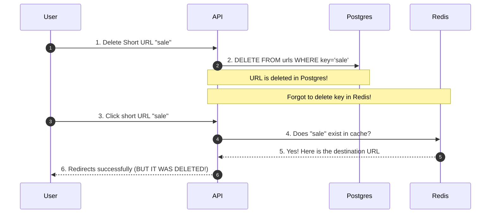
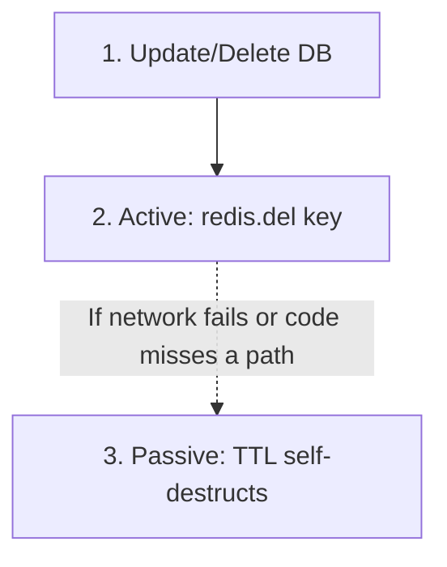

# 🧹 Cache Invalidation: Keeping the Cache Fresh and True

> "There are only two hard things in Computer Science: cache invalidation and naming things."
> — *Phil Karlton*

A cache is a **copy** of the truth. The moment the real truth (in Postgres) changes, your copy becomes stale, outdated, and wrong. **Cache Invalidation** is the art of ensuring your cache never serves stale answers to your users.

---

## 📝 The Sticky Note Analogy

Imagine you are an assistant at a desk:
* **The Database:** A massive, heavy filing cabinet in another room.
* **The Cache:** A **sticky note** on your computer screen with a client's phone number.

If a client calls and changes their number:
* If you update the file in the cabinet but **forget to tear off the sticky note**, you will keep dialing the old, wrong number.
* **Cache Invalidation** is the act of ripping that sticky note off and throwing it away the moment the client's information changes.

---

## 🧭 The Danger of No Invalidation

Here is what happens when we delete database data but forget to invalidate the cache:



---

## 🛠️ The 3 Ways to Keep Your Cache Fresh

---

### 1. Passive Invalidation: TTL (The Self-Destructing Sticky Note) ⏳
* **How it works:** You set an expiration time (Time-To-Live) when saving data to Redis:
  ```typescript
  await redis.set(key, value, 'EX', 86400); // Expires in 24 hours
  ```
* **The Analogy:** You write a note with special ink that fades away and self-destructs after 24 hours.
* **Pros:** Automatic. If you forget to write cleanup code, Redis will delete it anyway.
* **Cons:** Stale window. If the database changes in hour 2, users will see the old data for the next 22 hours.

---

### 2. Active Invalidation: Delete-on-Write (Rip and Throw) 🗑️
* **How it works:** The instant you `UPDATE` or `DELETE` a row in Postgres, you actively delete that key from Redis.
  ```typescript
  await pool.query(`DELETE FROM urls WHERE short_key = $1`, [shortKey]);
  await redis.del(KEY_PREFIX + shortKey); // Invalidate!
  ```
* **The Analogy:** The moment you update the filing cabinet, you rip the sticky note off your screen and throw it in the trash. The next request is forced to look at the cabinet and write a new, correct note.
* **Pros:** Simple, reliable, and guarantees the next read is 100% correct.

---

### 3. Active Invalidation: Update-on-Write (Erase and Rewrite) ✏️
* **How it works:** The instant you update Postgres, you immediately write the *new* value directly into the cache.
  ```typescript
  await pool.query(`UPDATE urls SET original_url = $1 WHERE short_key = $2`, [newUrl, shortKey]);
  await setCachedUrl(shortKey, newUrl); // Write-Through update!
  ```
* **The Analogy:** You erase the phone number on your sticky note and write the new one over it.
* **Pros:** Extremely fast. Zero cache misses, even on the next request.
* **Cons:** Risk of bugs. If your update logic writes the wrong data to Redis, your cache will confidently serve incorrect data.

---

## 🛡️ The Ultimate Safety Net: Combine 1 & 2

The industry standard pattern is to use **Delete-on-Write** as your active approach, with a **TTL** underneath it as a backup:



* **Why?** If the server temporarily loses network connection to Redis, the `redis.del()` command might fail. Having a TTL ensures the cache will self-heal within a few hours instead of staying broken forever.

---

## ⚡ System Design Trade-off: Consistency vs. Speed

This is a classic demonstration of the **CAP Theorem** (Consistency vs. Availability):

* **Prioritize Speed:** Use long TTLs and don't worry about minor mismatches (Accept eventual consistency).
* **Prioritize Consistency:** Delete cache keys immediately on database writes (Ensures users never see stale data, at the cost of more database reads on cache misses).

---

## 🔍 When Does This Apply to TinyURL?

* **Right Now:** Since we only `INSERT` new short links (we never edit or delete them), cache stale mismatch is **impossible**.
* **In the Future:** The moment we add features like **"Edit Destination URL"** or **"Delete Link"**, we must add a matching `redis.del()` right next to the database query.