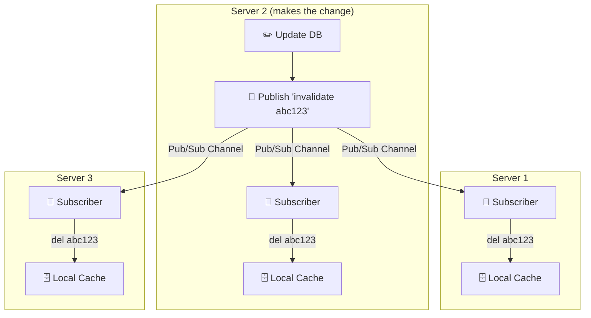

# 🧹 The Complete Guide to Cache Invalidation

> *"There are only two hard things in Computer Science: cache invalidation and naming things."*
> — Phil Karlton
>
> *"...and off-by-one errors."*
> — Every programmer ever

A cache is a **copy** of the truth. The moment the truth changes and your copy doesn't, you're serving a confident lie. Cache invalidation is the discipline of ensuring your cache never betrays your users with stale data. This guide teaches you **everything** — every invalidation strategy, every failure mode, every edge case, and exactly how your TinyURL handles (and will handle) cache freshness.

---

## 📖 Table of Contents

1. [Chapter 1: What Is Cache Invalidation? — The Sticky Note That Lies](#chapter-1-what-is-it)
2. [Chapter 2: Why Is It the "Hardest Problem"?](#chapter-2-why-hard)
3. [Chapter 3: The Stale Data Horror Stories](#chapter-3-horror-stories)
4. [Chapter 4: Strategy 1 — TTL (Time-To-Live)](#chapter-4-ttl)
5. [Chapter 5: Strategy 2 — Delete-on-Write](#chapter-5-delete-on-write)
6. [Chapter 6: Strategy 3 — Update-on-Write (Write-Through)](#chapter-6-update-on-write)
7. [Chapter 7: Strategy 4 — Event-Driven Invalidation (Pub/Sub)](#chapter-7-event-driven)
8. [Chapter 8: Strategy 5 — Version-Based Invalidation](#chapter-8-version-based)
9. [Chapter 9: The Belt-and-Suspenders Pattern](#chapter-9-belt-and-suspenders)
10. [Chapter 10: Race Conditions — When Invalidation Goes Wrong](#chapter-10-race-conditions)
11. [Chapter 11: Your TinyURL — Current State & Future-Proofing](#chapter-11-your-tinyurl)
12. [Chapter 12: Cache Invalidation in Distributed Systems](#chapter-12-distributed)
13. [Chapter 13: Testing Cache Invalidation](#chapter-13-testing)
14. [Chapter 14: Quick Reference Cheat Sheet](#chapter-14-cheat-sheet)

---

<a id="chapter-1-what-is-it"></a>
## 📕 Chapter 1: What Is Cache Invalidation? — The Sticky Note That Lies

### 📝 The Sticky Note Analogy

You work at a help desk. A client calls and gives you their phone number. You write it on a sticky note and stick it to your monitor.

```
  ┌────────────────────────────────────┐
  │  📝 Sticky Note (Cache)           │
  │                                    │
  │  Client: ACME Corp                │
  │  Phone:  555-1234                  │
  │                                    │
  └────────────────────────────────────┘

  ┌────────────────────────────────────┐
  │  📁 Filing Cabinet (Database)     │
  │                                    │
  │  Client: ACME Corp                │
  │  Phone:  555-1234                  │
  │                                    │
  └────────────────────────────────────┘

  Both match! Everything is fine. ✅
```

Now the client calls back and changes their number:

```
  Client: "Our new number is 555-9999."
  You: "Got it!" → Update the filing cabinet.

  ┌────────────────────────────────────┐
  │  📝 Sticky Note (Cache)           │
  │                                    │
  │  Client: ACME Corp                │
  │  Phone:  555-1234  ← STALE! 🧟   │
  │                                    │
  └────────────────────────────────────┘

  ┌────────────────────────────────────┐
  │  📁 Filing Cabinet (Database)     │
  │                                    │
  │  Client: ACME Corp                │
  │  Phone:  555-9999  ← UPDATED ✅   │
  │                                    │
  └────────────────────────────────────┘

  You forgot to update the sticky note!
  Next time you need to call ACME, you dial 555-1234 (WRONG!).
  You're confidently calling the wrong number.

  CACHE INVALIDATION = remembering to update or destroy the sticky note
  every time the filing cabinet changes.
```

### The Formal Definition

```
  ┌─────────────────────────────────────────────────────────────────────┐
  │                                                                     │
  │  CACHE INVALIDATION:                                               │
  │  The process of removing or updating cached data when the          │
  │  underlying source of truth (database) changes, so that           │
  │  subsequent reads never return stale (outdated) data.             │
  │                                                                     │
  │  Three possible actions when data changes:                         │
  │                                                                     │
  │  1. DELETE the cache entry    → Next read fetches fresh from DB   │
  │  2. UPDATE the cache entry    → Next read gets the new value      │
  │  3. DO NOTHING (rely on TTL)  → Stale for a while, then auto-fix │
  │                                                                     │
  └─────────────────────────────────────────────────────────────────────┘
```

---

<a id="chapter-2-why-hard"></a>
## 📗 Chapter 2: Why Is It the "Hardest Problem"?

### The Fundamental Tension

```
  The cache exists to be FAST (avoid querying the database).
  Invalidation exists to be CORRECT (don't serve stale data).

  SPEED ◄──────────── TENSION ────────────► CORRECTNESS

  More caching    = Faster responses      = Higher risk of stale data
  Less caching    = Slower responses      = Always-fresh data
  No caching      = Every request hits DB = Perfect accuracy but slow

  You can't have both extremes. You MUST choose a point on the spectrum.
```

### The Four Reasons Invalidation Is Hard

```
  REASON 1: KNOWING WHEN DATA CHANGED
  ──────────────────────────────────────
  Your cache doesn't automatically know when the database changes.
  Someone has to TELL it. If you forget one code path, stale data leaks.

  Update URL in service A → forgets to invalidate cache → 
  Service B reads stale data → user sees wrong redirect → 💀


  REASON 2: MULTIPLE WRITERS
  ─────────────────────────────
  What if two servers update the same URL simultaneously?

  Server A: Update URL to google.com → cache.set("abc123", "google.com")
  Server B: Update URL to github.com → cache.set("abc123", "github.com")

  Which write wins? It depends on timing (race condition).
  The cache might not match the database!


  REASON 3: DISTRIBUTED CACHES
  ───────────────────────────────
  With multiple Redis instances or in-memory caches per server:

  Server 1's local cache: abc123 → google.com  (updated ✅)
  Server 2's local cache: abc123 → old-site.com (STALE! 🧟)

  Server 2 doesn't know about Server 1's update.


  REASON 4: NETWORK FAILURES
  ────────────────────────────
  You update the database ✅
  You try to delete the cache key ❌ (Redis briefly unreachable)
  The stale entry lives on until TTL expires.
  You can't retry because you don't remember what to retry.
```

### The Two Fundamental Errors

```
  ┌─────────────────────────────────────────────────────────────────────┐
  │                                                                     │
  │  ERROR 1: SERVING STALE DATA (False Positive)                      │
  │  Cache returns an answer that's no longer correct.                 │
  │  "This URL goes to google.com" (but it was changed to github.com) │
  │  User is silently sent to the wrong place.                         │
  │  Severity: 🟡 Wrong behavior (potentially dangerous)              │
  │                                                                     │
  │  ERROR 2: UNNECESSARY CACHE MISS (False Negative)                  │
  │  Cache doesn't have data that's actually still valid.              │
  │  "Cache miss! Let me check the database." (but cache was fine)    │
  │  User gets correct data but slightly slower.                       │
  │  Severity: 🟢 Performance hit only (always safe)                   │
  │                                                                     │
  │  RULE: It's ALWAYS safer to over-invalidate (more misses)         │
  │  than to under-invalidate (stale data served to users).            │
  │                                                                     │
  └─────────────────────────────────────────────────────────────────────┘
```

> [!IMPORTANT]
> **When in doubt, invalidate.** An extra cache miss costs you 10ms. Serving stale data can cost you a user's trust, a broken feature, or a security vulnerability. Always err on the side of freshness.

---

<a id="chapter-3-horror-stories"></a>
## 📘 Chapter 3: The Stale Data Horror Stories

### Horror Story 1: The Phantom Redirect

```
  SCENARIO: Your TinyURL (future feature: "Edit URL")

  1. User creates: abc123 → google.com
     → DB: google.com ✅
     → Cache: google.com ✅ (Write-Through on creation)

  2. User edits:  abc123 → github.com
     → DB: github.com ✅
     → Cache: google.com 🧟 (FORGOT to invalidate!)

  3. 10,000 visitors click abc123
     → Cache HIT → google.com → WRONG DESTINATION!
     → User changed it to github.com but nobody goes there
     → For 24 HOURS (until TTL expires)

  Impact: 10,000 people sent to the wrong website.
  User blames your product. Trust destroyed. 💀
```

### Horror Story 2: The Zombie URL

```
  SCENARIO: Your TinyURL (future feature: "Delete URL")

  1. URL abc123 → malware-site.com (reported as phishing!)
  2. Admin deletes abc123 from database immediately
     → DB: abc123 GONE ✅
     → Cache: abc123 → malware-site.com 🧟 (STILL THERE!)

  3. Users keep clicking abc123
     → Cache HIT → malware-site.com → USERS GET PHISHED!
     → For 24 HOURS until TTL expires

  Impact: You're actively redirecting users to malware
  AFTER you "deleted" the link. Legal liability. 💀💀💀
```

### Horror Story 3: The Ghost Expiration

```
  SCENARIO: Your TinyURL (current feature: URL expiration)

  1. URL abc123 → google.com, expires_at = August 20
  2. August 19: User clicks → Cache HIT → google.com ✅
  3. Cache entry has TTL of 24 hours (set yesterday)
  4. August 20: URL expires in PostgreSQL
     → DB: "expires_at > now()" fails → would return NULL
     → Cache: google.com 🧟 (still has 12 hours of TTL left!)

  5. August 20, 8:00 AM: User clicks
     → Cache HIT → google.com → EXPIRED URL STILL WORKS!

  6. August 20, 8:00 PM: Cache TTL finally expires
     → Cache MISS → DB → NULL → 404 Not Found ✅ (finally!)

  Impact: Expired URLs keep working for up to 24 hours.
  If the URL was a limited-time promo, customers get deals
  they shouldn't have. Revenue loss. 💀
```

> [!CAUTION]
> **Horror Story 3 exists in YOUR current code.** Your `expires_at` check only runs on cache misses. If a URL is cached and then expires in the DB, the cache still serves it until TTL runs out. This is a known tradeoff — Chapter 11 shows how to fix it.

---

<a id="chapter-4-ttl"></a>
## 📙 Chapter 4: Strategy 1 — TTL (Time-To-Live)

### ⏰ The Self-Destructing Sticky Note

```
  You write a note with DISAPPEARING INK.
  After 24 hours, the ink fades and the note is blank.
  You're forced to look at the filing cabinet again.

  Even if you FORGET to invalidate, the note self-destructs.
  Maximum staleness = TTL duration.
```

### How TTL Works

```
  SET url:abc123 "https://google.com" EX 86400
                                      ^^^^^^^^
                                      Expire in 86400 seconds (24h)

  Timeline:
  ┌──────────────────────────────────────────────────────────────────┐
  │                                                                  │
  │  Hour 0:     Key created. TTL = 86400 seconds.                  │
  │  Hour 1-23:  GET url:abc123 → "https://google.com" (from cache)│
  │  Hour 24:    KEY AUTO-DELETED BY REDIS 💨                       │
  │  Hour 24+:   GET url:abc123 → null (cache miss)                │
  │              → Fetch from DB → Re-cache with new TTL           │
  │                                                                  │
  └──────────────────────────────────────────────────────────────────┘
```

### Your Actual Code

From [`url_cache.js`](file:///c:/Users/TARUN/Desktop/TinyURL/src/cache/url_cache.js):

```javascript
await redis.set(KEY_PREFIX + shortKey, originalUrl, 'EX', env.CACHE_TTL_SECONDS);
//                                                  ^^^  ^^^^^^^^^^^^^^^^^^^^^^
//                                                  "Expire After" 86400 seconds
```

### TTL — The Full Analysis

```
  ADVANTAGES:
  ───────────
  ✅ AUTOMATIC — no extra code needed on writes
  ✅ GUARANTEED maximum staleness (= TTL duration)
  ✅ SELF-HEALING — even if you forget to invalidate,
     the cache fixes itself within TTL seconds
  ✅ PREVENTS MEMORY LEAKS — keys don't accumulate forever
  ✅ SIMPLE — one line of code (EX 86400)

  DISADVANTAGES:
  ──────────────
  ❌ STALE WINDOW — data can be wrong for up to TTL duration
  ❌ NOT INSTANT — if data changes at hour 1, cache serves
     stale data for 23 more hours
  ❌ COLD MISSES — after expiry, the first request is slow
  ❌ ONE-SIZE-FITS-ALL — same TTL for all keys, but some data
     changes more frequently than others
```

### Choosing the Right TTL

```
  ┌── TTL Decision Matrix ──────────────────────────────────────────┐
  │                                                                  │
  │  Data Type          │ Staleness OK? │ Recommended TTL           │
  │─────────────────────│───────────────│───────────────────────────│
  │  URL mapping        │ Hours         │ 24h (86400s) ← yours     │
  │  User session       │ No!           │ 30 min (1800s) + refresh │
  │  Product price      │ Minutes       │ 5 min (300s)             │
  │  Stock ticker       │ No!           │ 0 (no caching!) or 1s    │
  │  Blog post          │ Hours         │ 1h (3600s)               │
  │  Rate limiter       │ Per window    │ window × 2 ← yours       │
  │  DNS record         │ Hours         │ 1h-24h (varies)          │
  │  Static asset (CDN) │ Days          │ 30 days (2592000s)       │
  │                                                                  │
  └──────────────────────────────────────────────────────────────────┘
```

---

<a id="chapter-5-delete-on-write"></a>
## 📒 Chapter 5: Strategy 2 — Delete-on-Write

### 🗑️ The Rip-and-Throw Pattern

```
  The INSTANT you update the filing cabinet,
  you reach over and RIP the sticky note off your monitor.
  Throw it in the trash. Gone.

  Next time someone asks, there's no note.
  You're FORCED to check the filing cabinet.
  You get the FRESH data. You write a NEW note.
```

### How It Works

```
  STEP 1: Update the database
  ────────────────────────────
  await pool.query(
      `UPDATE url.URL SET OriginalURL = $1 WHERE ShortURL = $2`,
      [newUrl, shortKey]
  );

  STEP 2: DELETE the cache key (invalidate!)
  ──────────────────────────────────────────
  await redis.del('url:' + shortKey);

  STEP 3: Next read → Cache MISS → Fresh data from DB
  ───────────────────────────────────────────────────
  getCachedUrl("abc123") → null
  fetchData("abc123") → "github.com" (the NEW value from DB)
  setCachedUrl("abc123", "github.com")
```

### The Complete Timeline

```
  ┌── Delete-on-Write Timeline ────────────────────────────────────────┐
  │                                                                     │
  │  T=0:    URL created: abc123 → google.com                         │
  │          DB: google.com ✅  Cache: google.com ✅                   │
  │                                                                     │
  │  T=1h:   Click → Cache HIT → google.com ✅ (correct!)             │
  │  T=2h:   Click → Cache HIT → google.com ✅                        │
  │                                                                     │
  │  T=3h:   User edits URL: abc123 → github.com                      │
  │          ├── DB updated: github.com ✅                              │
  │          └── redis.del("url:abc123") → cache entry DESTROYED ✅   │
  │                                                                     │
  │  T=3h+1ms: Click → Cache MISS → DB → github.com → re-cached ✅   │
  │  T=4h:   Click → Cache HIT → github.com ✅ (correct!)             │
  │                                                                     │
  │  STALE WINDOW: ~0ms (from delete to next read) ⚡                 │
  │                                                                     │
  └─────────────────────────────────────────────────────────────────────┘
```

### Delete-on-Write — Full Analysis

```
  ADVANTAGES:
  ───────────
  ✅ INSTANT freshness — next read gets latest data
  ✅ SIMPLE — just add redis.del() after DB write
  ✅ SAFE — impossible to cache wrong data
     (you delete the old entry, fresh data loads on next read)
  ✅ IDEMPOTENT — deleting a key that doesn't exist is a no-op

  DISADVANTAGES:
  ──────────────
  ❌ ONE CACHE MISS after invalidation (minor performance cost)
  ❌ REQUIRES CODE CHANGES — every DB write path must include redis.del()
  ❌ NETWORK FAILURE RISK — if redis.del() fails, stale data persists
  ❌ THUNDERING HERD RISK — if a hot key is deleted, hundreds of
     simultaneous requests all miss and hit DB
     (mitigated by your single_flight.js pattern!)
```

### Why Delete Instead of Update?

```
  "Why not just SET the new value instead of DELeting?"

  DELETE is safer because:

  Scenario: Two servers update abc123 simultaneously

  ┌── WITH DELETE (safe) ──────────────────────────────────────────────┐
  │                                                                     │
  │  Server A: DB → github.com → redis.del("abc123") → key gone      │
  │  Server B: DB → gitlab.com → redis.del("abc123") → key already   │
  │            gone (no-op)                                             │
  │                                                                     │
  │  Next read: Cache MISS → DB → gitlab.com (latest write wins) ✅   │
  │  Cache always reflects the LATEST database state.                  │
  │                                                                     │
  └─────────────────────────────────────────────────────────────────────┘

  ┌── WITH UPDATE (risky!) ────────────────────────────────────────────┐
  │                                                                     │
  │  Server A: DB → github.com → redis.set("abc123", "github.com")   │
  │  Server B: DB → gitlab.com → redis.set("abc123", "gitlab.com")   │
  │                                                                     │
  │  BUT WHAT IF Server B's DB write happens first,                    │
  │  then Server A's cache write happens last?                         │
  │                                                                     │
  │  DB: gitlab.com (Server B won the DB race)                        │
  │  Cache: github.com (Server A won the cache race!) 💀               │
  │                                                                     │
  │  CACHE AND DB ARE OUT OF SYNC! Stale until TTL expires.           │
  │                                                                     │
  └─────────────────────────────────────────────────────────────────────┘

  DELETE avoids this race entirely because it doesn't write a value.
  The correct value is always loaded fresh from DB on the next read.
```

> [!TIP]
> **The golden rule: Delete, don't update (unless you have a single-writer guarantee).** Delete-on-Write is safer in concurrent systems because it eliminates write-order race conditions.

---

<a id="chapter-6-update-on-write"></a>
## 📔 Chapter 6: Strategy 3 — Update-on-Write (Write-Through Invalidation)

### ✏️ The Erase-and-Rewrite Pattern

```
  Instead of ripping off the sticky note (delete),
  you erase the old number and write the new one.

  The note is NEVER blank. No cache miss. Zero gap.
```

### How It Works

```javascript
// When user edits a URL destination:
await pool.query(
    `UPDATE url.URL SET OriginalURL = $1 WHERE ShortURL = $2`,
    [newUrl, shortKey]
);

// Update cache with the NEW value (not delete!)
await setCachedUrl(shortKey, newUrl);
// Cache goes from old value → new value with ZERO downtime
```

### Timeline Comparison

```
  ┌── DELETE-on-Write ──────────────────────────────────────────────────┐
  │                                                                      │
  │  T=3h: Edit URL → DB updated → redis.del() → KEY GONE             │
  │  T=3h+1ms: Read → CACHE MISS → DB query (5-15ms) → re-cache      │
  │                      │                                              │
  │                   +5-15ms penalty (one-time)                        │
  └──────────────────────────────────────────────────────────────────────┘

  ┌── UPDATE-on-Write ─────────────────────────────────────────────────┐
  │                                                                      │
  │  T=3h: Edit URL → DB updated → redis.set(new value) → KEY FRESH   │
  │  T=3h+1ms: Read → CACHE HIT → instant! ⚡                          │
  │                      │                                              │
  │                   Zero penalty!                                     │
  └──────────────────────────────────────────────────────────────────────┘
```

### When Update-on-Write Is Appropriate

```
  ✅ USE Update-on-Write when:
  • Single writer (one server, one code path)
  • The new value is readily available at write time
  • The key is HOT (frequently read) — avoid the miss penalty
  • You have Write-Through already (like your createShortURL)

  ❌ AVOID Update-on-Write when:
  • Multiple concurrent writers (race conditions!)
  • The new value requires complex computation
  • You can't guarantee write ordering
  • Security-critical deletions (zombie URL problem)

  YOUR TINYURL:
  • URL creation: Update-on-Write ✅ (single writer, Write-Through)
  • URL editing (future): Delete-on-Write safer ✅ (concurrent users)
  • URL deletion (future): MUST be Delete-on-Write ✅ (zombie URLs!)
```

---

<a id="chapter-7-event-driven"></a>
## 📚 Chapter 7: Strategy 4 — Event-Driven Invalidation (Pub/Sub)

### 📡 The Office Intercom Pattern

```
  Imagine 10 help desk agents, each with their own sticky notes.
  When Client ACME changes their phone number:

  WITHOUT Event-Driven:
  You call each agent individually: "Hey, update your ACME note."
  Tedious. Error-prone. What if you forget one?

  WITH Event-Driven (Intercom):
  You announce on the office intercom:
  "Attention all agents: ACME's phone number has changed. 
   Please destroy your ACME sticky note."

  ALL agents hear it simultaneously. All notes destroyed.
  The next agent who needs ACME's number checks the filing cabinet.
```

### How It Works with Redis Pub/Sub

```javascript
// PUBLISHER (when data changes):
await pool.query(`UPDATE url.URL SET OriginalURL = $1 WHERE ShortURL = $2`,
                 [newUrl, shortKey]);
await redis.publish('cache:invalidate', JSON.stringify({
    key: 'url:' + shortKey,
    action: 'delete'
}));

// SUBSCRIBER (on every app server):
redis.subscribe('cache:invalidate');
redis.on('message', (channel, message) => {
    const { key, action } = JSON.parse(message);
    if (action === 'delete') {
        localCache.delete(key);  // Invalidate local in-memory cache
        redis.del(key);          // Also invalidate shared Redis cache
    }
});
```

### The Architecture



### When Event-Driven Invalidation Shines

```
  ✅ USE Event-Driven when:
  • Multiple server instances with local in-memory caches
  • Data changes must propagate to ALL servers immediately
  • You have a pub/sub infrastructure already (Redis, Kafka)
  • Cache consistency across servers is critical

  ❌ AVOID Event-Driven when:
  • Single server (overkill — just call redis.del() directly)
  • You only use a shared Redis cache (all servers read the same cache)
  • The pub/sub system itself is unreliable (fire-and-forget delivery)

  YOUR TINYURL:
  Currently uses a shared Redis cache (all servers see the same cache).
  → Delete-on-Write on the shared Redis is sufficient.
  → Event-driven would be needed if you added per-server in-memory caches.
```

---

<a id="chapter-8-version-based"></a>
## 📖 Chapter 8: Strategy 5 — Version-Based Invalidation

### 🏷️ The Stamped Receipt Pattern

```
  Instead of relying on time (TTL) or manual deletion,
  every piece of data gets a VERSION NUMBER.

  Receipt v1: ACME → 555-1234
  Receipt v2: ACME → 555-9999

  When you read from cache:
  "I have receipt v1. Let me check — is v1 still the latest?"
  → "No, v2 exists!" → Cache entry is stale → Fetch fresh data.
```

### How It Works

```javascript
// Store the version alongside the data:
const version = await redis.get('url:abc123:version');  // "3"
const cached  = await redis.get('url:abc123:v3');       // "google.com"

// On write, increment the version:
await redis.incr('url:abc123:version');  // Now "4"
// Old cache entries (v3, v2, v1) naturally expire via TTL
// New reads see version 4, miss on v4, fetch from DB

// Alternatively, use ETags (HTTP-level version):
// Cache stores: { value: "google.com", etag: "abc123-v3" }
// On read, check if etag still matches the source
```

### When Version-Based Invalidation Shines

```
  ✅ USE Version-Based when:
  • Data changes frequently and unpredictably
  • You need cheap invalidation checks (just compare a number)
  • CDN/browser caching with ETags
  • Optimistic concurrency control

  ❌ AVOID when:
  • Simple key-value caching (overengineered)
  • Your data changes infrequently (TTL is simpler)

  YOUR TINYURL:
  Not needed currently. URLs rarely change, and TTL + Delete-on-Write
  covers all your invalidation needs.
```

---

<a id="chapter-9-belt-and-suspenders"></a>
## 🛡️ Chapter 9: The Belt-and-Suspenders Pattern

### The Industry-Standard Approach

**Never rely on a single invalidation strategy.** Use **active invalidation** as your primary defense and **TTL** as your safety net.

```
  ┌── THE BELT-AND-SUSPENDERS PATTERN ──────────────────────────────┐
  │                                                                  │
  │  BELT (Primary): Active invalidation (Delete-on-Write)          │
  │  ────────────────────────────────────────────────────            │
  │  When data changes → redis.del("url:abc123")                    │
  │  Instant freshness! Works 99.9% of the time.                    │
  │                                                                  │
  │  SUSPENDERS (Backup): TTL (Time-To-Live)                        │
  │  ──────────────────────────────────────────                      │
  │  Every cache entry has EX 86400 (24 hour TTL).                  │
  │  Even if redis.del() FAILS (network blip, code bug),            │
  │  the stale entry self-destructs within 24 hours.                │
  │                                                                  │
  │  TOGETHER:                                                       │
  │  ────────                                                        │
  │  Normal case:  redis.del() works → instant freshness ✅          │
  │  Edge case:    redis.del() fails → TTL kicks in → fresh         │
  │                within 24 hours maximum ✅                         │
  │  Worst case:   BOTH fail → data is wrong until Redis restart    │
  │                (astronomically unlikely)                         │
  │                                                                  │
  └──────────────────────────────────────────────────────────────────┘
```

### Why Both Are Needed

```
  TTL ALONE:
  ┌────────────────────────────────────────────────────────────────┐
  │  Data changes at T=1h. TTL is 24h.                            │
  │  Users see stale data for 23 hours. 😬                        │
  │  Acceptable for blog posts. NOT for URL redirects.            │
  └────────────────────────────────────────────────────────────────┘

  DELETE-ON-WRITE ALONE:
  ┌────────────────────────────────────────────────────────────────┐
  │  Data changes. redis.del() called. But Redis was unreachable! │
  │  Stale data lives FOREVER (no TTL to save you).               │
  │  One network blip = permanently stale data. 💀                │
  └────────────────────────────────────────────────────────────────┘

  BOTH TOGETHER:
  ┌────────────────────────────────────────────────────────────────┐
  │  Data changes. redis.del() called.                            │
  │  Case 1: redis.del() succeeds → instant freshness ✅          │
  │  Case 2: redis.del() fails → TTL expires in ≤24h → fresh ✅  │
  │  Maximum possible staleness: 24 hours (not forever!)          │
  └────────────────────────────────────────────────────────────────┘
```

---

<a id="chapter-10-race-conditions"></a>
## ⚡ Chapter 10: Race Conditions — When Invalidation Goes Wrong

### Race Condition 1: Delete-then-Read-then-Write

```
  The Classic Bug:

  Thread A (updating URL):          Thread B (reading URL):
  ─────────────────────────         ─────────────────────────

  1. UPDATE DB → github.com
                                    2. GET cache → MISS
                                    3. SELECT DB → github.com
  4. DEL cache (invalidate!)
                                    5. SET cache → github.com
                                       (re-caches the value from step 3)

  Wait — this actually works! The cache has the NEW value. ✅
  But what about this ordering?

  Thread A (updating URL):          Thread B (reading URL):
  ─────────────────────────         ─────────────────────────

                                    1. GET cache → MISS
                                    2. SELECT DB → google.com (old!)
  3. UPDATE DB → github.com
  4. DEL cache
                                    5. SET cache → google.com (STALE! 🧟)

  Thread B read the OLD value from DB (step 2),
  then wrote it to cache (step 5) AFTER Thread A's invalidation (step 4).
  The cache now has STALE DATA that survives until TTL expires!
```

### How to Prevent Race Condition 1

```
  SOLUTION 1: Delete AFTER the DB read + cache write is complete
  (Impractical — you'd have to coordinate across threads)

  SOLUTION 2: Double-Delete (Delete before AND after DB update)

  Thread A:
  1. redis.del("url:abc123")    ← First delete (pre-emptive)
  2. UPDATE DB → github.com
  3. await sleep(100ms)          ← Wait for in-flight reads to finish
  4. redis.del("url:abc123")    ← Second delete (cleanup)

  Even if Thread B re-caches stale data between steps 1-4,
  step 4 destroys it.

  SOLUTION 3: Short TTL as safety net (your approach)
  The stale data from the race condition auto-expires.
  With a 24h TTL, maximum staleness = 24 hours.
  For most URL shorteners, this is acceptable.

  SOLUTION 4: Use single-flight + atomic operations
  Your single_flight.js ensures only ONE DB query runs per key.
  Combined with Delete-on-Write, most race conditions are eliminated.
```

### Race Condition 2: The ABA Problem

```
  Thread A: URL is "A" → update to "B" → update back to "A"
  Thread B: Reads and caches "A" during the process

  Is the cache stale? It says "A" and the DB says "A"... 
  but the cache entry is from BEFORE the updates.
  If there were intermediate side-effects, this could matter.

  For URL shorteners: NOT a problem.
  The value "A" is the same regardless of when it was cached.
  (ABA matters for systems with versioned state, like CAS operations)
```

---

<a id="chapter-11-your-tinyurl"></a>
## 🗺️ Chapter 11: Your TinyURL — Current State & Future-Proofing

### Current Invalidation Strategy

```
  ┌── YOUR CURRENT STATE ───────────────────────────────────────────┐
  │                                                                  │
  │  OPERATIONS YOU SUPPORT:                                        │
  │  ✅ CREATE URLs (INSERT)  → Write-Through (DB + cache together) │
  │  ✅ READ URLs (SELECT)    → Cache-Aside (check cache first)    │
  │  ❌ UPDATE URLs           → Not implemented yet                 │
  │  ❌ DELETE URLs           → Not implemented yet                 │
  │                                                                  │
  │  INVALIDATION IN USE:                                            │
  │  ✅ TTL (EX 86400)        → 24-hour auto-expiry                │
  │  ❌ Delete-on-Write       → Not needed (no updates/deletes)    │
  │  ❌ Update-on-Write       → Not needed (no updates)            │
  │  ❌ Event-Driven          → Not needed (single shared cache)   │
  │                                                                  │
  │  IS THIS CORRECT?                                                │
  │  ✅ YES! Since you only INSERT and never modify URLs,           │
  │  cache staleness is IMPOSSIBLE by design.                       │
  │  TTL prevents memory leaks. That's all you need right now.     │
  │                                                                  │
  └──────────────────────────────────────────────────────────────────┘
```

### The Known Gap: expires_at vs Cache TTL

Your [`redirect.service.js`](file:///c:/Users/TARUN/Desktop/TinyURL/src/modules/redirect/redirect.service.js):

```javascript
// This expiration check only runs on CACHE MISSES:
const { rows } = await pool.query(
    `SELECT OriginalURL FROM url.URL
     WHERE ShortURL = $1
       AND (expires_at IS NULL OR expires_at > now())`,
    [shortKey]
);
```

```
  THE GAP:
  ────────
  URL cached at 8:00 AM with TTL = 24h (expires from cache at 8:00 AM tomorrow).
  URL's expires_at = 6:00 PM today (expires from DB in 10 hours).

  8:00 AM - 6:00 PM:  Cache HIT → redirect ✅ (URL is valid)
  6:00 PM - 8:00 AM:  Cache HIT → redirect 🧟 (URL expired in DB,
                       but cache still has it for 14 more hours!)

  FIX OPTIONS:
  ────────────
  Option A: Set cache TTL = min(CACHE_TTL, secondsUntilExpiry)
  ┌────────────────────────────────────────────────────────────────┐
  │  const secondsUntilExpiry = Math.floor(                       │
  │      (expiresAt.getTime() - Date.now()) / 1000               │
  │  );                                                           │
  │  const ttl = Math.min(env.CACHE_TTL_SECONDS, secondsUntilExpiry);│
  │  await redis.set(key, value, 'EX', ttl);                     │
  │                                                               │
  │  Cache auto-expires exactly when the URL expires! ✅           │
  └────────────────────────────────────────────────────────────────┘

  Option B: Store expiry in cache and check on every read
  ┌────────────────────────────────────────────────────────────────┐
  │  // Cache stores: { url: "google.com", expiresAt: 1723..." } │
  │  // On read: check if expiresAt > now() before returning      │
  │  // If expired: invalidate and return null                    │
  └────────────────────────────────────────────────────────────────┘
```

### Future: Adding "Edit URL"

```javascript
// WHEN you add an "Edit URL" endpoint, you MUST add invalidation:

export async function editURL(shortKey, newUrl) {
    const pool = getPool(shortKey);
    
    // 1. Update database (source of truth)
    await pool.query(
        `UPDATE url.URL SET OriginalURL = $1 WHERE ShortURL = $2`,
        [newUrl, shortKey]
    );
    
    // 2. INVALIDATE cache (belt)
    await redis.del('url:' + shortKey);
    
    // 3. TTL on all cache entries already acts as suspenders ✅
}
```

### Future: Adding "Delete URL"

```javascript
// WHEN you add a "Delete URL" endpoint:

export async function deleteURL(shortKey) {
    const pool = getPool(shortKey);
    
    // 1. Delete from database
    await pool.query(
        `DELETE FROM url.URL WHERE ShortURL = $1`,
        [shortKey]
    );
    
    // 2. IMMEDIATELY invalidate cache (zombie prevention!)
    await redis.del('url:' + shortKey);
    
    // CRITICAL: Do NOT skip step 2!
    // Without it, the deleted URL keeps working from cache
    // for up to 24 hours. If it was flagged as malware/phishing,
    // you're actively directing users to a dangerous site.
}
```

> [!WARNING]
> **When you add DELETE functionality, `redis.del()` is not optional — it's a security requirement.** The zombie URL horror story (Chapter 3) becomes a real vulnerability if you skip cache invalidation on deletes.

---

<a id="chapter-12-distributed"></a>
## 🌐 Chapter 12: Cache Invalidation in Distributed Systems

### The Multi-Server Challenge

```
  Single server:
  ┌──────────────────────┐
  │  App + Redis (shared)│
  │  redis.del() works   │
  │  instantly ✅         │
  └──────────────────────┘

  Multiple servers, shared Redis:
  ┌────────┐  ┌────────┐  ┌────────┐
  │ App 1  │  │ App 2  │  │ App 3  │
  └────┬───┘  └────┬───┘  └────┬───┘
       │           │           │
       └─────┬─────┘───────────┘
             │
       ┌─────┴─────┐
       │   Redis   │
       │  (shared) │
       └───────────┘

  App 1 calls redis.del() → key deleted for ALL servers ✅
  No coordination needed! The shared cache is the single source.
  THIS IS YOUR ARCHITECTURE. It's the simplest correct approach.


  Multiple servers, LOCAL caches per server:
  ┌────────────────┐  ┌────────────────┐  ┌────────────────┐
  │ App 1          │  │ App 2          │  │ App 3          │
  │ ┌────────────┐ │  │ ┌────────────┐ │  │ ┌────────────┐ │
  │ │ Local Cache│ │  │ │ Local Cache│ │  │ │ Local Cache│ │
  │ └────────────┘ │  │ └────────────┘ │  │ └────────────┘ │
  └────────────────┘  └────────────────┘  └────────────────┘

  App 1 invalidates its local cache ✅
  App 2's and App 3's local caches still have stale data! 💀

  Solution: Event-driven invalidation (Pub/Sub) — Chapter 7
```

### The CAP Theorem Connection

```
  Cache invalidation is a CONSISTENCY vs AVAILABILITY tradeoff:

  STRONG CONSISTENCY (always fresh):
  • Invalidate everywhere instantly before returning
  • Slower writes (must wait for all caches to acknowledge)
  • Zero stale reads

  EVENTUAL CONSISTENCY (fresh "eventually"):
  • Invalidate asynchronously (fire-and-forget)
  • Fast writes
  • Short window of possible stale reads (TTL bounds this)

  YOUR TINYURL:
  Uses eventual consistency (TTL = 24h maximum staleness).
  For a URL shortener, this is the correct tradeoff.
  The speed benefit far outweighs the risk of a stale redirect.
```

---

<a id="chapter-13-testing"></a>
## 🔬 Chapter 13: Testing Cache Invalidation

### How to Test Your Invalidation Is Working

```bash
# 1. Create a URL
curl -X POST http://localhost:3099/api/shorten \
  -H "Content-Type: application/json" \
  -d '{"originalUrl": "https://google.com"}'
# Returns: {"shortKey": "abc123", ...}

# 2. Verify it's cached
redis-cli GET url:abc123
# → "https://google.com"

# 3. Check TTL
redis-cli TTL url:abc123
# → 86399 (24 hours minus 1 second)

# 4. Simulate edit (when you add the feature):
# Update DB directly + call redis.del()
redis-cli DEL url:abc123
# → (integer) 1 (deleted!)

# 5. Verify cache is empty
redis-cli GET url:abc123
# → (nil)

# 6. Click the URL — should fetch fresh from DB
curl -I http://localhost:3099/abc123
# → 302 (cache miss → DB → re-cached)

# 7. Verify it's re-cached with fresh data
redis-cli GET url:abc123
# → "https://google.com" (or new URL if edited)
```

### Automated Test Scenarios

```
  ┌── TEST CASES FOR CACHE INVALIDATION ───────────────────────────┐
  │                                                                 │
  │  Test 1: TTL Expiry                                            │
  │  ─────────────────                                              │
  │  SET key with EX 1 → wait 2 seconds → GET key → should be null│
  │                                                                 │
  │  Test 2: Delete-on-Write                                       │
  │  ──────────────────────                                         │
  │  SET key → DEL key → GET key → should be null                 │
  │  → Next read should fetch from DB and re-cache                 │
  │                                                                 │
  │  Test 3: Stale Data Prevention                                 │
  │  ─────────────────────────────                                  │
  │  SET key "old" → UPDATE DB "new" → DEL key                    │
  │  → GET key → null → fetch DB → "new" ✅                       │
  │                                                                 │
  │  Test 4: Network Failure Resilience                            │
  │  ──────────────────────────────────                             │
  │  SET key with TTL → simulate redis.del() failure               │
  │  → key still exists → wait for TTL → key auto-deleted ✅       │
  │                                                                 │
  │  Test 5: Concurrent Invalidation                               │
  │  ───────────────────────────────                                │
  │  Two writers update same key simultaneously                    │
  │  → Both call DEL → next read gets latest DB value ✅            │
  │                                                                 │
  └─────────────────────────────────────────────────────────────────┘
```

---

<a id="chapter-14-cheat-sheet"></a>
## 📋 Chapter 14: Quick Reference Cheat Sheet

### The 5 Invalidation Strategies — One-Page Summary

```
  ┌──────────────────────────────────────────────────────────────────────┐
  │  STRATEGY          │ HOW              │ SPEED    │ RISK            │
  │────────────────────│──────────────────│──────────│─────────────────│
  │  1. TTL            │ Auto-expire      │ ⏰ Slow  │ 🟡 Stale window│
  │                    │ after N seconds   │ (waits)  │ (up to TTL)    │
  │                    │                  │          │                 │
  │  2. Delete-on-Write│ redis.del()      │ ⚡ Fast  │ 🟢 Very low    │
  │                    │ after DB write    │ (instant)│ (1 cache miss) │
  │                    │                  │          │                 │
  │  3. Update-on-Write│ redis.set()      │ ⚡⚡ Fastest│ 🟡 Race cond.│
  │                    │ after DB write    │ (no miss)│ (concurrent)   │
  │                    │                  │          │                 │
  │  4. Event-Driven   │ Pub/Sub broadcast│ ⚡ Fast  │ 🟢 Low         │
  │                    │ to all servers    │          │ (fire-forget)  │
  │                    │                  │          │                 │
  │  5. Version-Based  │ Compare version  │ ⚡ Fast  │ 🟢 Low         │
  │                    │ numbers           │          │ (complex impl) │
  │                    │                  │          │                 │
  │  RECOMMENDED:      │ DELETE-ON-WRITE + TTL (Belt and Suspenders) │
  └──────────────────────────────────────────────────────────────────────┘
```

### Decision Flowchart

```
  Does your data ever change after creation?

  ├── NO (insert-only, like your current TinyURL)
  │   └── TTL only. No active invalidation needed. ✅
  │
  ├── YES, rarely (user can edit their URL)
  │   └── Delete-on-Write + TTL safety net ✅
  │
  ├── YES, frequently (real-time data, prices, scores)
  │   └── Short TTL (seconds) + Event-driven ✅
  │
  └── YES, security-critical (delete malicious URLs)
      └── Delete-on-Write IMMEDIATELY + verify with GET ✅
          (no TTL window acceptable — must be instant!)
```

### Redis Commands for Invalidation

```bash
# DELETE a single cache entry (after DB update/delete)
DEL url:abc123

# DELETE multiple entries at once (batch invalidation)
DEL url:abc123 url:def456 url:ghi789

# Check if a key still exists
EXISTS url:abc123          # Returns 1 (exists) or 0 (gone)

# Check remaining TTL
TTL url:abc123             # Returns seconds remaining
                           # -1 = no expiry, -2 = doesn't exist

# Flush ALL keys (nuclear option — only for emergencies!)
FLUSHDB                    # Deletes everything in current DB
FLUSHALL                   # Deletes everything in ALL DBs

# Find keys matching a pattern (for batch invalidation)
SCAN 0 MATCH url:* COUNT 100    # Safe, non-blocking iteration
# ⚠️ Never use KEYS * in production!
```

### Your TinyURL Invalidation Map

| Operation | DB Action | Cache Action | Strategy | Status |
|:--|:--|:--|:--|:--|
| **Create URL** | INSERT | SET (EX 86400) | Write-Through | ✅ Implemented |
| **Read URL** | SELECT | GET → miss? → SET | Cache-Aside | ✅ Implemented |
| **Edit URL** | UPDATE | DEL (then re-cache on read) | Delete-on-Write + TTL | 🔮 Future |
| **Delete URL** | DELETE | DEL (immediately!) | Delete-on-Write + TTL | 🔮 Future |
| **URL Expiry** | expires_at check | Auto-expire via TTL | TTL (with gap⚠️) | ⚠️ Has gap |

---

## 🎓 Final Mental Model

```
  Think of cache invalidation as MAINTAINING A MAP:

  🗺️ The terrain (database) is the TRUTH.
  🗺️ Your map (cache) is a COPY of the truth.
  🗺️ When a new road is built (data changes), your map becomes WRONG.

  TTL:              "I'll print a new map every 24 hours."
                    (The map is wrong for up to 24 hours after a change.)

  Delete-on-Write:  "Every time a road changes, I tear up the old map page
                    and print a fresh one."
                    (The map is always correct, but I waste paper.)

  Update-on-Write:  "Every time a road changes, I draw the new road 
                    directly on the existing map."
                    (Fast, but if two people draw at once, it's messy.)

  Belt + Suspenders: "I draw new roads immediately AND reprint every 24 hours
                     just in case I miss one."
                    (Best of both worlds. Maximum reliability.)

  ┌──────────────────────────────────────────────────────────────────┐
  │                                                                  │
  │  The cache is a lie that must be maintained.                    │
  │  Invalidation is the discipline of keeping the lie believable. │
  │  TTL is your safety net. Active invalidation is your precision.│
  │  Use both. Always. No exceptions.                               │
  │                                                                  │
  └──────────────────────────────────────────────────────────────────┘
```

> **A cache without invalidation is a bug waiting to happen. A cache with TTL alone is a compromise. A cache with Delete-on-Write plus TTL is production-grade engineering.**

---

*This guide is part of the TinyURL backend documentation. See also: [Caching Strategies](file:///c:/Users/TARUN/Desktop/TinyURL/docs/backend/caching_strategies.md) · [Interfacing with Redis](file:///c:/Users/TARUN/Desktop/TinyURL/docs/backend/interfacing_with_redis.md) · [Cache Eviction](file:///c:/Users/TARUN/Desktop/TinyURL/docs/system_design/cache_eviction.md)*
