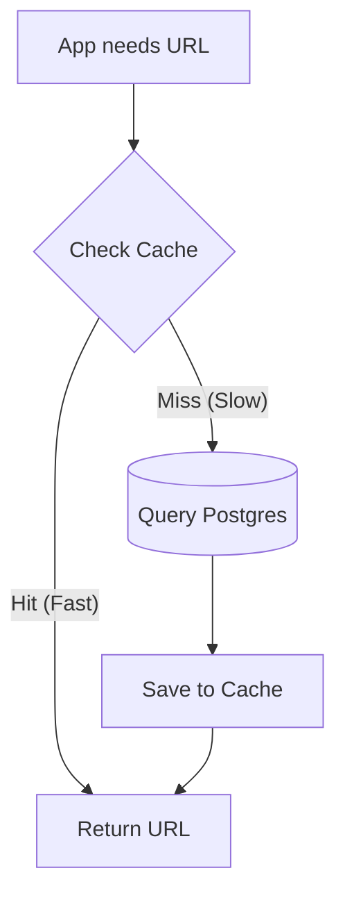
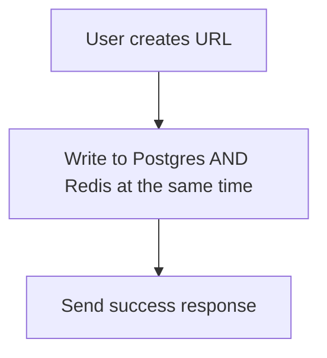
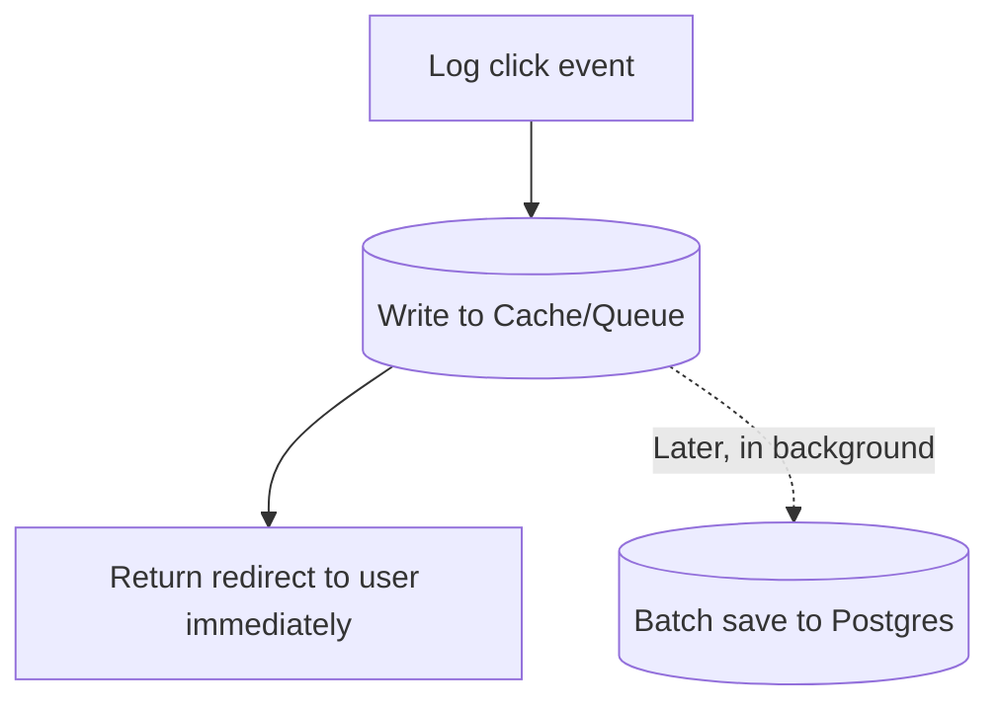
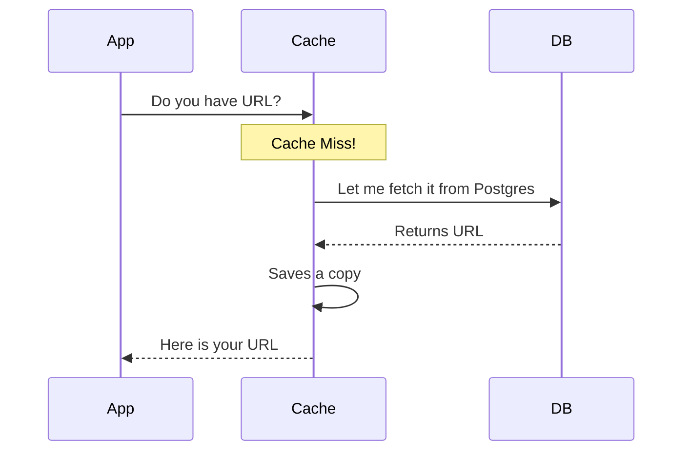

# ⚡ Caching Strategies: The Speed Boosters of Software Architecture

A **caching strategy** is a rule that decides when data enters the cache, how it is read from the cache vs. the primary database, and how the two stores stay in sync.

To make these patterns unforgettable, let's use a **Restaurant Kitchen Analogy**:
* **The Database:** The pantry in the basement (far away, slow to reach, but fits everything).
* **The Cache (Redis):** The prep counter right next to the chef (super close, lightning fast, but has limited space).

---

## 🍳 The 5 Caching Strategies in Action

---

### 1. Cache-Aside (Lazy Cooking) 🥗
*The app itself manages the cache, checking it before going to the database.*

* **The Analogy:** You need tomatoes. You check the prep counter. If they aren't there (a **cache miss**), you walk down to the basement pantry, grab them, place a portion on the counter for next time, and start cooking.
* **Why we use it for URL redirects:** We have millions of links, but only a few are clicked constantly. Cache-Aside only stores "hot" URLs in Redis, keeping memory usage low.

---

### 2. Write-Through (Prep Ahead) 🥕
*Write to the database and the cache simultaneously.*

* **The Analogy:** A fresh delivery of fresh basil arrives. You put a handful immediately on your prep counter and store the rest in the basement.
* **Why we use it on URL creation:** Without it, the *very first* redirect on a newly created short link would be a guaranteed cache miss. By saving it to both places instantly, the first visitor gets a fast response.

---

### 3. Write-Behind / Write-Back (Deferred Cleaning) 📝
*Write to the cache immediately for speed, then update the database later in the background.*

* **The Analogy:** When service is busy, you throw dirty pans into a pile. You keep cooking to serve guests fast, and clean them in batches when the rush slows down.
* **Why we use it for analytics:** Writing click events directly to Postgres on every single redirect would slow down our hot redirect path. Instead, we write clicks to a queue (Redis) and flush them to Postgres in batches later.

---

### 4. Read-Through (The Kitchen Assistant) 🧑‍🍳
*The app asks the cache for data. If it's a miss, the cache fetches it from the database itself (transparent to the app).*

* **The Analogy:** You ask your kitchen assistant for onions. If they aren't on the prep counter, the assistant runs to the basement to get them while you keep working.
* **Note:** We do not use this here because we manage Redis manually with code (`ioredis`), making our app the orchestrator (which is Cache-Aside).

---

### 5. Write-Around (Direct Storage) 📦
*Write straight to the database and skip the cache entirely on writes. The cache is only populated on subsequent reads.*
* **The Analogy:** A massive bag of flour arrives. You store it directly in the basement because you only use it once a week. You don't waste precious prep counter space.
* **Why we avoided it on URL creation:** If we skipped the cache on creation, we would force the first visit to be a slow database lookup.

---

## 📊 Summary Comparison Table

| Strategy | Read Latency | Write Latency | Data Consistency | Risk of Data Loss |
| :--- | :--- | :--- | :--- | :--- |
| **Cache-Aside** | 🟢 Fast (on Hit) | 🟡 Medium | 🟡 Medium | 🟢 Low (DB is source of truth) |
| **Write-Through** | 🟢 Fast | 🔴 Slow (double write) | 🟢 High (always in sync) | 🟢 Low |
| **Write-Behind** | 🟢 Fast | 🟢 Fast | 🔴 Low (DB lags behind) | 🔴 High (if cache crashes) |

---

## 🎯 How TinyURL Applies These Strategies

There is no single "perfect" strategy. A great developer chooses the strategy based on the data's tolerance for lag and loss:

1. **URL Mappings (Redirects):** **Cache-Aside + Write-Through**
   * *Why:* Mappings must never be wrong, and we want the first redirect to be instant.
2. **Click Analytics:** **Write-Behind (Queue & Worker)**
   * *Why:* Speed is critical; losing a single click event during a crash is acceptable, but slowing down redirects is not.
3. **Rate Limiting:** **Cache Only (Redis Only)**
   * *Why:* Rate limits are temporary. We don't need a backing database at all because losing rate-limiting counts during a crash is minor.