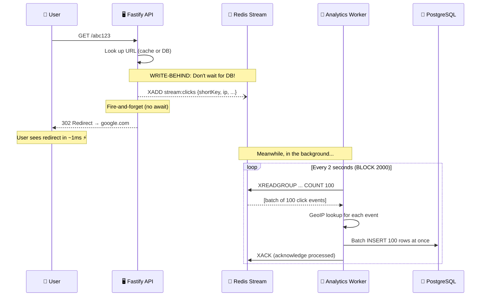
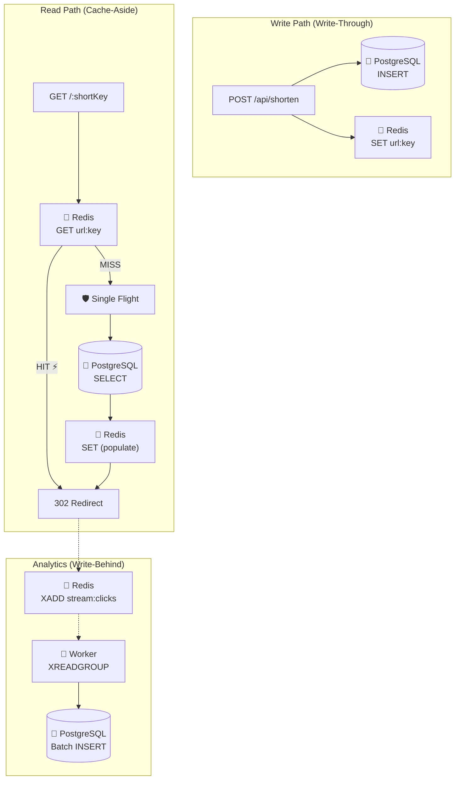

# ⚡ The Complete Guide to Caching Strategies

> *"A cache is a lie you tell your system — 'here's the data, trust me, it's fresh.' The art of caching is choosing WHEN to lie, HOW LONG the lie stays believable, and WHAT happens when the truth changes."*

This guide teaches you **everything** about caching — every strategy that exists, how they work at the data-flow level, when each one shines or fails, and exactly how your TinyURL combines multiple strategies into a layered caching architecture. By the end, you'll know which strategy to reach for in any system design problem.

---

## 📖 Table of Contents

1. [Chapter 1: Why Cache? — The Speed Problem](#chapter-1-why-cache)
2. [Chapter 2: The 5 Caching Strategies — The Complete Family](#chapter-2-five-strategies)
3. [Chapter 3: Cache-Aside — "Check the Counter First" (Your Redirect Flow)](#chapter-3-cache-aside)
4. [Chapter 4: Write-Through — "Stock Both Shelves" (Your Shorten Flow)](#chapter-4-write-through)
5. [Chapter 5: Write-Behind — "Wash Dishes Later" (Your Analytics Pipeline)](#chapter-5-write-behind)
6. [Chapter 6: Read-Through — "The Automatic Shelf-Stocker"](#chapter-6-read-through)
7. [Chapter 7: Write-Around — "Skip the Shelf"](#chapter-7-write-around)
8. [Chapter 8: Cache Invalidation — The Hardest Problem in CS](#chapter-8-invalidation)
9. [Chapter 9: Cache Eviction — When RAM Runs Out](#chapter-9-eviction)
10. [Chapter 10: The Single-Flight Pattern — Preventing Cache Stampedes](#chapter-10-single-flight)
11. [Chapter 11: Your TinyURL Caching Architecture — The Complete Map](#chapter-11-your-architecture)
12. [Chapter 12: Cache Metrics — Measuring Cache Health](#chapter-12-metrics)
13. [Chapter 13: Advanced Patterns — Multi-Layer & Distributed Caching](#chapter-13-advanced)
14. [Chapter 14: Quick Reference Cheat Sheet](#chapter-14-cheat-sheet)

---

<a id="chapter-1-why-cache"></a>
## 📕 Chapter 1: Why Cache? — The Speed Problem

### 🍳 The Restaurant Kitchen Analogy

Every caching concept maps perfectly to a restaurant kitchen:

```
  THE RESTAURANT:

  🏪 BASEMENT PANTRY (PostgreSQL)              📋 PREP COUNTER (Redis)
  ──────────────────────────────               ─────────────────────────
  • Stores EVERYTHING                          • Holds what you need NOW
  • Massive capacity                           • Limited space
  • Takes 30 seconds to walk down              • Right next to the chef
    and find an ingredient                     • Grab it in 1 second
  • Survives a kitchen fire                    • Lost if counter is cleared
  • Perfectly organized (shelves, labels)      • Just the hot items

  WITHOUT the prep counter:
  Every time a customer orders tomatoes, you walk to the basement.
  30 seconds × 100 orders = 50 MINUTES wasted walking! 🐌

  WITH the prep counter:
  First order: walk to basement, bring up tomatoes, put some on counter.
  Next 99 orders: grab from counter instantly.
  30 seconds + (99 × 1 second) = ~2 MINUTES. 25x faster! ⚡
```

### The Numbers That Make Caching Non-Negotiable

```
  Your TinyURL — Without Redis cache:
  ────────────────────────────────────
  Every redirect → PostgreSQL query → 5-15ms per request
  At 10,000 RPS → 10,000 DB queries/second
  DB connection pool (10 connections) → EXHAUSTED at ~2,000 RPS 💀

  Your TinyURL — With Redis cache:
  ─────────────────────────────────
  95% of redirects → Redis cache → 0.5ms per request
  5% cache misses → PostgreSQL → 5-15ms per request
  At 10,000 RPS → only 500 DB queries/second
  DB pool handles this easily ✅

  ┌─────────────────────────────────────────────────────────────────┐
  │  Cache hit rate: 95%                                           │
  │  Average latency: (0.95 × 0.5ms) + (0.05 × 10ms) = 0.975ms  │
  │  Without cache:  10ms average                                  │
  │  Speedup: ~10x faster! ⚡                                      │
  │  DB load: reduced by 95%! 🛡️                                   │
  └─────────────────────────────────────────────────────────────────┘
```

### The Core Cache Vocabulary

| Term | Meaning | Kitchen Analogy |
|:--|:--|:--|
| **Cache Hit** | Data found in cache — fast return! | Tomatoes on the prep counter ✅ |
| **Cache Miss** | Data NOT in cache — must fetch from DB | Counter empty — walk to basement 🐌 |
| **Hit Rate** | % of requests served from cache | How often the counter has what you need |
| **TTL** | Time-To-Live — auto-expiry in seconds | "Use by" date on prep ingredients |
| **Eviction** | Removing old data when cache is full | Clearing counter space for new items |
| **Invalidation** | Deliberately removing stale data | Throwing out spoiled ingredients |
| **Warm Cache** | Cache populated with frequently-used data | Counter stocked for dinner rush |
| **Cold Cache** | Empty cache (after restart) | Empty counter on first morning |
| **Stale Data** | Cache holds outdated data | Yesterday's chopped onions 🧅 |

---

<a id="chapter-2-five-strategies"></a>
## 📗 Chapter 2: The 5 Caching Strategies — The Complete Family

There are exactly **5 fundamental caching strategies**. Every caching system in the world is built from combinations of these:

```
  ┌─────────────────────────────────────────────────────────────────────┐
  │              THE 5 CACHING STRATEGIES                              │
  │                                                                     │
  │  READ strategies (how data enters the cache):                      │
  │  ─────────────────────────────────────────────                     │
  │  1. Cache-Aside      App checks cache → miss → fetches DB → fills │
  │  2. Read-Through     Cache auto-fetches from DB on miss            │
  │                                                                     │
  │  WRITE strategies (how writes interact with cache):                │
  │  ──────────────────────────────────────────────                    │
  │  3. Write-Through    Write to DB + cache simultaneously            │
  │  4. Write-Behind     Write to cache first, DB later (async)        │
  │  5. Write-Around     Write to DB only, skip cache                  │
  │                                                                     │
  │  YOUR TINYURL USES:                                                │
  │  ✅ Cache-Aside    (redirect reads)                                │
  │  ✅ Write-Through  (shorten writes)                                │
  │  ✅ Write-Behind   (analytics pipeline)                            │
  │                                                                     │
  └─────────────────────────────────────────────────────────────────────┘
```

### The Quick Visual Comparison

```
  CACHE-ASIDE:        READ-THROUGH:       WRITE-THROUGH:
  
  App ──▶ Cache       App ──▶ Cache       App ──▶ Cache ──▶ DB
   │       │  miss      │        │          │       │
   │       ▼            │        ▼          │       ▼
   └──▶ DB ──▶ Cache    │      DB ──▶ Cache └──▶ DB (same time)
  (App orchestrates)   (Cache orchestrates) (Both updated together)


  WRITE-BEHIND:       WRITE-AROUND:
  
  App ──▶ Cache       App ──▶ DB
   │       │                 (skip cache)
   │       ▼ (later)
   │      DB
  (Cache first, DB later) (DB only, cache fills on reads)
```

---

<a id="chapter-3-cache-aside"></a>
## 📘 Chapter 3: Cache-Aside — "Check the Counter First" (Your Redirect Flow)

### The Definition

> **Cache-Aside (Lazy Loading):** The application is responsible for reading from and writing to the cache. On a read, it checks the cache first. On a miss, it queries the database, then populates the cache for next time.

### The Restaurant Analogy

```
  Customer orders tomato soup.

  Chef thinks: "Do I have chopped tomatoes on the prep counter?"

  YES (cache hit):
  → Grab tomatoes from counter → Start cooking immediately ⚡

  NO (cache miss):
  → Walk down to basement pantry → Grab tomatoes → Bring them up
  → Put EXTRA on the prep counter for next time → Start cooking 🐌
  
  Next customer orders tomato soup:
  → Tomatoes are on the counter! → Instant! ⚡
```

### Your Actual Code — `redirect.service.js`

This is the **textbook** Cache-Aside implementation in your [`redirect.service.js`](file:///c:/Users/TARUN/Desktop/TinyURL/src/modules/redirect/redirect.service.js):

```javascript
export async function getOriginalUrl(shortKey) {
    // STEP 1: Check the cache first
    const cached = await getCachedUrl(shortKey);
    if (cached) return cached;  // Cache HIT — return immediately! ⚡

    // STEP 2: Cache MISS — fetch from database (with single-flight dedup)
    const originalUrl = await singleFlight(shortKey, () => fetchData(shortKey));
    
    // STEP 3: Populate cache for next time
    if (originalUrl) {
        await setCachedUrl(shortKey, originalUrl);
    }

    return originalUrl;
}
```

### The Complete Data Flow — Visualized

```
  REQUEST: GET /abc123

  ┌── STEP 1: Check Redis ────────────────────────────────────────────┐
  │                                                                    │
  │  redis.get("url:abc123")                                          │
  │                                                                    │
  │  RESULT A: "https://google.com" → CACHE HIT!                     │
  │  ├── Increment redisCacheHitsCounter (Prometheus)                 │
  │  ├── Return "https://google.com"                                   │
  │  └── Total time: ~0.5ms ⚡⚡⚡                                    │
  │                                                                    │
  │  RESULT B: null → CACHE MISS!                                     │
  │  ├── Increment redisCacheMissesCounter (Prometheus)               │
  │  └── Fall through to Step 2 ↓                                     │
  └────────────────────────────────────────────────────────────────────┘
                        │ (miss)
                        ▼
  ┌── STEP 2: Single-Flight → PostgreSQL ──────────────────────────────┐
  │                                                                     │
  │  singleFlight("abc123", () => fetchData("abc123"))                 │
  │                                                                     │
  │  → getPool("abc123") → select correct shard                       │
  │  → SELECT OriginalURL FROM url.URL                                 │
  │    WHERE ShortURL = 'abc123'                                       │
  │    AND (expires_at IS NULL OR expires_at > now())                  │
  │                                                                     │
  │  RESULT: "https://google.com" (or null if expired/missing)        │
  │  Total time: ~5-15ms 🐌                                            │
  └─────────────────────────────────────────────────────────────────────┘
                        │ (found!)
                        ▼
  ┌── STEP 3: Populate Cache ──────────────────────────────────────────┐
  │                                                                     │
  │  redis.set("url:abc123", "https://google.com", "EX", 86400)      │
  │                                                                     │
  │  Now the NEXT request for abc123 will be a cache HIT! ⚡           │
  │  TTL: 86400 seconds (24 hours), then auto-expires.                │
  └─────────────────────────────────────────────────────────────────────┘
```

### Why Cache-Aside Is Perfect for Redirects

```
  ┌─────────────────────────────────────────────────────────────────────┐
  │  ADVANTAGES for URL shortener redirects:                           │
  │                                                                     │
  │  ✅ Only "hot" URLs enter the cache                                │
  │     If a URL is created but never clicked, it stays ONLY in DB.   │
  │     No wasted Redis memory on cold URLs.                           │
  │                                                                     │
  │  ✅ Self-healing on Redis crash                                    │
  │     Redis dies → all requests go to DB (slower but works).        │
  │     Redis comes back → cache refills naturally from misses.       │
  │     No manual intervention needed!                                 │
  │                                                                     │
  │  ✅ App controls the logic                                         │
  │     You decide WHAT gets cached, for HOW LONG, with WHAT key.    │
  │     Maximum flexibility.                                           │
  │                                                                     │
  │  ✅ Simple to implement and debug                                  │
  │     The logic is explicit in your code. No hidden magic.          │
  │                                                                     │
  │  DISADVANTAGES:                                                     │
  │                                                                     │
  │  ❌ First request is ALWAYS slow (cold miss)                       │
  │     Fixed by combining with Write-Through on creation! (Chapter 4)│
  │                                                                     │
  │  ❌ Potential for stale data                                       │
  │     If DB changes, cache might still hold the old value.          │
  │     Fixed by TTL + active invalidation! (Chapter 8)               │
  │                                                                     │
  └─────────────────────────────────────────────────────────────────────┘
```

---

<a id="chapter-4-write-through"></a>
## 📙 Chapter 4: Write-Through — "Stock Both Shelves" (Your Shorten Flow)

### The Definition

> **Write-Through:** When data is written, it goes to BOTH the database AND the cache simultaneously. The write is only considered complete when both succeed.

### The Restaurant Analogy

```
  A fresh delivery of artisan basil arrives at the restaurant.

  WITHOUT Write-Through:
  → Store basil in basement pantry only.
  → First customer orders pesto → Chef checks counter → no basil!
  → Walks to basement → Slow first order. 🐌

  WITH Write-Through:
  → Store basil in basement pantry AND put some on the prep counter.
  → First customer orders pesto → Chef checks counter → basil is there!
  → Immediate! ⚡
```

### Your Actual Code — `shorten.service.js`

Your [`shorten.service.js`](file:///c:/Users/TARUN/Desktop/TinyURL/src/modules/shorten/shorten.service.js) uses Write-Through:

```javascript
export async function createShortURL(originalURL) {
    const rawId    = snowflake.nextRawId();
    const shortKey = encode(rawId);
    const pool     = getPool(shortKey);

    // Write to PostgreSQL (the source of truth)
    await pool.query(
        `INSERT INTO url.URL (ID, OriginalURL, ShortURL) VALUES ($1, $2, $3)`,
        [rawId, originalURL, shortKey]
    );

    // Write to Redis cache AT THE SAME TIME
    await setCachedUrl(shortKey, originalURL);
    //    ^^^^^^^^^^^^^^^^^^^^^^^^^^^^^^^^^^^
    //    THIS is the Write-Through line!
    //    The URL is in the cache BEFORE anyone clicks it.

    return shortKey;
}
```

### Why Write-Through Is Essential for URL Creation

```
  THE SCENARIO: Someone shortens a URL and shares it on Twitter.

  WITHOUT Write-Through (Cache-Aside only):
  ──────────────────────────────────────────
  1. User creates short URL → stored in DB only
  2. Tweet goes viral → 10,000 people click in 1 second
  3. ALL 10,000 requests → cache MISS → hit PostgreSQL simultaneously
  4. DB pool (10 connections) → OVERWHELMED! 💀
  5. This is called a "cache stampede" or "thundering herd"

  WITH Write-Through:
  ────────────────────
  1. User creates short URL → stored in DB AND Redis
  2. Tweet goes viral → 10,000 people click in 1 second
  3. ALL 10,000 requests → cache HIT → served from Redis ⚡
  4. DB pool → idle, relaxed, sipping coffee ☕
  5. Zero stampede!

  ┌─────────────────────────────────────────────────────────────────┐
  │                                                                 │
  │  Write-Through eliminates the "cold first request" problem     │
  │  that Cache-Aside has. By pre-warming the cache on writes,     │
  │  the first reader ALWAYS gets a cache hit.                     │
  │                                                                 │
  └─────────────────────────────────────────────────────────────────┘
```

### Write-Through Tradeoffs

```
  ADVANTAGES:                           DISADVANTAGES:
  ───────────                           ──────────────

  ✅ First read is always fast          ❌ Writes are slower
     (cache is pre-warmed)                 (must write to TWO places)

  ✅ Cache and DB always in sync        ❌ Fills cache with data that
     (both updated together)               may never be read

  ✅ No "thundering herd" on            ❌ If cache write fails but DB
     newly created data                    succeeds, you have inconsistency

  For your URL shortener:
  WRITES are rare (12/sec) and READS are massive (10,000/sec).
  Adding ~1ms to each write saves millions of cache misses.
  → Write-Through is the obvious winner here. ✅
```

---

<a id="chapter-5-write-behind"></a>
## 📒 Chapter 5: Write-Behind — "Wash Dishes Later" (Your Analytics Pipeline)

### The Definition

> **Write-Behind (Write-Back):** Write to the cache/queue immediately for speed. The database is updated later, asynchronously, in the background.

### The Restaurant Analogy

```
  During dinner rush, the kitchen is SLAMMED with orders.

  WITHOUT Write-Behind:
  → Every dirty pan is immediately washed, dried, and put away.
  → Chef stops cooking for 2 minutes per pan.
  → Customers wait. Orders pile up. Kitchen grinds to a halt. 💀

  WITH Write-Behind:
  → Throw dirty pans into a pile (the "queue").
  → Keep cooking. Keep serving. Speed! ⚡
  → After the rush, the dishwasher processes the pile in batches.
  → All pans eventually get clean, but service was never disrupted.
```

### Your Analytics Pipeline — The Perfect Write-Behind

```
  The Problem:
  ────────────
  Every redirect must record a click event (IP, browser, referrer, etc.)
  Writing directly to PostgreSQL on every redirect:
  → Adds 5-15ms latency to EVERY redirect
  → At 10,000 RPS, that's 10,000 INSERT queries/second to Postgres
  → DB melts. Redirects slow down. Users angry. 💀

  The Solution (Write-Behind):
  ─────────────────────────────
  Every redirect pushes a click event to Redis Stream (0.2ms).
  A background worker reads events in batches and bulk-inserts to PostgreSQL.
  Redirect latency stays at ~1ms. DB gets efficient batch writes. ✅
```

### The Data Flow



### Your Actual Code — Producer vs Consumer

**Producer** ([`click_producer.js`](file:///c:/Users/TARUN/Desktop/TinyURL/src/queue/click_producer.js)):
```javascript
// Fire-and-forget — NO await!
redis.xadd(STREAM_KEY, '*',
    'shortKey', shortKey,
    'userAgent', userAgent || '',
    'ip', ip || '',
    'referrer', referrer || '',
    'timestamp', String(timestamp || Date.now())
).catch((err) => {
    console.error('Error:', err.message);
});
```

**Consumer** ([`analytics_worker.js`](file:///c:/Users/TARUN/Desktop/TinyURL/worker/analytics_worker.js)):
```javascript
// Read up to 100 events at a time, block for 2 seconds if empty
const response = await workerRedis.xreadgroup(
    'GROUP', GROUP_NAME, CONSUMER_NAME,
    'COUNT', 100,        // Batch size!
    'BLOCK', 2000,       // Wait up to 2s for new events
    'STREAMS', STREAM_KEY, '>'
);

// Process batch → GeoIP → Batch INSERT → XACK
await processBatch(messages);
await workerRedis.xack(STREAM_KEY, GROUP_NAME, ...messageIds);
```

### Why Write-Behind Is the ONLY Option for Analytics

```
  COMPARISON: What if you wrote analytics synchronously?

  ┌── SYNCHRONOUS (Direct DB Write) ─────────────────────────────────┐
  │                                                                    │
  │  User clicks → Look up URL → INSERT click_analytics → Redirect   │
  │                                       │                           │
  │                                    +5-15ms                        │
  │                                                                    │
  │  Redirect latency: 6-17ms (Redis hit) or 15-30ms (DB miss)      │
  │  DB load: 10,000 INSERTs/second (writes overwhelm reads)        │
  │  Risk: If analytics DB is slow, REDIRECTS are slow 💀            │
  └────────────────────────────────────────────────────────────────────┘

  ┌── WRITE-BEHIND (Your approach) ──────────────────────────────────┐
  │                                                                    │
  │  User clicks → Look up URL → XADD (fire-forget) → Redirect      │
  │                                    │                              │
  │                                 +0.2ms                            │
  │                                                                    │
  │  Redirect latency: 1-2ms (Redis hit) or 6-17ms (DB miss)        │
  │  DB load: 1 batch INSERT every 2 seconds (~50 rows)             │
  │  Risk: If Redis is slow, redirect is still fast (fire-forget)    │
  └────────────────────────────────────────────────────────────────────┘

  Write-Behind makes analytics INVISIBLE to the user experience.
```

### Write-Behind Tradeoffs

```
  ADVANTAGES:                           DISADVANTAGES:
  ───────────                           ──────────────

  ✅ Writes are blazingly fast          ❌ Data might be LOST if Redis
     (only goes to cache/queue)            crashes before worker processes

  ✅ DB writes are batched              ❌ Analytics dashboard is slightly
     (efficient bulk inserts)              DELAYED (seconds, not real-time)

  ✅ Decouples hot path from            ❌ More complex architecture
     cold analytics processing             (producer + consumer + groups)

  For your URL shortener:
  Losing 1 click event during a crash? Acceptable. ✅
  Slowing down every redirect by 15ms? UNACCEPTABLE. ❌
  → Write-Behind is the only rational choice.
```

---

<a id="chapter-6-read-through"></a>
## 📔 Chapter 6: Read-Through — "The Automatic Shelf-Stocker"

### The Definition

> **Read-Through:** The cache itself is responsible for loading data from the database on a miss. The application ONLY talks to the cache — never to the database directly.

### The Restaurant Analogy

```
  CACHE-ASIDE (what you use):
  Chef needs tomatoes → Checks counter → Not there!
  → Chef PERSONALLY walks to basement → Gets tomatoes → Puts on counter

  READ-THROUGH:
  Chef needs tomatoes → Asks kitchen assistant "give me tomatoes"
  → Assistant checks counter → Not there!
  → Assistant walks to basement → Gets tomatoes → Puts on counter
  → Assistant hands tomatoes to chef

  The chef NEVER sees the basement. Only the assistant does.
  The chef doesn't even know WHERE the tomatoes come from.
```

### How It Would Look (Hypothetical)

```javascript
// READ-THROUGH (hypothetical — not your current code)
const cache = new ReadThroughCache({
    loader: async (key) => {
        // This function is called automatically on cache miss
        const pool = getPool(key);
        const { rows } = await pool.query(
            `SELECT OriginalURL FROM url.URL WHERE ShortURL = $1`, [key]
        );
        return rows[0]?.originalurl ?? null;
    },
    ttl: 86400
});

// App code is simpler — just ask the cache!
export async function getOriginalUrl(shortKey) {
    return await cache.get(shortKey);
    // Cache handles: check → miss → fetch DB → store → return
    // App never touches the DB directly!
}
```

### Why Your TinyURL Uses Cache-Aside Instead

```
  ┌─────────────────────────────────────────────────────────────────────┐
  │  Cache-Aside (your choice)        Read-Through                    │
  │  ─────────────────────────        ──────────────                  │
  │  ✅ Explicit, visible logic       ⚠️ Logic hidden inside cache    │
  │  ✅ Works with plain ioredis      ❌ Needs a caching library      │
  │  ✅ Easy to add single-flight     ⚠️ Library must support it      │
  │  ✅ Custom error handling         ⚠️ Error handling is opaque     │
  │  ✅ You control every detail      ❌ Less control                  │
  │                                                                     │
  │  Read-Through is great for larger teams where you want             │
  │  consistent caching behavior without trusting every developer      │
  │  to implement Cache-Aside correctly. It's essentially Cache-Aside │
  │  packaged into a reusable abstraction.                             │
  └─────────────────────────────────────────────────────────────────────┘
```

---

<a id="chapter-7-write-around"></a>
## 📚 Chapter 7: Write-Around — "Skip the Shelf"

### The Definition

> **Write-Around:** Write data ONLY to the database. Don't put it in the cache. The cache is populated only when someone reads the data (via Cache-Aside).

### The Restaurant Analogy

```
  A 50kg bag of specialty flour arrives.

  Write-Through approach:
  → Put 5kg on the prep counter AND store 45kg in the basement.
  → But you only use this flour for one recipe per week!
  → You just wasted precious counter space for 6 days. ❌

  Write-Around approach:
  → Store ALL 50kg directly in the basement. Skip the counter.
  → When you actually need it (once a week), go get some.
  → Counter space is preserved for frequently-used items. ✅
```

### When Write-Around Makes Sense

```
  GOOD for Write-Around:
  ───────────────────────
  • Data that's written once but rarely read
  • Audit logs, historical records
  • User registration data (written once, read occasionally)
  • Bulk data imports

  BAD for Write-Around (your case):
  ──────────────────────────────────
  • URL shortener! A URL is created BECAUSE someone will click it soon.
  • The very first click would be a guaranteed cache miss.
  • Viral sharing makes the first seconds the MOST critical time.
  
  That's why you use Write-Through instead.
```

### The Five Strategies — Combined Comparison

| Strategy | Write goes to... | Read comes from... | First read speed | Your TinyURL use? |
|:--|:--|:--|:--|:--|
| **Cache-Aside** | (read only) | Cache → DB fallback | 🐌 (cold miss) | ✅ Redirects |
| **Read-Through** | (read only) | Cache auto-loads from DB | 🐌 (cold miss) | ❌ |
| **Write-Through** | DB + Cache | Cache | ⚡ (pre-warmed!) | ✅ Shorten |
| **Write-Behind** | Cache only (DB later) | Cache | ⚡ (instant!) | ✅ Analytics |
| **Write-Around** | DB only (skip cache) | Cache → DB fallback | 🐌 (cold miss) | ❌ |

---

<a id="chapter-8-invalidation"></a>
## 📖 Chapter 8: Cache Invalidation — The Hardest Problem in CS

> *"There are only two hard things in Computer Science: cache invalidation and naming things."* — Phil Karlton

### 🧟 The Stale Data Problem

```
  SCENARIO: You add an "Edit URL" feature.

  User changes abc123's destination from google.com → github.com.

  ┌── WITHOUT Invalidation ─────────────────────────────────────────┐
  │                                                                  │
  │  PostgreSQL:  abc123 → github.com  (updated! ✅)                │
  │  Redis:       abc123 → google.com  (STALE! Old data! 🧟)       │
  │                                                                  │
  │  Next 10,000 visitors → Redis cache HIT → google.com (WRONG!)  │
  │  The old destination is served for up to 24 HOURS (your TTL)    │
  │  until the cache entry expires naturally.                        │
  │                                                                  │
  │  THE USER CHANGED THE URL BUT NOBODY SEES THE CHANGE! 💀       │
  └──────────────────────────────────────────────────────────────────┘
```

### The Three Invalidation Strategies

#### Strategy 1: TTL — The Self-Destructing Sticky Note ⏰

```
  HOW:   Set an expiry time. Redis auto-deletes after N seconds.
  YOUR CODE: redis.set(key, value, 'EX', 86400)

  ┌──── Timeline ──────────────────────────────────────────────────┐
  │                                                                 │
  │  Hour 0:  SET url:abc123 "google.com" EX 86400                 │
  │  Hour 3:  User edits URL to github.com (DB updated)            │
  │           Cache still has google.com! (STALE for 21 hours)     │
  │  Hour 24: Cache entry expires automatically                     │
  │  Hour 24+: Cache miss → DB fetch → gets github.com → correct! │
  │                                                                 │
  │  STALE WINDOW: 21 hours 😬                                     │
  │                                                                 │
  └─────────────────────────────────────────────────────────────────┘

  VERDICT:
  ✅ Simple, automatic, no extra code needed
  ❌ Stale data served for up to TTL duration
  ❌ Not suitable if immediate consistency is required
```

#### Strategy 2: Delete-on-Write — Rip and Throw 🗑️

```
  HOW:  When DB changes, actively DELETE the cache key.

  // When user edits a URL:
  await pool.query(`UPDATE url.URL SET OriginalURL = $1 WHERE ShortURL = $2`,
                   [newUrl, shortKey]);
  await redis.del('url:' + shortKey);  // INVALIDATE! Cache gone!

  ┌──── Timeline ──────────────────────────────────────────────────┐
  │                                                                 │
  │  Hour 0:  SET url:abc123 "google.com" EX 86400                 │
  │  Hour 3:  User edits URL to github.com                         │
  │           → DB updated to github.com ✅                         │
  │           → redis.del("url:abc123") ✅ Cache DESTROYED         │
  │  Hour 3+1ms: Next request → Cache MISS → DB → github.com! ✅  │
  │              → Cache re-populated with github.com               │
  │                                                                 │
  │  STALE WINDOW: ~0ms! Instantly correct!                        │
  │                                                                 │
  └─────────────────────────────────────────────────────────────────┘

  VERDICT:
  ✅ Immediate consistency — next read gets fresh data
  ✅ Simple — just one extra redis.del() call
  ❌ One extra cache miss after invalidation (minor cost)
```

#### Strategy 3: Update-on-Write — Erase and Rewrite ✏️

```
  HOW:  When DB changes, write the NEW value to cache immediately.

  // When user edits a URL:
  await pool.query(`UPDATE url.URL SET OriginalURL = $1 WHERE ShortURL = $2`,
                   [newUrl, shortKey]);
  await setCachedUrl(shortKey, newUrl);  // Update cache with NEW value!

  ┌──── Timeline ──────────────────────────────────────────────────┐
  │                                                                 │
  │  Hour 0:  SET url:abc123 "google.com" EX 86400                 │
  │  Hour 3:  User edits URL to github.com                         │
  │           → DB updated to github.com ✅                         │
  │           → redis.set("url:abc123", "github.com") ✅           │
  │  Hour 3+1ms: Next request → Cache HIT → github.com! ✅⚡      │
  │              → ZERO cache misses!                               │
  │                                                                 │
  │  STALE WINDOW: 0ms AND zero miss penalty!                      │
  │                                                                 │
  └─────────────────────────────────────────────────────────────────┘

  VERDICT:
  ✅ Immediate consistency + no cache miss
  ⚠️ Slightly more complex — must ensure new value is correct
  ⚠️ Risk: if update logic has a bug, cache serves wrong data confidently
```

### The Industry Best Practice — Belt and Suspenders

```
  Use ACTIVE invalidation (Delete-on-Write or Update-on-Write)
  PLUS TTL as a safety net:

  ┌──────────────────────────────────────────────────────────────────┐
  │                                                                  │
  │  Primary defense:   redis.del() on every DB write               │
  │  Backup defense:    TTL of 86400 seconds on every cache entry   │
  │                                                                  │
  │  If the redis.del() fails (network blip, code bug):             │
  │  → TTL kicks in → Data self-heals within 24 hours maximum      │
  │  → No permanently stale data possible ✅                        │
  │                                                                  │
  └──────────────────────────────────────────────────────────────────┘
```

### Your TinyURL's Current Situation

```
  RIGHT NOW: You only INSERT new URLs. Never update or delete.
  → Cache staleness is IMPOSSIBLE (data never changes after creation) ✅
  → TTL alone is sufficient ✅

  FUTURE: When you add "Edit URL" or "Delete URL" features:
  → You MUST add redis.del() next to every UPDATE/DELETE query
  → The TTL will serve as your safety net
```

---

<a id="chapter-9-eviction"></a>
## 📃 Chapter 9: Cache Eviction — When RAM Runs Out

### The Full Drawer Problem

```
  Redis stores everything in RAM. RAM is finite.

  Imagine a desk drawer that holds exactly 10 folders.
  The drawer is FULL. An 11th folder arrives.

  WHAT DO YOU THROW OUT?

  ┌── EVICTION POLICY ──────┬── WHAT IT DOES ──────────────────────┐
  │                          │                                       │
  │  noeviction              │  REFUSE. Return error on new writes. │
  │                          │  "Sorry, drawer is full!"            │
  │                          │                                       │
  │  allkeys-random          │  Remove a RANDOM key.                │
  │                          │  Close eyes, pick one, shred it.     │
  │                          │                                       │
  │  allkeys-lru ← DEFAULT  │  Remove LEAST RECENTLY USED key.    │
  │                          │  Throw out the one untouched longest.│
  │                          │                                       │
  │  allkeys-lfu             │  Remove LEAST FREQUENTLY USED key.  │
  │                          │  Throw out the one used fewest times.│
  │                          │                                       │
  │  volatile-ttl            │  Remove key with SHORTEST TTL left.  │
  │                          │  Throw out what's about to expire.   │
  │                          │                                       │
  │  volatile-lru            │  LRU, but only keys WITH a TTL set. │
  │                          │                                       │
  │  volatile-lfu            │  LFU, but only keys WITH a TTL set. │
  │                          │                                       │
  └──────────────────────────┴───────────────────────────────────────┘
```

### LRU vs LFU — The Showdown

```
  Two URLs compete for the last cache slot:

  URL A — "The Viral Link":
  50,000 clicks in 10 minutes (2 hours ago). Silent since. 🔇

  URL B — "The Steady Link":
  1 click every 10 minutes, all day long. Last clicked: 10 seconds ago. 📊

  ┌── LRU (Least RECENTLY Used) ────────────────────────────────────┐
  │                                                                  │
  │  "Who was accessed LEAST RECENTLY?"                             │
  │  URL A: last accessed 2 hours ago → EVICT A ❌                  │
  │  URL B: last accessed 10 seconds ago → KEEP B ✅                │
  │                                                                  │
  │  Problem: If URL A goes viral AGAIN, it's a cache miss!         │
  │  But usually, recently-active links ARE more likely to be used. │
  └──────────────────────────────────────────────────────────────────┘

  ┌── LFU (Least FREQUENTLY Used) ──────────────────────────────────┐
  │                                                                  │
  │  "Who was accessed LEAST OFTEN?"                                │
  │  URL A: 50,000 total accesses → KEEP A ✅                       │
  │  URL B: 12 total accesses → EVICT B ❌                          │
  │                                                                  │
  │  Problem: URL A might never be clicked again (one-time viral).  │
  │  Its high frequency count makes it "sticky" in cache forever.   │
  └──────────────────────────────────────────────────────────────────┘

  VERDICT for URL shorteners:
  LRU is generally better. URLs follow a "recent = hot" access pattern.
  allkeys-lru is the recommended eviction policy. ✅
```

### Memory Sizing — Back-of-Envelope

```
  Per cached URL:
  Key:   "url:abc1234567" ≈ 20 bytes
  Value: "https://example.com/some/path" ≈ 60 bytes
  Redis overhead per key: ≈ 70 bytes
  Total per key: ≈ 150 bytes

  Target: Cache top 1 million hot URLs
  Memory: 1,000,000 × 150 bytes = 150 MB

  Add rate limiter keys + stream buffer + overhead:
  Recommended maxmemory: 256 MB - 512 MB

  Configuration:
  redis-server --maxmemory 256mb --maxmemory-policy allkeys-lru
```

---

<a id="chapter-10-single-flight"></a>
## 🛡️ Chapter 10: The Single-Flight Pattern — Preventing Cache Stampedes

### ⛈️ The Thundering Herd Problem

```
  SCENARIO: A popular URL's cache entry expires.
  At that EXACT moment, 1,000 requests arrive for that URL.

  WITHOUT Single-Flight:
  ──────────────────────
  Request 1:  cache MISS → query PostgreSQL
  Request 2:  cache MISS → query PostgreSQL
  Request 3:  cache MISS → query PostgreSQL
  ...
  Request 1000: cache MISS → query PostgreSQL

  1,000 IDENTICAL queries hit PostgreSQL simultaneously!
  DB pool exhausted! Queries queue up! Latency spikes! 💀

  This is called a "Cache Stampede" or "Thundering Herd."
```

### Your Solution — `single_flight.js`

Your [`single_flight.js`](file:///c:/Users/TARUN/Desktop/TinyURL/src/cache/single_flight.js):

```javascript
const inFlight = new Map();

export async function singleFlight(key, fn) {
    const existing = inFlight.get(key);
    if (existing) return existing;  // Piggyback on existing request!

    const promise = fn().finally(() => {
        inFlight.delete(key);       // Clean up after completion
    });
    inFlight.set(key, promise);     // Register this as "in-flight"
    return promise;
}
```

### How It Prevents the Stampede

```
  1,000 requests arrive for "abc123" after cache expires:

  WITH Single-Flight:
  ────────────────────

  Request 1:   cache MISS → singleFlight("abc123", fetchData)
               → inFlight.get("abc123") → undefined (not in-flight)
               → Start DB query → inFlight.set("abc123", promise)

  Request 2:   cache MISS → singleFlight("abc123", fetchData)
               → inFlight.get("abc123") → FOUND! Promise exists!
               → Return the SAME promise (piggyback!) No new DB query!

  Request 3:   Same as Request 2 — piggybacks on Request 1's query
  ...
  Request 1000: Same as Request 2 — piggybacks on Request 1's query

  Request 1's DB query completes:
  → Result returned to ALL 1,000 requests simultaneously
  → Cache populated for future requests
  → inFlight.delete("abc123") — cleanup

  ┌───────────────────────────────────────────────────────────────┐
  │  WITHOUT single-flight: 1,000 DB queries                     │
  │  WITH single-flight:    1 DB query + 999 piggybacking        │
  │                                                               │
  │  Database load reduced by 99.9%! 🛡️                          │
  └───────────────────────────────────────────────────────────────┘
```

### How It Fits in Your Code

```javascript
// redirect.service.js — the full read path
export async function getOriginalUrl(shortKey) {
    // Layer 1: Redis cache
    const cached = await getCachedUrl(shortKey);
    if (cached) return cached;

    // Layer 2: Single-flight deduplication → PostgreSQL
    const originalUrl = await singleFlight(shortKey, () => fetchData(shortKey));
    //                        ^^^^^^^^^^^^
    //                        "Only ONE request actually queries the DB.
    //                         All others wait for this one's result."

    // Layer 3: Populate cache
    if (originalUrl) {
        await setCachedUrl(shortKey, originalUrl);
    }

    return originalUrl;
}
```

---

<a id="chapter-11-your-architecture"></a>
## 🗺️ Chapter 11: Your TinyURL Caching Architecture — The Complete Map

### The Three Data Flows — Each Using a Different Strategy

```
  ┌── FLOW 1: REDIRECT (Read Path) ─────────────────────────────────┐
  │  Strategy: Cache-Aside + Single-Flight                          │
  │                                                                  │
  │  GET /abc123                                                     │
  │  ├── 1. getCachedUrl("abc123")         → Redis GET  (~0.5ms)   │
  │  │   ├── HIT → return immediately ⚡                            │
  │  │   └── MISS ↓                                                  │
  │  ├── 2. singleFlight("abc123", fn)     → Dedup     (~0ms)      │
  │  ├── 3. fetchData("abc123")            → PG SELECT (~5-15ms)   │
  │  ├── 4. setCachedUrl("abc123", url)    → Redis SET  (~0.5ms)   │
  │  └── 5. return url                                               │
  │                                                                  │
  │  Files: redirect.service.js, url_cache.js, single_flight.js    │
  └──────────────────────────────────────────────────────────────────┘

  ┌── FLOW 2: SHORTEN (Write Path) ─────────────────────────────────┐
  │  Strategy: Write-Through                                         │
  │                                                                  │
  │  POST /api/shorten { originalUrl: "..." }                       │
  │  ├── 1. snowflake.nextRawId()          → Generate ID (~0ms)    │
  │  ├── 2. encode(rawId)                  → Base62 key  (~0ms)    │
  │  ├── 3. pool.query(INSERT)             → PG INSERT   (~5ms)    │
  │  ├── 4. setCachedUrl(shortKey, url)    → Redis SET   (~0.5ms)  │
  │  └── 5. return shortKey                                          │
  │                                                                  │
  │  Files: shorten.service.js, url_cache.js                        │
  └──────────────────────────────────────────────────────────────────┘

  ┌── FLOW 3: ANALYTICS (Async Path) ───────────────────────────────┐
  │  Strategy: Write-Behind                                          │
  │                                                                  │
  │  (triggered during redirect, fire-and-forget)                   │
  │  ├── 1. redis.xadd(STREAM_KEY, ...)   → Redis XADD  (~0.2ms) │
  │  │       (no await — doesn't block redirect response!)          │
  │  │                                                               │
  │  │   ...later, in background worker process...                  │
  │  │                                                               │
  │  ├── 2. xreadgroup(... COUNT 100)      → Read batch  (~2ms)    │
  │  ├── 3. resolveGeoIP(ip)              → Lookup      (~0.1ms)  │
  │  ├── 4. batchInsertAnalytics(pool, records) → PG INSERT (~5ms)│
  │  └── 5. xack(...)                     → ACK events  (~0.5ms)  │
  │                                                                  │
  │  Files: click_producer.js, analytics_worker.js                  │
  └──────────────────────────────────────────────────────────────────┘
```

### The Combined Strategy Diagram



---

<a id="chapter-12-metrics"></a>
## 📊 Chapter 12: Cache Metrics — Measuring Cache Health

### The Metrics That Matter

Your [`metrics.js`](file:///c:/Users/TARUN/Desktop/TinyURL/src/observability/metrics.js) exports these cache-related Prometheus metrics:

```
  ┌── YOUR CACHE METRICS ──────────────────────────────────────────┐
  │                                                                 │
  │  redis_cache_hits_total     → Counter                          │
  │  redis_cache_misses_total   → Counter                          │
  │                                                                 │
  │  From these two, you derive THE most important metric:         │
  │                                                                 │
  │  Hit Rate = hits / (hits + misses) × 100%                      │
  │                                                                 │
  │  > 95%: Excellent ⚡ (most requests served from cache)         │
  │  > 80%: Good ✅ (healthy cache)                                │
  │  > 50%: Concerning ⚠️ (cache might be too small or TTL wrong) │
  │  < 50%: Broken 💀 (cache isn't helping — investigate!)        │
  │                                                                 │
  └─────────────────────────────────────────────────────────────────┘
```

### Prometheus Query for Hit Rate

```promql
# Cache hit rate (%)
rate(redis_cache_hits_total[5m]) / 
  (rate(redis_cache_hits_total[5m]) + rate(redis_cache_misses_total[5m])) 
  * 100
```

### What to Alert On

```
  ┌── ALERT ─────────────────────────────────────────────────────────┐
  │  TRIGGER: Cache hit rate drops below 80% for 5 minutes          │
  │  CAUSE:   Redis might be down, evicting too many keys,          │
  │           or TTL is too short                                    │
  │  ACTION:  Check Redis connection, memory usage, eviction stats  │
  └──────────────────────────────────────────────────────────────────┘

  ┌── ALERT ─────────────────────────────────────────────────────────┐
  │  TRIGGER: redis_cache_misses_total spike (3x normal rate)       │
  │  CAUSE:   Cache was flushed, Redis restarted, or traffic pattern│
  │           shifted to uncached URLs                               │
  │  ACTION:  Check if Redis restarted (cold cache scenario)        │
  └──────────────────────────────────────────────────────────────────┘
```

---

<a id="chapter-13-advanced"></a>
## 🔬 Chapter 13: Advanced Patterns — Multi-Layer & Distributed Caching

### Multi-Layer Caching (L1 + L2)

```
  Your current architecture has TWO layers already:

  L1: In-Process Cache (single_flight.js)
  ─────────────────────────────────────────
  • Stores in-flight promises in a JavaScript Map
  • Speed: 0ms (same process, same memory)
  • Scope: Single server instance only
  • TTL: Duration of the DB query (~5-15ms)

  L2: Redis Cache (url_cache.js)
  ──────────────────────────────
  • Stores URL strings in Redis
  • Speed: 0.5ms (network round-trip to Redis)
  • Scope: Shared across ALL server instances
  • TTL: 86400 seconds (24 hours)

  L3: PostgreSQL (the source of truth)
  ──────────────────────────────────────
  • Stores everything permanently
  • Speed: 5-15ms (disk I/O, query execution)
  • Scope: Shared across ALL server instances
  • TTL: Forever (until deleted)

  Request flow:
  ┌──────┐    ┌──────────────┐    ┌──────────┐    ┌────────────┐
  │ L1   │ →  │ L2           │ →  │ L3       │ →  │ 404        │
  │ Map  │    │ Redis        │    │ Postgres │    │ Not Found  │
  │ 0ms  │    │ 0.5ms        │    │ 5-15ms   │    │            │
  └──────┘    └──────────────┘    └──────────┘    └────────────┘
  single-      url_cache.js       redirect.        controller
  flight                          service
```

### Cache Warming — Pre-Loading Hot Data

```
  COLD CACHE SCENARIO:
  Redis restarts → ALL cache entries gone → EVERY request hits PostgreSQL
  → DB overwhelmed → latency spikes → cascading failure risk 💀

  CACHE WARMING STRATEGY:
  On startup, pre-load the top N most-accessed URLs into Redis.

  // Hypothetical startup script:
  const topUrls = await db.query(`
      SELECT ShortURL, OriginalURL 
      FROM url.URL 
      ORDER BY click_count DESC 
      LIMIT 10000
  `);
  for (const { shorturl, originalurl } of topUrls) {
      await setCachedUrl(shorturl, originalurl);
  }
  console.log('Cache warmed with top 10,000 URLs');

  This prevents the "cold start stampede" after Redis restarts.
```

---

<a id="chapter-14-cheat-sheet"></a>
## 📋 Chapter 14: Quick Reference Cheat Sheet

### The 5 Strategies — One-Page Summary

```
  ┌─────────────────────────────────────────────────────────────────────┐
  │           STRATEGY        │ WRITE TO    │ READ FROM   │ BEST FOR  │
  │───────────────────────────│─────────────│─────────────│───────────│
  │  1. Cache-Aside           │ (reads only)│ Cache → DB  │ General   │
  │  2. Read-Through          │ (reads only)│ Cache (auto)│ Libraries │
  │  3. Write-Through         │ DB + Cache  │ Cache       │ Hot data  │
  │  4. Write-Behind          │ Cache → DB  │ Cache       │ Analytics │
  │  5. Write-Around          │ DB only     │ Cache → DB  │ Cold data │
  │                           │             │             │           │
  │  YOUR TINYURL:            │             │             │           │
  │  Redirects: Cache-Aside + Single-Flight │             │           │
  │  Shortening: Write-Through              │             │           │
  │  Analytics: Write-Behind (Stream)       │             │           │
  │  Rate Limit: Cache-Only (Redis only)    │             │           │
  └─────────────────────────────────────────────────────────────────────┘
```

### Decision Flowchart

```
  How do I choose a caching strategy?

  ├── Is the data written once and read many times?
  │   └── YES: Write-Through (pre-warm cache on write) ← your URL shortener
  │
  ├── Is the data written frequently but reads can be slightly stale?
  │   └── YES: Write-Behind (write to cache, batch to DB) ← your analytics
  │
  ├── Is the data rarely read after being written?
  │   └── YES: Write-Around (skip cache, let reads populate lazily)
  │
  ├── Do you want the cache to auto-manage DB fetches?
  │   └── YES: Read-Through (use a caching library)
  │
  └── Default / most flexibility?
      └── Cache-Aside (explicit, debuggable, widely understood) ← default choice
```

### Invalidation Strategy Quick Pick

```
  ├── Data NEVER changes after creation?
  │   └── TTL only. No active invalidation needed. ← your current state
  │
  ├── Data changes occasionally, must reflect within seconds?
  │   └── Delete-on-Write + TTL safety net
  │
  ├── Data changes, must reflect INSTANTLY, zero miss penalty?
  │   └── Update-on-Write + TTL safety net
  │
  └── Data changes unpredictably from external sources?
      └── Short TTL (minutes, not hours) for eventual consistency
```

---

## 🎓 Final Mental Model

```
  Caching is like a CHEAT SHEET on an exam:

  📝 The textbook (PostgreSQL) has ALL the answers.
  📝 Your cheat sheet (Redis) has the MOST LIKELY answers.
  📝 If the answer is on your cheat sheet → instant! ⚡
  📝 If it's not → flip through the textbook (slower but works).
  📝 After looking it up, you ADD it to your cheat sheet.
  📝 Eventually, your cheat sheet has everything you need.

  The art of caching = choosing WHAT goes on the cheat sheet,
  HOW LONG it stays, and WHEN to update it.

  ┌──────────────────────────────────────────────────────────────────┐
  │                                                                  │
  │  The fastest code is code that never runs.                      │
  │  The fastest query is a query that never reaches the database.  │
  │  That's what a cache gives you.                                 │
  │                                                                  │
  └──────────────────────────────────────────────────────────────────┘
```

> **Every caching system in the world is built from 5 strategies, 3 invalidation methods, and a handful of eviction policies. Master these primitives and you can design the caching layer for any system.**

---

*This guide is part of the TinyURL backend documentation. See also: [Interfacing with Redis](file:///c:/Users/TARUN/Desktop/TinyURL/docs/backend/interfacing_with_redis.md) · [Cache Invalidation](file:///c:/Users/TARUN/Desktop/TinyURL/docs/backend/cache_invalidation.md) · [Cache Eviction](file:///c:/Users/TARUN/Desktop/TinyURL/docs/system_design/cache_eviction.md)*
