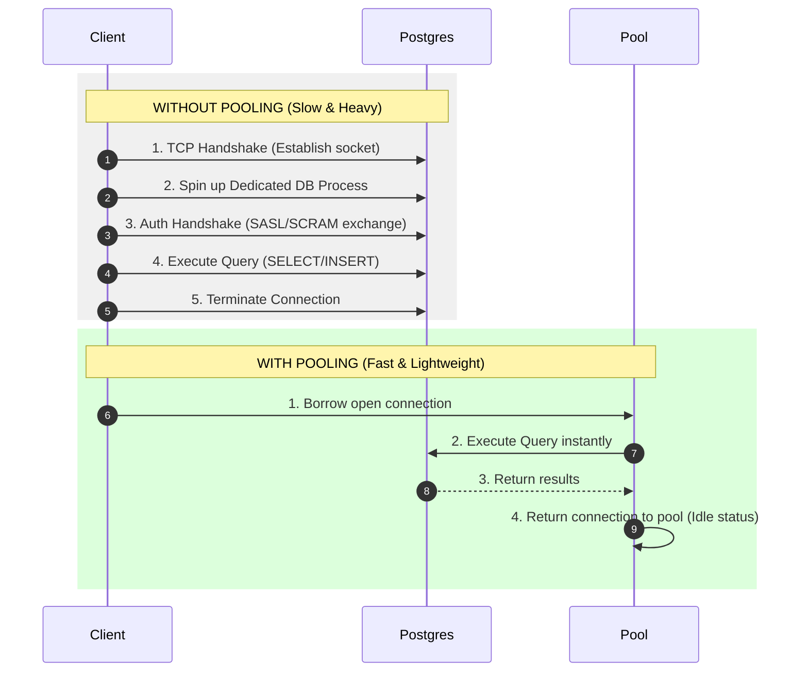

# 🏊 Connection Pooling: The Valet Parking of Databases

Opening a connection to your database is surprisingly slow and resource-heavy. **Connection Pooling** is a technique that keeps a small set of database connections open and ready to use, rather than building and tearing down a new connection for every single query.

Let's look at the core difference through a simple real-world analogy:

---

## 🏎️ The Valet Parking Analogy

### ❌ Without Pooling (Build a Highway)
Imagine if every time a customer wanted to drive to your shop, you had to build a brand-new highway lane, let them drive over, and then tear the lane down immediately after they arrived.
* **Why it's bad:** The overhead of building and destroying the road (TCP handshake, authentication, spinning up Postgres backend memory) takes 10x longer than the actual visit itself!

### 🟢 With Pooling (The Valet Team)
Imagine a hotel with **10 valet drivers** (your database connection pool). 
* When a guest arrives, they hand their keys to a driver. The driver parks the car and returns immediately.
* If 15 guests arrive at once, the first 10 get served immediately. The remaining 5 wait in a quick, orderly queue.
* The moment a driver returns, they grab the next guest's keys. You never need to hire 50 extra drivers, saving massive costs and space!

---

## 🗺️ How it Works under the Hood

Here is how queries bypass the expensive connection establishment process:



---

## 🛠️ Configuring the Pool (Your Code)

In your connection setup (`src/db/pool.js`), we configure the pool using options like these:

```typescript
export const pool = new Pool({
  connectionString: env.databaseUrl,
  max: 10,                          // Pool Capacity
  idleTimeoutMillis: 30000,         // Clean up idle connections
  connectionTimeoutMillis: 5000     // Maximum wait time in queue
});
```

Here is exactly what these configurations mean:

| Option | What it does | Simple translation |
| :--- | :--- | :--- |
| **`max: 10`** | The maximum number of active database connections to open. | *"Never hire more than 10 valet drivers."* |
| **`idleTimeoutMillis: 30000`** | Closes connections that have been sitting unused for 30 seconds. | *"If drivers are idle for 30s, send them home to save resources."* |
| **`connectionTimeoutMillis: 5000`**| How long a query will wait in the queue before throwing an error. | *"If a customer waits in line for 5s and no driver is free, apologize and say we are full."* |

---

## 🚦 Traffic Scenario: 50 Requests vs. `max: 10`

What happens when 50 users click a short link at the exact same millisecond?

1. **Requests 1–10:** Immediately grab the 10 open connections and run their database lookups.
2. **Requests 11–50:** Wait in a queue. They do not fail; they just wait their turn.
3. **The Cycle:** As soon as Request #1 finishes and returns its connection, Request #11 takes it.
4. **The End Result:** All 50 queries execute quickly, safely, and using **only 10 physical connections**.

> [!IMPORTANT]
> Without a pool, your app would try to open 50 connections at once. Under high traffic (e.g. 500 requests), this leads to **socket starvation** where Postgres runs out of connection slots and begins rejecting requests, crashing your app.

---

## 💡 System Design Tip: Sizing Your Pool

Why not just set `max: 1000`?
* **Resource Cost:** Each connection consumes memory and CPU on the Postgres server.
* **Scaling Horizontally:** If you scale your API from 1 server instance to 10 instances, each instance will spin up its own pool. 
  $$\text{Total Connections} = \text{API Instances} \times \text{max pool size}$$
  If you have 10 instances and `max: 10` on each, that's $100$ total connections hitting Postgres—which must stay under Postgres's internal `max_connections` limit.

---

## 🔍 Try It Yourself! (Inspect Your Pool)

Want to see this happen in real time? Add this monitoring script to your server setup:

```javascript
setInterval(() => {
  console.log(`Pool Stats: total=${pool.totalCount} | idle=${pool.idleCount} | waiting=${pool.waitingCount}`);
}, 2000);
```

Then, run your application and refresh the short-link redirect URL multiple times in a second. You will see `totalCount` scale up to 10, `idleCount` drop as queries execute, and `waitingCount` go up temporarily under heavy loads!