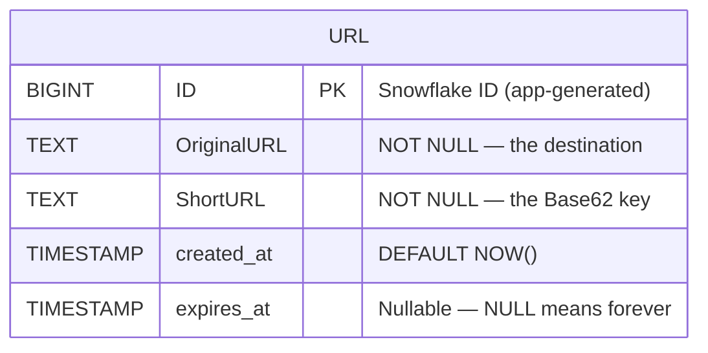
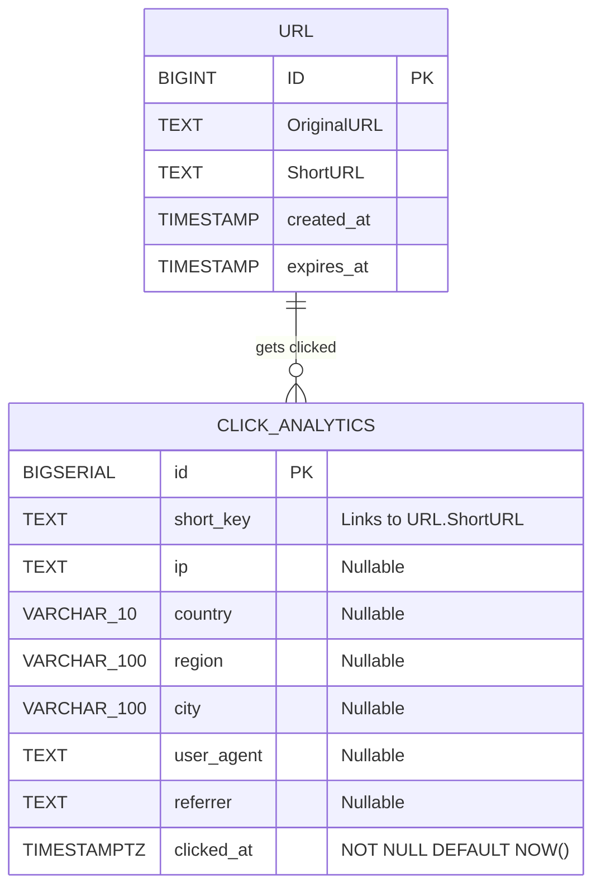
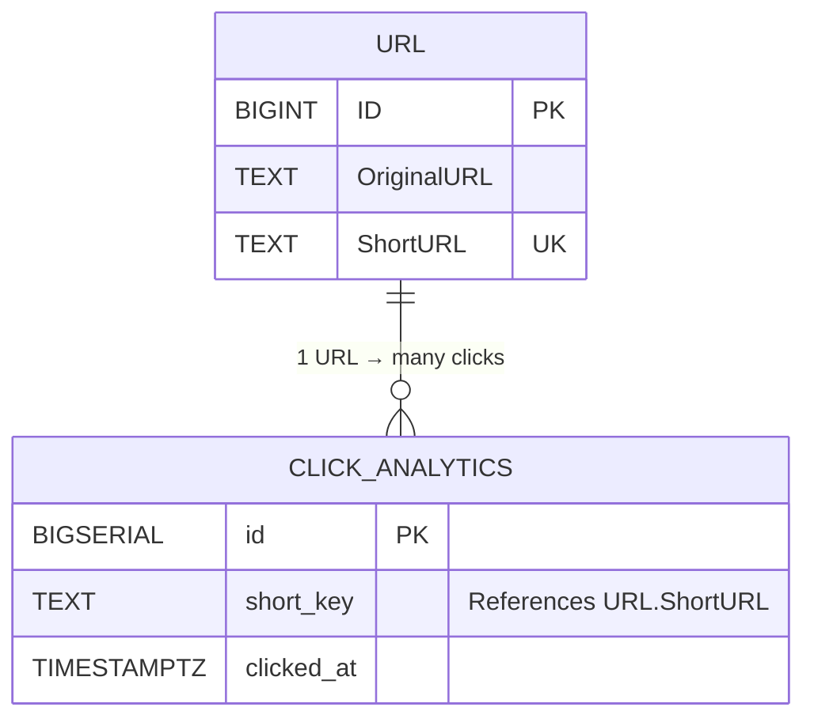

# 🏗️ The Complete Guide to Database Schema Design

> *"A messy codebase can be refactored in an afternoon. A messy database schema with millions of rows is a nightmare that haunts you for years."*

This guide will teach you **everything** about database schema design — from the very first question ("what even IS a schema?") to advanced concepts like normalization, indexing strategies, and the exact reasoning behind every column in your TinyURL database.

---

## 📖 Table of Contents

1. [Chapter 1: What Is a Schema? — The City Blueprint](#chapter-1-what-is-a-schema)
2. [Chapter 2: Tables — The Buildings in Your City](#chapter-2-tables)
3. [Chapter 3: Columns — The Rooms Inside Each Building](#chapter-3-columns)
4. [Chapter 4: Data Types — What Fits in Each Room](#chapter-4-data-types)
5. [Chapter 5: Primary Keys — Every Building Needs an Address](#chapter-5-primary-keys)
6. [Chapter 6: Your TinyURL Schema — The Complete Autopsy](#chapter-6-your-schema)
7. [Chapter 7: Constraints — The Building Code Inspector](#chapter-7-constraints)
8. [Chapter 8: Indexes — The City's GPS System](#chapter-8-indexes)
9. [Chapter 9: Normalization — One Fact, One Place](#chapter-9-normalization)
10. [Chapter 10: Relationships — How Buildings Connect](#chapter-10-relationships)
11. [Chapter 11: Schema Anti-Patterns — Buildings That Collapse](#chapter-11-anti-patterns)
12. [Chapter 12: Schema Evolution — Renovating Without Demolishing](#chapter-12-evolution)
13. [Chapter 13: Quick Reference Cheat Sheet](#chapter-13-cheat-sheet)

---

<a id="chapter-1-what-is-a-schema"></a>
## 📕 Chapter 1: What Is a Schema? — The City Blueprint

### 🏙️ The City Analogy

Imagine you're the **mayor** of a brand-new city. Before a single building goes up, you need a **master plan**:

- Where does the hospital go? (What tables do you need?)
- How many floors does the school have? (How many columns per table?)
- What size are the doors? (What data types?)
- Which roads connect which buildings? (How do tables relate?)
- What are the safety rules? (What constraints apply?)

This master plan is your **database schema**. It's the complete blueprint that defines:

```
Schema = Tables + Columns + Data Types + Constraints + Relationships + Indexes
```

### 🤔 Why Can't I Just "Figure It Out Later"?

Here's the brutal truth:

```
                Code                     vs                  Database
          ─────────────                              ─────────────────────
  
  Mistake:  Wrong function name                 Wrong column type
  Fix:      Find & Replace (2 min)              ALTER TABLE on 50M rows (2 hours of downtime)
  
  Mistake:  Bad folder structure                Missing table
  Fix:      Move files around (5 min)           Create table + backfill data + update all 
                                                queries + deploy (full sprint of work)
  
  Mistake:  Monolithic file                     Denormalized table
  Fix:      Split into modules (1 day)          Split table + migrate foreign keys + 
                                                update application layer (weeks of work)
```

> [!CAUTION]
> **Database schema changes on a live production system with millions of rows are the most expensive and dangerous changes you can make.** Getting it right upfront is not perfectionism — it's survival.

---

<a id="chapter-2-tables"></a>
## 📗 Chapter 2: Tables — The Buildings in Your City

### The Golden Rule of Tables

> **One table = one type of thing (entity)**

A table answers the question: **"What is the ONE thing this table stores?"**

If you can't answer in a single word or phrase, your table is trying to do too much.

```
  ✅ GOOD — Each table is ONE thing:

  ┌─────────────┐    ┌──────────────────┐    ┌──────────────┐
  │   urls       │    │  click_analytics  │    │    users      │
  │─────────────│    │──────────────────│    │──────────────│
  │ A shortened  │    │ A single click    │    │ A person who  │
  │ URL record   │    │ event on a URL    │    │ uses the app  │
  └─────────────┘    └──────────────────┘    └──────────────┘


  ❌ BAD — Multiple things crammed into one table:

  ┌──────────────────────────────────────────────────────────┐
  │                    everything_table                       │
  │──────────────────────────────────────────────────────────│
  │ url, click_count, user_name, user_email, ip_address,     │
  │ browser, last_login, subscription_plan, ...              │
  │                                                          │
  │ 🤮 This is a spreadsheet, not a database!                │
  └──────────────────────────────────────────────────────────┘
```

### How to Identify Your Entities

Ask yourself: **"What are the nouns in my app?"**

For TinyURL:
- A **URL** (the shortened link) → `url.URL` table ✅
- A **Click** (someone visiting a short link) → `url.click_analytics` table ✅
- A **User** (future feature — someone who creates links) → `users` table (future) ✅

### Schemas (Namespaces) — Neighborhoods in Your City

Notice your tables live under `url.URL` and `url.click_analytics`, not just `URL`. That `url.` prefix is a **PostgreSQL schema** (namespace).

```
  Database: tinyurl_db
  │
  ├── Schema: public (default, for generic stuff)
  │   └── schema_migrations
  │
  └── Schema: url (your business domain)
      ├── URL               ← core link data
      └── click_analytics   ← click tracking
```

Think of schemas as **neighborhoods** in your city. The `url` neighborhood has all the URL-related buildings. Later you might have a `users` neighborhood or an `analytics` neighborhood.

**Why bother?** As your database grows to 50+ tables, namespaces keep things organized. You'd never dump a hospital, a school, and a factory on the same street with no zoning!

---

<a id="chapter-3-columns"></a>
## 📘 Chapter 3: Columns — The Rooms Inside Each Building

Each column stores a **single fact** about the entity.

### The Column Checklist

For every column you add, answer these 5 questions:

```
  ┌─────────────────────────────────────────────────────────────┐
  │                    COLUMN DECISION TREE                     │
  │                                                             │
  │  1. Is this a direct fact about THIS entity?                │
  │     └─ NO → It belongs in another table                     │
  │     └─ YES ↓                                                │
  │                                                             │
  │  2. Can it be DERIVED from other columns?                   │
  │     └─ YES → Don't store it (calculate on the fly)          │
  │     └─ NO ↓                                                 │
  │                                                             │
  │  3. Will it change frequently?                              │
  │     └─ YES → Consider a separate table (normalization)      │
  │     └─ NO ↓                                                 │
  │                                                             │
  │  4. Can it be NULL (missing)?                               │
  │     └─ YES → Is that meaningful? → allow NULL               │
  │     └─ NO → add NOT NULL constraint                         │
  │                                                             │
  │  5. What's the tightest data type that fits?                │
  │     └─ Choose the SMALLEST type that works                  │
  └─────────────────────────────────────────────────────────────┘
```

### Example: Should `click_count` Be a Column on `URL`?

Let's run the checklist:

| Question | Answer | Verdict |
|:--|:--|:--|
| Is it a fact about the URL? | Kinda... it's about clicks on the URL | ⚠️ Indirect |
| Can it be derived? | YES — `SELECT COUNT(*) FROM click_analytics WHERE short_key = X` | ❌ Don't store |
| Will it change frequently? | YES — every single click updates it | ❌ Terrible for writes |
| Can it be NULL? | N/A | — |

**Verdict: Do NOT add `click_count` to the URL table.** Compute it from `click_analytics` when needed. Storing it would mean updating the URL row on every single click, creating write contention and race conditions.

---

<a id="chapter-4-data-types"></a>
## 📙 Chapter 4: Data Types — What Fits in Each Room

Choosing the right data type is like choosing the right container for your stuff:

```
  You wouldn't store a goldfish in a shoebox         🐟 📦 ❌
  You wouldn't store a ring in a swimming pool       💍 🏊 ❌
  You wouldn't store milk in a mesh bag              🥛 🧺 ❌

  Right container for the right thing!
```

### The PostgreSQL Data Type Menu

Here's your menu, ordered from "use this most" to "use this rarely":

#### 📝 Text Types — For Words and Strings

```
  ┌──────────────────────────────────────────────────────────────┐
  │  TYPE           │  SIZE          │  WHEN TO USE              │
  │─────────────────│────────────────│───────────────────────────│
  │  TEXT            │  Unlimited     │  When length is unknown   │
  │                 │                │  (URLs, descriptions)     │
  │                 │                │                           │
  │  VARCHAR(N)     │  Up to N chars │  When you KNOW the max    │
  │                 │                │  (country code: 10 chars) │
  │                 │                │                           │
  │  CHAR(N)        │  Exactly N     │  Almost never. Fixed      │
  │                 │  (padded)      │  length data only.        │
  └──────────────────────────────────────────────────────────────┘
```

**Your TinyURL uses:**
- `TEXT` for `OriginalURL` — URLs can be 2,000+ characters. No artificial limit.
- `TEXT` for `ShortURL` — although it's always ~7 chars, TEXT works fine here.
- `VARCHAR(10)` for `country` — ISO country codes never exceed 10 characters.
- `VARCHAR(100)` for `region`, `city` — reasonable upper bounds.

#### 🔢 Number Types — For Counting and Identifying

```
  ┌──────────────────────────────────────────────────────────────┐
  │  TYPE           │  RANGE                  │  BYTES  │ USE    │
  │─────────────────│─────────────────────────│─────────│────────│
  │  SMALLINT       │  -32,768 to 32,767      │  2      │ Rare   │
  │  INTEGER        │  -2.1B to 2.1B          │  4      │ Common │
  │  BIGINT         │  -9.2 quintillion       │  8      │ IDs!   │
  │                 │   to 9.2 quintillion    │         │        │
  │  BIGSERIAL      │  Auto-increment BIGINT  │  8      │ Auto   │
  │                 │                         │         │ IDs    │
  └──────────────────────────────────────────────────────────────┘
```

**Your TinyURL uses:**
- `BIGINT` for `URL.ID` — Snowflake IDs are 64-bit integers. `INTEGER` would overflow!
- `BIGSERIAL` for `click_analytics.id` — auto-incrementing, because clicks don't need Snowflake IDs.

#### ⏰ Time Types — For When Things Happen

```
  ┌──────────────────────────────────────────────────────────────────┐
  │  TYPE              │  STORES TIMEZONE?  │  EXAMPLE               │
  │────────────────────│────────────────────│─────────────────────────│
  │  TIMESTAMP         │  ❌ NO             │  2026-08-15 17:30:00    │
  │                    │                    │  (What timezone?? 🤷)   │
  │                    │                    │                         │
  │  TIMESTAMPTZ       │  ✅ YES            │  2026-08-15 17:30:00+05 │
  │                    │                    │  (IST, unambiguous! ✅)  │
  └──────────────────────────────────────────────────────────────────┘
```

> [!WARNING]
> **Always use `TIMESTAMPTZ`, never plain `TIMESTAMP`.**
>
> Your `create_table.sql` uses `TIMESTAMP` for `created_at` and `expires_at` on the URL table. This works while your server and database are in the same timezone, but will cause bugs the moment you deploy to a cloud server in a different region. `click_analytics.clicked_at` correctly uses `TIMESTAMPTZ` — the URL table should too!

**The Horror Story:**
```
  Your local machine:  IST (UTC+5:30)
  AWS server:          UTC (UTC+0)

  You create a URL that "expires at 2026-08-15 18:00:00" (meant: 6pm IST)

  With TIMESTAMP:   Stored as "18:00:00" — no timezone info
                    Server reads it as "18:00:00 UTC" = 11:30pm IST
                    URL stays alive 5.5 hours longer than intended! 😱

  With TIMESTAMPTZ: Stored as "18:00:00+05:30" — always correct
                    Server converts it properly regardless of its timezone ✅
```

#### 🆔 UUID vs BIGINT — The Great ID Debate

This is one of the most important design decisions. Let's settle it:

```
  ┌────────────────────────────────────────────────────────────────────┐
  │                    BIGINT                  │       UUID            │
  │────────────────────────────────────────────│───────────────────────│
  │  Looks like: 7284639584729301              │  550e8400-e29b-41d4  │
  │  Size: 8 bytes                             │  Size: 16 bytes      │
  │  Sortable: ✅ Yes (natural order)          │  Sortable: ❌ Random │
  │  Index speed: ⚡ Very fast                 │  Index speed: 🐌 Slow│
  │  Human readable: 😬 Kinda                  │  Human readable: ❌  │
  │  Guessable: ⚠️ Sequential ones are        │  Guessable: ✅ No    │
  │  Distributed: ❌ Needs coordination        │  Distributed: ✅ Yes │
  └────────────────────────────────────────────────────────────────────┘
```

**Your TinyURL chose BIGINT + Snowflake IDs, getting the best of both worlds:**

```
  Snowflake ID:  combines BIGINT efficiency with distributed uniqueness

  ┌──────────────────────────────────────────────────────────┐
  │  0 │ 41 bits: timestamp │ 10 bits: machine │ 12 bits: seq│
  │    │ (69 years of ms)   │ (1024 machines)  │ (4096/ms)   │
  └──────────────────────────────────────────────────────────┘
       │                      │                   │
       ▼                      ▼                   ▼
    Sortable by time    Unique per machine    Unique per ms
    (unlike UUID!)      (distributed!)        (high throughput!)
```

> [!TIP]
> **Why Snowflake > UUID for TinyURL:**
> - 8 bytes instead of 16 = half the storage, faster indexes
> - Naturally time-sorted = efficient B-tree inserts (always append, never random)
> - Encodes to shorter Base62 strings = shorter URLs!

---

<a id="chapter-5-primary-keys"></a>
## 📒 Chapter 5: Primary Keys — Every Building Needs an Address

### What IS a Primary Key?

A primary key is a column (or set of columns) that **uniquely identifies every single row** in a table. No two rows can ever have the same primary key value.

```
  Think of it as a house address:

  🏠 123 Main St  ← only ONE house can have this address
  🏠 124 Main St  ← different house, different address
  🏠 123 Main St  ← ❌ ILLEGAL! Address already taken!

  Similarly:

  ID: 7284639584729301  ← only ONE URL can have this ID
  ID: 7284639584729302  ← different URL, different ID
  ID: 7284639584729301  ← ❌ PostgreSQL REJECTS this INSERT!
```

### The 3 Rules of Primary Keys

| Rule | Why | Your TinyURL |
|:--|:--|:--|
| **1. Unique** | No two rows share the same PK | Snowflake IDs are globally unique |
| **2. Never NULL** | Every row MUST have an identity | `BIGINT PRIMARY KEY` implies `NOT NULL` |
| **3. Never changes** | If the address changes, everything that references it breaks | Snowflake IDs are immutable once generated |

### Natural Key vs Surrogate Key

```
  NATURAL KEY: Uses a real-world attribute as the identifier
  ─────────────
  Example: Using "short_key" (like "abc123") as the primary key

  Problems:
  - What if business rules change and short keys need to be editable?
  - What if two systems generate the same short key?
  - short_key is a VARCHAR — slower to join and index than integers


  SURROGATE KEY: A system-generated artificial identifier (what you use!)
  ─────────────
  Example: Using Snowflake BIGINT ID as the primary key

  Benefits:
  ✅ Never changes (business rules can't affect it)
  ✅ Always unique (guaranteed by the algorithm)
  ✅ Fast to index (8-byte integer vs variable-length string)
  ✅ Meaningless to users (can't be guessed or manipulated)
```

**Your TinyURL correctly uses a surrogate key (`ID BIGINT PRIMARY KEY`)** while keeping `ShortURL` as a separate unique indexed column for lookups.

---

<a id="chapter-6-your-schema"></a>
## 📓 Chapter 6: Your TinyURL Schema — The Complete Autopsy

Let's dissect your actual migration file [`create_table.sql`](file:///c:/Users/TARUN/Desktop/TinyURL/src/db/migrations/create_table.sql) line by line.

### Table 1: `url.URL` — The Core

```sql
CREATE TABLE IF NOT EXISTS url.URL(
    ID          BIGINT    PRIMARY KEY,
    OriginalURL TEXT      NOT NULL,
    ShortURL    TEXT      NOT NULL,
    created_at  TIMESTAMP DEFAULT NOW(),
    expires_at  TIMESTAMP
);
CREATE UNIQUE INDEX IF NOT EXISTS idx_urls_short_url ON url.URL (ShortURL);
```

Let's examine every single decision:

```
  ┌────────────────────────────────────────────────────────────────────────┐
  │  COLUMN        TYPE       CONSTRAINTS     WHY THIS WAY?              │
  │────────────────────────────────────────────────────────────────────────│
  │                                                                       │
  │  ID            BIGINT     PRIMARY KEY     Snowflake ID from your     │
  │                                           generator. 64-bit integer. │
  │                                           NOT auto-increment — your  │
  │                                           app generates it.          │
  │                                                                       │
  │  OriginalURL   TEXT       NOT NULL        The long URL being          │
  │                                           shortened. TEXT because     │
  │                                           URLs can be very long.     │
  │                                           NOT NULL because a URL     │
  │                                           without a destination is   │
  │                                           meaningless.               │
  │                                                                       │
  │  ShortURL      TEXT       NOT NULL        The Base62-encoded key.     │
  │                                           NOT NULL because you can't │
  │                                           have a shortened URL       │
  │                                           without the short part!    │
  │                                                                       │
  │  created_at    TIMESTAMP  DEFAULT NOW()   Auto-filled on INSERT.     │
  │                                           Records when the URL was   │
  │                                           created. No NOT NULL, but  │
  │                                           DEFAULT ensures it's       │
  │                                           always populated.          │
  │                                                                       │
  │  expires_at    TIMESTAMP  (nullable)      Can be NULL! A URL might   │
  │                                           live forever. NULL means   │
  │                                           "never expires."           │
  │                                                                       │
  └────────────────────────────────────────────────────────────────────────┘
```

**The ER Diagram:**



### Table 2: `url.click_analytics` — The Event Log

```sql
CREATE TABLE IF NOT EXISTS url.click_analytics (
    id         BIGSERIAL PRIMARY KEY,
    short_key  TEXT NOT NULL,
    ip         TEXT,
    country    VARCHAR(10),
    region     VARCHAR(100),
    city       VARCHAR(100),
    user_agent TEXT,
    referrer   TEXT,
    clicked_at TIMESTAMPTZ NOT NULL DEFAULT NOW()
);
CREATE INDEX IF NOT EXISTS idx_click_analytics_short_key ON url.click_analytics (short_key);
CREATE INDEX IF NOT EXISTS idx_click_analytics_clicked_at ON url.click_analytics (clicked_at);
```

```
  ┌────────────────────────────────────────────────────────────────────────┐
  │  COLUMN        TYPE           WHY THIS WAY?                          │
  │────────────────────────────────────────────────────────────────────────│
  │                                                                       │
  │  id            BIGSERIAL      Auto-incrementing. Unlike URLs, clicks │
  │                               don't need Snowflake IDs. BIGSERIAL    │
  │                               is simpler and fine for event logs.    │
  │                                                                       │
  │  short_key     TEXT           Links this click to a URL. NOT NULL    │
  │                               because every click must belong to     │
  │                               a URL.                                  │
  │                                                                       │
  │  ip            TEXT           Visitor's IP address. Nullable because │
  │                               some requests come through proxies     │
  │                               that strip the IP.                     │
  │                                                                       │
  │  country       VARCHAR(10)    ISO country code. Bounded — country    │
  │                               codes are short. Nullable because geo  │
  │                               lookup can fail.                       │
  │                                                                       │
  │  region        VARCHAR(100)   State/province. Bounded but generous.  │
  │                                                                       │
  │  city          VARCHAR(100)   City name. Same reasoning.             │
  │                                                                       │
  │  user_agent    TEXT           Browser/device string. These can be    │
  │                               very long (200+ chars), so TEXT.       │
  │                                                                       │
  │  referrer      TEXT           Where the click came from. Nullable    │
  │                               because direct visits have no referrer.│
  │                                                                       │
  │  clicked_at    TIMESTAMPTZ    When the click happened. Uses          │
  │                               TIMESTAMPTZ (correct!). NOT NULL       │
  │                               with DEFAULT — every click has a time. │
  │                                                                       │
  └────────────────────────────────────────────────────────────────────────┘
```

**The ER Diagram:**



### 🧠 Design Insight: Why `short_key` Instead of a Foreign Key?

You might wonder: why does `click_analytics.short_key` store the short URL text instead of referencing `URL.ID` as a foreign key?

```
  Option A: Foreign Key (url_id BIGINT REFERENCES url.URL(ID))
  ───────────────────────────────────────────────────────────
  ✅ Enforces referential integrity (can't log a click for a non-existent URL)
  ❌ Requires a JOIN to get the short key for display
  ❌ With sharding, foreign keys across shards are impossible


  Option B: Denormalized Key (short_key TEXT) ← What you chose!
  ─────────────────────────────────────────────
  ✅ Self-contained — the analytics table has everything it needs
  ✅ No JOINs needed for analytics queries
  ✅ Works perfectly with sharding (both tables shard on the same key)
  ⚠️ No database-enforced integrity (app must ensure correctness)
```

> [!NOTE]
> This is a deliberate tradeoff for **performance and scalability**. Your shard router in [`shard_router.js`](file:///c:/Users/TARUN/Desktop/TinyURL/src/db/shard_router.js) hashes on `short_key` to route to the correct shard. If analytics used `url_id` instead, you'd need cross-shard JOINs — a performance nightmare.

---

<a id="chapter-7-constraints"></a>
## 📔 Chapter 7: Constraints — The Building Code Inspector

Constraints are **rules enforced by the database itself**. They're your last line of defense against bad data.

### 🧱 Think of It Like a Building Inspector

Your app might check if a URL is valid before inserting it. But what if:
- A bug in your validation code slips through?
- A developer writes a quick script that bypasses your API?
- Two requests arrive at the exact same millisecond?

The database constraints catch what your app misses:

```
  ┌─────────────────────────────────────────────────────────────────┐
  │                    LAYERS OF DEFENSE                            │
  │                                                                 │
  │  Layer 1: Frontend ──▶ "Please enter a valid URL"              │
  │                        (User can bypass with dev tools)        │
  │                                                                 │
  │  Layer 2: API ──────▶  if (!isURL(input)) throw Error          │
  │                        (Bug could skip this check)             │
  │                                                                 │
  │  Layer 3: DATABASE ──▶ NOT NULL, UNIQUE, CHECK constraints     │
  │                        (IMPOSSIBLE to bypass. Period.) 🛡️      │
  │                                                                 │
  └─────────────────────────────────────────────────────────────────┘
```

### Constraint Types Explained

#### 1. `NOT NULL` — "This room MUST have furniture"

```sql
OriginalURL TEXT NOT NULL
```

Prevents inserting a URL without a destination. Without this:
```sql
INSERT INTO url.URL (ID, ShortURL) VALUES (123, 'abc');
-- OriginalURL is NULL — a short link that goes NOWHERE! 💀
```

With `NOT NULL`:
```
ERROR: null value in column "OriginalURL" violates not-null constraint
```

#### 2. `PRIMARY KEY` — "This address is unique and mandatory"

```sql
ID BIGINT PRIMARY KEY
```

This is a shortcut for `UNIQUE + NOT NULL`. It also automatically creates an index.

#### 3. `UNIQUE` (via Index) — "No two buildings can have the same address"

```sql
CREATE UNIQUE INDEX idx_urls_short_url ON url.URL (ShortURL);
```

This is the **most critical constraint** in your entire schema. Here's why:

```
  The Race Condition Nightmare (without UNIQUE):

  Time 0ms:  Request A generates short key "abc123"
  Time 0ms:  Request B generates short key "abc123" (collision!)
  Time 1ms:  Request A checks: "Does abc123 exist?" → No
  Time 1ms:  Request B checks: "Does abc123 exist?" → No
  Time 2ms:  Request A inserts abc123 → ✅ Success
  Time 2ms:  Request B inserts abc123 → ✅ Success (DUPLICATE! 💀)

  Now "abc123" points to TWO different URLs!
  Which one do you redirect to? DISASTER.


  With UNIQUE INDEX:

  Time 2ms:  Request A inserts abc123 → ✅ Success
  Time 2ms:  Request B inserts abc123 → ❌ UNIQUE VIOLATION
             (PostgreSQL physically blocks the duplicate)

  Your app catches the error and generates a new short key. 
```

> [!IMPORTANT]
> **Your app-level uniqueness checks are NOT enough.** Only a database-level `UNIQUE` constraint can handle race conditions where two requests arrive at the exact same time. This is because the database uses **row-level locking** to ensure atomicity.

#### 4. `DEFAULT` — "If you don't specify, use this"

```sql
created_at TIMESTAMP DEFAULT NOW()
```

This means your INSERT can skip `created_at` entirely:
```sql
-- Both of these work identically:
INSERT INTO url.URL (ID, OriginalURL, ShortURL) VALUES (1, 'https://...', 'abc');
INSERT INTO url.URL (ID, OriginalURL, ShortURL, created_at) VALUES (1, 'https://...', 'abc', NOW());
```

Your [`shorten.service.js`](file:///c:/Users/TARUN/Desktop/TinyURL/src/modules/shorten/shorten.service.js) takes advantage of this:
```javascript
await pool.query(
    `INSERT INTO url.URL (ID, OriginalURL, ShortURL) VALUES ($1, $2, $3)`,
    [rawId, originalURL, shortKey]
);
// Notice: no created_at or expires_at — DEFAULT handles created_at,
// and expires_at is nullable (NULL = never expires)
```

#### 5. `CHECK` — "This room must follow specific rules" (not used yet, but powerful)

```sql
-- Example: Ensure expires_at is always in the future
ALTER TABLE url.URL ADD CONSTRAINT chk_expires_future
    CHECK (expires_at IS NULL OR expires_at > created_at);

-- Example: Ensure OriginalURL starts with http
ALTER TABLE url.URL ADD CONSTRAINT chk_url_protocol
    CHECK (OriginalURL LIKE 'http%');
```

---

<a id="chapter-8-indexes"></a>
## 📚 Chapter 8: Indexes — The City's GPS System

### 📖 The Book Index Analogy

Imagine searching for the word "Snowflake" in a 500-page book:

```
  WITHOUT an index:
  Read page 1... no. Page 2... no. Page 3... no...
  ...Page 247... FOUND IT!
  Time: You read 247 pages (Sequential Scan)


  WITH an index (back of the book):
  Flip to index → "Snowflake: page 247"
  Jump directly to page 247 → FOUND IT!
  Time: 2 lookups (Index Scan)
```

**That's exactly what a database index does.** Without one, PostgreSQL reads every single row (sequential scan). With one, it jumps directly to the matching rows.

### Your TinyURL Indexes

Your schema creates 3 indexes:

```sql
-- Index 1: UNIQUE index on ShortURL (created explicitly)
CREATE UNIQUE INDEX idx_urls_short_url ON url.URL (ShortURL);

-- Index 2: Regular index on short_key in click_analytics
CREATE INDEX idx_click_analytics_short_key ON url.click_analytics (short_key);

-- Index 3: Regular index on clicked_at in click_analytics
CREATE INDEX idx_click_analytics_clicked_at ON url.click_analytics (clicked_at);

-- (Index 4: Automatically created by PRIMARY KEY on URL.ID)
-- (Index 5: Automatically created by PRIMARY KEY on click_analytics.id)
```

### Why These Specific Indexes?

The rule is simple: **index what you search by.**

Let's match each index to its query:

```
  INDEX                              QUERY THAT USES IT
  ─────                              ──────────────────

  idx_urls_short_url                 SELECT OriginalURL FROM url.URL
  (on ShortURL)                      WHERE ShortURL = $1
                                     ↑ This is your HOTTEST query!
                                       Every redirect hits this.
                                       Used in redirect.service.js


  idx_click_analytics_short_key      SELECT * FROM url.click_analytics
  (on short_key)                     WHERE short_key = $1
                                     ↑ "Show me all clicks for this URL"
                                       Analytics dashboard query.


  idx_click_analytics_clicked_at     SELECT * FROM url.click_analytics
  (on clicked_at)                    WHERE clicked_at > NOW() - INTERVAL '7 days'
                                     ↑ "Show me clicks from the last week"
                                       Time-range analytics query.
```

### ⚠️ Why NOT Index Everything?

```
  ┌───────────────────────────────────────────────────────────────────────┐
  │                     THE COST OF INDEXES                              │
  │                                                                      │
  │                         READ                        WRITE            │
  │                                                                      │
  │  Without index:    Slow (scan all rows)       Fast (just insert)    │
  │  With 1 index:     Fast ⚡                     Slightly slower      │
  │  With 5 indexes:   Fast ⚡                     Noticeably slower    │
  │  With 20 indexes:  Fast ⚡                     VERY slow! 🐌        │
  │                                                                      │
  │  WHY? Every INSERT/UPDATE/DELETE must also update ALL indexes.       │
  │  More indexes = more work on every write.                            │
  │                                                                      │
  └───────────────────────────────────────────────────────────────────────┘
```

### B-Tree: How Indexes Actually Work

PostgreSQL's default index type is a **B-Tree** (Balanced Tree). Here's a simplified view:

```
  B-Tree Index on ShortURL:

                          ┌──────────┐
                          │  "m..."   │         ← Root node
                          └─────┬────┘
                       ┌────────┴────────┐
                  ┌────┴────┐       ┌────┴────┐
                  │ "a-l"   │       │ "m-z"   │  ← Branch nodes
                  └────┬────┘       └────┬────┘
              ┌────────┴──┐         ┌───┴────────┐
         ┌────┴──┐   ┌───┴───┐  ┌──┴────┐  ┌───┴───┐
         │abc123 │   │def456 │  │mno789 │  │xyz000 │  ← Leaf nodes
         │→row 5 │   │→row 12│  │→row 3 │  │→row 8 │    (point to rows)
         └───────┘   └───────┘  └───────┘  └───────┘

  Looking up "def456":
  1. Root: "def" < "m" → go left
  2. Branch: "def" is in "a-l" range → go to second leaf
  3. Leaf: Found "def456" → row 12!

  Total lookups: 3 (even with millions of rows!)
  Without index: up to millions of row scans 💀
```

> [!TIP]
> **Why Snowflake IDs are B-Tree friendly:** Because they're time-sorted, new IDs are always larger than old ones. This means inserts always go to the **rightmost leaf** of the B-Tree, avoiding expensive rebalancing. Random UUIDs scatter inserts all over the tree, causing constant page splits and fragmentation.

---

<a id="chapter-9-normalization"></a>
## 📖 Chapter 9: Normalization — One Fact, One Place

### 🎯 The Core Principle

> **Every piece of data should live in exactly ONE place.**

If the same fact appears in multiple rows or tables, it's a **normalization violation** — and it will eventually cause inconsistencies.

### The Spreadsheet vs Database Thinking

```
  ❌ THE SPREADSHEET APPROACH (Denormalized):

  ┌──────────┬──────────────────────────┬────────┬──────────┬──────────┐
  │ short_key│ original_url             │ click_ip│ click_at │ browser  │
  │──────────│──────────────────────────│────────│──────────│──────────│
  │ abc123   │ https://google.com       │ 1.2.3.4│ 10:00am  │ Chrome   │
  │ abc123   │ https://google.com       │ 5.6.7.8│ 10:05am  │ Firefox  │
  │ abc123   │ https://google.com       │ 9.0.1.2│ 10:10am  │ Safari   │
  │ def456   │ https://github.com       │ 1.2.3.4│ 10:15am  │ Chrome   │
  └──────────┴──────────────────────────┴────────┴──────────┴──────────┘

  Problems:
  🔴 "https://google.com" is stored 3 times (wasted space)
  🔴 If the URL changes, you must update 3 rows (update anomaly)
  🔴 If you delete all clicks, you lose the URL itself! (delete anomaly)
  🔴 You can't store a URL that has zero clicks (insert anomaly)


  ✅ THE DATABASE APPROACH (Normalized):

  urls table:                        click_analytics table:
  ┌──────────┬────────────────────┐  ┌────┬──────────┬────────┬──────────┐
  │ short_key│ original_url       │  │ id │ short_key│ ip     │ clicked_at│
  │──────────│────────────────────│  │────│──────────│────────│──────────│
  │ abc123   │ https://google.com │  │ 1  │ abc123   │ 1.2.3.4│ 10:00am  │
  │ def456   │ https://github.com │  │ 2  │ abc123   │ 5.6.7.8│ 10:05am  │
  └──────────┴────────────────────┘  │ 3  │ abc123   │ 9.0.1.2│ 10:10am  │
                                     │ 4  │ def456   │ 1.2.3.4│ 10:15am  │
  URL stored ONCE ✅                 └────┴──────────┴────────┴──────────┘
  Clicks stored separately ✅
  Can delete all clicks without losing URL ✅
  Can have URL with zero clicks ✅
```

### The 3 Normal Forms (Simplified)

Think of normalization as **levels of cleanliness**:

#### 1NF — "No bags of stuff in a single cell"

Every cell contains a **single value**, not a list.

```
  ❌ Violates 1NF:
  ┌──────────┬──────────────────────────┐
  │ short_key│ click_ips                │
  │──────────│──────────────────────────│
  │ abc123   │ 1.2.3.4, 5.6.7.8, 9.0.1 │  ← Multiple values in one cell!
  └──────────┴──────────────────────────┘

  ✅ Satisfies 1NF:
  ┌──────────┬──────────┐
  │ short_key│ click_ip │
  │──────────│──────────│
  │ abc123   │ 1.2.3.4  │  ← One value per cell
  │ abc123   │ 5.6.7.8  │
  │ abc123   │ 9.0.1.2  │
  └──────────┴──────────┘
```

#### 2NF — "Every column depends on the WHOLE key"

No column should depend on just PART of the primary key.

```
  ❌ Violates 2NF (composite key: short_key + click_id):
  ┌──────────┬──────────┬──────────────────┬──────────┐
  │ short_key│ click_id │ original_url     │ click_ip │
  │──────────│──────────│──────────────────│──────────│

  original_url depends ONLY on short_key, not on click_id!
  → Move it to its own table.
```

#### 3NF — "Every column depends on the key, the whole key, and nothing but the key"

No column should depend on another non-key column.

```
  ❌ Violates 3NF:
  ┌──────────┬──────────┬──────────┬──────────────┐
  │ click_id │ ip       │ country  │ country_name │
  │──────────│──────────│──────────│──────────────│

  country_name depends on country (not on click_id)!
  → If you need country_name, derive it from a countries lookup table.

  ✅ Satisfies 3NF:
  click_analytics has: country code (VARCHAR(10))
  countries lookup has: code → name mapping
```

> [!NOTE]
> **Your TinyURL schema is well-normalized.** The `url.URL` table stores URL data, and `click_analytics` stores click events. No redundant data, no anomalies. The only controlled denormalization is `short_key` in analytics (see Chapter 6).

---

<a id="chapter-10-relationships"></a>
## 🔗 Chapter 10: Relationships — How Buildings Connect

### The Three Types of Relationships

```
  1. ONE-TO-MANY (1:N) — The most common!
  ────────────────────
  One URL has MANY clicks.
  One user has MANY URLs.

  ┌──────┐         ┌──────────────────┐
  │ URL  │────────<│ click_analytics  │
  │      │  1 : N  │                  │
  └──────┘         └──────────────────┘


  2. ONE-TO-ONE (1:1) — Rare but useful
  ──────────────────
  One user has ONE profile.
  One URL has ONE QR code.

  ┌──────┐         ┌──────────┐
  │ URL  │─────────│ QR Code  │
  │      │  1 : 1  │          │
  └──────┘         └──────────┘


  3. MANY-TO-MANY (M:N) — Needs a junction table
  ────────────────────
  Many URLs belong to many tags.
  Many users belong to many teams.

  ┌──────┐         ┌───────────┐         ┌──────┐
  │ URL  │────────<│ url_tags  │>────────│ Tag  │
  │      │  1 : N  │(junction) │  N : 1  │      │
  └──────┘         └───────────┘         └──────┘
```

### Your TinyURL Relationships



**The relationship:** One URL can be clicked thousands of times. Each click is a separate row in `click_analytics`. This is a classic **one-to-many** relationship.

### How It's Queried

```sql
-- "How many times was this URL clicked?"
SELECT COUNT(*) FROM url.click_analytics WHERE short_key = 'abc123';

-- "Show me the last 10 clicks for this URL"
SELECT ip, country, city, user_agent, clicked_at
FROM url.click_analytics
WHERE short_key = 'abc123'
ORDER BY clicked_at DESC
LIMIT 10;

-- "Show me the top 5 most clicked URLs"
SELECT short_key, COUNT(*) as clicks
FROM url.click_analytics
GROUP BY short_key
ORDER BY clicks DESC
LIMIT 5;
```

---

<a id="chapter-11-anti-patterns"></a>
## 💀 Chapter 11: Schema Anti-Patterns — Buildings That Collapse

Learn from other people's disasters:

### Anti-Pattern 1: The God Table

```
  ❌ ONE table with 50 columns for everything:

  ┌───────────────────────────────────────────────────────────────────┐
  │                        god_table                                  │
  │───────────────────────────────────────────────────────────────────│
  │ url_id, original_url, short_key, created_at, expires_at,         │
  │ click_count, last_clicked_at, user_id, user_name, user_email,    │
  │ user_plan, click_ip_1, click_ip_2, click_ip_3, ...               │
  └───────────────────────────────────────────────────────────────────┘

  Problems: Redundancy, NULL hell, impossible to scale, nightmare JOINs
```

### Anti-Pattern 2: The Spreadsheet Columns

```
  ❌ Adding columns instead of rows:

  ┌──────────┬──────────┬──────────┬──────────┬─────┐
  │ short_key│ click_1  │ click_2  │ click_3  │ ... │
  │──────────│──────────│──────────│──────────│─────│
  │ abc123   │ 10:00am  │ 10:05am  │ 10:10am  │     │
  └──────────┴──────────┴──────────┴──────────┴─────┘

  What happens at click 1001? Add column click_1001? 💀
  
  ✅ Use ROWS, not columns, for repeating data (that's what click_analytics does!)
```

### Anti-Pattern 3: Stringly-Typed Data

```
  ❌ Storing structured data as text:

  ┌──────────┬──────────────────────────────────────────┐
  │ short_key│ metadata                                 │
  │──────────│──────────────────────────────────────────│
  │ abc123   │ "created:2026-08-15,clicks:42,user:john" │
  └──────────┴──────────────────────────────────────────┘

  You can't query this efficiently! Can't index it! Can't enforce types!
  
  ✅ Use proper columns with proper types for each piece of data.
```

### Anti-Pattern 4: No Default Timestamps

```
  ❌ Relying on the app to set created_at:

  created_at TIMESTAMP   ← No DEFAULT, no NOT NULL

  What if the app forgets? Row has NULL created_at. Forever.
  
  ✅ Always use: created_at TIMESTAMPTZ NOT NULL DEFAULT NOW()
```

### Anti-Pattern 5: Using SERIAL for Distributed IDs

```
  ❌ Using auto-increment with multiple database shards:

  Shard 0: id = 1, 2, 3, 4, 5...
  Shard 1: id = 1, 2, 3, 4, 5...  ← COLLISION!

  ✅ Your TinyURL correctly uses Snowflake IDs which are globally unique
     across all shards! Each shard generates different IDs because the
     machine_id portion is different.
```

---

<a id="chapter-12-evolution"></a>
## 🔄 Chapter 12: Schema Evolution — Renovating Without Demolishing

Your schema will change. The question is: **how do you change it safely?**

### The Migration Approach (What You Use)

```
  Version 1:  0001_create_urls.sql
              Creates the url.URL table

  Version 2:  0002_add_analytics.sql
              Creates url.click_analytics

  Version 3:  0003_add_user_agent.sql   (hypothetical future)
              ALTER TABLE url.click_analytics ADD COLUMN device_type VARCHAR(20);

  Each migration only moves FORWARD. Never edit old migrations!
```

### Safe vs Dangerous Schema Changes

| Change | Risk Level | Safe Approach |
|:--|:-:|:--|
| **Add a nullable column** | 🟢 Safe | `ALTER TABLE ADD COLUMN ... NULL` — no lock, instant |
| **Add a NOT NULL column** | 🟡 Medium | Add as NULL first, backfill data, then add NOT NULL |
| **Add an index** | 🟡 Medium | Use `CREATE INDEX CONCURRENTLY` (doesn't lock the table) |
| **Drop a column** | 🔴 Risky | Remove app references first, then drop column in next release |
| **Change column type** | 🔴 Risky | Add new column, migrate data, drop old column (3-step) |
| **Rename a table** | 🔴 Very Risky | Create new table, copy data, update app, drop old table |

> [!CAUTION]
> **Never run `ALTER TABLE ... ADD COLUMN ... NOT NULL` on a large table without a DEFAULT value.** PostgreSQL will lock the entire table and rewrite every row to add the new value. On a table with 50 million rows, this can lock your database for minutes.

### The Three-Phase Deploy for Breaking Changes

```
  Phase 1: EXPAND
  ───────────────
  Add the new column alongside the old one.
  App writes to BOTH columns.
  App reads from OLD column.

  Phase 2: MIGRATE
  ────────────────
  Backfill the new column with data from the old column.
  App reads from NEW column.
  App writes to BOTH columns.

  Phase 3: CONTRACT
  ─────────────────
  Drop the old column.
  App uses only the new column.
  
  This ensures ZERO DOWNTIME during the transition.
```

---

<a id="chapter-13-cheat-sheet"></a>
## 📋 Chapter 13: Quick Reference Cheat Sheet

### Data Type Selection Guide

```
  What are you storing?        →  Use this type
  ──────────────────────           ────────────
  Short text (< 255 chars)    →  VARCHAR(N)
  Long text (unknown length)  →  TEXT
  Small number (< 32K)        →  SMALLINT
  Normal number (< 2B)        →  INTEGER
  Large number / ID           →  BIGINT
  Auto-increment ID           →  BIGSERIAL
  True/False                  →  BOOLEAN
  Date and time (USE THIS)    →  TIMESTAMPTZ
  Date and time (AVOID THIS)  →  TIMESTAMP
  Money                       →  NUMERIC(precision, scale)
  JSON data                   →  JSONB (not JSON!)
  Binary / File               →  BYTEA (but usually store files externally!)
```

### Constraint Quick Reference

```sql
-- Column must have a value
column_name TYPE NOT NULL

-- Column has a default value
column_name TYPE DEFAULT value

-- Column values must be unique
column_name TYPE UNIQUE

-- Column is the primary identifier
column_name TYPE PRIMARY KEY

-- Column references another table
column_name TYPE REFERENCES other_table(column)

-- Column must satisfy a condition
column_name TYPE CHECK (column_name > 0)
```

### Index Decision Flowchart

```
  Should I add an index on this column?

  ┌─ Do you search/filter by this column (WHERE clause)?
  │   └─ NO → Don't index it
  │   └─ YES ↓
  │
  ├─ Is the table large (> 10,000 rows)?
  │   └─ NO → Index optional (small tables are fast without indexes)
  │   └─ YES ↓
  │
  ├─ Is the column high-cardinality (many unique values)?
  │   └─ NO (e.g., boolean, status enum) → Index may not help much
  │   └─ YES ↓
  │
  ├─ Do you write to this table frequently?
  │   └─ YES → Add index, but be aware of write overhead
  │   └─ NO → Definitely add the index! ✅
  │
  └─ Result: Add the index ✅
```

### Your TinyURL Schema at a Glance

```
  ┌─── Schema: url ────────────────────────────────────────────────────┐
  │                                                                     │
  │  ┌── URL ───────────────────────────────────────────────────────┐  │
  │  │  ID          BIGINT       PK    (Snowflake, app-generated)  │  │
  │  │  OriginalURL TEXT         NN    (the destination)           │  │
  │  │  ShortURL    TEXT         NN,UQ (the Base62 key)            │  │
  │  │  created_at  TIMESTAMP    DEF   (auto-filled)               │  │
  │  │  expires_at  TIMESTAMP    NULL  (NULL = forever)            │  │
  │  │                                                              │  │
  │  │  Indexes: PK(ID), UNIQUE(ShortURL)                          │  │
  │  └──────────────────────────────────────────────────────────────┘  │
  │           │                                                        │
  │           │ 1:N (one URL → many clicks)                            │
  │           ▼                                                        │
  │  ┌── click_analytics ──────────────────────────────────────────┐  │
  │  │  id          BIGSERIAL    PK    (auto-increment)            │  │
  │  │  short_key   TEXT         NN    (links to URL.ShortURL)     │  │
  │  │  ip          TEXT         NULL  (visitor IP)                │  │
  │  │  country     VARCHAR(10)  NULL  (geo lookup)                │  │
  │  │  region      VARCHAR(100) NULL  (geo lookup)                │  │
  │  │  city        VARCHAR(100) NULL  (geo lookup)                │  │
  │  │  user_agent  TEXT         NULL  (browser string)            │  │
  │  │  referrer    TEXT         NULL  (traffic source)            │  │
  │  │  clicked_at  TIMESTAMPTZ  NN,DEF(event timestamp)           │  │
  │  │                                                              │  │
  │  │  Indexes: PK(id), IDX(short_key), IDX(clicked_at)           │  │
  │  └──────────────────────────────────────────────────────────────┘  │
  │                                                                     │
  │  PK=Primary Key  NN=NOT NULL  UQ=UNIQUE  DEF=DEFAULT  NULL=Nullable│
  └─────────────────────────────────────────────────────────────────────┘
```

---

## 🎓 Final Mental Model

```
  Schema Design is like building a LIBRARY:

  📚 Tables    = Sections (Fiction, Science, History)
  📖 Columns   = The information on each book's catalog card
  🏷️  Types     = The kind of info (title=text, year=number, available=boolean)
  🔑 Keys      = The catalog number (unique, never changes)
  📏 Constraints = Library rules ("every book MUST have a title")
  📇 Indexes   = The card catalog (find any book in seconds)
  🔗 Relations = Cross-references ("see also: related books")

  A well-designed schema, like a well-organized library,
  makes finding and storing information effortless —
  even when you have millions of books.
```

> **The best database schema is one that makes the wrong thing impossible and the right thing effortless.**

---

*This guide is part of the TinyURL backend documentation. See also: [Connection Pooling](file:///c:/Users/TARUN/Desktop/TinyURL/docs/backend/connection_pooling.md) · [Migration Flows](file:///c:/Users/TARUN/Desktop/TinyURL/docs/backend/migration_flows.md) · [Caching Strategies](file:///c:/Users/TARUN/Desktop/TinyURL/docs/backend/caching_strategies.md)*
