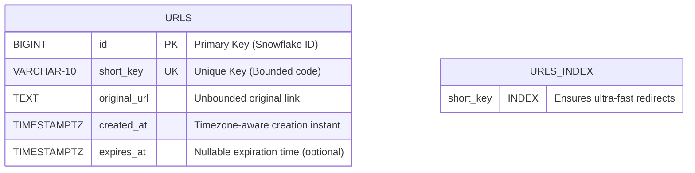
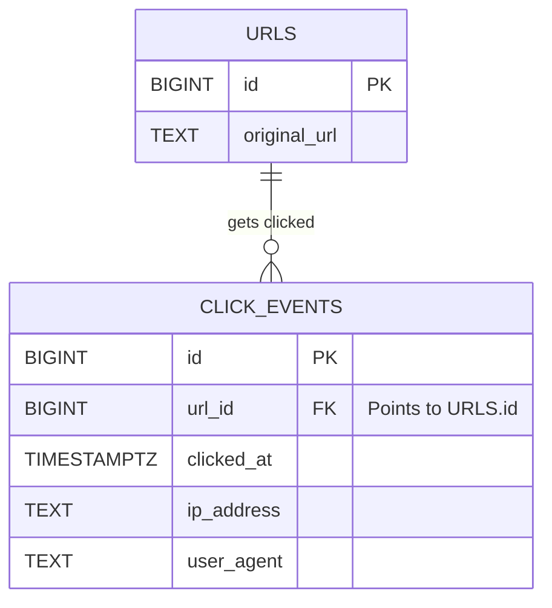

# 📐 Database Schema Design: The Blueprint of Your App

Imagine you are building a house. You don't just randomly change the blueprint, tear down walls, or add new rooms without planning—otherwise, the house might collapse! 

In software development, **database schema design** is the architectural blueprint of your database. It is the process of deciding **what tables you need, what columns each one has, what type each column is, and how tables relate to each other**—before writing a single line of application code.

---

## 🗺️ Visualizing the `urls` Table Schema

Here is how our `urls` table is structured under the hood, including its data types, keys, and indexes:



---

## 🛠️ The 5 Pillars of Database Schema Design

When designing any table, you must answer five core questions:

### 1. What is the "Thing" (Entity)? 📦
A table should represent **exactly one** type of thing.
* In our app, the core entity is the shortened URL. So we have one clean `urls` table.
* **Bad Design:** Shoving user account details directly into the `urls` table.
* **Good Design:** Keeping a separate `users` table and linking it to the `urls` table using a reference key.

### 2. What Facts Do We Store (Columns)? 📋
Every column should be a direct fact about that entity.
* **Keep it lean:** We store `original_url`, `short_key`, `created_at`, and `expires_at`.
* **What is missing?** Notice there is no `click_count` column. Why? Because a click count changes constantly and is composed of individual events. We store those separately in a `click_events` table (see Normalization below).

### 3. Choosing the Perfect Data Type 🧰
Selecting the right data type enforces validation at the database level:

| Column | Type | Why This Type? |
| :--- | :--- | :--- |
| **`id`** | `BIGINT` | A large integer. Chosen over `UUID` because we use **Snowflake IDs** later. Integers index and sort much faster than random string UUIDs. |
| **`short_key`** | `VARCHAR(10)` | Bounded string. Limiting it to 10 characters stops garbage data (like someone sending a 1,000-character key) from ever entering the table. |
| **`original_url`** | `TEXT` | Unbounded string. Real-world URLs can be extremely long, so we don't put a fixed limit on this. |
| **`created_at`** | `TIMESTAMPTZ` | **Timezone-aware timestamp**. Plain `TIMESTAMP` ignores timezones. `TIMESTAMPTZ` ensures the time is correct regardless of where the server runs. |
| **`expires_at`** | `TIMESTAMPTZ` | **Nullable** (no `NOT NULL`). It can be empty because a URL might never expire. Nullability is a key design decision. |

### 4. Setting Constraints (The Rule Enforcer) 🚨
Constraints stop bad data from ever entering your database.
```sql
CREATE UNIQUE INDEX idx_urls_short_key ON urls (short_key);
```
* **Why?** We could check if a `short_key` is unique in Node.js before saving. But if two users submit the same key at the exact same millisecond, both might write successfully (a race condition). 
* **The Solution:** A `UNIQUE` index at the database level physically blocks duplicates from ever existing.

### 5. Indexing for Query Patterns 🏎️
Indexes act like the index at the back of a book. Instead of searching the entire database line-by-line (Seq Scan), Postgres jumps directly to the answer.
* Our hottest query is:
  ```sql
  SELECT original_url FROM urls WHERE short_key = $1;
  ```
* Because we search by `short_key`, we put our unique index on `short_key`.
* **Tip:** Do not index every column! Every index slows down database writes (`INSERT`/`UPDATE`) because Postgres has to update the index too. Index only what you search by.

---

## 🧩 The Concept of Normalization

**Normalization** is the golden rule of database design: **"A fact should only live in one place."**

Let's look at how we connect a URL to its click statistics as our app grows:



* **Why two tables?** A URL is created **once**. A click event happens **many times**.
* If we crammed click counts or visitor IPs into the `urls` table, we would have massive redundancy and messy schemas. 
* By separating them into two tables linked by `url_id` (a Foreign Key), we maintain clean data integrity.

---

## 💡 Why This Matters (The Big Picture)

A messy codebase can be refactored in an afternoon. **A messy database schema with millions of rows is a nightmare to fix.** Changing a column type or splitting a table on a live production database requires complex migrations and risks database downtime. 

Getting the shape right *now*—while our data is small—is the cheapest and safest engineering decision you can make!