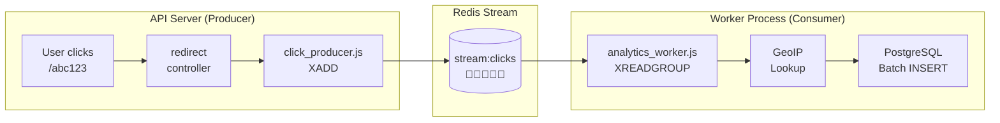
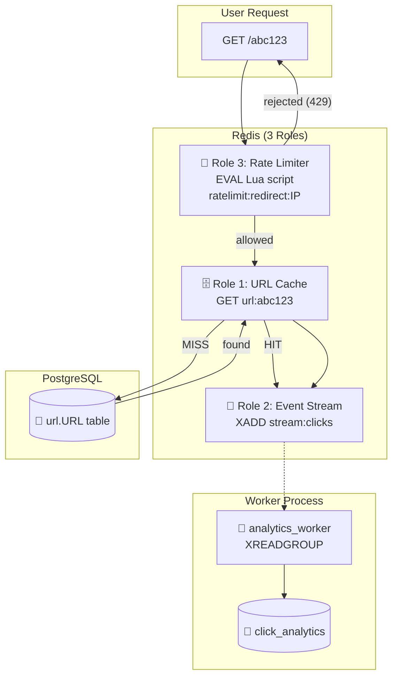

# 🔴 The Complete Guide to Interfacing with Redis

> *"Redis is the Swiss Army knife of backend engineering. It's a cache, a message broker, a rate limiter, a session store, and a real-time data structure server — all in one. Understanding how to interface with it is the single biggest force multiplier for your backend skills."*

This guide teaches you **everything** about Redis — what it is, how it works under the hood, every data structure it offers, and exactly how your TinyURL project uses it for caching, streaming, rate limiting, and more.

---

## 📖 Table of Contents

1. [Chapter 1: What Is Redis? — The Speed Demon](#chapter-1-what-is-redis)
2. [Chapter 2: Redis vs PostgreSQL — Why You Need Both](#chapter-2-redis-vs-postgres)
3. [Chapter 3: Connecting to Redis — Your Client Setup](#chapter-3-connecting)
4. [Chapter 4: The Core Data Structures — Redis's Superpower](#chapter-4-data-structures)
5. [Chapter 5: Strings — The Foundation (Your URL Cache)](#chapter-5-strings)
6. [Chapter 6: Key Expiration — Self-Destructing Data (TTL)](#chapter-6-expiration)
7. [Chapter 7: Redis Streams — The Message Highway (Your Analytics Pipeline)](#chapter-7-streams)
8. [Chapter 8: EVAL & Lua Scripting — Atomic Brain Surgery (Your Rate Limiter)](#chapter-8-lua)
9. [Chapter 9: Your TinyURL Redis Architecture — The Complete Map](#chapter-9-architecture)
10. [Chapter 10: Connection Management — Resilience & Recovery](#chapter-10-connection-management)
11. [Chapter 11: Failure Modes — What Happens When Redis Dies?](#chapter-11-failure-modes)
12. [Chapter 12: Redis CLI — The Developer's Best Friend](#chapter-12-cli)
13. [Chapter 13: Performance & Best Practices](#chapter-13-performance)
14. [Chapter 14: Quick Reference Cheat Sheet](#chapter-14-cheat-sheet)

---

<a id="chapter-1-what-is-redis"></a>
## 📕 Chapter 1: What Is Redis? — The Speed Demon

### 🧠 The Human Memory Analogy

Think about how your brain works:

```
  LONG-TERM MEMORY (PostgreSQL):
  ──────────────────────────────
  • Stores everything permanently
  • Takes a moment to recall ("What was that phone number...?")
  • Massive capacity (billions of facts)
  • Survives sleep, reboots, power outages
  • Speed: ~5-50ms to retrieve

  SHORT-TERM MEMORY (Redis):
  ──────────────────────────
  • Holds what you're actively thinking about
  • Instant recall ("What was the last thing someone said?")
  • Limited capacity (what fits in RAM)
  • Forgotten if you "sleep" (data lost on restart by default)
  • Speed: ~0.1-1ms to retrieve  ← 50x FASTER! ⚡
```

**Redis = your backend's short-term memory.** It keeps the hot, frequently-accessed data in RAM so your app doesn't have to ask the slow disk-based PostgreSQL every time.

### What Makes Redis Fast?

```
  ┌─────────────────────────────────────────────────────────────────────┐
  │                   WHY REDIS IS FAST                                │
  │                                                                     │
  │  1. ALL DATA IN RAM                                                │
  │     PostgreSQL reads from disk:  ~5ms (SSD) to ~15ms (HDD)       │
  │     Redis reads from RAM:        ~0.1ms                           │
  │     Speedup: 50-150x faster ⚡                                    │
  │                                                                     │
  │  2. SINGLE-THREADED EVENT LOOP                                     │
  │     No locking, no context switching, no thread contention.        │
  │     One thread does everything — sequentially, blazingly fast.     │
  │     (Counterintuitively, this is FASTER than multi-threading       │
  │      for this workload because it eliminates lock overhead.)       │
  │                                                                     │
  │  3. SIMPLE DATA STRUCTURES                                         │
  │     No SQL parsing, no query planning, no join optimization.       │
  │     Just: GET key → return value. O(1) operations.                 │
  │                                                                     │
  │  4. BINARY PROTOCOL                                                │
  │     Redis speaks RESP (Redis Serialization Protocol) — a compact,  │
  │     efficient binary format. No JSON parsing overhead.             │
  │                                                                     │
  └─────────────────────────────────────────────────────────────────────┘
```

### Redis Is NOT Just a Cache

Most people think Redis = cache. But Redis is actually a **data structure server** that can act as many things:

```
  ┌──────────────────────────────────────────────────────────────┐
  │              WHAT REDIS CAN BE                               │
  │                                                              │
  │  🗄️  Cache          → Store URL lookups (your url_cache.js)  │
  │  📨  Message Queue   → Stream click events (your XADD)      │
  │  🚦  Rate Limiter    → Sliding window counter (your Lua)    │
  │  🔒  Lock Manager    → Distributed locks (Redis SETNX)      │
  │  📊  Leaderboard     → Sorted sets (top clicked URLs)       │
  │  🗂️  Session Store   → User login sessions                  │
  │  📡  Pub/Sub         → Real-time notifications              │
  │  ⏰  Task Scheduler  → Delayed job queues                   │
  │                                                              │
  │  Your TinyURL uses the first THREE. ✅                       │
  └──────────────────────────────────────────────────────────────┘
```

---

<a id="chapter-2-redis-vs-postgres"></a>
## 📗 Chapter 2: Redis vs PostgreSQL — Why You Need Both

### The Library vs Notepad Analogy

```
  POSTGRESQL is the LIBRARY:
  ──────────────────────────
  📚 Massive collection (terabytes of data)
  📚 Everything is carefully cataloged (schemas, indexes)
  📚 Information survives forever (durability)
  📚 Multiple people can read/write simultaneously (ACID transactions)
  📚 Takes time to walk there and find a book (~5-50ms)


  REDIS is the STICKY NOTE on your desk:
  ──────────────────────────────────────
  📝 Holds just the stuff you need RIGHT NOW
  📝 Instant access (it's right in front of you)
  📝 Limited space (only what fits in RAM)
  📝 Temporary (falls off the desk when you bump it)
  📝 No complex organization (just key → value)
```

### The Head-to-Head Comparison

| Feature | PostgreSQL | Redis |
|:--|:--|:--|
| **Storage** | Disk (SSD/HDD) | RAM |
| **Speed** | 5-50ms per query | 0.1-1ms per operation |
| **Capacity** | Terabytes | Gigabytes (limited by RAM) |
| **Durability** | ✅ Survives crashes | ⚠️ Data may be lost on crash |
| **Data Model** | Relational tables | Key-value + data structures |
| **Query Language** | SQL (complex joins, aggregations) | Simple commands (GET, SET, XADD) |
| **Transactions** | Full ACID | Limited (Lua scripts for atomicity) |
| **Best for** | Source of truth, complex queries | Hot data, caching, real-time ops |

### Why Your TinyURL Uses Both

```
  The request flow shows WHY you need both:

  GET /abc123
       │
       ▼
  ┌─── REDIS (fast path) ────────────────────────────────────────────┐
  │  redis.get("url:abc123")                                        │
  │                                                                  │
  │  Cache HIT? → Return instantly (~0.5ms) ⚡                      │
  │  Cache MISS? ↓                                                   │
  └──────────────────────────────────────────────────────────────────┘
       │
       ▼
  ┌─── POSTGRESQL (slow path) ──────────────────────────────────────┐
  │  SELECT OriginalURL FROM url.URL WHERE ShortURL = 'abc123'     │
  │                                                                  │
  │  Found? → Store in Redis for next time → Return (~5-15ms) 🐌    │
  │  Not found? → Return 404                                        │
  └──────────────────────────────────────────────────────────────────┘

  Redis handles 95%+ of requests (cache hits).
  PostgreSQL handles the remaining 5% (cache misses).
  Both are essential!
```

---

<a id="chapter-3-connecting"></a>
## 📘 Chapter 3: Connecting to Redis — Your Client Setup

### Your Actual Connection Code

Here's your [`redis_client.js`](file:///c:/Users/TARUN/Desktop/TinyURL/src/cache/redis_client.js):

```javascript
import { Redis } from 'ioredis';
import { env } from '../config/env.js';

export const redis = new Redis(env.REDIS_URL, {
    retryStrategy: () => 1000,
    maxRetriesPerRequest: 2,
    enableOfflineQueue: true
});

redis.on('error', (err) => {
    console.log(err.message);
});
```

### Line-by-Line Breakdown

```
  ┌── import { Redis } from 'ioredis' ────────────────────────────────┐
  │                                                                    │
  │  WHY ioredis (not "redis" package)?                               │
  │                                                                    │
  │  ioredis:                          redis (node-redis):            │
  │  ✅ Built-in Lua scripting         ⚠️ Requires extra setup        │
  │  ✅ Stream support (XADD, XREAD)   ⚠️ Less ergonomic             │
  │  ✅ Cluster mode built-in          ⚠️ Cluster via separate pkg    │
  │  ✅ Auto-reconnection              ✅ Auto-reconnection           │
  │  ✅ Promises by default            ✅ Promises by default         │
  │                                                                    │
  │  ioredis is the preferred choice for production Node.js apps. ✅  │
  └────────────────────────────────────────────────────────────────────┘
```

---

#### `env.REDIS_URL`

From your [`.env`](file:///c:/Users/TARUN/Desktop/TinyURL/.env):
```
REDIS_URL=redis://localhost:6379/
```

```
  redis://localhost:6379/
  │       │         │   │
  │       │         │   └── Database number (0 by default, Redis has 16)
  │       │         └── Port (6379 is Redis's default)
  │       └── Host (local Docker container)
  └── Protocol
```

---

#### `retryStrategy: () => 1000`

```
  What happens when Redis goes down?

  WITHOUT retryStrategy:
  ──────────────────────
  Connection lost → App crashes! 💀

  WITH retryStrategy: () => 1000:
  ────────────────────────────────
  Connection lost → Wait 1000ms → Try again → Wait 1000ms → Try again...
  → Redis comes back → Connection restored! ✅

  Timeline:
  ──────────────────────────────────────────────────────────────────
  0s     Lost connection 😰
  1s     Retry #1... still down
  2s     Retry #2... still down
  3s     Retry #3... CONNECTED! ✅ Back in business
  ──────────────────────────────────────────────────────────────────

  The () => 1000 means "always wait 1 second between retries."
  You could also make it exponential: (times) => Math.min(times * 200, 5000)
```

---

#### `maxRetriesPerRequest: 2`

```
  What happens to a single Redis command when Redis is temporarily down?

  redis.get("url:abc123")
       │
       ├── Attempt 1: Connection is dead → retry
       ├── Attempt 2: Still dead → retry
       └── Attempt 3: Still dead → GIVE UP, throw error

  maxRetriesPerRequest: 2 means "try the command up to 2 additional times
  before giving up and throwing an error to the caller."

  Your url_cache.js catches this error and returns null (cache miss),
  falling back to PostgreSQL. The app stays alive! ✅
```

---

#### `enableOfflineQueue: true`

```
  What happens when commands arrive WHILE Redis is reconnecting?

  enableOfflineQueue: false:
  ─────────────────────────
  Commands thrown away immediately. Errors everywhere. 💀

  enableOfflineQueue: true:
  ────────────────────────
  Commands queued in memory. When Redis reconnects, they're replayed!

  Timeline:
  ──────────────────────────────────────────────────────────────────
  0s     Redis disconnected
  0.1s   redis.get("url:abc") → QUEUED (not sent yet)
  0.2s   redis.set("url:def") → QUEUED
  1.0s   Redis reconnects!
  1.01s  Queued commands automatically sent → Results returned ✅
  ──────────────────────────────────────────────────────────────────
```

---

#### `redis.on('error', ...)`

```javascript
redis.on('error', (err) => {
    console.log(err.message);
});
```

```
  Same principle as your PostgreSQL pool error handler!

  WITHOUT this handler:
  Unhandled error → Node.js crashes → Entire server dies 💀

  WITH this handler:
  Error logged → Node.js continues → Server stays alive ✅

  Common errors you'll see:
  • "ECONNREFUSED" → Redis isn't running (start Docker!)
  • "ETIMEDOUT" → Network issue (transient, will auto-retry)
  • "ECONNRESET" → Connection dropped (auto-reconnects)
```

> [!CAUTION]
> **Never remove the error handler!** Without it, a single Redis connection blip will crash your entire TinyURL server via an unhandled `'error'` event on the Redis EventEmitter.

---

<a id="chapter-4-data-structures"></a>
## 📙 Chapter 4: The Core Data Structures — Redis's Superpower

Redis isn't just key-value. It's a **data structure server**. Each key holds a specific type of value:

```
  ┌──────────────────────────────────────────────────────────────────────┐
  │               REDIS DATA STRUCTURES                                 │
  │                                                                      │
  │  Structure      │  Think of it as...     │  Your TinyURL uses?     │
  │─────────────────│────────────────────────│─────────────────────────│
  │  String          │  A single value        │  ✅ URL cache          │
  │  List            │  A queue/stack         │  ❌                     │
  │  Set             │  Unique collection     │  ❌                     │
  │  Sorted Set      │  Leaderboard           │  ❌ (future analytics) │
  │  Hash            │  A mini-object         │  ❌                     │
  │  Stream          │  Append-only event log │  ✅ Click events       │
  │  HyperLogLog     │  Unique counter        │  ❌ (future UV counts) │
  │  Bitmap          │  Bit array             │  ❌                     │
  │                                                                      │
  │  + Lua scripting │  Atomic operations     │  ✅ Rate limiter       │
  │                                                                      │
  └──────────────────────────────────────────────────────────────────────┘
```

### Visual Overview

```
  KEY                         VALUE (type depends on commands used)
  ───                         ─────

  "url:abc123"         →      "https://google.com"              STRING
  "url:def456"         →      "https://github.com"              STRING

  "stream:clicks"      →      [ {id, shortKey, ip, ...},        STREAM
                                 {id, shortKey, ip, ...},
                                 {id, shortKey, ip, ...} ]

  "ratelimit:redir:    →      "7"                               STRING
   1.2.3.4:12345"             (counter managed by Lua)

  "user:42:profile"    →      { name: "Tarun", plan: "pro" }    HASH
  (future example)

  "top:urls:clicks"    →      [ {abc123: 5000},                 SORTED SET
  (future example)              {def456: 3200},
                                {ghi789: 1800} ]
```

---

<a id="chapter-5-strings"></a>
## 📒 Chapter 5: Strings — The Foundation (Your URL Cache)

### The Simplest Data Structure

A Redis String is a key that maps to a single value. That's it. But it's incredibly powerful.

```
  SET "url:abc123" "https://www.google.com"
  GET "url:abc123"  →  "https://www.google.com"
```

### Your URL Cache — Complete Walkthrough

Here's your [`url_cache.js`](file:///c:/Users/TARUN/Desktop/TinyURL/src/cache/url_cache.js):

```javascript
import { redis } from "./redis_client.js";
import { env } from "../config/env.js";
import { redisCacheHitsCounter, redisCacheMissesCounter } from "../observability/metrics.js";

const KEY_PREFIX = 'url:';

export async function getCachedUrl(shortKey) {
    try {
        const val = await redis.get(KEY_PREFIX + shortKey);
        if (val) {
            redisCacheHitsCounter.inc();    // Prometheus metric: cache hit!
        } else {
            redisCacheMissesCounter.inc();  // Prometheus metric: cache miss!
        }
        return val;
    } catch (err) {
        console.error('[UrlCache] Error fetching cached URL:', err.message);
        redisCacheMissesCounter.inc();
        return null;    // Fail gracefully — fall back to PostgreSQL
    }
}

export async function setCachedUrl(shortKey, originalUrl) {
    try {
        await redis.set(KEY_PREFIX + shortKey, originalUrl, 'EX', env.CACHE_TTL_SECONDS);
    } catch (error) {
        console.log(error);  // Don't crash if cache write fails
    }
}
```

### What Each Operation Does

#### `redis.get(KEY_PREFIX + shortKey)`

```
  Command sent to Redis:  GET url:abc123
  
  Redis looks up the key in its hash table:
  ┌────────────────────┬──────────────────────────────┐
  │ Key                │ Value                        │
  │────────────────────│──────────────────────────────│
  │ url:abc123         │ "https://www.google.com"     │  ← FOUND!
  │ url:def456         │ "https://github.com"         │
  │ url:xyz789         │ (expired, removed)           │
  └────────────────────┴──────────────────────────────┘
  
  Returns: "https://www.google.com"
  Time: ~0.1ms ⚡

  If key doesn't exist → Returns: null
```

#### `redis.set(KEY_PREFIX + shortKey, originalUrl, 'EX', env.CACHE_TTL_SECONDS)`

```
  Command sent to Redis:  SET url:abc123 "https://www.google.com" EX 86400

  Breakdown:
  SET         → Store this key-value pair
  url:abc123  → The key
  "https://…" → The value
  EX 86400    → Expire after 86400 seconds (24 hours)

  After 86400 seconds, Redis automatically deletes this key.
  No cron job needed. No cleanup code. It just vanishes. ✨
```

### The Key Prefix Pattern

```
  WHY use "url:" as a prefix?

  Redis has a single flat namespace (no folders, no schemas).
  ALL keys from ALL features share the same space.

  WITHOUT prefixes:
  ┌────────────────────────────────────────────────────┐
  │  abc123                → is this a URL? A session? │
  │  ratelimit:1.2.3.4    → clearly a rate limit key  │
  │  user:42               → is this a session? URL?   │
  │                                                    │
  │  Total chaos! 💀                                    │
  └────────────────────────────────────────────────────┘

  WITH prefixes:
  ┌────────────────────────────────────────────────────┐
  │  url:abc123            → URL cache entry ✅        │
  │  url:def456            → URL cache entry ✅        │
  │  ratelimit:redir:1.2.3 → Rate limiter key ✅       │
  │  session:user:42       → Session key ✅             │
  │                                                    │
  │  Clean namespace! Easy to find and manage. ✅       │
  └────────────────────────────────────────────────────┘
```

> [!TIP]
> **Convention:** Use colon `:` as a namespace separator. This is a Redis community convention and is recognized by Redis CLI tools, GUIs (like RedisInsight), and monitoring systems. They'll group keys by prefix for you.

---

<a id="chapter-6-expiration"></a>
## 📔 Chapter 6: Key Expiration — Self-Destructing Data (TTL)

### ⏰ The Self-Destructing Sticky Note

```
  Regular sticky note:    Stays forever until YOU throw it away.
  Self-destructing note:  Disappears automatically after 24 hours.

  Regular Redis key:      Lives forever until you DEL it.
  Key with EX/TTL:        Redis auto-deletes it after N seconds.
```

### How TTL Works

```
  SET url:abc123 "https://google.com" EX 86400

  Time 0s:        Key created. TTL = 86400 seconds (24h)
  Time 43200s:    TTL = 43200 seconds (12h remaining)
  Time 86399s:    TTL = 1 second remaining
  Time 86400s:    💨 Key automatically deleted by Redis. Gone forever.

  TTL url:abc123  → Returns the remaining seconds
  TTL url:abc123  → -2 (key doesn't exist anymore)
```

### Your TTL Configuration

From your `.env`:
```
CACHE_TTL_SECONDS=86400
```

```
  86400 seconds = 24 hours

  This means:
  • When a URL is first accessed, it's cached for 24 hours.
  • For the next 24 hours, all requests for this URL hit Redis (fast! ⚡).
  • After 24 hours, the cache entry expires.
  • The next request triggers a cache miss → hits PostgreSQL → re-caches for another 24h.

  ┌── The Cache Lifecycle ──────────────────────────────────────────┐
  │                                                                 │
  │  Hour 0:   First request → DB lookup → cache SET (TTL=24h)    │
  │  Hour 1:   request → cache HIT ⚡ (23h remaining)              │
  │  Hour 12:  request → cache HIT ⚡ (12h remaining)              │
  │  Hour 23:  request → cache HIT ⚡ (1h remaining)               │
  │  Hour 24:  cache entry EXPIRES 💨                               │
  │  Hour 24+: request → cache MISS → DB lookup → cache SET again │
  │                                                                 │
  └─────────────────────────────────────────────────────────────────┘
```

### Why 24 Hours?

```
  TOO SHORT (1 minute):
  Cache expires constantly → most requests hit PostgreSQL → 
  you barely benefit from caching at all. Waste of Redis.

  TOO LONG (30 days):
  If you change a URL's destination, users see the OLD destination
  for up to 30 days (stale cache). Not acceptable.

  JUST RIGHT (24 hours):
  Most URLs are accessed in bursts (shared on social media).
  24h covers the "hot window" of viral sharing.
  After 24h, the URL cools down anyway.
  Changes propagate within 24h max.
```

### Expiration Commands Cheat Sheet

| Command | What It Does | Example |
|:--|:--|:--|
| `SET key value EX seconds` | Set with expiry in seconds | `SET url:abc123 "..." EX 86400` |
| `SET key value PX milliseconds` | Set with expiry in milliseconds | `SET key "..." PX 5000` |
| `EXPIRE key seconds` | Add expiry to existing key | `EXPIRE url:abc123 3600` |
| `TTL key` | Check remaining seconds | `TTL url:abc123` → `43200` |
| `PERSIST key` | Remove expiry (make permanent) | `PERSIST url:abc123` |

---

<a id="chapter-7-streams"></a>
## 📚 Chapter 7: Redis Streams — The Message Highway (Your Analytics Pipeline)

### 📬 The Conveyor Belt Analogy

```
  Imagine a SUSHI CONVEYOR BELT in a restaurant:

  Chef (Producer):
  • Places sushi plates on the belt one by one
  • Doesn't wait for customers to eat — just keeps placing
  • Each plate has a label (timestamp + order number)

  Belt (Redis Stream):
  • Plates move along in order
  • Belt remembers ALL plates ever placed
  • Multiple customers can eat from the same belt
  • Belt tracks which plates each customer has eaten

  Customer (Consumer):
  • Grabs plates from the belt when hungry
  • Can grab one at a time or a batch of plates
  • Tells the belt "I've eaten this plate" (ACK)
  • If customer falls asleep, belt holds plates for them

  THIS is exactly how your TinyURL analytics pipeline works!
```

### Your TinyURL Stream Architecture



### The Producer: `click_producer.js`

Your [`click_producer.js`](file:///c:/Users/TARUN/Desktop/TinyURL/src/queue/click_producer.js) pushes click events onto the stream:

```javascript
export function emitClickEvent({ shortKey, userAgent, ip, referrer, timestamp }) {
    if (!shortKey) return;

    redis.xadd(
        STREAM_KEY,      // "stream:clicks"
        '*',             // Auto-generate message ID
        'shortKey', shortKey,
        'userAgent', userAgent || '',
        'ip', ip || '',
        'referrer', referrer || '',
        'timestamp', String(timestamp || Date.now())
    ).catch((err) => {
        console.error('[AnalyticsProducer] Error:', err.message);
    });
}
```

Let's break down `XADD`:

```
  redis.xadd("stream:clicks", "*", "shortKey", "abc123", "ip", "1.2.3.4", ...)

  XADD               → "Add a message to this stream"
  "stream:clicks"    → The stream name (like a topic or channel)
  "*"                → "Let Redis generate the message ID"
                       (IDs look like: 1723729500000-0 = timestamp-sequence)
  "shortKey","abc123" → Field-value pair #1
  "ip","1.2.3.4"     → Field-value pair #2
  ...                → More field-value pairs

  What Redis stores internally:
  ┌────────────────────────────────────────────────────────────────────┐
  │  Stream: stream:clicks                                            │
  │                                                                    │
  │  Message 1723729500000-0:                                         │
  │    shortKey  = "abc123"                                           │
  │    ip        = "1.2.3.4"                                          │
  │    userAgent = "Chrome/127"                                       │
  │    referrer  = "twitter.com"                                      │
  │    timestamp = "1723729500000"                                    │
  │                                                                    │
  │  Message 1723729500001-0:                                         │
  │    shortKey  = "def456"                                           │
  │    ip        = "5.6.7.8"                                          │
  │    ...                                                             │
  │                                                                    │
  │  Message 1723729500002-0:                                         │
  │    ...                                                             │
  └────────────────────────────────────────────────────────────────────┘
```

### The Critical Design Decision: Fire-and-Forget

```javascript
// Notice: NO await! This is deliberate.
redis.xadd(...).catch((err) => { ... });
```

```
  WHY no await?

  WITH await (synchronous):
  ─────────────────────────
  User clicks → Look up URL → await XADD (wait for Redis) → redirect
                                     │
                                  +1-2ms added to response time
                                  If Redis is slow, user waits!

  WITHOUT await (fire-and-forget):
  ─────────────────────────────────
  User clicks → Look up URL → XADD (don't wait) → redirect IMMEDIATELY
                                │
                                └── Redis handles this in the background
                                    If it fails, .catch() logs the error
                                    User never knows or waits

  RESULT: Analytics recording adds ZERO latency to the redirect. ⚡
  TRADEOFF: If Redis crashes mid-XADD, that ONE click event is lost.
            (Acceptable — we lose ~1 click, not 1 million.)
```

### The Consumer: `analytics_worker.js`

Your [`analytics_worker.js`](file:///c:/Users/TARUN/Desktop/TinyURL/worker/analytics_worker.js) reads from the stream:

```javascript
// Create a consumer group (run once at startup)
await workerRedis.xgroup('CREATE', STREAM_KEY, GROUP_NAME, '$', 'MKSTREAM');

// Read messages in a loop
const response = await workerRedis.xreadgroup(
    'GROUP', GROUP_NAME, CONSUMER_NAME,   // Who's reading
    'COUNT', BATCH_SIZE,                   // Read up to 100 at once
    'BLOCK', BLOCK_MS,                     // Wait up to 2 seconds for new messages
    'STREAMS', STREAM_KEY, '>'             // Read only NEW undelivered messages
);
```

#### What Is a Consumer Group?

```
  WITHOUT Consumer Groups:
  ──────────────────────────
  Worker A reads message #1
  Worker B reads message #1 (SAME message! Duplicate processing! 💀)

  WITH Consumer Groups:
  ─────────────────────
  Worker A reads message #1 (assigned to A)
  Worker B reads message #2 (assigned to B, different message ✅)
  Worker A reads message #3
  Worker B reads message #4

  Messages are distributed among workers. No duplicates!

  ┌── Consumer Group: "analytics_group" ───────────────────────┐
  │                                                             │
  │  Stream:   [msg1] [msg2] [msg3] [msg4] [msg5] [msg6]      │
  │                │     │     │     │     │     │             │
  │  Worker A:    msg1  msg3  msg5                              │
  │  Worker B:    msg2  msg4  msg6                              │
  │                                                             │
  │  Each message goes to exactly ONE worker.                   │
  └─────────────────────────────────────────────────────────────┘
```

#### The ACK (Acknowledgment) Mechanism

```javascript
// After successfully processing and inserting into PostgreSQL:
await workerRedis.xack(STREAM_KEY, GROUP_NAME, ...messageIds);
```

```
  XACK = "I have successfully processed these messages."

  Without ACK:
  If the worker crashes mid-processing, Redis doesn't know if the message
  was handled. It will re-deliver the message when the worker restarts.
  (This is a FEATURE — it prevents data loss!)

  With ACK:
  Redis marks the message as "done." It won't be delivered again.

  Timeline:
  ──────────────────────────────────────────────────────────────────
  1. Worker reads messages [msg1, msg2, msg3]    → Redis: "pending"
  2. Worker inserts into PostgreSQL               → DB: "saved"
  3. Worker sends XACK [msg1, msg2, msg3]         → Redis: "done" ✅
  4. If worker crashes at step 2 (before XACK):
     → Redis still has [msg1, msg2, msg3] as "pending"
     → Worker restarts → reads pending messages → processes again
     → "At-least-once" delivery guarantee ✅
  ──────────────────────────────────────────────────────────────────
```

### Batch Processing — Why Not One at a Time?

```javascript
const BATCH_SIZE = 100;  // Read up to 100 messages at once
```

```
  ONE AT A TIME:                          BATCHED (100 at a time):
  ──────────────                          ─────────────────────────

  Read msg1 → INSERT → ACK               Read msg1-100 → BATCH INSERT → ACK
  Read msg2 → INSERT → ACK               Read msg101-200 → BATCH INSERT → ACK
  Read msg3 → INSERT → ACK
  ...
  Read msg100 → INSERT → ACK

  100 Redis round-trips                   1 Redis round-trip
  100 PostgreSQL INSERTs                  1 PostgreSQL INSERT (with 100 rows!)
  Total: ~500ms                           Total: ~20ms ← 25x faster! ⚡
```

---

<a id="chapter-8-lua"></a>
## 📖 Chapter 8: EVAL & Lua Scripting — Atomic Brain Surgery (Your Rate Limiter)

### 🧪 Why Can't We Just Use Regular Commands?

Your rate limiter needs to do this atomically:

```
  1. READ the current count for this IP
  2. CALCULATE if the limit is exceeded
  3. INCREMENT the counter if allowed
  4. SET the expiration

  The problem: These are 4 separate commands.
  Between commands, ANOTHER request from the same IP could sneak in!

  Request A: READ count = 99     ← sees 99, under limit of 100
  Request B: READ count = 99     ← also sees 99! (race condition!)
  Request A: INCREMENT → 100     ← count is now 100
  Request B: INCREMENT → 101     ← count is 101! OVER LIMIT but wasn't caught! 💀
```

### The Lua Script Solution

A Lua script runs **atomically** inside Redis — all commands execute as one indivisible unit. No other command can sneak in between.

Your [`sliding_window_counter.lua`](file:///c:/Users/TARUN/Desktop/TinyURL/src/rate-limit/sliding_window_counter.lua):

```lua
-- KEYS[1] = "ratelimit:redirect:1.2.3.4"
-- ARGV[1] = current unix time (seconds)
-- ARGV[2] = window size (60 seconds)
-- ARGV[3] = max requests (100)

local base_key = KEYS[1]
local now = tonumber(ARGV[1])
local window_size = tonumber(ARGV[2])
local limit = tonumber(ARGV[3])

-- Calculate current and previous window numbers
local current_window = math.floor(now / window_size)
local previous_window = current_window - 1

local current_key = base_key .. ":" .. current_window
local previous_key = base_key .. ":" .. previous_window

-- Get counts from both windows
local current_count = tonumber(redis.call("GET", current_key)) or 0
local previous_count = tonumber(redis.call("GET", previous_key)) or 0

-- Weighted sliding window estimate
local elapsed_in_current = now % window_size
local weight = (window_size - elapsed_in_current) / window_size
local estimated_count = (previous_count * weight) + current_count

-- Decision: allow or reject
if estimated_count >= limit then
  local retry_after = window_size - elapsed_in_current
  return {0, math.ceil(retry_after)}  -- REJECTED
end

redis.call("INCR", current_key)
redis.call("EXPIRE", current_key, window_size * 2)

local remaining = limit - estimated_count - 1
return {math.floor(remaining), 0}  -- ALLOWED
```

### How the Sliding Window Works — Visualized

```
  Window size: 60 seconds
  Limit: 100 requests per window

  ┌── Previous Window ────┐┌── Current Window ─────┐
  │  (60 seconds ago)      ││  (now)                 │
  │                        ││                        │
  │  Count: 80 requests    ││  Count: 30 requests    │
  │                        ││        ↑               │
  └────────────────────────┘└────────┤───────────────┘
                                     │
                              We are HERE
                              (40 seconds into current window)

  Weight of previous window: (60 - 40) / 60 = 0.333
  Estimated count: (80 × 0.333) + 30 = 26.6 + 30 = 56.6

  56.6 < 100 → ALLOWED ✅ (remaining ≈ 43)


  If estimated ≥ 100 → REJECTED with "retry after" seconds ❌
```

### How Your Node.js Calls the Lua Script

From [`rate_limiter.js`](file:///c:/Users/TARUN/Desktop/TinyURL/src/rate-limit/rate_limiter.js):

```javascript
const [remaining, retryAfter] = await redis.eval(
    script,           // The Lua source code (loaded from .lua file)
    1,                // Number of KEYS arguments
    key,              // KEYS[1] = "ratelimit:redirect:1.2.3.4"
    now,              // ARGV[1] = current time
    windowSeconds,    // ARGV[2] = 60
    limit             // ARGV[3] = 100
);
```

```
  redis.eval(script, 1, key, now, windowSeconds, limit)
              │      │   │    │         │          │
              │      │   │    │         │          └── ARGV[3]: max requests
              │      │   │    │         └── ARGV[2]: window size in seconds
              │      │   │    └── ARGV[1]: current unix timestamp
              │      │   └── KEYS[1]: the rate limit key for this IP
              │      └── Number of KEYS (tells Redis which args are keys vs values)
              └── The Lua script source code
```

### The "Fail Open" Pattern

```javascript
} catch (err) {
    console.error('Rate limiter Redis error, failing open:', err.message);
    return { allowed: true, remaining: limit, retryAfterSeconds: 0 };
}
```

```
  "Fail OPEN" vs "Fail CLOSED":

  Fail OPEN (your choice):
  Redis is down → ALLOW the request ✅
  Reasoning: "Better to serve some extra requests than to
              block ALL users because the rate limiter is down."

  Fail CLOSED (alternative):
  Redis is down → REJECT the request ❌
  Reasoning: "Without rate limiting, we're vulnerable to attacks."

  For a URL shortener, FAIL OPEN is correct.
  Blocking all redirects because Redis is down would be catastrophic.
  The rare extra requests during a Redis outage are acceptable.
```

> [!IMPORTANT]
> **"Fail open" vs "fail closed" is a critical design decision.** For security-critical systems (banking), you might fail closed. For availability-critical systems (URL shortener), fail open. Always document your choice.

---

<a id="chapter-9-architecture"></a>
## 📓 Chapter 9: Your TinyURL Redis Architecture — The Complete Map

Here's how Redis serves three completely different roles in your app — all from the same Redis instance:

```
  ┌─────────────────────────────────────────────────────────────────────┐
  │                   REDIS IN YOUR TINYURL                            │
  │                                                                     │
  │  ┌── ROLE 1: URL CACHE ──────────────────────────────────────────┐ │
  │  │                                                                │ │
  │  │  Keys:     url:abc123, url:def456, ...                        │ │
  │  │  Type:     String                                              │ │
  │  │  Commands: GET, SET (with EX)                                  │ │
  │  │  TTL:      86400 seconds (24 hours)                           │ │
  │  │  Purpose:  Avoid hitting PostgreSQL on every redirect          │ │
  │  │  Files:    cache/url_cache.js, cache/redis_client.js          │ │
  │  │                                                                │ │
  │  └────────────────────────────────────────────────────────────────┘ │
  │                                                                     │
  │  ┌── ROLE 2: ANALYTICS EVENT STREAM ─────────────────────────────┐ │
  │  │                                                                │ │
  │  │  Keys:     stream:clicks                                      │ │
  │  │  Type:     Stream                                              │ │
  │  │  Commands: XADD (produce), XREADGROUP (consume), XACK        │ │
  │  │  Purpose:  Async click event pipeline (decouple API & worker) │ │
  │  │  Files:    queue/click_producer.js, worker/analytics_worker.js│ │
  │  │                                                                │ │
  │  └────────────────────────────────────────────────────────────────┘ │
  │                                                                     │
  │  ┌── ROLE 3: RATE LIMITER STATE ─────────────────────────────────┐ │
  │  │                                                                │ │
  │  │  Keys:     ratelimit:redirect:1.2.3.4:12345, ...             │ │
  │  │  Type:     String (counter)                                    │ │
  │  │  Commands: EVAL (Lua), GET, INCR, EXPIRE                     │ │
  │  │  TTL:      windowSeconds × 2 (auto-cleanup)                   │ │
  │  │  Purpose:  Track request counts per IP per time window        │ │
  │  │  Files:    rate-limit/rate_limiter.js, sliding_window.lua     │ │
  │  │                                                                │ │
  │  └────────────────────────────────────────────────────────────────┘ │
  │                                                                     │
  └─────────────────────────────────────────────────────────────────────┘
```

### The Complete Data Flow



---

<a id="chapter-10-connection-management"></a>
## 🔌 Chapter 10: Connection Management — Resilience & Recovery

### Single Client vs Worker Client

Your project uses **two separate Redis connections**:

```
  ┌── Connection 1: Main App ──────────────────────────────────────┐
  │  File:    cache/redis_client.js                                │
  │  Used by: url_cache.js, click_producer.js, rate_limiter.js    │
  │  Config:  maxRetriesPerRequest: 2                             │
  │           retryStrategy: () => 1000                            │
  └────────────────────────────────────────────────────────────────┘

  ┌── Connection 2: Worker Process ────────────────────────────────┐
  │  File:    worker/analytics_worker.js                           │
  │  Used by: XREADGROUP (blocking read)                          │
  │  Config:  maxRetriesPerRequest: null (infinite for blocking)  │
  │           retryStrategy: () => 1000                            │
  └────────────────────────────────────────────────────────────────┘
```

### Why Two Connections?

```
  The worker uses XREADGROUP with BLOCK 2000 (blocks for up to 2 seconds).

  If the worker used the SAME Redis connection as the API:

  Worker: XREADGROUP ... BLOCK 2000    ← Holds the connection for 2 seconds!
  API:    GET url:abc123               ← BLOCKED! Waiting for worker to finish! 💀
  API:    EVAL rate_limit_script       ← ALSO BLOCKED!

  The blocking read would starve your API of Redis access!

  WITH separate connections:

  Worker Connection: XREADGROUP ... BLOCK 2000  ← Blocking its own connection
  API Connection:    GET url:abc123              ← Free to run! ✅
  API Connection:    EVAL rate_limit_script      ← Also free! ✅

  Each connection operates independently. No interference.
```

### The Worker's Special Config

```javascript
// Worker uses maxRetriesPerRequest: null
const workerRedis = new Redis(env.REDIS_URL, {
    maxRetriesPerRequest: null,   // ← Different from the main client!
});
```

```
  WHY null (infinite retries) for the worker?

  The worker's XREADGROUP with BLOCK is designed to wait forever.
  If maxRetriesPerRequest was 2, the blocking read would throw an error
  after 2 retries, killing the worker loop!

  With null:
  Worker blocks → Redis temporarily down → Worker retries indefinitely
  → Redis comes back → Worker resumes reading → No data lost ✅
```

---

<a id="chapter-11-failure-modes"></a>
## ⚠️ Chapter 11: Failure Modes — What Happens When Redis Dies?

### The Graceful Degradation Map

```
  ┌── REDIS DOWN ──────────────────────────────────────────────────────┐
  │                                                                     │
  │  Feature          │ What Happens?              │ Severity           │
  │───────────────────│────────────────────────────│────────────────────│
  │                   │                            │                    │
  │  URL Cache        │ Every request hits DB      │ 🟡 DEGRADED       │
  │  (url_cache.js)   │ (slower but WORKS)         │ Latency: 5-15ms   │
  │                   │ try/catch returns null      │ instead of 0.5ms  │
  │                   │                            │                    │
  │  Rate Limiter     │ Fails OPEN (allows all)    │ 🟡 DEGRADED       │
  │  (rate_limiter.js)│ No abuse protection        │ Security risk      │
  │                   │ catch returns allowed:true  │ but app works     │
  │                   │                            │                    │
  │  Click Analytics  │ Events LOST (fire-forget)  │ 🟠 DATA LOSS      │
  │  (click_producer) │ .catch() logs error        │ Analytics gap      │
  │                   │ Redirects still work!       │ Not user-facing   │
  │                   │                            │                    │
  │  Worker           │ Blocks, retries forever    │ 🟢 RESILIENT      │
  │  (analytics_worker│ Resumes when Redis returns │ No manual action  │
  │                   │                            │                    │
  │  OVERALL APP      │ STILL SERVES REDIRECTS ✅  │ 🟡 DEGRADED       │
  │                   │ Slower, no analytics       │ NOT DOWN           │
  │                   │                            │                    │
  └───────────────────┴────────────────────────────┴────────────────────┘
```

> [!TIP]
> **This is graceful degradation in action.** Your TinyURL never crashes because of Redis. Every Redis call is wrapped in try/catch with sensible fallbacks. This is what "99.99% availability" looks like in practice — the system bends but doesn't break.

---

<a id="chapter-12-cli"></a>
## 💻 Chapter 12: Redis CLI — The Developer's Best Friend

### Connecting to Redis CLI

```bash
# Connect to your local Redis
redis-cli

# Connect to a specific host/port
redis-cli -h localhost -p 6379
```

### Essential Commands for Debugging

```bash
# ── STRING OPERATIONS ──────────────────────────────────────────

# Check if a URL is cached
GET url:abc123
# → "https://www.google.com"  (cached!)
# → (nil)                     (not cached)

# Manually cache a URL (for testing)
SET url:test123 "https://example.com" EX 60
# → OK (cached for 60 seconds)

# Check time remaining on a cached URL
TTL url:abc123
# → 43200  (12 hours remaining)
# → -1     (no expiry — lives forever)
# → -2     (key doesn't exist)

# Delete a cached URL (force cache miss on next request)
DEL url:abc123
# → (integer) 1


# ── STREAM OPERATIONS ─────────────────────────────────────────

# How many click events are in the stream?
XLEN stream:clicks
# → (integer) 1247

# Read the last 5 messages
XREVRANGE stream:clicks + - COUNT 5

# See consumer group info
XINFO GROUPS stream:clicks
# Shows: group name, consumers, pending messages, last delivered ID

# See which messages are pending (unacknowledged)
XPENDING stream:clicks analytics_group


# ── RATE LIMITER KEYS ─────────────────────────────────────────

# See all rate limit keys
KEYS ratelimit:*
# → ratelimit:redirect:1.2.3.4:12345
# → ratelimit:shorten:5.6.7.8:12345

# Check a specific counter
GET ratelimit:redirect:1.2.3.4:12345
# → "42"  (this IP has made 42 requests in this window)


# ── GENERAL OPERATIONS ────────────────────────────────────────

# List ALL keys (careful in production! Blocks Redis)
KEYS *

# Count keys matching a pattern (non-blocking)
SCAN 0 MATCH url:* COUNT 100

# See memory usage of a key
MEMORY USAGE url:abc123
# → (integer) 72  (bytes)

# See total Redis memory usage
INFO memory
# → used_memory_human: 1.23M

# Monitor ALL commands in real-time (amazing for debugging!)
MONITOR
# Shows every command Redis processes, live
```

> [!WARNING]
> **Never run `KEYS *` on a production Redis with millions of keys.** It scans the entire keyspace and blocks Redis for seconds. Use `SCAN` instead for safe, incremental scanning.

---

<a id="chapter-13-performance"></a>
## ⚡ Chapter 13: Performance & Best Practices

### Redis Performance Numbers

```
  ┌─────────────────────────────────────────────────────────────────┐
  │  Operation         │ Latency (localhost) │ Throughput           │
  │────────────────────│─────────────────────│──────────────────────│
  │  GET (string)      │ ~0.1ms              │ 100,000+ ops/sec    │
  │  SET (string)      │ ~0.1ms              │ 100,000+ ops/sec    │
  │  XADD (stream)     │ ~0.2ms              │ 50,000+ ops/sec     │
  │  EVAL (Lua script) │ ~0.3ms              │ 30,000+ ops/sec     │
  │  XREADGROUP        │ ~0.2ms (+ block)    │ 50,000+ ops/sec     │
  └─────────────────────────────────────────────────────────────────┘
```

### Best Practices Checklist

```
  ┌── DO ──────────────────────────────────────────────────────────────┐
  │                                                                     │
  │  ✅ Use key prefixes (url:, ratelimit:, session:)                  │
  │  ✅ Set TTL on all cache keys (prevent unbounded memory growth)    │
  │  ✅ Use try/catch on every Redis call (graceful degradation)       │
  │  ✅ Use separate connections for blocking operations (XREADGROUP)  │
  │  ✅ Handle the 'error' event on the Redis client                   │
  │  ✅ Use EVAL/Lua for multi-step atomic operations                  │
  │  ✅ Batch operations when possible (XREADGROUP COUNT 100)          │
  │  ✅ Use XACK to acknowledge processed stream messages              │
  │  ✅ Monitor memory with INFO memory                                │
  │  ✅ Use SCAN instead of KEYS in production                         │
  │                                                                     │
  └─────────────────────────────────────────────────────────────────────┘

  ┌── DON'T ───────────────────────────────────────────────────────────┐
  │                                                                     │
  │  ❌ Store large blobs (>1MB) in Redis (use object storage)         │
  │  ❌ Use KEYS * in production (blocks Redis)                        │
  │  ❌ Skip TTL on cache keys (Redis memory grows forever!)           │
  │  ❌ Use Redis as your primary database (it's RAM, not disk!)       │
  │  ❌ Ignore connection errors (crashes Node.js!)                    │
  │  ❌ Share a blocking connection with non-blocking operations       │
  │  ❌ Store sensitive data without encryption                        │
  │  ❌ Run FLUSHALL unless you really mean it (deletes EVERYTHING)    │
  │                                                                     │
  └─────────────────────────────────────────────────────────────────────┘
```

### Memory Management

```
  Redis stores EVERYTHING in RAM. RAM is expensive. Be mindful!

  Your TinyURL memory estimate:
  ──────────────────────────────
  1 cached URL ≈ 100 bytes (key + value + overhead)
  1 million cached URLs ≈ 100 MB
  10 million cached URLs ≈ 1 GB

  Stream messages (before ACK + trim):
  1 click event ≈ 200 bytes
  100,000 pending events ≈ 20 MB

  Rate limiter keys:
  1 key per IP per window ≈ 50 bytes
  10,000 active IPs ≈ 500 KB (negligible)

  TOTAL for a busy TinyURL: ~200MB - 1GB of Redis RAM
  (Easily fits in a small Redis instance!)
```

---

<a id="chapter-14-cheat-sheet"></a>
## 📋 Chapter 14: Quick Reference Cheat Sheet

### Your TinyURL Redis Commands Summary

| Feature | Redis Command | File | Key Pattern |
|:--|:--|:--|:--|
| **Cache read** | `GET url:shortKey` | `url_cache.js` | `url:abc123` |
| **Cache write** | `SET url:shortKey value EX 86400` | `url_cache.js` | `url:abc123` |
| **Click emit** | `XADD stream:clicks * field value...` | `click_producer.js` | `stream:clicks` |
| **Click consume** | `XREADGROUP GROUP name consumer COUNT 100 BLOCK 2000 STREAMS stream:clicks >` | `analytics_worker.js` | `stream:clicks` |
| **Click ACK** | `XACK stream:clicks group_name msgId...` | `analytics_worker.js` | `stream:clicks` |
| **Rate limit** | `EVAL lua_script 1 key now window limit` | `rate_limiter.js` | `ratelimit:name:ip:window` |

### ioredis Client Config Reference

```javascript
const redis = new Redis(url, {
    // Connection recovery
    retryStrategy: (times) => Math.min(times * 200, 5000),  // Exponential backoff
    maxRetriesPerRequest: 2,       // Give up after 2 retries per command
    
    // Offline behavior
    enableOfflineQueue: true,       // Queue commands while disconnected
    
    // Timeouts
    connectTimeout: 10000,          // 10s to establish connection
    commandTimeout: 5000,           // 5s per command (0 = no limit)
    
    // Connection pool (for cluster mode)
    lazyConnect: false,             // Connect immediately on creation
    
    // TLS (for production Redis)
    tls: { rejectUnauthorized: false },
});
```

### Redis Data Type Decision Flowchart

```
  What do I need to store?

  ├─ A single value (string, number, URL)?
  │   └── Use STRING (GET/SET)
  │
  ├─ A queue of messages to process?
  │   └── Use STREAM (XADD/XREADGROUP) ← your click events
  │
  ├─ An ordered list (push/pop)?
  │   └── Use LIST (LPUSH/RPOP)
  │
  ├─ A collection of unique items?
  │   └── Use SET (SADD/SMEMBERS)
  │
  ├─ A ranked leaderboard?
  │   └── Use SORTED SET (ZADD/ZRANGE)
  │
  ├─ A small object with multiple fields?
  │   └── Use HASH (HSET/HGET)
  │
  ├─ A unique visitor count (approximate)?
  │   └── Use HYPERLOGLOG (PFADD/PFCOUNT)
  │
  └─ Multiple commands that must be atomic?
      └── Use EVAL with Lua script ← your rate limiter
```

---

## 🎓 Final Mental Model

```
  Think of Redis as a WHITEBOARD in your office:

  📋 It's RIGHT THERE (in RAM) — no walking to the filing cabinet
  📋 It's FAST — glance and you see the answer instantly
  📋 It has LIMITED SPACE — only what matters right now
  📋 It's TEMPORARY — someone might erase it (reboot)
  📋 It's SHARED — everyone in the office reads the same board
  📋 It's VERSATILE — lists, tables, sticky notes all fit on it

  Your PostgreSQL is the filing cabinet (permanent, organized, slow).
  Your Redis is the whiteboard (temporary, visible, instant).

  Use the whiteboard for what you need RIGHT NOW.
  Use the filing cabinet for what you need FOREVER.
  
  ┌──────────────────────────────────────────────────────────────────┐
  │                                                                  │
  │  Redis doesn't replace your database.                            │
  │  It makes your database feel faster than it actually is.        │
  │                                                                  │
  └──────────────────────────────────────────────────────────────────┘
```

> **Redis is the fastest friend your backend will ever have. Learn it well, and your system will feel instant to every user.**

---

*This guide is part of the TinyURL backend documentation. See also: [Redis Lua Scripting](file:///c:/Users/TARUN/Desktop/TinyURL/docs/backend/redis_lua_scripting.md) · [Caching Strategies](file:///c:/Users/TARUN/Desktop/TinyURL/docs/backend/caching_strategies.md) · [Connection Pooling](file:///c:/Users/TARUN/Desktop/TinyURL/docs/backend/connection_pooling.md)*
