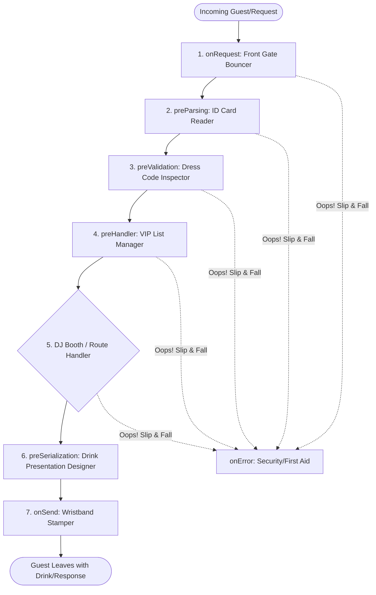

# 🚪 Middleware Architectures: The VIP Club of Web Requests

**Middleware** is a sequence of helper functions that run **in between** a raw incoming HTTP request and your actual route handler. 

To make this architecture unforgettable, let's use a **Nightclub VIP Lounge Analogy**:
* **The Guest (Request):** Someone trying to get into the exclusive VIP lounge.
* **The Bouncers (Middleware checkpoints):** Staff standing in a line at the entrance. Each bouncer inspects the guest, makes modifications (like giving a wristband), or kicks them out.
* **The VIP Lounge / DJ Booth (Route Handler):** The main attraction where the magic happens (e.g., generating short URLs).
* **The Party / Drinks (Response):** What the guest leaves the club with.

---

## 🎟️ The VIP Club Entry Pipeline (Fastify Lifecycle)

Fastify organizes its middleware checkpoints (called **hooks**) in a strict, sequential pipeline. Here is how a request moves from the front door to the dance floor:



---

## 🕵️ The Checkpoints in Detail

Here is what each bouncer is actually doing at every stage of the pipeline:

### 1. `onRequest` (The Front Gate Bouncer) 🚪
* **What it does:** The very first point of contact. The bouncer checks if the guest is even in the right line before they enter the building. The request body is **not parsed yet**.
* **Good for:** Quick logging (recording that a guest arrived) or basic IP blacklisting.

### 2. `preParsing` (The ID Reader) 🪪
* **What it does:** Scans your raw ID card and translates it into a digital format. Fastify reads the raw network stream and parses it into `request.body` (usually JSON).
* **Good for:** Modifying the raw body stream before parsing (e.g., handling custom decompression).

### 3. `preValidation` (The Dress Code Inspector) 👔
* **What it does:** Checks if what you're wearing matches the club's rules. This runs *after* parsing but *before* schema validation (e.g., checking if `url` is a valid string).
* **Good for:** Sanitizing input headers or modifying request parameters before validation starts.

### 4. `preHandler` (The VIP List Manager) 📋
* **What it does:** Checks if you have a valid invite or if you've tried to enter too many times. **This is where our Rate Limiter lives.**
* **Why it lives here:** By this point, the request is fully parsed and validated. We check if the guest's IP has exceeded the limit. If they have, we block them.
```typescript
app.post('/api/shorten', {
  preHandler: rateLimit({ name: 'shorten', windowSeconds: 60, limit: 10 })
}, shortenHandler);
```

### 5. `Route Handler` (The DJ Booth) 🎧
* **What it does:** The core business logic runs. The DJ spins the track, the bartender mixes the drink (e.g., saving the URL to Postgres and Redis).

### 6. `preSerialization` (The Drink Presentation Designer) 🍹
* **What it does:** Inspects the drink before handing it over, wrapping it in a clean glass, ensuring no internal secret ingredients are exposed.
* **Good for:** Filtering out sensitive fields (like database passwords or internal logs) from the response object before sending it to the client.

### 7. `onSend` (The Wristband Stamper) 🎟️
* **What it does:** The final step before the guest steps out. You can slip a flyer into their bag or stamp their hand.
* **Good for:** Appending headers (like `X-RateLimit-Remaining` or custom response headers) to the final outgoing response.

### 8. `onResponse` (The Log Book Recorder) 📊
* **What it does:** Runs *after* the response has been sent to the client. The bouncer writes down the exit time in the club's log ledger.
* **Good for:** Logging performance metrics (e.g., "Request took 15ms") and cleanup.

### 9. `onError` (Security / First Aid) 🚑
* **What it does:** If a guest slips and falls, spills a drink, or starts a fight anywhere in the chain, security/medical jumps in to hand them a clean towel and escort them out safely.
* **Good for:** Global error handling (preventing the server from crashing and returning a nice, clean `500 Internal Server Error`).

---

## 🚫 The Critical Concept: Short-Circuiting (No Entry!)

The power of middleware is that **any bouncer can reject a guest early**. 

For example, when a user hits their rate limit, our `preHandler` bouncer steps in, hands them a `429 Too Many Requests` flyer, and kicks them out:

```typescript
if (!result.allowed) {
  reply.header('Retry-After', result.retryAfterSeconds);
  return reply.status(429).send({ error: 'Too many requests, slow down.' });
}
```

By calling `reply.send()` inside the middleware, Fastify **short-circuits** the pipeline. The request never reaches the DJ Booth (Route Handler), saving server resources and database query time.

```
Request ──> [onRequest] ──> [preHandler (KICKED OUT! 429)] ──x (Never reaches Route Handler)
```

---

## 🥞 Composability: Stacking Bouncers

You can line up multiple bouncers one after another. If a guest passes the first, they face the second:

```typescript
app.post('/api/shorten', {
  preHandler: [
    rateLimit({ name: 'shorten', windowSeconds: 60, limit: 10 }), // 1st Check
    authenticateUser                                             // 2nd Check
  ]
}, shortenHandler);
```

> [!IMPORTANT]
> **Order matters!** Put cheap, fast checks first. We run the Rate Limiter (which checks Redis) before authentication (which might query the main Postgres database). No point running database queries for someone we are going to reject anyway.

---

## 🌍 Global vs. Per-Route Hooks

You can place bouncers in two different locations:

1. **Global Hooks (The Front Gate Bouncer):** Placed at the entrance of the whole club using `app.addHook(...)`. Every guest must pass them, no matter which room they want to go to.
   ```typescript
   app.addHook('onRequest', requestLogger); // Logs every single incoming request
   app.addHook('onError', errorHandler);    // Catches errors from all routes
   ```
2. **Per-Route Hooks (The VIP Room Guard):** Placed on specific VIP doors using the route options object.
   ```typescript
   app.post('/api/shorten', { preHandler: rateLimit(...) }, shortenHandler);
   ```

---

## 🧠 The Cheat Sheet

When deciding how to design middleware for a feature, ask these three questions:
1. **What stage should it run?** (Do you need the request body? If not, run it early at `onRequest` to save memory).
2. **Should it be Global or Per-Route?** (Does it apply to every request like logging, or specific routes like rate-limiting a specific action?).
3. **Can it short-circuit?** (Is it just logging info, or can it block/reject requests?).