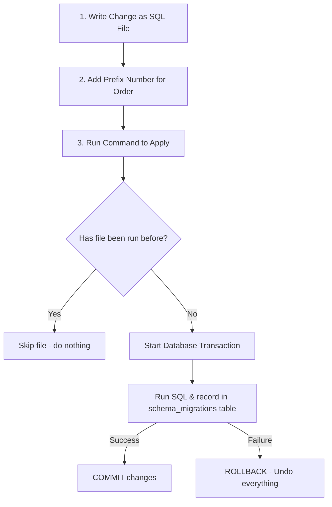

# 🚀 Database Migration Flows Made Simple

Imagine you are building a house. You don't just randomly change the blueprint, tear down walls, or add new rooms without planning—otherwise, the house might collapse! 

In software development, **database schema migrations** are the versioned blueprints for your database. A **Migration Flow** is the process of safely planning, applying, and tracking these blueprints over time as your application grows.

---

## 🗺️ The Migration Roadmap

Here is how a database change moves from your code all the way to a running database:



---

## 🛠️ The 5 Pillars of a Perfect Migration Flow

Here is a simple breakdown of the five rules of the migration flow you use in projects:

### 1. Write Code, Not Clicks ✍️
Never open a database tool (like pgAdmin or DBeaver) and manually click buttons to create/edit tables.
* **The Rule:** Every database change must live in a file in your Git repository.
* **Example:**
  ```sql
  -- src/db/migrations/0001_create_urls.sql
  CREATE TABLE urls (
    id SERIAL PRIMARY KEY,
    long_url TEXT NOT NULL,
    short_code VARCHAR(10) UNIQUE NOT NULL
  );
  ```

### 2. Numbers Count (Ordering) 🔢
* **The Rule:** Prefix files with a sequence (e.g., `0001_`, `0002_`).
* **Why?** Order is not optional! If migration `0002_add_analytics.sql` adds a column reference to the `urls` table, `0001_create_urls.sql` **must** run first. Sorting by filename prefix guarantees this order.

### 3. Keep a History Book 📖
How does the database know which migrations have already run? It keeps its own record!
* **The Rule:** The database creates a special metadata table when it starts:
  ```sql
  CREATE TABLE IF NOT EXISTS schema_migrations (
    filename TEXT PRIMARY KEY,
    applied_at TIMESTAMPTZ NOT NULL DEFAULT now()
  );
  ```
* **Why?** Every time a migration file runs successfully, its filename is saved here. This serves as the database's memory of its history.

### 4. Make it Safe to Re-run (Idempotence) 🔁
What happens if you run `npm run migrate` ten times in a row?
* **The Rule:** Your migration runner checks the history book before running any file.
  ```typescript
  if (applied.has(file)) {
    console.log(`skip (already applied): ${file}`);
    continue;
  }
  ```
* **Why?** It only applies what is **new**. This makes the flow completely safe to run repeatedly.

### 5. Fail Safely (All-or-Nothing) 🛡️
If a migration script has 3 changes, and step 2 fails, you don't want a half-done database!
* **The Rule:** Wrap your migrations in a Database Transaction.
  ```typescript
  await client.query('BEGIN'); // Start transaction
  // ... execute your SQL commands ...
  await client.query('COMMIT'); // Save changes
  
  // On error:
  await client.query('ROLLBACK'); // Undo everything!
  ```
* **Why?** If anything fails, it rolls back to exactly how it was before, preventing database corruption.

---

## 🌟 The Golden Rule of Database Migrations

> [!WARNING]
> **Never edit an old migration file once it has been applied!**
> 
> If you edit `0001_create_urls.sql` after it has already run, the database still has it marked as done in the `schema_migrations` table. It will skip it, and your database schema will drift out of sync with your repository code.
> 
> **How to fix mistakes:** Always create a *new* migration (e.g., `0002_fix_column.sql`) to alter or correct what was done before. Migrations only move forward!

---

## 💡 Why This Matters (The Big Picture)

* **Teamwork:** A new developer clones the repository, runs the migration command, and instantly gets a database identical to yours.
* **Automation:** Production releases run the exact same scripts automatically—no manual, error-prone commands needed.
* **Audit Trail:** Your migrations folder acts as a clear changelog showing how the database structure evolved over time.
