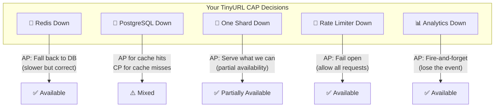

# 🌐 The Complete Guide to the CAP Theorem & Its Trade-offs

> *"You can have it fast, correct, or always-on. Pick two. That's not a limitation of your engineering — it's a law of physics. Information takes time to travel, and during that travel time, the universe forces you to choose."*

The CAP Theorem is the **most important concept in distributed systems design**. Every architecture decision you make — choosing between Redis and PostgreSQL, designing sharding strategies, handling network failures — is a CAP trade-off in disguise. This guide teaches you the theorem deeply, with real scenarios from your TinyURL project, so you can reason about trade-offs like a senior engineer.

---

## 📖 Table of Contents

1. [Chapter 1: What Is the CAP Theorem? — The Bank With Two Branches](#chapter-1-what-is-cap)
2. [Chapter 2: C, A, and P — Defined Precisely](#chapter-2-defined)
3. [Chapter 3: Why You Can't Have All Three](#chapter-3-why-not-all-three)
4. [Chapter 4: "P" Is Not Optional — The Real Choice](#chapter-4-p-not-optional)
5. [Chapter 5: CP Systems — "I'd Rather Be Right Than Fast"](#chapter-5-cp)
6. [Chapter 6: AP Systems — "I'd Rather Be Available Than Correct"](#chapter-6-ap)
7. [Chapter 7: Your TinyURL — Every CAP Decision Mapped](#chapter-7-your-tinyurl)
8. [Chapter 8: Consistency Models — The Spectrum Between C and A](#chapter-8-consistency-models)
9. [Chapter 9: The PACELC Extension — What Happens When There's NO Partition?](#chapter-9-pacelc)
10. [Chapter 10: Real-World Systems Classified](#chapter-10-real-world)
11. [Chapter 11: CAP in the System Design Interview](#chapter-11-interview)
12. [Chapter 12: Common Misconceptions — What CAP Does NOT Say](#chapter-12-misconceptions)
13. [Chapter 13: Beyond CAP — Modern Perspectives](#chapter-13-beyond-cap)
14. [Chapter 14: Quick Reference Cheat Sheet](#chapter-14-cheat-sheet)

---

<a id="chapter-1-what-is-cap"></a>
## 📕 Chapter 1: What Is the CAP Theorem? — The Bank With Two Branches

### 🏛️ The Two-Branch Bank Story

Imagine a bank with **two branches** on opposite sides of town. They share customer balances over a phone line.

```
  NORMAL STATE (phone line working):
  ┌──────────────────────────────────────────────────────────────────┐
  │                                                                  │
  │  ┌────────────┐         📞          ┌────────────┐              │
  │  │ Branch A   │ ◄──────────────────► │ Branch B   │              │
  │  │            │    Phone Line        │            │              │
  │  │ Balance:   │    (always synced)   │ Balance:   │              │
  │  │ $500       │                      │ $500       │              │
  │  └────────────┘                      └────────────┘              │
  │                                                                  │
  │  Customer deposits $100 at Branch A:                             │
  │  Branch A: $600 → tells Branch B via phone → Branch B: $600     │
  │  Both branches agree. Everyone is happy. ✅                      │
  │                                                                  │
  └──────────────────────────────────────────────────────────────────┘
```

One day, construction workers accidentally cut the phone line:

```
  PARTITIONED STATE (phone line CUT!):
  ┌──────────────────────────────────────────────────────────────────┐
  │                                                                  │
  │  ┌────────────┐        ✂️ 💀         ┌────────────┐              │
  │  │ Branch A   │ ◄─── BROKEN ────► │ Branch B   │              │
  │  │            │                      │            │              │
  │  │ Balance:   │    Can't sync!       │ Balance:   │              │
  │  │ $600       │                      │ $500       │              │
  │  └────────────┘                      └────────────┘              │
  │                                                                  │
  │  Customer deposited $100 at Branch A.                            │
  │  Branch B doesn't know about it!                                │
  │                                                                  │
  │  Now the customer's spouse walks into Branch B                  │
  │  and asks: "What's our balance?"                                 │
  │                                                                  │
  │  Branch B must CHOOSE:                                           │
  │                                                                  │
  └──────────────────────────────────────────────────────────────────┘
```

### The Two Choices

```
  CHOICE 1: CONSISTENCY (CP) — "I refuse to lie"
  ┌──────────────────────────────────────────────────────────────────┐
  │                                                                  │
  │  Branch B: "I'm sorry, our phone line to Branch A is down.     │
  │  I cannot guarantee this balance is correct. Please come back   │
  │  when the line is restored."                                    │
  │                                                                  │
  │  ✅ Correct: Never gives wrong information                      │
  │  ❌ Unavailable: Customer can't access their account!           │
  │                                                                  │
  └──────────────────────────────────────────────────────────────────┘

  CHOICE 2: AVAILABILITY (AP) — "I'll answer, but it might be stale"
  ┌──────────────────────────────────────────────────────────────────┐
  │                                                                  │
  │  Branch B: "Your balance is $500."                              │
  │  (The REAL balance is $600 because of the deposit at Branch A)  │
  │                                                                  │
  │  ✅ Available: Customer gets an answer immediately              │
  │  ❌ Inconsistent: The answer is WRONG ($500 instead of $600)   │
  │                                                                  │
  └──────────────────────────────────────────────────────────────────┘
```

**That's the CAP Theorem.** During a network partition, you must choose between consistency and availability. You cannot have both.

---

<a id="chapter-2-defined"></a>
## 📗 Chapter 2: C, A, and P — Defined Precisely

### The Three Properties

```
  ┌─────────────────────────────────────────────────────────────────────┐
  │                                                                     │
  │  C — CONSISTENCY                                                   │
  │  ─────────────────                                                 │
  │  Every read receives the MOST RECENT write or an error.            │
  │  All nodes see the same data at the same time.                     │
  │                                                                     │
  │  "If I write X=5, the very next read MUST return 5,               │
  │   no matter which server handles the read."                        │
  │                                                                     │
  │  Bank analogy: Both branches always show the same balance.         │
  │                                                                     │
  │  ──────────────────────────────────────────────────────────────     │
  │                                                                     │
  │  A — AVAILABILITY                                                  │
  │  ──────────────────                                                │
  │  Every request receives a (non-error) response,                    │
  │  without guarantee that it contains the most recent write.         │
  │                                                                     │
  │  "No matter what's happening, I will always answer.               │
  │   The answer might be slightly outdated, but I will NEVER          │
  │   hang, timeout, or return an error."                              │
  │                                                                     │
  │  Bank analogy: Both branches always serve customers.               │
  │                                                                     │
  │  ──────────────────────────────────────────────────────────────     │
  │                                                                     │
  │  P — PARTITION TOLERANCE                                           │
  │  ────────────────────────                                          │
  │  The system continues to operate despite arbitrary message         │
  │  loss or failure of part of the network.                           │
  │                                                                     │
  │  "Even if the network cable between my servers is cut,            │
  │   the system doesn't completely shut down."                        │
  │                                                                     │
  │  Bank analogy: Both branches stay open even when the phone        │
  │  line between them is broken.                                      │
  │                                                                     │
  └─────────────────────────────────────────────────────────────────────┘
```

### The Triangle Visualization

```
              Consistency (C)
                   /\
                  /  \
                 /    \
                / CP   \
               /  zone  \
              /          \
             /     CA     \
            /   (fantasy   \
           /    zone — only \
          /    possible on   \
         /    a single node)  \
        /________________________\
  Availability (A) ——— AP zone ——— Partition Tolerance (P)


  You can be IN one of the zones, but you can't be in all three:

  CP: Consistent + Partition-tolerant (but NOT always available)
  AP: Available + Partition-tolerant (but NOT always consistent)
  CA: Consistent + Available (but can't tolerate partitions — single server only!)
```

---

<a id="chapter-3-why-not-all-three"></a>
## 📘 Chapter 3: Why You Can't Have All Three

### The Proof by Contradiction

```
  Assume we CAN have C, A, and P simultaneously.

  Setup:
  - Server 1 and Server 2 replicate data
  - A network partition occurs (they can't communicate)

  ┌────────────┐        ✂️ PARTITION        ┌────────────┐
  │ Server 1   │ ◄──── CAN'T TALK ────► │ Server 2   │
  │            │                          │            │
  │ Data: X=5  │                          │ Data: X=5  │
  └────────────┘                          └────────────┘

  Step 1: Client writes X=10 to Server 1
  Server 1: X=10 ✅
  Server 2: X=5 (doesn't know about the write — partition!)

  Step 2: Another client reads X from Server 2

  IF Consistency: Server 2 must return X=10 (latest write)
    BUT Server 2 doesn't KNOW about X=10! The partition blocks it.
    To be consistent, Server 2 must REFUSE to answer. → NOT Available! ❌

  IF Availability: Server 2 must return an answer (no errors)
    The only value it has is X=5 (stale).
    It returns X=5. → NOT Consistent! ❌

  IF both C and A: Server 2 must return X=10 AND must answer.
    IMPOSSIBLE — it doesn't have X=10 and can't get it. 💀

  THEREFORE: During a partition, you CANNOT have both C and A. QED.
```

### The Speed-of-Light Problem

```
  "But can't we just sync faster?"

  NO. Here's why:

  Server 1 is in New York.
  Server 2 is in London.
  Distance: 5,500 km

  Speed of light: 300,000 km/s
  Minimum latency: 5,500 / 300,000 = ~18ms (one way)
  Round-trip: ~36ms

  During those 36ms, the servers are ALWAYS out of sync.
  Any write to New York takes AT LEAST 36ms to reach London.

  If a user in London reads during those 36ms,
  they see stale data. That's a consistency violation.

  The ONLY way to prevent this is to make London wait 36ms
  before answering. But that hurts availability (latency = partial unavailability).

  Physics enforces the trade-off. Not your code.
```

---

<a id="chapter-4-p-not-optional"></a>
## 📙 Chapter 4: "P" Is Not Optional — The Real Choice

### Partitions WILL Happen

```
  "Can I just choose CA and avoid partitions?"

  In theory: Yes, if everything runs on ONE single server.
  In practice: No, because:

  ┌─────────────────────────────────────────────────────────────────────┐
  │                                                                     │
  │  Partitions happen ALL THE TIME in the real world:                 │
  │                                                                     │
  │  🔌 Network cable gets unplugged accidentally                      │
  │  🔥 Switch/router reboots during firmware update                   │
  │  ☁️  Cloud provider has a brief network blip (happens weekly)       │
  │  🐛 DNS resolution fails temporarily                               │
  │  ⚡ Firewall rule change blocks traffic between services            │
  │  🔧 Docker network bridge restarts during container update         │
  │  💾 Redis connection drops for 2 seconds under heavy load          │
  │  🗄️  PostgreSQL shard becomes unreachable for 5 seconds            │
  │                                                                     │
  │  If your system talks to ANY external service (Redis, PostgreSQL,  │
  │  another API), you're distributed, and partitions can happen.      │
  │                                                                     │
  │  YOUR TINYURL talks to Redis AND PostgreSQL AND multiple shards.   │
  │  You are a distributed system. Partitions WILL happen.             │
  │                                                                     │
  └─────────────────────────────────────────────────────────────────────┘
```

### The REAL Question

```
  ┌─────────────────────────────────────────────────────────────────────┐
  │                                                                     │
  │  The CAP Theorem is NOT:                                           │
  │  "Pick two of three."                                              │
  │                                                                     │
  │  The CAP Theorem IS:                                               │
  │  "When a partition inevitably occurs, do you sacrifice             │
  │   Consistency or Availability?"                                    │
  │                                                                     │
  │  CP: "When the network breaks, I stop serving rather than          │
  │       give wrong answers."                                         │
  │                                                                     │
  │  AP: "When the network breaks, I keep serving even if some         │
  │       answers might be stale."                                     │
  │                                                                     │
  └─────────────────────────────────────────────────────────────────────┘
```

---

<a id="chapter-5-cp"></a>
## 📒 Chapter 5: CP Systems — "I'd Rather Be Right Than Fast"

### The Definition

> **CP (Consistent + Partition-Tolerant):** When a partition occurs, the system stops serving some or all requests to ensure that every response is correct.

### Real-World CP Examples

```
  ┌── BANKING SYSTEMS ─────────────────────────────────────────────────┐
  │                                                                     │
  │  You transfer $1000 from Checking to Savings.                      │
  │  The network between the two database replicas breaks.             │
  │                                                                     │
  │  CP behavior: "Transaction failed. Please try again later."       │
  │                                                                     │
  │  WHY: If the system showed $1000 in BOTH accounts (stale read),   │
  │  you'd think you have $2000. Then you'd spend money you don't have.│
  │  The bank would lose real money. CONSISTENCY IS NON-NEGOTIABLE.    │
  │                                                                     │
  └─────────────────────────────────────────────────────────────────────┘

  ┌── INVENTORY SYSTEMS ───────────────────────────────────────────────┐
  │                                                                     │
  │  Only 1 PS5 left in stock. Two users click "Buy" simultaneously.  │
  │  Network partition between the order service and inventory DB.     │
  │                                                                     │
  │  CP behavior: "Unable to process order. Please try again."        │
  │                                                                     │
  │  WHY: If both orders went through (AP), you'd sell 2 PS5s when    │
  │  you only have 1. Now you owe a customer a refund + apology.     │
  │                                                                     │
  └─────────────────────────────────────────────────────────────────────┘
```

### CP Technologies

```
  ┌────────────────────────────────────────────────────────────────┐
  │  TECHNOLOGY       │  CP BEHAVIOR                              │
  │───────────────────│───────────────────────────────────────────│
  │  PostgreSQL       │  Single primary. Writes blocked if        │
  │  (single node)    │  primary is unreachable.                  │
  │                   │                                           │
  │  MongoDB (default)│  Writes only go to primary. If primary   │
  │                   │  is partitioned, writes fail.             │
  │                   │                                           │
  │  ZooKeeper        │  Requires majority quorum to operate.    │
  │                   │  Minority partition goes offline.         │
  │                   │                                           │
  │  etcd             │  Raft consensus. Writes require majority.│
  │                   │  Sacrifices availability for consistency. │
  │                   │                                           │
  │  HBase            │  Strong consistency via single region     │
  │                   │  server per row range.                    │
  └────────────────────────────────────────────────────────────────┘
```

---

<a id="chapter-6-ap"></a>
## 📔 Chapter 6: AP Systems — "I'd Rather Be Available Than Correct"

### The Definition

> **AP (Available + Partition-Tolerant):** When a partition occurs, the system continues serving requests, even if some responses might contain stale data.

### Real-World AP Examples

```
  ┌── SOCIAL MEDIA FEED ──────────────────────────────────────────────┐
  │                                                                     │
  │  You post a photo on Instagram. Your friend in another country    │
  │  doesn't see it for 3 seconds (partition/replication lag).        │
  │                                                                     │
  │  AP behavior: Friend sees their feed immediately (without your    │
  │  new post). A few seconds later, your post appears.              │
  │                                                                     │
  │  WHY: Instagram would rather show a slightly stale feed than      │
  │  show a loading spinner or error page. Users tolerate a few      │
  │  seconds of lag. They DON'T tolerate a broken app.               │
  │                                                                     │
  └─────────────────────────────────────────────────────────────────────┘

  ┌── URL SHORTENER (YOUR TINYURL!) ───────────────────────────────────┐
  │                                                                     │
  │  User clicks short URL. Redis has the cached redirect.            │
  │  PostgreSQL is temporarily unreachable (partition).               │
  │                                                                     │
  │  AP behavior: Serve the redirect from Redis cache.                │
  │  The URL MIGHT have been deleted in PostgreSQL,                   │
  │  but we serve the cached version anyway.                          │
  │                                                                     │
  │  WHY: A URL shortener that shows "503 Error" when PostgreSQL      │
  │  hiccups would lose user trust instantly. A very rare stale       │
  │  redirect to a deleted URL is far less damaging than downtime.    │
  │                                                                     │
  └─────────────────────────────────────────────────────────────────────┘
```

### AP Technologies

```
  ┌────────────────────────────────────────────────────────────────┐
  │  TECHNOLOGY       │  AP BEHAVIOR                              │
  │───────────────────│───────────────────────────────────────────│
  │  Redis            │  Serves cached data even if source DB    │
  │                   │  is unreachable.                          │
  │                   │                                           │
  │  Cassandra        │  Multi-master. Any node can serve reads  │
  │                   │  and writes. Eventual consistency.        │
  │                   │                                           │
  │  DynamoDB         │  Eventually consistent reads by default. │
  │                   │  Always available across regions.         │
  │                   │                                           │
  │  CouchDB          │  Multi-master replication. Conflicts     │
  │                   │  resolved after partition heals.          │
  │                   │                                           │
  │  DNS              │  Caches records with TTL. Serves stale   │
  │                   │  records if authoritative server is down. │
  └────────────────────────────────────────────────────────────────┘
```

---

<a id="chapter-7-your-tinyurl"></a>
## 📚 Chapter 7: Your TinyURL — Every CAP Decision Mapped

Your TinyURL makes **multiple** CAP trade-offs, one for each component boundary:

### Decision 1: Redis Goes Down

```
  ┌── PARTITION: App ←✂️→ Redis ────────────────────────────────────┐
  │                                                                  │
  │  Your code (url_cache.js):                                      │
  │  ┌────────────────────────────────────────────────────────────┐ │
  │  │ try {                                                      │ │
  │  │     const val = await redis.get(KEY_PREFIX + shortKey);    │ │
  │  │     ...                                                    │ │
  │  │ } catch (err) {                                            │ │
  │  │     console.error('Redis down:', err.message);             │ │
  │  │     return null;  // ← CACHE MISS, fall back to DB        │ │
  │  │ }                                                          │ │
  │  └────────────────────────────────────────────────────────────┘ │
  │                                                                  │
  │  CHOICE: AP (Available + Partition-tolerant) ✅                  │
  │                                                                  │
  │  • Available: YES — request is served from PostgreSQL           │
  │  • Consistent: YES — PostgreSQL is the source of truth!        │
  │  • Penalty: Higher latency (~10ms instead of ~0.5ms)           │
  │                                                                  │
  │  This is the BEST CASE — you lose speed but NOT correctness.   │
  │  Redis is just a cache. PostgreSQL is the truth. ✅              │
  │                                                                  │
  └──────────────────────────────────────────────────────────────────┘
```

### Decision 2: PostgreSQL Goes Down, Redis Is Up

```
  ┌── PARTITION: App ←✂️→ PostgreSQL (Redis still up) ──────────────┐
  │                                                                  │
  │  Scenario: User clicks abc123. It's in the Redis cache.         │
  │  PostgreSQL is unreachable (partition).                          │
  │                                                                  │
  │  Your current behavior:                                          │
  │  getCachedUrl("abc123") → "google.com" (cache HIT!)             │
  │  → Redirect to google.com ✅                                     │
  │  → PostgreSQL is never contacted (cache served it)              │
  │                                                                  │
  │  CHOICE: AP ✅                                                    │
  │                                                                  │
  │  • Available: YES — redirect works!                             │
  │  • Consistent: MAYBE — what if the URL was deleted in DB        │
  │    during the partition? Cache still serves it (stale!).        │
  │  • Risk: Low. URLs rarely change. The stale window = TTL.      │
  │                                                                  │
  └──────────────────────────────────────────────────────────────────┘

  ┌── But what about a CACHE MISS during this partition? ──────────┐
  │                                                                  │
  │  getCachedUrl("xyz789") → null (cache MISS)                     │
  │  fetchData("xyz789") → PostgreSQL unreachable → ERROR! 💀       │
  │  → 500 Internal Server Error                                     │
  │                                                                  │
  │  CHOICE: CP (for cache misses)                                  │
  │                                                                  │
  │  • Consistent: YES — you don't serve stale/wrong data          │
  │  • Available: NO — user gets an error                           │
  │                                                                  │
  │  Your TinyURL is AP for cache hits, CP for cache misses.       │
  │  THE HIGHER YOUR CACHE HIT RATE, THE MORE "AP" YOU ARE.        │
  │  At 95% hit rate, you're 95% AP and 5% CP during a PG outage. │
  │                                                                  │
  └──────────────────────────────────────────────────────────────────┘
```

### Decision 3: One Database Shard Goes Down

```
  ┌── PARTITION: Shard 0 ←✂️→ App (Shard 1 still up) ──────────────┐
  │                                                                  │
  │  Your shard_router.js:                                          │
  │  getPool("abc123") → fnv1aHash("abc123") % 2 → Shard 0 💀     │
  │  getPool("def456") → fnv1aHash("def456") % 2 → Shard 1 ✅     │
  │                                                                  │
  │  CHOICE: AP (partial availability) ✅                            │
  │                                                                  │
  │  • URLs on Shard 1: Still work perfectly ✅                     │
  │  • URLs on Shard 0: Fail (if cache miss) ❌                    │
  │  • URLs on Shard 0: Work (if cached in Redis) ✅               │
  │                                                                  │
  │  You DON'T shut down the entire system because one shard is     │
  │  down. You serve what you can and fail only what you must.     │
  │  This is called PARTIAL AVAILABILITY — the pragmatic approach. │
  │                                                                  │
  └──────────────────────────────────────────────────────────────────┘
```

### Decision 4: Rate Limiter (Redis Down)

```
  ┌── PARTITION: Rate Limiter ←✂️→ Redis ──────────────────────────┐
  │                                                                  │
  │  Your rate_limiter.js:                                          │
  │  ┌──────────────────────────────────────────────────────────┐  │
  │  │ } catch (err) {                                          │  │
  │  │     console.error('Redis error, failing open:');         │  │
  │  │     return { allowed: true, ... };  // ← LET IT THROUGH │  │
  │  │ }                                                        │  │
  │  └──────────────────────────────────────────────────────────┘  │
  │                                                                  │
  │  CHOICE: AP — "Fail Open" ✅                                    │
  │                                                                  │
  │  • Available: YES — all requests are served                     │
  │  • Consistent: NO — rate limits aren't enforced                 │
  │  • Risk: Temporary abuse vulnerability during Redis outage     │
  │                                                                  │
  │  Alternative: CP — "Fail Closed"                                │
  │  return { allowed: false }                                      │
  │  → All requests blocked during Redis outage! ❌                 │
  │  → Safer against abuse, but ALL users are punished.             │
  │                                                                  │
  └──────────────────────────────────────────────────────────────────┘
```

### Decision 5: Analytics Stream (Redis Down)

```
  ┌── PARTITION: Click Producer ←✂️→ Redis Stream ─────────────────┐
  │                                                                  │
  │  Your click_producer.js:                                        │
  │  redis.xadd(...).catch((err) => { console.error(...); });      │
  │  // Fire-and-forget! No await!                                  │
  │                                                                  │
  │  CHOICE: AP ✅                                                    │
  │                                                                  │
  │  • Available: YES — redirect completes regardless               │
  │  • Consistent: NO — click event is LOST                         │
  │  • Risk: Analytics gap. Dashboard shows fewer clicks than real. │
  │                                                                  │
  │  WHY AP: Losing 1 click event is acceptable.                   │
  │  Slowing down EVERY redirect to guarantee analytics delivery   │
  │  would be catastrophic for user experience.                     │
  │                                                                  │
  └──────────────────────────────────────────────────────────────────┘
```

### The Complete CAP Map



---

<a id="chapter-8-consistency-models"></a>
## 📖 Chapter 8: Consistency Models — The Spectrum Between C and A

CAP's "Consistency" is binary (you have it or you don't). But in practice, consistency lives on a **spectrum**:

```
  STRONG                                                        WEAK
  CONSISTENCY ◄──────────────────────────────────────────► CONSISTENCY
  
  │           │              │                │              │
  Linearizable  Sequential    Causal          Eventual      Read-your-
  Consistency   Consistency   Consistency     Consistency    writes
  
  "Every read    "All ops     "Related events "Eventually    "You see YOUR
   sees the       in some      in correct      all nodes      own writes
   latest write   total        order, but      converge to    immediately,
   instantly"     order"       unrelated may   the same       others may
                               be out of       value"         not yet"
                               order"
```

### The Ones That Matter for Your TinyURL

```
  ┌── STRONG CONSISTENCY ─────────────────────────────────────────────┐
  │                                                                    │
  │  Your createShortURL() flow:                                      │
  │  1. INSERT into PostgreSQL (synchronous, awaited)                 │
  │  2. SET into Redis cache (synchronous, awaited)                   │
  │  3. Return shortKey to user                                       │
  │                                                                    │
  │  The user only sees the shortKey AFTER both writes succeed.       │
  │  If they immediately click the URL, it works.                     │
  │  This is READ-YOUR-WRITES consistency. ✅                          │
  │                                                                    │
  └────────────────────────────────────────────────────────────────────┘

  ┌── EVENTUAL CONSISTENCY ───────────────────────────────────────────┐
  │                                                                    │
  │  Your cache with TTL:                                             │
  │  If someone edits a URL in the database directly                  │
  │  (bypassing your app), the cache has stale data.                  │
  │  Eventually (within 24 hours / TTL), the cache expires           │
  │  and the fresh data loads.                                        │
  │                                                                    │
  │  The system is "eventually consistent" — it converges to the     │
  │  correct state over time, but there's a window of staleness.     │
  │                                                                    │
  └────────────────────────────────────────────────────────────────────┘
```

---

<a id="chapter-9-pacelc"></a>
## 📃 Chapter 9: The PACELC Extension — What Happens When There's NO Partition?

### CAP Only Covers Failure Scenarios

```
  CAP says: "During a partition, choose C or A."
  But what about the 99.99% of the time when there's NO partition?

  PACELC extends CAP:

  ┌─────────────────────────────────────────────────────────────────────┐
  │                                                                     │
  │  IF there's a Partition (P):                                       │
  │    Choose Availability (A) or Consistency (C)                      │
  │                                                                     │
  │  ELSE (E) when there's NO partition:                               │
  │    Choose Latency (L) or Consistency (C)                           │
  │                                                                     │
  │  P → A/C   +   E → L/C                                            │
  │  ├────────┤     ├────────┤                                         │
  │  During     During normal                                          │
  │  failures   operation                                              │
  │                                                                     │
  └─────────────────────────────────────────────────────────────────────┘
```

### Your TinyURL Under PACELC

```
  DURING PARTITION (P):
  Your TinyURL chooses A (Availability) over C
  → Serve from cache, fail open on rate limiter, partial shard availability

  ELSE (normal operation):
  Your TinyURL chooses L (Latency) over C
  → Read from Redis cache (~0.5ms) instead of always querying PostgreSQL (~10ms)
  → The cache MIGHT be stale, but it's FAST

  Your TinyURL is PA/EL:
  "During partitions: be Available. Otherwise: be Low-latency."

  This is the MOST COMMON choice for web applications. ✅
```

### PACELC Classification of Popular Systems

```
  ┌──────────────────────────────────────────────────────────────────┐
  │  SYSTEM           │ During Partition │ Normal Operation         │
  │───────────────────│─────────────────│──────────────────────────│
  │  Your TinyURL     │ PA (Available)  │ EL (Low-latency cache)  │
  │  DynamoDB         │ PA              │ EL                       │
  │  Cassandra        │ PA              │ EL                       │
  │  PostgreSQL       │ PC (Consistent) │ EC (Consistent reads)   │
  │  MongoDB (default)│ PC              │ EC                       │
  │  Redis (single)   │ PA              │ EL                       │
  │  ZooKeeper        │ PC              │ EC                       │
  │  Google Spanner   │ PC              │ EC (global consistency!) │
  └──────────────────────────────────────────────────────────────────┘
```

---

<a id="chapter-10-real-world"></a>
## 🌍 Chapter 10: Real-World Systems Classified

### Famous Systems and Their CAP Choices

```
  ┌─────────────────────────────────────────────────────────────────────┐
  │                                                                     │
  │  AP SYSTEMS (Availability over Consistency):                       │
  │  ──────────────────────────────────────────                        │
  │  📱 Instagram feed — shows slightly stale posts but never errors  │
  │  🛒 Amazon shopping cart — might show stale cart but never fails  │
  │  🔗 URL shorteners — serve cached redirects even during outages  │
  │  📧 Email — delivers eventually, never loses messages             │
  │  🌐 DNS — serves cached records, updates propagate slowly        │
  │  📺 Netflix — shows slightly stale catalog but never buffers     │
  │                                                                     │
  │  CP SYSTEMS (Consistency over Availability):                       │
  │  ──────────────────────────────────────────                        │
  │  🏦 Bank transfers — refuses transactions if data is uncertain   │
  │  📊 Stock trading — halts trading if price data is inconsistent  │
  │  🎫 Ticket booking — blocks double-booking even if it means      │
  │     showing "temporarily unavailable"                              │
  │  🔐 Password changes — won't let you log in with old password   │
  │     even if replication is lagging                                 │
  │  📦 Inventory management — blocks overselling                    │
  │                                                                     │
  └─────────────────────────────────────────────────────────────────────┘
```

### The Decision Heuristic

```
  Ask yourself: "What's worse?"

  ├── Showing wrong data is worse than being temporarily down?
  │   └── Choose CP (Consistency)
  │       Examples: banking, inventory, authentication
  │
  └── Being down is worse than showing slightly stale data?
      └── Choose AP (Availability)
          Examples: social media, URL shorteners, content sites
```

---

<a id="chapter-11-interview"></a>
## 🎤 Chapter 11: CAP in the System Design Interview

### How to Discuss CAP Like a Senior Engineer

```
  STEP 1: Identify that you're dealing with a distributed system
  ─────────────────────────────────────────────────────────────
  "This system involves multiple servers, databases, and caches.
   It's inherently distributed, which means the CAP theorem applies."

  STEP 2: Identify partition scenarios
  ──────────────────────────────────────
  "Let me think about what can break:
   - Cache layer could be unreachable
   - Database could go down
   - One shard could become partitioned
   - Network between services could have a blip"

  STEP 3: State your choice and WHY
  ──────────────────────────────────
  "For a URL shortener, I'd prioritize Availability (AP) because:
   - A redirect that's 1 hour stale is far less damaging than
     a '503 Service Unavailable' error.
   - Users share short links on social media — if the link doesn't
     work immediately, it might as well not exist.
   - We can use TTLs and cache invalidation to bound staleness."

  STEP 4: Show nuance (this is what impresses!)
  ─────────────────────────────────────────────
  "However, the choice isn't binary across the whole system:
   - URL creation: CP — we need write confirmation before returning
   - URL redirects: AP — serve from cache, fail gracefully
   - Analytics: AP — fire-and-forget, acceptable to lose 1 event
   - Rate limiting: AP — fail open, don't block all users

  Different components of the same system can make different
  CAP trade-offs based on their specific requirements."
```

> [!TIP]
> **The secret to acing CAP in interviews:** Don't say "my system is AP." Say "my redirect path is AP, my write path is CP, and my analytics pipeline is AP with at-least-once delivery." Component-level CAP reasoning is what separates senior from junior engineers.

---

<a id="chapter-12-misconceptions"></a>
## ⚠️ Chapter 12: Common Misconceptions — What CAP Does NOT Say

### Misconception 1: "Pick Two, Lose One Permanently"

```
  WRONG: "My system is AP, so it's NEVER consistent."

  RIGHT: CAP trade-offs only activate DURING a partition.
  When the network is healthy, you CAN have all three!
  
  Your TinyURL:
  Normal operation (99.99% of the time): C + A ✅
  During Redis outage (0.01% of the time): A wins, C degrades slightly
  
  You don't permanently sacrifice consistency.
  You sacrifice it ONLY during the brief partition window.
```

### Misconception 2: "CAP Means I Can't Have Consistency"

```
  WRONG: "URL shorteners are AP so we can't have consistent data."

  RIGHT: You have strong consistency for WRITES:
  createShortURL() awaits BOTH PostgreSQL INSERT and Redis SET.
  Read-your-writes consistency is guaranteed.

  You have eventual consistency for CACHE READS:
  If the DB changes externally, cache lags by up to TTL.
  But within YOUR application's write path, it's consistent.
```

### Misconception 3: "Latency = Unavailability"

```
  WRONG: "If my response takes 5 seconds, the system is unavailable."

  RIGHT: CAP's "Availability" means "every request gets a response."
  A slow response IS available (just slow).
  A timeout or error is NOT available.
  
  When Redis goes down:
  Your redirect goes from 0.5ms → 10ms (cache miss, DB query).
  That's AVAILABLE (just slower). Not unavailable. ✅
```

### Misconception 4: "I Should Choose CP Because Correctness Matters"

```
  WRONG: "Data correctness is always the most important thing."

  RIGHT: CONTEXT determines what matters.

  For a bank: Correctness > availability. A wrong balance = real money lost.
  For a URL shortener: Availability > strict consistency.
    A 1-hour stale redirect is fine. A 503 error is not.
  For a social feed: Availability > consistency.
    Showing a feed without the latest post is fine. A blank page is not.
```

---

<a id="chapter-13-beyond-cap"></a>
## 🔬 Chapter 13: Beyond CAP — Modern Perspectives

### Harvest and Yield (1999)

```
  An alternative way to think about CAP:

  HARVEST: How much of the complete, correct answer did you return?
  100% harvest = full, consistent answer
  80% harvest = partial answer (some data might be stale or missing)

  YIELD: How many requests got a response (vs failed)?
  100% yield = every request got answered
  80% yield = 20% of requests failed or timed out

  Your TinyURL:
  Normal: 100% harvest, 100% yield ← ideal
  Redis down: 100% harvest, 100% yield (just slower — DB is truth)
  PG shard down: 50% harvest (only URLs on healthy shard), ~95% yield
  Full PG down: 95% harvest (cached URLs), 100% yield for cache hits
```

### CRDTs — Conflict-Free Replicated Data Types

```
  CRDTs are data structures that allow multiple replicas to diverge
  during partitions and AUTOMATICALLY converge when the partition heals.
  No conflicts. No manual resolution.

  Example: A counter that always converges:
  Server A: counter = 5, adds 3 → counter = 8
  Server B: counter = 5, adds 2 → counter = 7
  Partition heals: merge(8, 7) → counter = 10 (5 + 3 + 2) ✅

  Used by: Redis CRDTs (Redis Enterprise), Riak, Phoenix LiveView
  
  CRDTs give you "AP with automatic convergence" — 
  the best of both worlds for specific data types.
```

---

<a id="chapter-14-cheat-sheet"></a>
## 📋 Chapter 14: Quick Reference Cheat Sheet

### CAP — The One-Page Summary

```
  ┌─────────────────────────────────────────────────────────────────────┐
  │                      THE CAP THEOREM                               │
  │                                                                     │
  │  C — Consistency:        Every read sees the latest write          │
  │  A — Availability:       Every request gets a response             │
  │  P — Partition Tolerance: System survives network failures         │
  │                                                                     │
  │  P is MANDATORY (networks always fail).                            │
  │  The REAL choice: During a partition, do you want C or A?         │
  │                                                                     │
  │  CP: Stop serving rather than give wrong answers.                  │
  │      (Banks, inventory, stock trading)                             │
  │                                                                     │
  │  AP: Keep serving even if answers might be stale.                  │
  │      (URL shorteners, social media, DNS, shopping carts)           │
  │                                                                     │
  └─────────────────────────────────────────────────────────────────────┘
```

### Your TinyURL's Complete CAP Decisions

| Component | Partition Scenario | Choice | Behavior | Risk |
|:--|:--|:--|:--|:--|
| **URL Cache** | Redis down | **AP** | Fall back to DB | 🟢 None (DB is truth) |
| **Redirect (hit)** | PG down, cache has it | **AP** | Serve from cache | 🟡 Possibly stale |
| **Redirect (miss)** | PG down, not cached | **CP** | Return error | 🟢 No stale data |
| **Shard failure** | One shard down | **AP** | Serve other shard | 🟡 Partial availability |
| **Rate limiter** | Redis down | **AP** | Fail open (allow all) | 🟠 Abuse window |
| **Analytics** | Redis Stream down | **AP** | Lose the event | 🟡 Data gap |
| **URL creation** | PG down | **CP** | Return error | 🟢 No phantom URLs |

### PACELC Quick Reference

```
  IF Partition → A or C?    ELSE (no partition) → L or C?

  PA/EL: Available during failures, low-latency normally (YOUR APP ✅)
  PA/EC: Available during failures, consistent normally
  PC/EL: Consistent during failures, low-latency normally
  PC/EC: Consistent always (PostgreSQL, MongoDB default)
```

### Interview Decision Flowchart

```
  "What happens if [component] goes down?"

  ├── Is wrong data DANGEROUS? (money, health, security)
  │   └── YES → CP: Stop and return error ❌
  │             "We cannot process this safely right now."
  │
  ├── Is slightly stale data ACCEPTABLE? (feeds, links, catalogs)
  │   └── YES → AP: Serve stale data ✅
  │             "Here's what we know. It might be slightly outdated."
  │
  └── Can you serve PARTIAL data? (some shards up, some down)
      └── YES → AP with partial availability ✅
                "These URLs work. Those don't. We'll fix it soon."
```

---

## 🎓 Final Mental Model

```
  The CAP Theorem is a WEATHER FORECAST for distributed systems:

  ☀️ SUNNY DAYS (no partition):
     Everything works perfectly. C + A + P. Everyone's happy.
     This is 99.99% of the time.

  🌧️ STORMY DAYS (partition occurs):
     You must choose: stay DRY (Consistent) or stay OUTSIDE (Available).
     You can't do both in the storm.

  Your engineering job is NOT to prevent storms (you can't).
  Your job is to decide: "When the storm hits, what do we sacrifice?"

  ┌──────────────────────────────────────────────────────────────────┐
  │                                                                  │
  │  For a bank:          Stay dry (CP). Close the outdoor café.    │
  │  For a URL shortener: Stay outside (AP). Get a little wet.     │
  │                                                                  │
  │  The system that KNOWS its trade-off is resilient.             │
  │  The system that IGNORES the trade-off will fail unpredictably. │
  │                                                                  │
  └──────────────────────────────────────────────────────────────────┘
```

> **CAP is not a limitation to work around. It's a design constraint to embrace. The best distributed systems don't try to beat CAP — they choose their trade-off consciously and design every component accordingly.**

---

*This guide is part of the TinyURL system design documentation. See also: [Functional vs Non-Functional Requirements](file:///c:/Users/TARUN/Desktop/TinyURL/docs/system_design/functional_vs_nonfunctional_requirements.md) · [Latency: RAM vs Disk](file:///c:/Users/TARUN/Desktop/TinyURL/docs/system_design/latency_ram_vs_disc.md) · [Cache Eviction](file:///c:/Users/TARUN/Desktop/TinyURL/docs/system_design/cache_eviction.md)*
