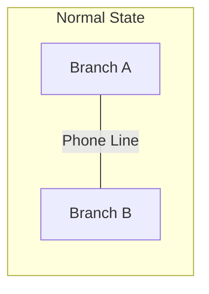
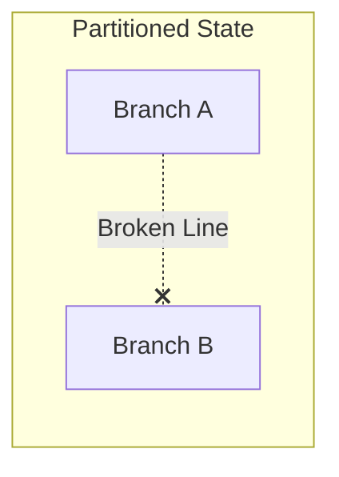
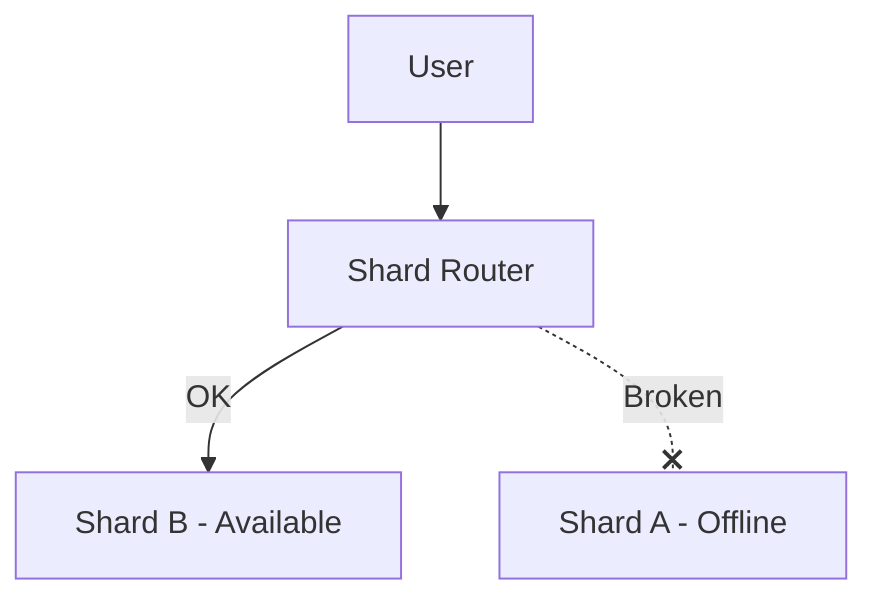

# 🌐 The CAP Theorem: The Immutable Rule of Distributed Systems

In any distributed system (where your app talks to separate servers like Redis, Postgres shards, or separate containers), you can only guarantee **two out of three** of these properties at the same time:

* **C — Consistency:** Every read gets the most recent write. No stale answers, ever.
* **A — Availability:** Every request gets a success response (no hangs, no 500 errors), even if parts of the system are broken.
* **P — Partition Tolerance:** The system keeps running even if the network link between servers breaks (a "partition").

---

## 🏛️ The Distributed Bank Analogy

Imagine a bank with **two branches** (Branch A and Branch B) that sync balances over a telephone line.



One day, construction workers accidentally cut the telephone line. **The branches can no longer talk to each other (this is a Network Partition — "P").**



Now, a customer deposits \$100 at Branch A. At the exact same second, their spouse walks into Branch B to check their balance. 

Since the phone line is cut, Branch B has two choices:

### Choice 1: Choose Consistency (CP) 🔒
Branch B says: *"The phone line is down, so I cannot confirm if your spouse made a deposit at Branch A. I refuse to answer you until the line is fixed."*
* **Outcome:** 100% Consistent, but **Unavailable** (errors/blocked requests).

### Choice 2: Choose Availability (AP) 🔓
Branch B says: *"I can't talk to Branch A, but I'll tell you your last known balance (\$500) anyway."*
* **Outcome:** 100% Available, but **Inconsistent** (the spouse's deposit is missing).

---

## 🗺️ The Reality: "P" is Not Optional!

In the real world, network cables fail, routers reboot, and cloud servers crash. **You cannot choose "CA".** Partitions *will* happen.

Therefore, the real choice of the CAP Theorem is:
> **"When a network partition occurs (P), do you choose Consistency (C) or Availability (A)?"**

---

## 🛠️ Applying CAP to TinyURL

Here is how these trade-offs look in our actual codebase:

### Case 1: Redis goes down (Low-Risk AP)
In `urlCache.js`, we wrap our Redis calls in a `try/catch` block:
```typescript
export async function getCachedUrl(shortKey: string): Promise<string | null> {
  try {
    return await redis.get(KEY_PREFIX + shortKey);
  } catch (err) {
    console.error('Redis down, falling back to Postgres:', err.message);
    return null; // Treat failure as a cache miss, not a crash!
  }
}
```
* **Our Choice:** **Availability (AP)**. If Redis fails, we silently fall back to Postgres instead of crashing the site.
* **Why it's low-risk:** Postgres is our source of truth. We temporarily lose the cache's speed, but we don't lose any correctness.

---

### Case 2: Postgres goes down, but Redis is up (High-Risk AP)
Imagine Postgres crashes, but the short URL `sale` is still cached in Redis:
* **Option AP (Choose Availability):** We serve the redirect from Redis anyway. 
  * *Trade-off:* The link might have been deleted in Postgres, but we don't know. We choose to redirect rather than throw a 500.
* **Option CP (Choose Consistency):** We throw a 500 error because we cannot verify the URL's current status with Postgres.

---

### Case 3: Database Sharding (Phase 4)
When we split Postgres into two separate database shards (Shard A and Shard B), a partition could take down Shard A while Shard B stays healthy:

* **Option AP (Choose Availability):** Keep serving redirects for URLs residing on Shard B. Only fail requests that specifically need Shard A. (This is what we use!)
* **Option CP (Choose Consistency):** Mark the entire application as down if *any* database shard fails, ensuring a completely uniform system state.

---

## 💡 Summary Comparison

| Choice | User Experience on Failure | Best Used For | Real Example |
| :--- | :--- | :--- | :--- |
| **AP** <br>*(Availability + Partition)* | **"It works, but might show older data."** | Systems where speed and uptime are critical. | URL shorteners, social media feeds, shopping carts. |
| **CP** <br>*(Consistency + Partition)* | **"The site is currently down for maintenance."** | Systems where incorrect data is unacceptable. | Bank transactions, stock markets, inventory counts. |