# 🗑️ Cache Eviction: Sizing and Purging Your Cache

Unlike your hard drive (which can grow to terabytes of cheap storage), RAM is finite, expensive, and limited. Since Redis stores all its data in RAM, it will eventually run out of space as new short URLs and rate limits are created. 

**Cache Eviction** is the automated ruleset Redis uses to decide: *when my memory is full and I need to save something new, what do I delete to make room?*

---

## 📂 The Desk Drawer Analogy

Imagine your desk has a single drawer that can hold exactly **10 folders** (`maxmemory` limit).

If the drawer is completely full, and a courier delivers an 11th folder:

| Eviction Policy | Action taken | Desk Analogy |
| :--- | :--- | :--- |
| **`noeviction`** | **Throw an error.** Refuse to accept the folder. | You scream at the courier and throw the folder back at them. |
| **`allkeys-random`** | **Delete a random file.** | You close your eyes, pull out a random folder, and shred it. |
| **`allkeys-lru`** | **Least Recently Used.** | You find the folder you haven't opened in the longest time and discard it. |
| **`allkeys-lfu`** | **Least Frequently Used.** | You look at the access logs. The folder opened only once in history gets shredded. |
| **`volatile-ttl`**| **Time-To-Live.** | You look only at folders stamped with an "expiration date" and throw out the one closest to expiring. |

---

## ⚔️ LRU vs. LFU: The Showdown

Let's look at a real scenario comparing **Least Recently Used (LRU)** vs. **Least Frequently Used (LFU)**:

* **URL A (The Viral Link):** Went viral 2 hours ago. Got **50,000 clicks** in 10 minutes, but hasn't been clicked since.
* **URL B (The Steady Link):** Gets exactly **1 click every 10 minutes** all day long. Its last click was 10 seconds ago.

```mermaid
gantt
    title URL Access Patterns
    dateFormat  HH:mm
    axisFormat %H:%M
    
    section URL A (Viral)
    50k clicks :active, 13:00, 13:10
    Idle (no access) : 13:10, 15:00
    
    section URL B (Steady)
    Clicks every 10m :active, 13:00, 15:00
```



* **If we use LRU (Recency matters):** Redis evicts **URL A** because it hasn't been accessed in 2 hours, even though it had 50k clicks.
* **If we use LFU (Frequency matters):** Redis evicts **URL B** because its total frequency count (12 clicks over 2 hours) is much lower than URL A's 50k clicks, even though B was clicked more recently.

> **Rule of thumb:** LRU is the industry default for most caches (recently clicked links are likely to be clicked again soon). LFU is best when you have evergreen content that gets steady, long-term traffic.

---

## 🛠️ Configuring Redis Eviction

By default, Redis has no memory limit. It will consume all system RAM and crash. To prevent this, configure a memory limit and policy in your `docker-compose.yml`:

```yaml
# infra/docker-compose.yml
redis:
  image: redis:7-alpine
  command: redis-server --maxmemory 256mb --maxmemory-policy allkeys-lru
  ports:
    - "6379:6379"
```

---

## 🧮 Sizing Your Cache (Back-of-the-Envelope Math)

How do you decide what `--maxmemory` size to use? Let's calculate:

1. **Size per item:** A cached redirect string (`short_key` + `original_url`) plus Redis metadata overhead is roughly **150 bytes**.
2. **Target capacity:** We want to store our top **1 million** active links.

$$\text{Required Memory} = 1,000,000 \text{ keys} \times 150 \text{ bytes/key} = 150,000,000 \text{ bytes} \approx 150 \text{ MB}$$

Adding some buffer for rate-limit keys and system overhead, setting `maxmemory` to **`256mb`** or **`512mb`** is a perfect size.

---

## 🔍 How to Monitor Eviction in Real Time

Run these commands in your Redis container to check memory limits, policies, and whether your cache is evicting keys:

```bash
# Connect to your Redis container
docker exec -it url-shortener-redis redis-cli

# Check your limits and policies
> CONFIG GET maxmemory
> CONFIG GET maxmemory-policy

# Check stats for evicted keys
> INFO stats
```

Look for the **`evicted_keys`** stat in the output. 
* If it is `0`, your memory is within limits.
* If it is **rapidly growing**, it means your cache is too small and is actively deleting useful keys to make room, which will slow down your app as database lookups increase!