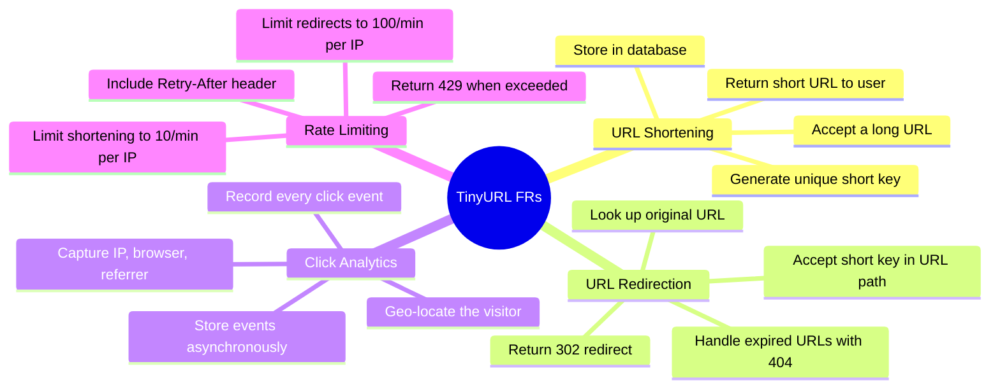
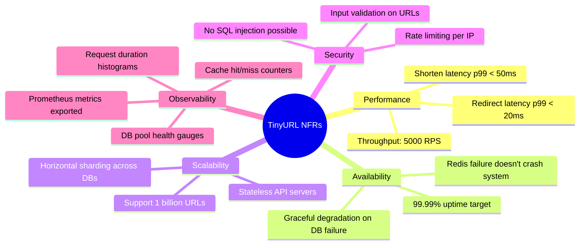

# 📋 The Complete Guide to Functional vs Non-Functional Requirements

> *"Functional requirements tell you WHAT to build. Non-functional requirements tell you HOW WELL it must work. Ignore the first, and you build the wrong thing. Ignore the second, and you build the right thing that nobody can use."*

This guide teaches you **everything** about requirements in system design — what they are, how they differ, how to define them precisely, and how every piece of your TinyURL project maps to a specific requirement. By the end, you'll be able to walk into any system design interview or planning session and decompose a problem like a senior engineer.

---

## 📖 Table of Contents

1. [Chapter 1: The Restaurant Analogy — The Big Picture](#chapter-1-the-restaurant)
2. [Chapter 2: Functional Requirements — "What Does It Do?"](#chapter-2-functional)
3. [Chapter 3: Non-Functional Requirements — "How Well Does It Do It?"](#chapter-3-non-functional)
4. [Chapter 4: Your TinyURL Requirements — The Complete Spec](#chapter-4-your-tinyurl)
5. [Chapter 5: Latency — The Speed Requirement (p50, p95, p99)](#chapter-5-latency)
6. [Chapter 6: Availability — The Uptime Requirement (99.9% vs 99.99%)](#chapter-6-availability)
7. [Chapter 7: Throughput — The Capacity Requirement (RPS)](#chapter-7-throughput)
8. [Chapter 8: Scalability — The Growth Requirement](#chapter-8-scalability)
9. [Chapter 9: Durability & Consistency — The Data Integrity Requirements](#chapter-9-durability)
10. [Chapter 10: Security — The Trust Requirement](#chapter-10-security)
11. [Chapter 11: How FRs Drive NFRs (The Cause-and-Effect Chain)](#chapter-11-cause-and-effect)
12. [Chapter 12: How Your TinyURL Code Implements Each Requirement](#chapter-12-code-mapping)
13. [Chapter 13: The System Design Interview Framework](#chapter-13-interview)
14. [Chapter 14: Quick Reference Cheat Sheet](#chapter-14-cheat-sheet)

---

<a id="chapter-1-the-restaurant"></a>
## 📕 Chapter 1: The Restaurant Analogy — The Big Picture

### 🍽️ Imagine You're Opening a Restaurant

You need two kinds of decisions:

```
  FUNCTIONAL REQUIREMENTS                NON-FUNCTIONAL REQUIREMENTS
  (WHAT the restaurant does)             (HOW WELL it does it)
  ─────────────────────────              ──────────────────────────

  ✅ Serve pasta                         ⚡ Serve within 15 minutes
  ✅ Serve pizza                         📊 Handle 200 customers/night
  ✅ Take reservations                   🏗️ Expand to 3 locations by 2027
  ✅ Accept credit cards                 🔒 Never leak credit card data
  ✅ Deliver food to homes               🕐 Open 99.9% of scheduled hours
  ✅ Show a menu                         🧹 Pass health inspection every time
```

**Without FRs:** You build a beautiful restaurant that serves... nothing. No menu, no kitchen, no waiters. A gorgeous empty building.

**Without NFRs:** You build a restaurant that technically serves food, but it takes 3 hours, seats 5 people, and gives everyone food poisoning. Technically works!

### The Key Insight

```
  ┌─────────────────────────────────────────────────────────────────────┐
  │                                                                     │
  │  Functional Requirements  = CAN the system do X?     (Yes/No)      │
  │  Non-Functional Requirements = HOW WELL does it do X? (Measurable) │
  │                                                                     │
  │  FR: "Can users shorten a URL?"         → Yes ✅ or No ❌          │
  │  NFR: "How fast is the shortening?"     → p99 < 50ms 📊           │
  │                                                                     │
  │  FRs are binary (works or doesn't).                                 │
  │  NFRs are on a spectrum (faster, slower, more available, etc.)     │
  │                                                                     │
  └─────────────────────────────────────────────────────────────────────┘
```

---

<a id="chapter-2-functional"></a>
## 📗 Chapter 2: Functional Requirements — "What Does It Do?"

### The Definition

> **A Functional Requirement (FR) describes a specific behavior or function of the system. It answers: "What should the system DO when the user does X?"**

FRs are defined as **input → output** pairs:

```
  IF the user does THIS...          THEN the system does THAT.

  IF user submits a long URL    →   System returns a short URL
  IF user visits a short URL    →   System redirects to the original
  IF user visits expired URL    →   System returns 404 Not Found
  IF user exceeds rate limit    →   System returns 429 Too Many Requests
```

### Characteristics of Good Functional Requirements

| Property | Good FR | Bad FR |
|:--|:--|:--|
| **Specific** | "System returns a 7-character Base62 short key" | "System makes URLs shorter" |
| **Testable** | "POST /api/shorten returns 200 with shortKey field" | "The shortening should work well" |
| **Unambiguous** | "GET /:shortKey returns 302 with Location header" | "System redirects users somehow" |
| **Complete** | "Expired URLs return 404. Missing URLs return 404." | "System handles errors" |

### The Functional Requirement Template

For every FR, write it in this format:

```
  ┌────────────────────────────────────────────────────────────────────┐
  │  FR-[number]: [Short Title]                                       │
  │                                                                    │
  │  Actor:    Who triggers this? (User, System, Admin, Cron Job)     │
  │  Trigger:  What action starts it? (HTTP request, timer, event)    │
  │  Input:    What data goes in?                                      │
  │  Process:  What happens internally?                                │
  │  Output:   What comes back?                                        │
  │  Errors:   What can go wrong?                                      │
  └────────────────────────────────────────────────────────────────────┘
```

### Example: TinyURL Shorten Requirement

```
  ┌────────────────────────────────────────────────────────────────────┐
  │  FR-1: URL Shortening                                             │
  │                                                                    │
  │  Actor:    End user (via API client, browser, or curl)            │
  │  Trigger:  POST /api/shorten                                      │
  │  Input:    { "originalUrl": "https://example.com/very/long/path" }│
  │  Process:  1. Generate Snowflake ID                                │
  │            2. Encode to Base62 short key                           │
  │            3. Store in PostgreSQL (sharded)                        │
  │            4. Cache in Redis                                       │
  │  Output:   { "shortKey": "2HhH9fK", "shortUrl": "http://..." }   │
  │  Errors:   400 if originalUrl missing or invalid                  │
  │            429 if rate limit exceeded                              │
  │            500 if database is unreachable                          │
  └────────────────────────────────────────────────────────────────────┘
```

---

<a id="chapter-3-non-functional"></a>
## 📘 Chapter 3: Non-Functional Requirements — "How Well Does It Do It?"

### The Definition

> **A Non-Functional Requirement (NFR) describes a quality attribute of the system. It answers: "How fast, reliable, safe, and scalable must the system be?"**

NFRs are defined as **measurable thresholds**:

```
  The system must be THIS [quality] at a level of THIS [number].

  The system must be FAST at a level of p99 < 20ms
  The system must be AVAILABLE at a level of 99.99% uptime
  The system must HANDLE at a level of 10,000 requests/second
  The system must PROTECT at a level of zero data breaches
```

### The Critical Difference: FRs Are Binary, NFRs Are Spectrums

```
  FUNCTIONAL:
  ───────────
  "Can users shorten URLs?"

  ❌ No     ─────────────────────────────────── ✅ Yes
             (nothing in between — it works or it doesn't)


  NON-FUNCTIONAL:
  ────────────────
  "How fast is the shortening?"

  🐌 5 sec ──── 500ms ──── 100ms ──── 20ms ──── 1ms ⚡
             (infinite points on the spectrum)
             
  Every point costs more money, effort, and complexity.
  You CHOOSE where on the spectrum you need to be.
```

### The NFR Categories

```
  ┌─────────────────────────────────────────────────────────────────────┐
  │                NON-FUNCTIONAL REQUIREMENT CATEGORIES               │
  │                                                                     │
  │  ⚡ PERFORMANCE                                                     │
  │     ├── Latency (how fast?)                                        │
  │     ├── Throughput (how many requests per second?)                  │
  │     └── Response time percentiles (p50, p95, p99)                  │
  │                                                                     │
  │  🟢 RELIABILITY                                                     │
  │     ├── Availability (what % of time is the system up?)            │
  │     ├── Durability (will stored data survive failures?)            │
  │     └── Fault tolerance (does one failure crash everything?)       │
  │                                                                     │
  │  📈 SCALABILITY                                                     │
  │     ├── Horizontal scaling (can we add more servers?)              │
  │     ├── Data growth (can we handle 1B URLs?)                       │
  │     └── Traffic spikes (can we handle 10x normal load?)            │
  │                                                                     │
  │  🔒 SECURITY                                                       │
  │     ├── Authentication (who is the user?)                          │
  │     ├── Authorization (what can they do?)                          │
  │     ├── Rate limiting (how do we prevent abuse?)                   │
  │     └── Data encryption (is data safe in transit/at rest?)         │
  │                                                                     │
  │  🔧 MAINTAINABILITY                                                 │
  │     ├── Observability (can we see what's happening?)               │
  │     ├── Deployability (can we ship changes safely?)                │
  │     └── Testability (can we verify correctness?)                   │
  │                                                                     │
  │  📏 CONSISTENCY                                                     │
  │     ├── Strong consistency (reads always see latest write?)        │
  │     └── Eventual consistency (reads may be slightly stale?)        │
  │                                                                     │
  └─────────────────────────────────────────────────────────────────────┘
```

---

<a id="chapter-4-your-tinyurl"></a>
## 📙 Chapter 4: Your TinyURL Requirements — The Complete Spec

Here's the complete requirements document for your TinyURL project, organized into FRs and NFRs:

### Functional Requirements



### Non-Functional Requirements



### The Complete FR Table

| ID | Requirement | Input | Output | Your Implementation |
|:--|:--|:--|:--|:--|
| **FR-1** | Shorten a URL | `POST /api/shorten` with `{ originalUrl }` | `{ shortKey, shortUrl }` | [`shorten.service.js`](file:///c:/Users/TARUN/Desktop/TinyURL/src/modules/shorten/shorten.service.js) |
| **FR-2** | Redirect via short key | `GET /:shortKey` | `302` with `Location` header | [`redirect.controller.js`](file:///c:/Users/TARUN/Desktop/TinyURL/src/modules/redirect/redirect.controller.js) |
| **FR-3** | Handle expired URLs | `GET /:shortKey` (expired) | `404 Not Found` | `expires_at > now()` check in [`redirect.service.js`](file:///c:/Users/TARUN/Desktop/TinyURL/src/modules/redirect/redirect.service.js) |
| **FR-4** | Handle missing URLs | `GET /:shortKey` (doesn't exist) | `404 Not Found` | `if (!originalUrl)` check in controller |
| **FR-5** | Track click analytics | (async, after redirect) | Click event → Redis Stream → Worker → DB | [`click_producer.js`](file:///c:/Users/TARUN/Desktop/TinyURL/src/queue/click_producer.js) |
| **FR-6** | Rate limit requests | Every request | `429` if limit exceeded | [`ratelimit.middleware.js`](file:///c:/Users/TARUN/Desktop/TinyURL/src/middleware/ratelimit.middleware.js) |
| **FR-7** | Expose health metrics | `GET /metrics` | Prometheus text format | [`metrics.js`](file:///c:/Users/TARUN/Desktop/TinyURL/src/observability/metrics.js) |

### The Complete NFR Table

| ID | Category | Requirement | Target | How You Achieve It |
|:--|:--|:--|:--|:--|
| **NFR-1** | Latency | Redirect response time | p99 < 20ms | Redis cache → single-flight → DB fallback |
| **NFR-2** | Latency | Shorten response time | p99 < 50ms | Snowflake ID (no DB round-trip for ID), sharded writes |
| **NFR-3** | Throughput | Sustained request rate | 5,000 RPS | Fastify (not Express), connection pooling, Redis caching |
| **NFR-4** | Availability | System uptime | 99.99% | Graceful error handling, pool error events, cache fallback |
| **NFR-5** | Scalability | Total URLs supported | 1 billion+ | Database sharding (2+ shards), Snowflake IDs |
| **NFR-6** | Scalability | Horizontal scaling | N app instances | Stateless API, machine-specific Snowflake MACHINE_ID |
| **NFR-7** | Durability | No URL data loss | 100% writes persisted | PostgreSQL with WAL, INSERT confirmed before response |
| **NFR-8** | Security | Abuse prevention | Rate limiting per IP | Redis-based sliding window rate limiter |
| **NFR-9** | Observability | Real-time monitoring | Prometheus + Grafana | Counters, histograms, gauges exported at `/metrics` |
| **NFR-10** | Consistency | Read-after-write | Immediate for shortener | Write to DB + cache simultaneously in `createShortURL()` |

---

<a id="chapter-5-latency"></a>
## 📒 Chapter 5: Latency — The Speed Requirement (p50, p95, p99)

### ⏱️ What Is Latency?

Latency is the time between a request arriving at your server and the response leaving.

```
  User clicks link ──▶ [    LATENCY    ] ──▶ User sees the page
                       ◀── this gap ──▶
```

### Why Averages Lie — The Percentile Story

Imagine 100 requests to your API:

```
  99 requests: 5ms each     ← Fast! Great! ⚡
   1 request:  5,000ms      ← Five SECONDS! 🐌

  Average latency = (99 × 5 + 1 × 5000) / 100 = 54.5ms

  That looks fine! But 1 user waited 5 SECONDS.
  The average HIDES the pain.
```

This is why we use **percentiles**:

```
  ┌────────────────────────────────────────────────────────────────────┐
  │                    PERCENTILE EXPLAINED                           │
  │                                                                    │
  │  Imagine sorting ALL your response times from fastest to slowest: │
  │                                                                    │
  │  Fastest ───────────────────────────────────────────── Slowest    │
  │  1ms 2ms 3ms 4ms 5ms 5ms 5ms 5ms ... 5ms 50ms 500ms 5000ms     │
  │  ▲                        ▲               ▲          ▲           │
  │  │                        │               │          │           │
  │  p0                      p50             p95        p99          │
  │  (fastest)           (median)        (95th %)   (99th %)        │
  │                                                                    │
  │  p50 = 5ms    → "Half of requests are faster than 5ms"           │
  │  p95 = 50ms   → "95% of requests are faster than 50ms"          │
  │  p99 = 500ms  → "99% of requests are faster than 500ms"         │
  │  p99.9 = 5s   → "Only 1 in 1000 requests is slower than 5s"    │
  │                                                                    │
  └────────────────────────────────────────────────────────────────────┘
```

### Why p99 Matters More Than p50

```
  At 10,000 requests/second (your target RPS):

  p50 = 5ms means:
  5,000 requests per second are faster than 5ms
  5,000 requests per second are SLOWER than 5ms
  → Half your users might be having a bad time!

  p99 = 20ms means:
  9,900 requests per second are faster than 20ms
  Only 100 requests per second are slower
  → 99% of users are happy! ✅

  p99.9 = 100ms means:
  Only 10 requests per second are slower than 100ms
  → Even the unluckiest users have an okay time
```

### Your TinyURL Latency Budget

Where does the time go in a redirect? Let's budget it:

```
  TARGET: p99 redirect latency < 20ms

  ┌── Latency Budget Breakdown ──────────────────────────────────────┐
  │                                                                   │
  │  Step                        │ Time    │ Cumulative │ Notes      │
  │──────────────────────────────│─────────│────────────│────────────│
  │  Fastify request parsing     │ 0.1ms   │ 0.1ms      │ Very fast │
  │  Rate limit check (Redis)    │ 0.5ms   │ 0.6ms      │ Local net │
  │  Cache lookup (Redis)        │ 0.5ms   │ 1.1ms      │ Cache HIT │
  │  Send 302 response           │ 0.1ms   │ 1.2ms      │ Tiny resp │
  │                              │         │            │           │
  │  TOTAL (cache hit):          │         │ ~1.2ms  ⚡ │ WELL      │
  │                              │         │            │ UNDER 20ms│
  │──────────────────────────────│─────────│────────────│───────────│
  │  Cache MISS adds:            │         │            │           │
  │  Single-flight dedup         │ 0.1ms   │ 1.3ms      │           │
  │  PostgreSQL query            │ 3-15ms  │ 4-16ms     │ With index│
  │  Cache write (Redis SET)     │ 0.5ms   │ 5-17ms     │           │
  │                              │         │            │           │
  │  TOTAL (cache miss):         │         │ ~5-17ms    │ STILL     │
  │                              │         │            │ UNDER 20ms│
  └───────────────────────────────────────────────────────────────────┘
```

### How Your Code Measures Latency

Your [`metrics.js`](file:///c:/Users/TARUN/Desktop/TinyURL/src/observability/metrics.js) defines a histogram:

```javascript
export const httpRequestDurationHistogram = new client.Histogram({
    name: 'http_request_duration_seconds',
    help: 'HTTP request duration in seconds',
    buckets: [0.001, 0.005, 0.01, 0.025, 0.05, 0.1, 0.25, 0.5, 1, 2.5, 5],
    //        1ms    5ms    10ms   25ms   50ms  100ms 250ms 500ms 1s  2.5s  5s
});
```

And your K6 load test in [`k6_stress_test.js`](file:///c:/Users/TARUN/Desktop/TinyURL/tests/load/k6_stress_test.js) sets a threshold:

```javascript
thresholds: {
    http_req_duration: ['p(95)<300'],  // 95% of requests under 300ms at 500 VUs
},
```

> [!NOTE]
> The K6 threshold of p95 < 300ms is measured **end-to-end** from the test client, including network latency between K6 and your server. The internal server latency (what your Prometheus histogram measures) will be much lower — likely p99 < 20ms for cached redirects.

---

<a id="chapter-6-availability"></a>
## 📔 Chapter 6: Availability — The Uptime Requirement (99.9% vs 99.99%)

### 🟢 What Is Availability?

Availability is the percentage of time your system is operational and serving requests correctly.

```
  Availability = Uptime / (Uptime + Downtime)
```

### The Nines — What Each Level Really Means

This is the most famous table in system design:

```
  ┌────────────────────────────────────────────────────────────────────┐
  │  AVAILABILITY  │  UPTIME       │  ALLOWED DOWNTIME PER YEAR       │
  │────────────────│───────────────│──────────────────────────────────│
  │  99%           │  "Two nines"  │  3 days, 15 hours, 36 minutes   │
  │  99.9%         │  "Three nines"│  8 hours, 45 minutes            │
  │  99.95%        │  "Three and   │  4 hours, 22 minutes            │
  │                │   a half"     │                                  │
  │  99.99%        │  "Four nines" │  52 minutes, 35 seconds         │
  │  99.999%       │  "Five nines" │  5 minutes, 15 seconds          │
  │  99.9999%      │  "Six nines"  │  31.5 seconds (!!!)             │
  └────────────────────────────────────────────────────────────────────┘
```

### Let's Put This in Human Terms

```
  99% availability:
  "Our URL shortener can be DOWN for 3.5 days per year."
  → That's a long weekend of outage. Users will find alternatives. ❌

  99.9% availability:
  "Our URL shortener can be DOWN for 8 hours, 45 minutes per year."
  → That's one bad day per year. Acceptable for most startups. ✅

  99.99% availability:
  "Our URL shortener can be DOWN for 52 minutes per year."
  → Less than 1 hour per year! This is enterprise-grade. ✅✅

  99.999% availability:
  "Our URL shortener can be DOWN for 5 minutes per year."
  → This is NASA/banking level. Extremely expensive to achieve. 💰💰💰
```

### The Exponential Cost of Each Nine

```
  ┌────────────────────────────────────────────────────────────────────┐
  │                                                                    │
  │  Availability     Engineering Effort        Approximate Cost      │
  │  ────────────     ──────────────────        ─────────────────     │
  │  99%              Basic server, single DB    $                     │
  │  99.9%            Load balancer, replicas    $$                    │
  │  99.99%           Multi-region, auto-failover $$$$$                │
  │  99.999%          Active-active, chaos eng.  $$$$$$$$$$            │
  │                                                                    │
  │  Each additional "9" roughly 10x the cost and complexity!         │
  │                                                                    │
  └────────────────────────────────────────────────────────────────────┘
```

### How Your TinyURL Achieves High Availability

```
  ┌── Failure Point ──────────┬── What Happens? ──────────────────────┐
  │                           │                                       │
  │  Redis goes down          │  Cache misses → falls back to DB     │
  │                           │  Slower but STILL WORKS ✅            │
  │                           │                                       │
  │  One DB shard goes down   │  URLs on that shard return errors     │
  │                           │  Other shard still works (partial) ⚠️ │
  │                           │                                       │
  │  API server crashes       │  Restart via process manager          │
  │                           │  Stateless → new instance is instant  │
  │                           │                                       │
  │  Connection pool exhausted│  connectionTimeoutMillis fires        │
  │                           │  Returns 500 → doesn't crash ✅      │
  │                           │                                       │
  │  Idle DB connection drops │  pool.on('error') handles it          │
  │                           │  Pool auto-creates replacement ✅     │
  │                           │                                       │
  └───────────────────────────┴───────────────────────────────────────┘
```

---

<a id="chapter-7-throughput"></a>
## 📚 Chapter 7: Throughput — The Capacity Requirement (RPS)

### 📊 What Is Throughput?

Throughput is the number of requests your system can handle per second (RPS).

```
  Think of throughput as a HIGHWAY:

  Latency  = How fast each car drives (speed limit)
  Throughput = How many cars can pass per hour (lane capacity)

  A highway can have:
  • Low latency + low throughput  = 1-lane road, 200mph speed limit
  • High latency + high throughput = 8-lane road, 30mph speed limit
  • Low latency + high throughput = 8-lane autobahn ← THE GOAL! ⚡
```

### Estimating Your TinyURL Throughput Needs

```
  ┌── Back-of-Envelope Calculation ─────────────────────────────────┐
  │                                                                  │
  │  Assumption: TinyURL serves 100 million redirects per day       │
  │                                                                  │
  │  Reads (redirects):                                              │
  │  100,000,000 redirects / 86,400 seconds = ~1,157 RPS average   │
  │  Peak (10x average) = ~11,570 RPS                               │
  │  Round up target: 10,000 - 15,000 RPS                           │
  │                                                                  │
  │  Writes (shortening):                                            │
  │  Read:Write ratio for URL shorteners ≈ 100:1                    │
  │  1,000,000 new URLs / 86,400 seconds = ~12 RPS average         │
  │  Peak: ~120 RPS                                                  │
  │                                                                  │
  │  The system is READ-HEAVY. Optimize for reads! (caching!)       │
  │                                                                  │
  └──────────────────────────────────────────────────────────────────┘
```

### How Your Load Test Validates Throughput

Your [`k6_stress_test.js`](file:///c:/Users/TARUN/Desktop/TinyURL/tests/load/k6_stress_test.js) ramps up to 500 virtual users:

```javascript
stages: [
    { duration: '10s', target: 50 },   // Warm-up
    { duration: '30s', target: 500 },  // Ramp to peak
    { duration: '30s', target: 500 },  // Sustain peak
    { duration: '10s', target: 0 },    // Cool-down
],
```

With 500 VUs and minimal sleep, this generates roughly **3,000-5,000 RPS** — validating your throughput target.

### The Traffic Mix Matters

Your K6 test simulates realistic traffic patterns:

```
  ┌─────────────────────────────────────────────────────────────────┐
  │                    TRAFFIC DISTRIBUTION                        │
  │                                                                 │
  │  ██████████████████████████████████████████████████ 90%  Redirect│
  │  █████ 5%  Shorten (new URL creation)                          │
  │  █████ 5%  Cold/404 (non-existent keys)                        │
  │                                                                 │
  │  This mirrors real-world URL shortener traffic:                │
  │  • Most requests are redirects (reading)                       │
  │  • Few requests are shortening (writing)                       │
  │  • Some requests are for URLs that don't exist                 │
  └─────────────────────────────────────────────────────────────────┘
```

---

<a id="chapter-8-scalability"></a>
## 📖 Chapter 8: Scalability — The Growth Requirement

### 📈 Vertical vs Horizontal Scaling

```
  VERTICAL SCALING (Scale UP):            HORIZONTAL SCALING (Scale OUT):
  Buy a BIGGER server.                    Buy MORE servers.

  Before:  ┌─────┐                        Before:  ┌─────┐
           │ 4GB │                                  │ 4GB │
           │ 2CPU│                                  │ 2CPU│
           └─────┘                                  └─────┘

  After:   ┌──────────┐                   After:   ┌─────┐ ┌─────┐ ┌─────┐
           │ 128GB    │                            │ 4GB │ │ 4GB │ │ 4GB │
           │ 64CPU    │                            │ 2CPU│ │ 2CPU│ │ 2CPU│
           └──────────┘                            └─────┘ └─────┘ └─────┘

  Limit:   There's a max server size!     Limit:   Infinite (add more!)
  Cost:    Exponential 💰💰💰              Cost:    Linear 💰
```

### How Your TinyURL Scales Horizontally

```
  ┌── STATELESS API SERVERS ────────────────────────────────────────┐
  │                                                                  │
  │  Your Fastify server stores NO local state.                     │
  │  Session data? In Redis. URL data? In PostgreSQL.               │
  │  This means you can run 1 server or 100 servers —               │
  │  they're all identical and interchangeable.                     │
  │                                                                  │
  │  Server 1 (MACHINE_ID=0) ──┐                                   │
  │  Server 2 (MACHINE_ID=1) ──┤── Load Balancer ── Users          │
  │  Server 3 (MACHINE_ID=2) ──┘                                   │
  │                                                                  │
  │  Each server has a unique MACHINE_ID for Snowflake IDs.         │
  │  That's the ONLY per-instance configuration.                    │
  │                                                                  │
  └──────────────────────────────────────────────────────────────────┘

  ┌── DATABASE SHARDING ────────────────────────────────────────────┐
  │                                                                  │
  │  Your data is split across multiple PostgreSQL instances.        │
  │  Each shard holds a portion of URLs (routed by FNV1a hash).     │
  │                                                                  │
  │  Shard 0 (port 5434): URLs where hash(shortKey) % 2 == 0       │
  │  Shard 1 (port 5435): URLs where hash(shortKey) % 2 == 1       │
  │                                                                  │
  │  To add capacity: add Shard 2, Shard 3, etc.                    │
  │  Each shard is an independent PostgreSQL instance.              │
  │                                                                  │
  └──────────────────────────────────────────────────────────────────┘
```

---

<a id="chapter-9-durability"></a>
## 📃 Chapter 9: Durability & Consistency — The Data Integrity Requirements

### 💾 Durability: "Is My Data Safe?"

> **Durability guarantees that once data is written, it won't be lost — even if the server crashes.**

```
  SCENARIO: User creates a short URL. Power goes out 1 second later.

  WITHOUT durability:
  "Sorry, your URL is gone. Create it again." 💀

  WITH durability (PostgreSQL WAL):
  URL is safely on disk. Server reboots. URL still exists. ✅
```

### 🔄 Consistency: "Do I See the Latest Data?"

```
  STRONG CONSISTENCY:
  ────────────────────
  User creates short URL "abc123" → immediately clicks "abc123"
  → ALWAYS redirected. No delay. ✅

  Your TinyURL achieves this because createShortURL() writes
  to BOTH PostgreSQL AND Redis cache before returning:

  await pool.query(`INSERT INTO url.URL ...`);   // DB write
  await setCachedUrl(shortKey, originalURL);      // Cache write
  return shortKey;                                // NOW respond

  The user only sees the shortKey AFTER both writes succeed.


  EVENTUAL CONSISTENCY:
  ─────────────────────
  User creates short URL "abc123" → clicks it immediately
  → MIGHT get 404 for a few milliseconds because the cache
    on a different server hasn't been updated yet.

  This would happen if your cache write was asynchronous
  or if you had multiple Redis instances without sync.
```

---

<a id="chapter-10-security"></a>
## 🔒 Chapter 10: Security — The Trust Requirement

### Your TinyURL's Security NFRs

```
  ┌── RATE LIMITING ────────────────────────────────────────────────┐
  │                                                                  │
  │  NFR: "No single IP can make more than 100 redirect requests    │
  │        per minute or 10 shorten requests per minute."           │
  │                                                                  │
  │  Implementation: Redis-based sliding window                     │
  │  File: ratelimit.middleware.js                                  │
  │                                                                  │
  │  Without this:                                                   │
  │  • An attacker could fire 1,000,000 requests/second             │
  │  • Your DB pool exhausts, Redis overloads, server crashes       │
  │  • Denial of Service achieved. Congratulations, you're down. 💀 │
  │                                                                  │
  │  Response when exceeded:                                         │
  │  HTTP 429 Too Many Requests                                     │
  │  Headers: X-RateLimit-Limit: 100                                │
  │           X-RateLimit-Remaining: 0                               │
  │           Retry-After: 45                                        │
  │                                                                  │
  └──────────────────────────────────────────────────────────────────┘

  ┌── INPUT VALIDATION ────────────────────────────────────────────┐
  │                                                                 │
  │  NFR: "The system must reject malicious or malformed input."   │
  │                                                                 │
  │  • SQL injection: Impossible — all queries use $1 parameters   │
  │  • XSS via URL: The URL is never rendered as HTML              │
  │  • Missing input: Returns 400 if originalUrl is missing        │
  │                                                                 │
  └─────────────────────────────────────────────────────────────────┘
```

---

<a id="chapter-11-cause-and-effect"></a>
## 🔗 Chapter 11: How FRs Drive NFRs (The Cause-and-Effect Chain)

This is the insight most beginners miss: **every NFR exists BECAUSE of an FR.**

```
  ┌── FUNCTIONAL REQUIREMENT ──┐     ┌── NON-FUNCTIONAL REQUIREMENTS ────────┐
  │                             │     │  that emerge from it                   │
  │                             │     │                                        │
  │  FR-1: Shorten URLs         │────▶│  NFR: Shorten latency p99 < 50ms     │
  │                             │     │  NFR: Generate globally unique IDs     │
  │                             │     │  NFR: Handle 120 writes/sec at peak   │
  │                             │     │                                        │
  │  FR-2: Redirect via key     │────▶│  NFR: Redirect latency p99 < 20ms    │
  │                             │     │  NFR: Handle 10,000 reads/sec         │
  │                             │     │  NFR: 99.99% availability             │
  │                             │     │                                        │
  │  FR-5: Track analytics      │────▶│  NFR: Analytics must not slow down    │
  │                             │     │       redirect response (async!)       │
  │                             │     │  NFR: No click events lost             │
  │                             │     │                                        │
  │  FR-6: Rate limiting        │────▶│  NFR: Rate check adds < 1ms latency  │
  │                             │     │  NFR: Works across multiple servers    │
  │                             │     │                                        │
  └─────────────────────────────┘     └────────────────────────────────────────┘
```

### The Architecture Decision Chain

Each NFR forces specific architectural decisions:

```
  NFR: "Redirect p99 < 20ms"
       │
       ├── Therefore: Can't query PostgreSQL for every redirect (too slow)
       │   └── Decision: Add Redis caching layer ✅
       │
       ├── Therefore: Multiple cache misses for same key waste time
       │   └── Decision: Add single-flight deduplication ✅
       │
       ├── Therefore: Can't process analytics synchronously (adds latency)
       │   └── Decision: Emit click events to Redis Stream (async) ✅
       │
       └── Therefore: Need fast framework (not Express)
           └── Decision: Use Fastify (3-5x faster than Express) ✅


  NFR: "Support 1 billion URLs"
       │
       ├── Therefore: Can't fit all data on one PostgreSQL instance
       │   └── Decision: Database sharding across multiple instances ✅
       │
       ├── Therefore: Can't use auto-increment IDs (collide across shards)
       │   └── Decision: Snowflake IDs (globally unique without coordination) ✅
       │
       └── Therefore: Need to route queries to the correct shard
           └── Decision: FNV1a hash-based shard router ✅


  NFR: "99.99% availability"
       │
       ├── Therefore: Redis crash can't bring down the system
       │   └── Decision: Cache miss falls back to DB (try/catch) ✅
       │
       ├── Therefore: Idle DB connection death can't crash Node.js
       │   └── Decision: pool.on('error') handler ✅
       │
       └── Therefore: API servers must be replaceable instantly
           └── Decision: Stateless design, no in-memory state ✅
```

---

<a id="chapter-12-code-mapping"></a>
## 🗺️ Chapter 12: How Your TinyURL Code Implements Each Requirement

Here's the complete mapping from requirement to code:

### Functional Requirements → Code

```
  FR-1: Shorten URL
  ┌─────────────────────────────────────────────────────────────────┐
  │  Route:    POST /api/shorten                                   │
  │  Handler:  shorten.controller.js                               │
  │  Logic:    shorten.service.js                                  │
  │                                                                 │
  │  Flow:     snowflake.nextRawId()                               │
  │            → encode(rawId) → Base62 short key                  │
  │            → getPool(shortKey) → correct shard                 │
  │            → pool.query(INSERT) → PostgreSQL                   │
  │            → setCachedUrl() → Redis                             │
  │            → return shortKey                                    │
  └─────────────────────────────────────────────────────────────────┘

  FR-2: Redirect
  ┌─────────────────────────────────────────────────────────────────┐
  │  Route:    GET /:shortkey                                      │
  │  Handler:  redirect.controller.js                              │
  │  Logic:    redirect.service.js                                 │
  │                                                                 │
  │  Flow:     getCachedUrl(shortKey) → Redis (fast path)          │
  │            → cache miss? singleFlight() → fetchData()          │
  │            → pool.query(SELECT WHERE expires_at check)         │
  │            → setCachedUrl() → Redis                             │
  │            → res.redirect(originalUrl, 302)                    │
  └─────────────────────────────────────────────────────────────────┘
```

### Non-Functional Requirements → Code

```
  NFR-1: p99 < 20ms redirect latency
  ┌─────────────────────────────────────────────────────────────────┐
  │  Redis cache:     url_cache.js (eliminates DB round-trip)      │
  │  Single-flight:   single_flight.js (deduplicates cache misses) │
  │  DB index:        CREATE UNIQUE INDEX ON url.URL (ShortURL)    │
  │  Connection pool: pool.js (max: 10, avoids connection overhead)│
  │  Measurement:     metrics.js → httpRequestDurationHistogram    │
  └─────────────────────────────────────────────────────────────────┘

  NFR-3: 5,000 RPS throughput
  ┌─────────────────────────────────────────────────────────────────┐
  │  Framework:       Fastify (not Express — 3-5x faster)          │
  │  Caching:         Redis (sub-millisecond reads)                │
  │  Async analytics: click_producer.js (non-blocking event emit)  │
  │  Connection pool: Reuses DB connections (no handshake per req) │
  │  Validation:      k6_stress_test.js (500 VUs, p95 < 300ms)    │
  └─────────────────────────────────────────────────────────────────┘

  NFR-9: Observability
  ┌─────────────────────────────────────────────────────────────────┐
  │  Prometheus:      metrics.js exports at GET /metrics           │
  │  Grafana:         tinyurl_dashboard.json (pre-built dashboard) │
  │  Metrics:                                                       │
  │    http_requests_total          → Counter (request count)      │
  │    http_request_duration_seconds → Histogram (latency p50-p99) │
  │    redis_cache_hits_total       → Counter (cache effectiveness)│
  │    redis_cache_misses_total     → Counter                      │
  │    db_pool_active_connections   → Gauge (pool health)          │
  │    db_pool_idle_connections     → Gauge                        │
  │    db_pool_waiting_count        → Gauge (queue pressure)       │
  └─────────────────────────────────────────────────────────────────┘
```

---

<a id="chapter-13-interview"></a>
## 🎤 Chapter 13: The System Design Interview Framework

When an interviewer says *"Design a URL shortener"*, here's exactly how to structure your answer using FRs and NFRs:

### Step 1: Clarify Functional Requirements (2-3 minutes)

```
  "Before I start designing, let me confirm the functional scope."

  ✅ "Should the system support custom short URLs, or only auto-generated?"
  ✅ "Do we need analytics (click tracking, geo data)?"
  ✅ "Should URLs expire? Or live forever?"
  ✅ "Do we need user accounts, or is it anonymous?"
  ✅ "Is there an API, a web UI, or both?"
```

### Step 2: Define Non-Functional Requirements (2-3 minutes)

```
  "Now let me establish the quality targets."

  ✅ "What's the expected scale? 100M URLs? 1B URLs?"
  ✅ "What's the read-to-write ratio? I'll assume 100:1."
  ✅ "Latency target? I'll target p99 < 20ms for redirects."
  ✅ "Availability target? I'll design for 99.99%."
  ✅ "Consistency model? Strong consistency for reads-after-write."
```

### Step 3: Do the Math (2 minutes)

```
  "Let me do some quick back-of-envelope calculations."

  URLs created: 1M/day = ~12/sec (avg), 120/sec (peak)
  Redirects: 100M/day = ~1,200/sec (avg), 12,000/sec (peak)
  Storage: 1B URLs × 500 bytes avg = ~500 GB (fits in one large DB,
           but sharding is wise for query distribution)
  Short key length: Base62, 7 chars = 62^7 = 3.5 trillion combinations ✅
```

### Step 4: Design the Architecture (10-15 minutes)

Now your design decisions are **justified by requirements**:

```
  "I'm using Redis caching BECAUSE of NFR-1 (p99 < 20ms)."
  "I'm using database sharding BECAUSE of NFR-5 (1B URLs)."
  "I'm using Snowflake IDs BECAUSE of NFR-6 (horizontal scaling)."
  "I'm using async analytics BECAUSE they can't slow down FR-2 (redirect)."
```

Every architectural decision traces back to a specific requirement. This is what separates junior from senior engineers in interviews.

---

<a id="chapter-14-cheat-sheet"></a>
## 📋 Chapter 14: Quick Reference Cheat Sheet

### FR vs NFR — The One-Page Summary

```
  ┌─────────────────────────────────────────────────────────────────────┐
  │            FUNCTIONAL                    NON-FUNCTIONAL            │
  │  ──────────────────────────    ──────────────────────────────────  │
  │  Answers: "What does it do?"   Answers: "How well does it do it?" │
  │  Type:    Binary (yes/no)      Type:    Spectrum (measurable)     │
  │  Test:    "Does X work?"       Test:    "How fast/reliable is X?" │
  │  Owner:   Product Manager      Owner:   Architect / SRE           │
  │  Change:  Feature request      Change:  Architecture redesign     │
  │                                                                    │
  │  Examples:                     Examples:                           │
  │  • Shorten a URL               • p99 latency < 20ms              │
  │  • Redirect via short key      • 99.99% availability             │
  │  • Track click analytics       • 10,000 RPS throughput           │
  │  • Rate limit abusers          • Support 1 billion URLs          │
  │  • Expire old URLs             • Zero data loss on crash         │
  └─────────────────────────────────────────────────────────────────────┘
```

### NFR Targets for Common Systems

| System Type | Latency Target | Availability | Throughput |
|:--|:--|:--|:--|
| **URL Shortener** (you!) | p99 < 20ms | 99.99% | 5,000-50,000 RPS |
| **E-commerce** (Amazon) | p99 < 200ms | 99.99% | 10,000+ RPS |
| **Social media feed** | p99 < 500ms | 99.9% | 100,000+ RPS |
| **Banking transaction** | p99 < 1s | 99.999% | 1,000 RPS |
| **Real-time game** | p99 < 5ms | 99.9% | 100,000+ RPS |
| **Email** | p99 < 5s | 99.9% | 1,000 RPS |

### The Interview Answer Template

```
  1. "The system must DO these things..."        (Functional Requirements)
  2. "At THESE quality levels..."                (Non-Functional Requirements)
  3. "Given THESE traffic numbers..."            (Back-of-envelope math)
  4. "I'll use THESE technologies BECAUSE..."    (Architecture ← driven by NFRs)
  5. "Here's how I'll MEASURE success..."        (Observability + load testing)
```

---

## 🎓 Final Mental Model

```
  Think of building a CAR:

  FUNCTIONAL REQUIREMENTS:              NON-FUNCTIONAL REQUIREMENTS:
  ─────────────────────────             ─────────────────────────────

  🚗 Must have an engine               ⚡ 0-60 mph in 6 seconds
  🚗 Must have 4 wheels                📊 Fuel efficiency: 30 mpg
  🚗 Must have brakes                  🔒 5-star safety rating
  🚗 Must have headlights              🏗️ Last 200,000 miles
  🚗 Must have a steering wheel        🧹 Service interval: 10,000 miles
  🚗 Must seat 4 passengers            🔇 Interior noise < 40 dB

  A car without an engine? Not a car.            (Missing FR = broken product)
  A car that goes 0-60 in 5 minutes? Useless.   (Bad NFR = unusable product)
  A car that's fast but crashes constantly? Dead. (NFRs work together)

  ┌──────────────────────────────────────────────────────────────────┐
  │                                                                  │
  │  FRs make the system EXIST.                                      │
  │  NFRs make the system SUCCEED.                                   │
  │                                                                  │
  │  You need BOTH. Always. No exceptions.                           │
  │                                                                  │
  └──────────────────────────────────────────────────────────────────┘
```

> **Functional requirements are the reason the system exists. Non-functional requirements are the reason users trust it.**

---

*This guide is part of the TinyURL system design documentation. See also: [CAP Theorem](file:///c:/Users/TARUN/Desktop/TinyURL/docs/system_design/CAP_Theorem.md) · [Latency: RAM vs Disk](file:///c:/Users/TARUN/Desktop/TinyURL/docs/system_design/latency_ram_vs_disc.md) · [Rate Limiting Topologies](file:///c:/Users/TARUN/Desktop/TinyURL/docs/system_design/rate_limiting_topologies.md)*
