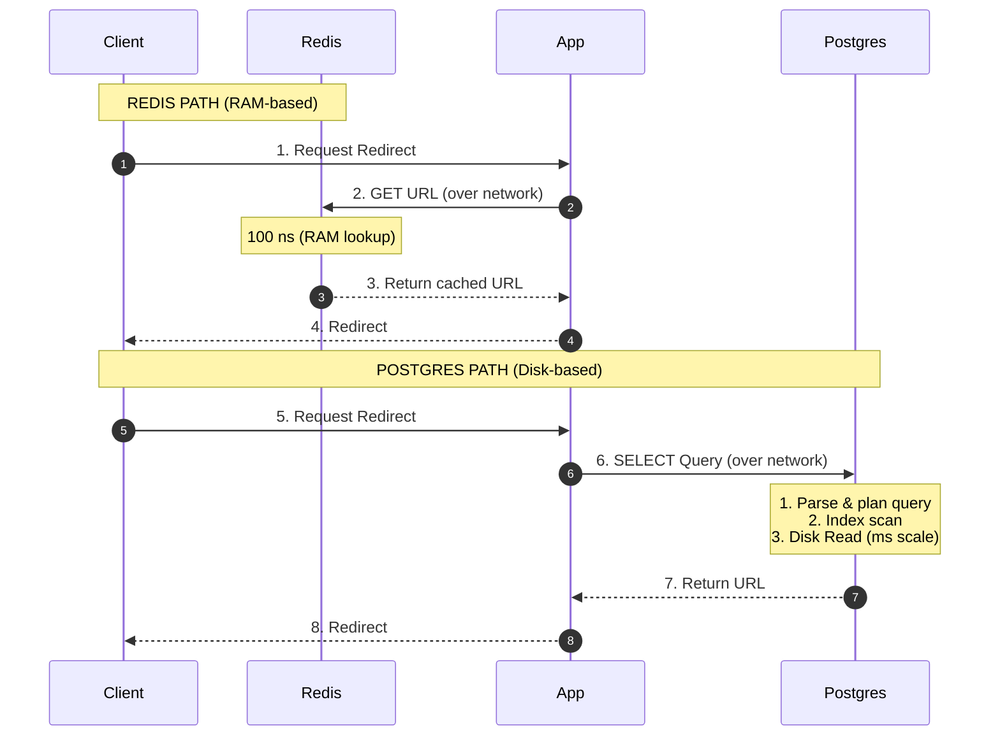

# ⏱️ RAM vs. Disk Latency: The Human Scale of Hardware Speed

This is about **physical hardware speed**, not programming. It is the actual reason caching gives you a massive performance win. 

---

## 🌎 Scaled to Human Time

Computer time units (nanoseconds, microseconds, milliseconds) are too small for our brains to fully comprehend. To understand how massive the latency gap is, let's scale the hardware operations up to human time:

> **If a single RAM access took 1 second:**

| Operation | Actual Latency | Human-Scale Time | Analogy |
| :--- | :--- | :--- | :--- |
| **RAM (Memory Access)** | ~100 ns | **1 Second** | Grabbing a pen from your desk. |
| **Network (Same Datacenter)** | ~500 µs | **1.4 Hours** | Walking to a local store down the street. |
| **SSD (Solid State Drive)** | ~150 µs | **25 Minutes** | Walking to a local library across town. |
| **HDD (Spinning Hard Disk)** | ~10 ms | **3 Months** | Walking across the entire continent on foot. |

---

## 🗺️ Path Analysis: Redis vs. Postgres

Here is how data retrieval flows through your server, showing where the actual time is spent:



> [!NOTE]
> Even if both paths pay the same network round-trip cost, the Postgres path adds parsing, planning, indexing, and physical disk I/O. Caching eliminates the **slowest** part of the chain.

---

## ⚡ The Ultimate Architectural Trade-off

Why don't we just build everything in Redis and throw away Postgres? 

| Storage | Speed | Cost | Volatility (Persistence) | Role |
| :--- | :--- | :--- | :--- | :--- |
| **RAM (Redis)** | 🚀 Blazing Fast | 💰 Very Expensive | 💨 **Volatile.** If the server power cuts out, all data is lost. | **Performance Booster** |
| **Disk (Postgres)** | 🐢 Slow | 💵 Cheap | 🔒 **Durable.** Data survives restarts and crashes forever. | **Source of Truth** |

We use both together because it is the only way to achieve **speed + safety**.

---

## 🛡️ Why Cache Stampede & Singleflight Matter

Because disk lookups are slow, a single database read is fine, but **1,000 database reads at the exact same millisecond** can crash your Postgres server. 

This is called a **Cache Stampede**. 

By using `singleflight.ts` in our code:
* If 1,000 users request a newly expired URL at once, only **1 query** goes to Postgres to read from the disk.
* The other 999 users wait for that single result and share it.
* This protects Postgres from grinding to a halt due to slow disk I/O.

---

## 🔬 Test It Yourself

You can measure this gap directly against your running application containers:

### 1. Measure a Cache HIT (Redis)
Click the same shortened link twice. The second time, it will load from the cache:
```bash
time curl -s -o /dev/null http://localhost:3000/abc123xy
```

### 2. Measure a Cold Database Query (Postgres)
Run a raw SQL query directly in your database container and print the execution time:
```bash
docker exec -it url-shortener-pg psql -U appuser -d urlshortener \
  -c "\timing" -c "SELECT original_url FROM urls WHERE short_key = 'abc123xy';"
```

Compare the results. You will see a clear, physical proof of the latency difference in action!