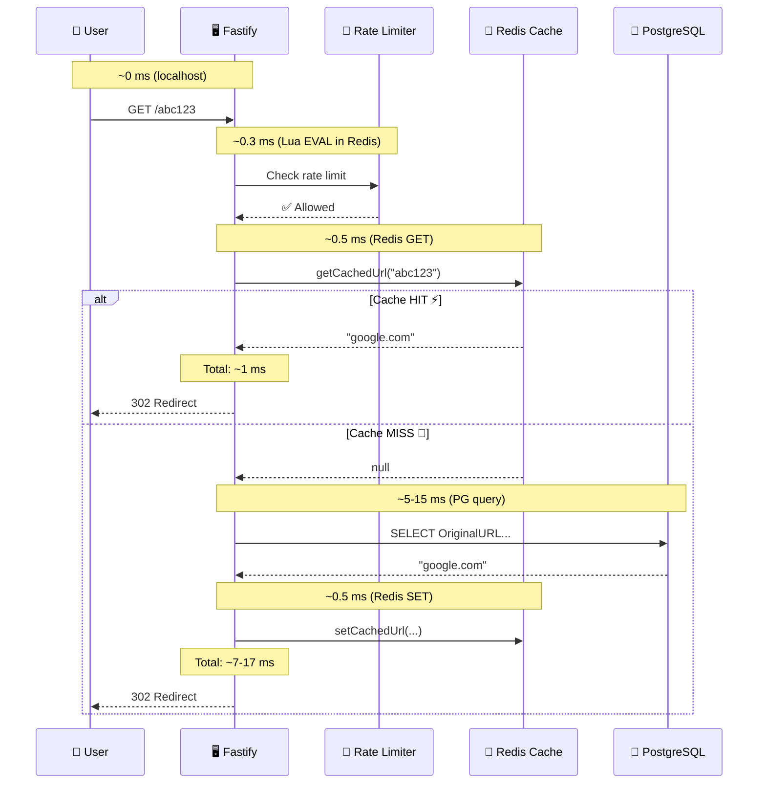

# ⏱️ The Complete Guide to Latency: RAM (Nanoseconds) vs Disk (Milliseconds)

> *"A nanosecond is to a second what a second is to 31.7 years. When your code reads from RAM instead of disk, it's like grabbing a book from your desk instead of ordering it from another continent and waiting three decades for delivery."*

This guide teaches you the **physics of speed** — why RAM is fast, why disks are slow, how the numbers translate to real-world system design, and exactly where your TinyURL pays the latency tax at every layer. These numbers are the foundation of every caching, sharding, and architecture decision you'll ever make.

---

## 📖 Table of Contents

1. [Chapter 1: What Is Latency? — The Distance Problem](#chapter-1-what-is-latency)
2. [Chapter 2: The Numbers Every Engineer Must Memorize](#chapter-2-numbers)
3. [Chapter 3: Human-Scale Time — Making Nanoseconds Intuitive](#chapter-3-human-scale)
4. [Chapter 4: How RAM Works — Why It's Fast](#chapter-4-how-ram-works)
5. [Chapter 5: How HDDs Work — Why They're Slow](#chapter-5-how-hdd-works)
6. [Chapter 6: How SSDs Work — The Middle Ground](#chapter-6-how-ssd-works)
7. [Chapter 7: Network Latency — The Hidden Cost](#chapter-7-network)
8. [Chapter 8: The Complete Memory Hierarchy](#chapter-8-hierarchy)
9. [Chapter 9: Your TinyURL — Latency at Every Layer](#chapter-9-your-tinyurl)
10. [Chapter 10: Why This Makes Caching Non-Negotiable](#chapter-10-why-caching)
11. [Chapter 11: Why This Makes Cache Stampedes Deadly](#chapter-11-stampedes)
12. [Chapter 12: Back-of-Envelope Latency Calculations](#chapter-12-back-of-envelope)
13. [Chapter 13: Measuring Latency in Your Own System](#chapter-13-measuring)
14. [Chapter 14: Quick Reference Cheat Sheet](#chapter-14-cheat-sheet)

---

<a id="chapter-1-what-is-latency"></a>
## 📕 Chapter 1: What Is Latency? — The Distance Problem

### 📬 The Mail Delivery Analogy

```
  You need a piece of information. Where you get it from determines
  how long you wait:

  🗄️ Your desk drawer (CPU Cache):
     Reach in, grab it. ~1 nanosecond.
     Like remembering your own phone number.

  📋 Your filing cabinet (RAM):
     Walk 3 steps, open drawer, grab folder. ~100 nanoseconds.
     Like looking at a sticky note on your monitor.

  📬 Your neighbor's mailbox (SSD):
     Walk next door, open mailbox, grab letter. ~100,000 nanoseconds.
     Like walking down the street to a store.

  🏢 The downtown post office (HDD):
     Drive 30 minutes, wait in line, pick up package. ~10,000,000 nanoseconds.
     Like taking a road trip to another city.

  🌍 Another country (Network round-trip):
     Mail it internationally, wait for reply. ~150,000,000 nanoseconds.
     Like sending a package overseas and waiting for the response.
```

### The Formal Definition

```
  ┌─────────────────────────────────────────────────────────────────────┐
  │                                                                     │
  │  LATENCY: The time delay between requesting data and receiving it. │
  │                                                                     │
  │  Measured in:                                                      │
  │  • ns  (nanoseconds)  = billionths of a second    (10⁻⁹)         │
  │  • µs  (microseconds) = millionths of a second    (10⁻⁶)         │
  │  • ms  (milliseconds) = thousandths of a second   (10⁻³)         │
  │                                                                     │
  │  Conversions:                                                      │
  │  1 ms = 1,000 µs = 1,000,000 ns                                   │
  │  1 µs = 1,000 ns                                                   │
  │  1 second = 1,000 ms = 1,000,000 µs = 1,000,000,000 ns           │
  │                                                                     │
  └─────────────────────────────────────────────────────────────────────┘
```

---

<a id="chapter-2-numbers"></a>
## 📗 Chapter 2: The Numbers Every Engineer Must Memorize

### Jeff Dean's Latency Numbers (Updated for 2024+)

These numbers were first published by Jeff Dean (Google) and Peter Norvig. Every system designer should **memorize** this table:

```
  ┌─────────────────────────────────────────────────────────────────────┐
  │              LATENCY NUMBERS EVERY PROGRAMMER SHOULD KNOW         │
  │                                                                     │
  │  OPERATION                             │ LATENCY     │ SCALE      │
  │────────────────────────────────────────│─────────────│────────────│
  │  L1 cache reference                   │ 1 ns        │            │
  │  Branch mispredict                     │ 3 ns        │            │
  │  L2 cache reference                   │ 4 ns        │            │
  │  Mutex lock/unlock                     │ 17 ns       │            │
  │  Main memory (RAM) reference           │ 100 ns      │ ← KEY!    │
  │  Compress 1KB with Snappy              │ 3,000 ns    │ 3 µs      │
  │  Send 2KB over 1 Gbps network          │ 20,000 ns   │ 20 µs     │
  │  Read 1MB sequentially from RAM        │ 250,000 ns  │ 250 µs    │
  │  Round trip within same datacenter     │ 500,000 ns  │ 500 µs    │
  │  Read 1MB sequentially from SSD        │ 1,000,000 ns│ 1 ms      │
  │  HDD seek                              │ 10,000,000 ns│ 10 ms ← KEY! │
  │  Read 1MB sequentially from HDD        │ 20,000,000 ns│ 20 ms    │
  │  Send packet CA → Netherlands → CA     │ 150,000,000 ns│ 150 ms  │
  │                                                                     │
  └─────────────────────────────────────────────────────────────────────┘
```

### The Two Numbers That Matter Most

```
  ┌─────────────────────────────────────────────────────────────────────┐
  │                                                                     │
  │  RAM access:  100 ns    (Redis lives here)                        │
  │  HDD seek:    10 ms     (PostgreSQL data on spinning disk)        │
  │                                                                     │
  │  Ratio: 10,000,000 / 100 = 100,000x                               │
  │                                                                     │
  │  RAM is ONE HUNDRED THOUSAND TIMES faster than a hard disk seek.  │
  │                                                                     │
  │  Even with SSD:                                                     │
  │  SSD read: ~100 µs = 100,000 ns                                   │
  │  Ratio: 100,000 / 100 = 1,000x                                    │
  │                                                                     │
  │  RAM is still A THOUSAND TIMES faster than SSD.                    │
  │                                                                     │
  └─────────────────────────────────────────────────────────────────────┘
```

---

<a id="chapter-3-human-scale"></a>
## 📘 Chapter 3: Human-Scale Time — Making Nanoseconds Intuitive

### If a RAM Access Took 1 Second...

Our brains can't feel 100 nanoseconds. So let's scale everything up proportionally. **If a single RAM access took 1 second** of human time:

```
  ┌─────────────────────────────────────────────────────────────────────┐
  │                                                                     │
  │  OPERATION                    │ ACTUAL     │ HUMAN SCALE           │
  │───────────────────────────────│────────────│───────────────────────│
  │                               │            │                       │
  │  L1 cache reference           │ 1 ns       │ 0.01 seconds         │
  │                               │            │ (blink of an eye)    │
  │                               │            │                       │
  │  RAM access                   │ 100 ns     │ 1 second             │
  │  (Redis GET)                  │            │ (grab a pen)         │
  │                               │            │                       │
  │  Network: same datacenter     │ 500 µs     │ 1.4 HOURS            │
  │  (app → Redis round-trip)     │            │ (drive to the mall)  │
  │                               │            │                       │
  │  SSD random read              │ 100 µs     │ 17 MINUTES           │
  │                               │            │ (walk to a store)    │
  │                               │            │                       │
  │  Read 1MB from SSD            │ 1 ms       │ 2.8 HOURS            │
  │                               │            │ (half a workday)     │
  │                               │            │                       │
  │  HDD seek                     │ 10 ms      │ 1.2 DAYS             │
  │                               │            │ (sleep, wake, work)  │
  │                               │            │                       │
  │  Read 1MB from HDD            │ 20 ms      │ 2.3 DAYS             │
  │                               │            │ (a full weekend)     │
  │                               │            │                       │
  │  PostgreSQL query             │ 5-15 ms    │ 14 HOURS - 1.7 DAYS  │
  │  (with index, SSD)            │            │                       │
  │                               │            │                       │
  │  Internet: CA → Europe → CA   │ 150 ms     │ 17.4 DAYS            │
  │                               │            │ (a vacation trip!)   │
  │                               │            │                       │
  │  HTTP timeout (typical)       │ 30,000 ms  │ 9.5 YEARS            │
  │                               │            │ (elementary school!) │
  │                               │            │                       │
  └─────────────────────────────────────────────────────────────────────┘
```

### The Visual Scale

```
  If RAM access = height of a USB stick (5 cm):

  L1 cache:          ■ 0.5 mm (thickness of a credit card)
  RAM (Redis):       ████ 5 cm (USB stick)
  SSD read:          ██████████████████ 50 meters (half a soccer field)
  HDD seek:          ██████...██████ 5 KILOMETERS (across a small town)
  Network (CA→EU):   ██████...██████ 75 KILOMETERS (between two cities)

  That's the gap between Redis and a hard drive.
  Not 2x faster. Not 10x faster. 100,000x faster.
  It's a USB stick vs the distance between two cities.
```

---

<a id="chapter-4-how-ram-works"></a>
## 📙 Chapter 4: How RAM Works — Why It's Fast

### ⚡ The Electric Highway

```
  RAM (Random Access Memory) is a grid of tiny capacitors on a silicon chip.
  Each capacitor stores ONE BIT (0 or 1) as an electric charge.

  To read data from RAM:
  1. CPU sends a memory address on the address bus
  2. The RAM chip activates the correct row
  3. The voltage on each column represents the data
  4. Data travels back to the CPU on the data bus

  TOTAL TIME: ~100 nanoseconds

  WHY IT'S FAST:
  ┌─────────────────────────────────────────────────────────────────────┐
  │                                                                     │
  │  1. NO MOVING PARTS                                                │
  │     Everything is electronic. Signals travel at near light speed.  │
  │     No waiting for a mechanical arm or a spinning platter.        │
  │                                                                     │
  │  2. TRUE "RANDOM ACCESS"                                           │
  │     Any memory address is equally fast to reach.                   │
  │     Address 0x0000 and address 0xFFFF take the same ~100ns.       │
  │     (Unlike disks, where "nearby" data is faster.)                │
  │                                                                     │
  │  3. ON THE SAME CIRCUIT BOARD                                      │
  │     RAM sits centimeters from the CPU.                             │
  │     Electrical signals travel ~30 cm per nanosecond.              │
  │     The physical distance is tiny → latency is tiny.              │
  │                                                                     │
  │  4. PARALLEL ACCESS                                                │
  │     Multiple RAM chips can be accessed simultaneously.             │
  │     DDR5 can deliver 50+ GB/s bandwidth.                          │
  │                                                                     │
  └─────────────────────────────────────────────────────────────────────┘
```

### Why RAM Is Volatile (And Why That Matters for Redis)

```
  Each bit in RAM is stored as charge on a tiny capacitor.
  Capacitors LEAK charge over time (milliseconds!).

  To keep data alive, RAM must REFRESH every capacitor thousands
  of times per second. This requires constant electrical power.

  Power off → capacitors drain → ALL data lost! 💨

  THIS is why Redis data disappears when the container restarts.
  THIS is why you need PostgreSQL (disk-based) as your source of truth.

  ┌── The Speed-Durability Tradeoff ───────────────────────────────┐
  │                                                                 │
  │  FAST                                             DURABLE      │
  │  ├──────────────────────────────────────────────────┤           │
  │  │                                                  │           │
  │  RAM (volatile)                           Disk (permanent)     │
  │  ~100 ns access                           ~10 ms access        │
  │  Data lost on crash                       Data survives crashes│
  │  Redis lives here                         PostgreSQL lives here│
  │                                                                 │
  │  You can ONLY pick one. That's why you use BOTH together.     │
  │                                                                 │
  └─────────────────────────────────────────────────────────────────┘
```

---

<a id="chapter-5-how-hdd-works"></a>
## 📒 Chapter 5: How HDDs Work — Why They're Slow

### 🔄 The Spinning Platter

```
  An HDD (Hard Disk Drive) is a MECHANICAL device:

  ┌───────────────────────────────────────────────────────────────┐
  │                                                               │
  │           ┌─── Read/Write Head (like a record needle)        │
  │           │                                                   │
  │           ▼                                                   │
  │    ╔══════════════╗                                           │
  │    ║  ╔════════╗  ║  ← Magnetic platter (spinning at        │
  │    ║  ║  ╔══╗  ║  ║     5,400 - 15,000 RPM)                 │
  │    ║  ║  ║  ║  ║  ║                                           │
  │    ║  ║  ╚══╝  ║  ║  ← Data stored as magnetic              │
  │    ║  ╚════════╝  ║     patterns on concentric tracks        │
  │    ╚══════════════╝                                           │
  │                                                               │
  │  To read data:                                                │
  │  1. SEEK: Move the head to the correct track (~5-10 ms)      │
  │  2. ROTATE: Wait for the platter to spin to the right        │
  │     sector (~2-5 ms at 7200 RPM)                              │
  │  3. TRANSFER: Read the magnetic pattern (~0.1 ms)            │
  │                                                               │
  │  TOTAL: 7-15 ms per random read                              │
  │                                                               │
  └───────────────────────────────────────────────────────────────┘
```

### Why HDDs Are Slow

```
  ┌─────────────────────────────────────────────────────────────────────┐
  │                                                                     │
  │  1. MECHANICAL MOVEMENT                                            │
  │     The read head must PHYSICALLY MOVE across the platter.        │
  │     A motor swings an arm. Metal moves through space.             │
  │     Physics imposes a minimum time for this movement.             │
  │     You're limited by the speed of physical objects, not          │
  │     the speed of electricity.                                     │
  │                                                                     │
  │  2. ROTATIONAL DELAY                                               │
  │     After the head arrives at the right track, it must wait       │
  │     for the platter to rotate to the correct sector.              │
  │     At 7200 RPM, one revolution = 8.33 ms.                       │
  │     Average wait = half a revolution = ~4.2 ms.                   │
  │     You're literally waiting for a metal plate to spin.           │
  │                                                                     │
  │  3. SEQUENTIAL IS FAST, RANDOM IS SLOW                            │
  │     Reading data in order (sequential) = fast (100 MB/s)          │
  │     Reading data at random locations = slow (0.5 MB/s)            │
  │     Each random read requires a new seek + rotation.              │
  │     That's why random database queries are expensive!             │
  │                                                                     │
  └─────────────────────────────────────────────────────────────────────┘
```

---

<a id="chapter-6-how-ssd-works"></a>
## 📔 Chapter 6: How SSDs Work — The Middle Ground

### 💾 The Flash Chip

```
  An SSD (Solid State Drive) uses NAND flash memory — no moving parts!

  ┌───────────────────────────────────────────────────────────────┐
  │                                                               │
  │  ┌──────┐ ┌──────┐ ┌──────┐ ┌──────┐                        │
  │  │ NAND │ │ NAND │ │ NAND │ │ NAND │ ← Flash memory chips   │
  │  │ chip │ │ chip │ │ chip │ │ chip │                          │
  │  └──────┘ └──────┘ └──────┘ └──────┘                          │
  │       │       │       │       │                                │
  │       └───────┴───┬───┴───────┘                                │
  │                   │                                            │
  │            ┌──────┴──────┐                                     │
  │            │ Controller  │ ← Manages reads/writes/wear        │
  │            └─────────────┘                                     │
  │                                                               │
  │  To read data:                                                │
  │  1. Controller translates logical address → physical page     │
  │  2. Voltage applied to flash cell → read stored charge        │
  │  3. Data returned via electronic bus                          │
  │                                                               │
  │  TOTAL: ~50-150 µs per random read (0.05-0.15 ms)           │
  │  That's 100x faster than HDD! But still 1000x slower than RAM│
  │                                                               │
  └───────────────────────────────────────────────────────────────┘
```

### The Speed Hierarchy

```
  OPERATION              │ HDD        │ SSD        │ RAM
  ────────────────────────│────────────│────────────│──────────
  Random read             │ 10 ms      │ 0.1 ms     │ 0.0001 ms
  Random read (IOPS)      │ 100-200    │ 100,000+   │ Millions
  Sequential read         │ 100 MB/s   │ 500-3500 MB/s│ 25,000+ MB/s
  Has moving parts?       │ YES ⚙️      │ NO ✅       │ NO ✅

  Relative speed (vs RAM):
  HDD:  100,000x SLOWER
  SSD:  1,000x SLOWER
  RAM:  BASELINE ⚡
```

### Why PostgreSQL on SSD Is Still Slow Compared to Redis

```
  "But I'm using SSD! PostgreSQL should be fast!"

  PostgreSQL query latency is NOT just disk I/O time:

  ┌── PostgreSQL Query Breakdown ───────────────────────────────────┐
  │                                                                  │
  │  1. Network round-trip (app → PG):        ~0.5 ms              │
  │  2. Parse the SQL query:                   ~0.01 ms             │
  │  3. Plan the query (optimizer):            ~0.05 ms             │
  │  4. Index lookup (B-tree traversal):       ~0.1 ms              │
  │  5. Read data page from disk/buffer:       ~0.1 ms (if cached!) │
  │                                          ~10 ms (if not cached) │
  │  6. Process results:                       ~0.01 ms             │
  │  7. Network round-trip (PG → app):        ~0.5 ms              │
  │  ───────────────────────────────────────────────────             │
  │  TOTAL (best case, data in PG buffer):     ~1.3 ms              │
  │  TOTAL (worst case, data on disk):         ~11 ms               │
  │                                                                  │
  │  REDIS:                                                          │
  │  1. Network round-trip (app → Redis):      ~0.5 ms              │
  │  2. Hash table lookup in RAM:              ~0.0001 ms            │
  │  3. Network round-trip (Redis → app):      ~0.5 ms              │
  │  ───────────────────────────────────────────────────             │
  │  TOTAL:                                     ~1.0 ms              │
  │                                                                  │
  │  Even on SSD, PostgreSQL is 1.3-11x slower than Redis.          │
  │  The query parsing, planning, and index traversal overhead      │
  │  adds up, even when disk I/O is fast!                           │
  │                                                                  │
  └──────────────────────────────────────────────────────────────────┘
```

---

<a id="chapter-7-network"></a>
## 📚 Chapter 7: Network Latency — The Hidden Cost

### The Speed of Light Problem

```
  Even at the speed of light, distance creates latency:

  ┌─────────────────────────────────────────────────────────────────────┐
  │                                                                     │
  │  ROUTE                          │ DISTANCE  │ LIGHT TIME │ ACTUAL  │
  │─────────────────────────────────│───────────│────────────│─────────│
  │  Same machine (localhost)       │ 0 m       │ 0 ns       │ ~50 µs │
  │  Same rack (datacenter)         │ ~3 m      │ 10 ns      │ ~100 µs│
  │  Same datacenter                │ ~300 m    │ 1 µs       │ ~500 µs│
  │  Same region (AZ to AZ)        │ ~100 km   │ 330 µs     │ ~1 ms  │
  │  Cross-continent (NY → LA)     │ ~4000 km  │ 13 ms      │ ~40 ms │
  │  Cross-ocean (NY → London)     │ ~5500 km  │ 18 ms      │ ~75 ms │
  │  Round-trip (NY → London → NY) │ ~11000 km │ 36 ms      │ ~150 ms│
  │                                                                     │
  │  "Actual" includes: fiber optic refraction, router hops,          │
  │  TCP handshake, TLS handshake, processing time.                    │
  │  Real-world is 3-5x slower than raw speed of light.               │
  │                                                                     │
  └─────────────────────────────────────────────────────────────────────┘
```

### Why Network Latency Dominates Your Redis Performance

```
  REDIS OPERATION BREAKDOWN:

  redis.get("url:abc123")

  ┌── What actually happens ─────────────────────────────────────────┐
  │                                                                    │
  │  1. ioredis serializes command to RESP:      ~0.005 ms            │
  │  2. TCP send: app → Redis (same machine):    ~0.025 ms            │
  │  3. Redis processes GET command:              ~0.001 ms ← INSTANT│
  │  4. TCP send: Redis → app (same machine):    ~0.025 ms            │
  │  5. ioredis deserializes RESP response:      ~0.005 ms            │
  │  ──────────────────────────────────────────────────────            │
  │  TOTAL:                                       ~0.06 ms            │
  │                                                                    │
  │  The actual RAM lookup (step 3) takes 0.001 ms!                   │
  │  The network (steps 2+4) takes 0.05 ms — 50x more!              │
  │                                                                    │
  │  Redis is so fast that NETWORK becomes the bottleneck.            │
  │  Moving Redis to another machine doubles your latency.            │
  │  That's why Redis runs on the same host or same rack.             │
  │                                                                    │
  └────────────────────────────────────────────────────────────────────┘
```

---

<a id="chapter-8-hierarchy"></a>
## 📖 Chapter 8: The Complete Memory Hierarchy

### The Pyramid of Speed

```
                    ┌───┐
                    │CPU│ L1 Cache: 1 ns, 64 KB
                    │REG│ (Inside the CPU itself)
                   ┌┴───┴┐
                   │  L2  │ L2 Cache: 4 ns, 256 KB
                   │Cache │ (Per CPU core)
                  ┌┴──────┴┐
                  │   L3    │ L3 Cache: 10 ns, 8-32 MB
                  │  Cache  │ (Shared across cores)
                 ┌┴─────────┴┐
                 │    RAM     │ RAM: 100 ns, 16-512 GB
                 │  (DRAM)    │ ← REDIS LIVES HERE ⚡
                ┌┴────────────┴┐
                │     SSD       │ SSD: 100 µs, 0.5-8 TB
                │  (Flash)      │ ← PostgreSQL data files
               ┌┴───────────────┴┐
               │      HDD        │ HDD: 10 ms, 1-20 TB
               │  (Spinning)     │ ← Backups, archives
              ┌┴─────────────────┴┐
              │     Network        │ Network: 0.5-150 ms
              │  (Remote Storage)  │ ← S3, cross-region DB replicas
              └────────────────────┘

  SPEED:     Fastest ────────────────────────────── Slowest
  CAPACITY:  Smallest ───────────────────────────── Largest
  COST:      Most expensive ─────────────────────── Cheapest
  VOLATILE:  YES (L1-RAM) ──────── NO (SSD, HDD, Network storage)
```

### Cost Per Gigabyte (2024+)

```
  ┌─────────────────────────────────────────────────────────────────────┐
  │                                                                     │
  │  TIER         │ COST/GB/month │ YOUR TINYURL USE                   │
  │───────────────│───────────────│─────────────────────────────────────│
  │  L1/L2/L3     │ Built into CPU│ V8 engine internals (automatic)    │
  │  RAM (Redis)  │ ~$5-10        │ URL cache, rate limits, streams   │
  │  SSD (EBS/PD) │ ~$0.10        │ PostgreSQL data files             │
  │  HDD          │ ~$0.02        │ Backups, cold storage             │
  │  S3/GCS       │ ~$0.01        │ Log archives, old analytics       │
  │                                                                     │
  │  RAM is 500x more expensive than SSD per GB!                      │
  │  That's why you only cache the HOT data in Redis,                 │
  │  not the entire database.                                          │
  │                                                                     │
  └─────────────────────────────────────────────────────────────────────┘
```

---

<a id="chapter-9-your-tinyurl"></a>
## 📃 Chapter 9: Your TinyURL — Latency at Every Layer

### The Complete Request Journey — Timed



### Latency Budget Breakdown

```
  ┌── CACHE HIT PATH (95% of requests) ────────────────────────────┐
  │                                                                  │
  │  Step                              │ Latency  │ % of Total      │
  │────────────────────────────────────│──────────│─────────────────│
  │  Rate limit check (Redis EVAL)     │ 0.3 ms   │ 30%            │
  │  Cache lookup (Redis GET)          │ 0.5 ms   │ 50%            │
  │  Click event (Redis XADD, async)   │ 0 ms     │ 0% (no await!) │
  │  HTTP response serialization       │ 0.1 ms   │ 10%            │
  │  Network overhead                  │ 0.1 ms   │ 10%            │
  │  ──────────────────────────────────────────────────────         │
  │  TOTAL:                             ~1.0 ms ⚡                  │
  │                                                                  │
  └──────────────────────────────────────────────────────────────────┘

  ┌── CACHE MISS PATH (5% of requests) ────────────────────────────┐
  │                                                                  │
  │  Step                              │ Latency  │ % of Total      │
  │────────────────────────────────────│──────────│─────────────────│
  │  Rate limit check (Redis EVAL)     │ 0.3 ms   │ 2%             │
  │  Cache lookup (Redis GET → null)   │ 0.5 ms   │ 3%             │
  │  Single-flight dedup               │ ~0 ms    │ 0%             │
  │  Shard routing (fnv1a hash)        │ ~0 ms    │ 0%             │
  │  PostgreSQL query (SSD, indexed)   │ 5-15 ms  │ 85% ← THE     │
  │  Cache population (Redis SET)      │ 0.5 ms   │ 3%    BOTTLENECK│
  │  Click event (Redis XADD, async)   │ 0 ms     │ 0%             │
  │  HTTP response serialization       │ 0.1 ms   │ 1%             │
  │  Network overhead                  │ 0.1 ms   │ 1%             │
  │  ──────────────────────────────────────────────────────         │
  │  TOTAL:                             ~7-17 ms 🐌                 │
  │                                                                  │
  │  85% of the miss path latency is PostgreSQL.                   │
  │  That's disk I/O + query parsing + index traversal.            │
  │  Caching avoids this for 95% of requests.                      │
  │                                                                  │
  └──────────────────────────────────────────────────────────────────┘
```

### Weighted Average Latency

```
  With 95% cache hit rate:

  Average latency = (0.95 × 1 ms) + (0.05 × 12 ms)
                  = 0.95 + 0.6
                  = 1.55 ms

  WITHOUT caching (every request hits PostgreSQL):
  Average latency = 12 ms

  Speedup: 12 / 1.55 = 7.7x faster! ⚡

  Your p99 target is < 20 ms (from your non-functional requirements).
  At 1.55 ms average, even p99 should be well under 20 ms. ✅
```

---

<a id="chapter-10-why-caching"></a>
## 📈 Chapter 10: Why This Makes Caching Non-Negotiable

### The Capacity Argument

```
  WITHOUT cache (pure PostgreSQL):
  ────────────────────────────────
  Each request takes ~12 ms of DB time.
  DB pool has 10 connections per shard × 2 shards = 20 connections.
  Each connection can process 1 request per 12 ms = 83 requests/sec.
  Total capacity: 20 × 83 = ~1,660 requests/second.

  Want 10,000 RPS? You need 120 database connections. 💀
  Connection overhead crushes PostgreSQL at that scale.


  WITH Redis cache (95% hit rate):
  ──────────────────────────────────
  95% of requests served by Redis in ~1 ms. No DB connection used.
  Only 5% of requests hit PostgreSQL = 500 requests/second to DB.
  20 connections × 83 req/sec = ~1,660 req/sec capacity.
  500 req/sec needed << 1,660 capacity. Easy! ✅

  Redis itself can handle 100,000+ operations/second on one core.
  At 10,000 RPS, Redis is at 10% capacity. Barely breaking a sweat.

  ┌─────────────────────────────────────────────────────────────────────┐
  │                                                                     │
  │  Without cache: Max ~1,660 RPS (DB is the bottleneck)             │
  │  With cache:    Max ~100,000+ RPS (Redis is barely loaded)        │
  │                                                                     │
  │  Caching gives you ~60x more capacity.                             │
  │  The latency difference between RAM and disk                       │
  │  is the ENTIRE reason caching works.                               │
  │                                                                     │
  └─────────────────────────────────────────────────────────────────────┘
```

---

<a id="chapter-11-stampedes"></a>
## ⛈️ Chapter 11: Why This Makes Cache Stampedes Deadly

### The Math of a Stampede

```
  Popular URL's cache entry expires. 1,000 users click at the same instant.

  WITHOUT single-flight:
  ─────────────────────
  All 1,000 requests → cache MISS → all 1,000 hit PostgreSQL
  Each query: ~12 ms of DB connection time
  Total DB time: 1,000 × 12 ms = 12,000 ms = 12 seconds of connection time
  With 20 connections: 12,000 ms / 20 = 600 ms of queued waiting
  p99 latency spikes to 600+ ms! 💀

  WITH single-flight:
  ────────────────────
  Request #1: cache MISS → query PostgreSQL (~12 ms)
  Requests #2-1000: piggyback on Request #1's in-flight query (wait ~12 ms)
  Total DB time: 1 × 12 ms = 12 ms
  With 20 connections: 12 ms / 20 = 0.6 ms queued
  p99 latency stays at ~13 ms ✅

  ┌─────────────────────────────────────────────────────────────────────┐
  │                                                                     │
  │  Cache stampedes are deadly BECAUSE of the latency gap.            │
  │  If disk I/O were as fast as RAM, stampedes wouldn't matter.      │
  │  Each request would just read from disk in 100 ns.                │
  │  But 12 ms × 1000 = 12 seconds of DB time. That's the problem.  │
  │                                                                     │
  │  Single-flight works BECAUSE RAM is fast enough to dedup          │
  │  requests in-memory before they hit the slow disk path.           │
  │                                                                     │
  └─────────────────────────────────────────────────────────────────────┘
```

---

<a id="chapter-12-back-of-envelope"></a>
## 🧮 Chapter 12: Back-of-Envelope Latency Calculations

### The System Design Interview Formulas

```
  FORMULA 1: Average latency with cache
  ──────────────────────────────────────
  avg_latency = (hit_rate × cache_latency) + (miss_rate × db_latency)

  Your TinyURL:
  avg = (0.95 × 1 ms) + (0.05 × 12 ms) = 1.55 ms


  FORMULA 2: Maximum throughput
  ─────────────────────────────
  max_rps = db_connections / avg_query_time_seconds

  Your TinyURL (without cache):
  max_rps = 20 / 0.012 = 1,666 RPS

  Your TinyURL (with 95% cache hit rate):
  db_rps = total_rps × 0.05  (only misses hit DB)
  max_total_rps = max_db_rps / 0.05 = 1,666 / 0.05 = 33,333 RPS


  FORMULA 3: Data transfer time
  ─────────────────────────────
  time = data_size / bandwidth

  Transfer 1 MB over 1 Gbps network:
  time = 1,000,000 bytes / 125,000,000 bytes/sec = 8 ms

  Transfer 1 KB (one URL response) over 1 Gbps:
  time = 1,000 / 125,000,000 = 0.008 ms (negligible)


  FORMULA 4: Requests per second needed
  ──────────────────────────────────────
  If you have 10 million short URLs and 1% are clicked per day:
  clicks_per_day = 10,000,000 × 0.01 = 100,000
  clicks_per_second = 100,000 / 86,400 ≈ 1.16 RPS (average)
  
  But peak is ~10x average:
  peak_rps ≈ 12 RPS

  With viral sharing, burst can be 100x average:
  burst_rps ≈ 116 RPS

  Your system with caching handles 33,333 RPS. More than enough! ✅
```

---

<a id="chapter-13-measuring"></a>
## 🔬 Chapter 13: Measuring Latency in Your Own System

### Test 1: Redis Latency (RAM)

```bash
# Built-in Redis latency test:
docker exec -it TinyURL-Redis redis-cli --latency
# Output: min: 0, max: 1, avg: 0.18 (in milliseconds)
# ↑ This is the raw round-trip time to Redis from inside Docker.

# Test a specific GET operation:
docker exec -it TinyURL-Redis redis-cli --latency-history
# Shows latency samples over time

# From your app's perspective:
time curl -s -o /dev/null -w "%{time_total}\n" http://localhost:3099/abc123
# 0.003 (3 ms total HTTP response time — includes TCP, processing, Redis)
```

### Test 2: PostgreSQL Latency (Disk/SSD)

```bash
# Enable query timing in psql:
docker exec -it TinyURL-Postgres-Shard-0 psql -U postgres -d tinyURL_shard0 \
  -c "\timing" \
  -c "SELECT OriginalURL FROM url.URL WHERE ShortURL = 'abc123';"

# Output:
# Time: 0.543 ms  ← data was in PostgreSQL's buffer cache (RAM!)
# Time: 5.234 ms  ← data was on disk (cold read)

# Force a cold read (clear PG buffer cache):
docker exec -it TinyURL-Postgres-Shard-0 psql -U postgres -d tinyURL_shard0 \
  -c "DISCARD ALL;" \
  -c "\timing" \
  -c "SELECT OriginalURL FROM url.URL WHERE ShortURL = 'abc123';"
```

### Test 3: Compare Cache Hit vs Miss

```bash
# Step 1: Ensure URL is cached
curl -s http://localhost:3099/abc123 > /dev/null

# Step 2: Measure cache HIT (second request)
time curl -s -o /dev/null http://localhost:3099/abc123
# real    0m0.002s  ← 2 ms (cache hit!) ⚡

# Step 3: Flush the cache
docker exec -it TinyURL-Redis redis-cli DEL url:abc123

# Step 4: Measure cache MISS (forces DB query)
time curl -s -o /dev/null http://localhost:3099/abc123
# real    0m0.015s  ← 15 ms (cache miss, DB query) 🐌

# The difference: 2 ms vs 15 ms = 7.5x slower without cache!
```

---

<a id="chapter-14-cheat-sheet"></a>
## 📋 Chapter 14: Quick Reference Cheat Sheet

### The Latency Table — Memorize This!

| Operation | Latency | Scale | Analogy (if RAM = 1 sec) |
|:--|:--|:--|:--|
| L1 cache | 1 ns | | Blink |
| L2 cache | 4 ns | | Snap fingers |
| **RAM (Redis)** | **100 ns** | | **1 second** |
| Compress 1KB | 3 µs | 3,000 ns | 30 seconds |
| Same-DC network | 500 µs | 500,000 ns | 1.4 hours |
| **SSD random read** | **100 µs** | **100,000 ns** | **17 minutes** |
| Read 1MB from SSD | 1 ms | 1,000,000 ns | 2.8 hours |
| **HDD seek** | **10 ms** | **10,000,000 ns** | **1.2 days** |
| Read 1MB from HDD | 20 ms | 20,000,000 ns | 2.3 days |
| CA → Netherlands → CA | 150 ms | 150,000,000 ns | 17 days |

### Your TinyURL Latency Map

| Component | Storage | Latency | Used For |
|:--|:--|:--|:--|
| Redis cache | RAM | ~0.5 ms | URL lookups, rate limits |
| PostgreSQL (warm) | RAM buffer | ~1-3 ms | Buffered queries |
| PostgreSQL (cold) | SSD | ~5-15 ms | Disk reads |
| Network (localhost) | N/A | ~0.05 ms | App ↔ Redis/PG |
| Redirect (cache hit) | RAM | **~1 ms** | 95% of requests |
| Redirect (cache miss) | SSD | **~7-17 ms** | 5% of requests |

### Speed Ratios to Remember

```
  RAM vs HDD:   100,000x faster    (one hundred thousand!)
  RAM vs SSD:   1,000x faster      (one thousand)
  SSD vs HDD:   100x faster        (one hundred)
  Same-DC network round-trip:      ~500 µs = 5,000x slower than RAM
```

---

## 🎓 Final Mental Model

```
  Think of your computer's memory as a CITY:

  🏠 Your pocket (L1 Cache):
     Instant access. Fits your phone and wallet. 1 ns.

  🏠 Your desk (RAM / Redis):
     Grab anything in a second. Fits a few drawers of files. 100 ns.

  🏘️ Your neighbor's house (SSD / PostgreSQL):
     Walk next door, knock, wait, get the item. 100 µs.

  🏙️ Downtown post office (HDD):
     Drive across town, wait in line, pick up package. 10 ms.

  🌍 International mail (Cross-continent network):
     Ship it overseas, wait for reply. 150 ms.

  Caching = keeping a copy of the most important mail
  in your pocket instead of driving to the post office every time.

  ┌──────────────────────────────────────────────────────────────────┐
  │                                                                  │
  │  Every architecture decision in your career comes down to this: │
  │  "Can I move this data closer to the CPU?"                      │
  │                                                                  │
  │  Disk → RAM = caching (Redis)                                   │
  │  RAM → L3 = hot data structures (single-flight Map)            │
  │  Remote → Local = CDN, edge computing                           │
  │  Network → Same machine = co-located services                   │
  │                                                                  │
  │  The memory hierarchy IS the system design hierarchy.           │
  │                                                                  │
  └──────────────────────────────────────────────────────────────────┘
```

> **The difference between 100 nanoseconds and 10 milliseconds is not a rounding error. It's the difference between a system that handles 100,000 requests per second and one that collapses at 1,000. Every cache hit is a visit to your desk instead of a trip downtown. That's why caching exists.**

---

*This guide is part of the TinyURL system design documentation. See also: [Caching Strategies](file:///c:/Users/TARUN/Desktop/TinyURL/docs/backend/caching_strategies.md) · [Cache Eviction](file:///c:/Users/TARUN/Desktop/TinyURL/docs/system_design/cache_eviction.md) · [Functional vs Non-Functional Requirements](file:///c:/Users/TARUN/Desktop/TinyURL/docs/system_design/functional_vs_nonfunctional_requirements.md)*
