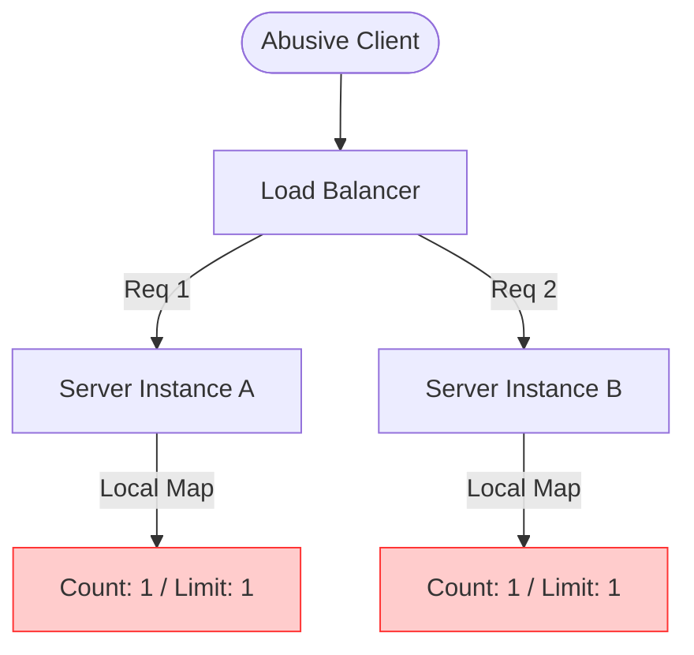
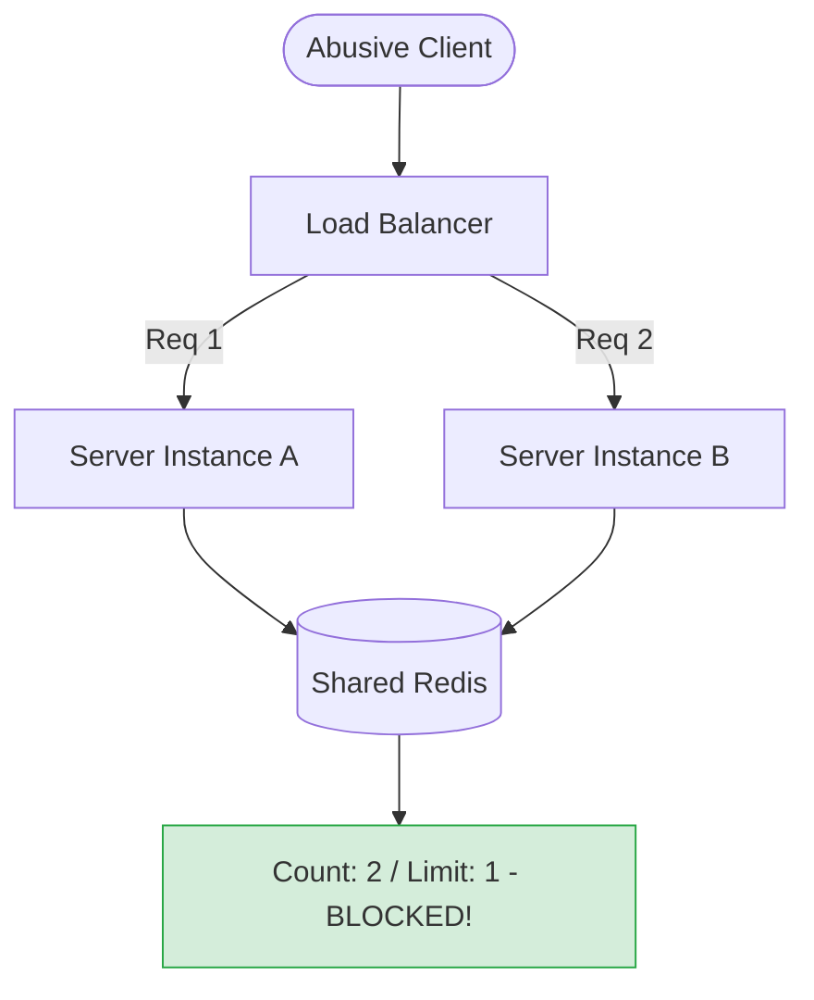

# 🏟️ Rate Limiting Topologies: The Stadium Crowd Control Plan

An algorithm (like our sliding window Lua script) only tells you *how* to count. **Topology** answers two much bigger design questions:
1. **Where** in your network does the counting check happen?
2. **Who** (what identity) are we actually counting and limiting?

To make these concepts simple and intuitive, let's use a **Concert Stadium Crowd Control** analogy.

---

## 🎟️ Axis 1: Identity (Who is entering?)

How does the rate limiter identify a visitor?

### 1. IP-Based Limiting (Checking the Tour Bus) 🚌
* **The Analogy:** Instead of checking individual IDs, security says: *"No more than 10 people from any single tour bus can enter per minute."*
* **How it looks in code:**
  ```javascript
  const clientIp = req.ip;
  const key = `ratelimit:${options.name}:${clientIp}`;
  ```
* **Pros & Cons:**
  * ✅ **Zero setup:** Works instantly without requiring users to register or log in.
  * ❌ **Collateral Damage:** If an entire office building, school, or mobile network shares a single public IP address (NAT), one bad actor can exhaust the limit, locking out innocent users.
  * ❌ **Easy to bypass:** A hacker rotating through VPNs gets a new IP (and a fresh limit) on every request.

### 2. User-Based Limiting (Checking the Personal Ticket) 🎫
* **The Analogy:** Every guest has a personalized ticket with their name on it. Security counts access *per ticket holder*.
* **How it looks in code:**
  ```javascript
  const identity = req.user?.apiKey ?? req.ip; // Use account API key, fallback to IP
  const key = `ratelimit:${options.name}:${identity}`;
  ```
* **Pros & Cons:**
  * ✅ **Fairness:** Each user gets their own personal quota.
  * ✅ **Secure:** Attackers cannot easily get a fresh quota by switching networks; they need a new registered account.
  * ❌ **Requires Auth:** You cannot use this to protect public, unauthenticated routes (like our anonymous `/api/shorten` page).

---

## 📝 Axis 2: Storage (Where is the counter kept?)

If you run multiple instances of your application, where do you track the numbers?

### 1. Per-Instance Storage (Separate Notebooks) 📓
* **The Analogy:** You have 3 entrance gates. Each security guard keeps their own separate notebook count.
* **Why it fails:** If a guest runs from gate to gate, they can enter 3 times as much before hitting a limit.



### 2. Centralized Storage (The Shared Walkie-Talkie) 📡
* **The Analogy:** All guards report entries via walkie-talkie to a central controller who keeps the master headcount.
* **How we do it:** We store limits in **Redis**, which acts as our shared source of truth. Regardless of which server instance receives the request, they check and increment the same Redis counter.



---

## 🛣️ Axis 3: Execution Layer (Where are the gates?)

Where does the check physically execute in the request lifecycle?

```
Client ──► [ 🛣️ Highway Exit: Coarse Edge Check ] ──► [ 🚪 Venue Gate: Fine-Grained App Check ]
```

### 1. Edge-Level / Gateway Limiting (The Highway Exit Barrier) 🚧
* **The Analogy:** Setting up a barrier miles away at the highway exit leading to the stadium.
* **How it works:** A load balancer (Nginx/Envoy) or API Gateway rejects spammy IPs before they even touch your application servers.
* **Best for:** Cheap, high-volume protection. It stops raw flood attacks (DDoS) immediately, saving your app servers from processing junk.

### 2. App-Level Limiting (The Ticket Scanner) 🎫
* **The Analogy:** Scanning tickets right at the entrance gate.
* **How it works:** Our Fastify middleware running Lua scripts on Redis.
* **Best for:** Fine-grained business logic rules. Nginx doesn't know what database queries cost, but your app does. It lets you assign small limits to heavy database routes (`/api/shorten`) and high limits to light static page routes (`/`).

---

## 🎯 Axis 4: Scope (What are they queueing for?)

What exactly are we limiting?

* **Global limits** 🌍: *"No more than 5,000 guests total in the entire stadium."*
  * (e.g. limiting an IP to 1,000 total API requests across your entire site).
* **Per-Route limits** 📍: *"No more than 200 guests inside the VIP Lounge."*
  * (e.g. limiting `/api/shorten` to 10/min, but allowing `/redirect` to handle 100/min).
* **Per-Resource limits** 💎: *"No more than 50 people can gather around a single viral artist."*
  * (e.g. limiting requests to a single viral short URL so it doesn't crash a database partition, regardless of which users are clicking it).

---

## ⚙️ Putting It Together: The TinyURL Setup

Here is the exact topology we built for TinyURL:

| Axis | Our Choice | Why It Fits |
| :--- | :--- | :--- |
| **Identity** | IP-Based 🚌 | Our URL shortener is a public tool without accounts/login yet. |
| **Storage** | Centralized 📡 | We use Redis, allowing us to spin up multiple application servers behind a load balancer without losing track of limits. |
| **Execution Layer** | App-Level 🚪 | Built inside our Fastify middleware, allowing us to enforce different rules for different routes. |
| **Scope** | Per-Route, Per-IP 📍 | Prevents API spam on writes (`/api/shorten` = 10/min) while remaining friendly to reads (`/redirect` = 100/min). |

> [!TIP]
> **Production Evolution:** As the app grows, we would add an **Edge Layer** (Nginx) to drop abusive connections early, and a **User-Based Check** using API keys for premium tier clients.